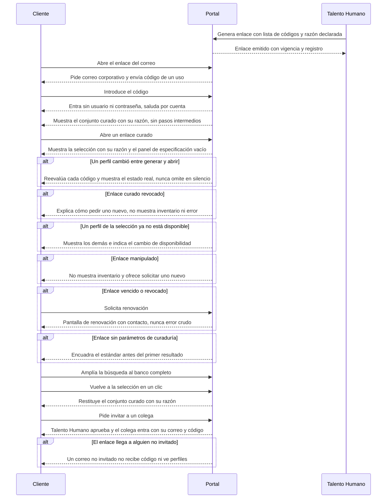

# Flow 001 — Acceso y aterrizaje curado

## Resumen

Del clic en el correo al conjunto curado a la vista. Actor principal: el **Cliente** —líder de área o de proyecto que recibió el correo—. Condición de éxito: entra sin registro, supera la verificación de dominio y ve los mismos perfiles del correo con su razón declarada.

## Diagrama

## Trazabilidad

| Paso | HU | AC |
|---|---|---|
| Generar enlace curado | HU-122 | AC-1 (happy) · AC-2 y AC-3 (error) |
| Abrir el enlace curado | HU-144 | AC-1 (happy) |
| Abrir, verificar y entrar | HU-090 | AC-1 (happy) |
| Ver el conjunto curado | HU-091 | AC-1 (happy) |
| Perfil cambiado desde el envío | HU-144 | AC-3 (edge) |
| Perfil no disponible en la selección | HU-091 | AC-2 (error) |
| Enlace manipulado | HU-090 | AC-2 (error) |
| Enlace vencido o revocado | HU-092 | AC-1 (happy) · HU-144 AC-2 (error) |
| Aterrizaje sin curaduría | HU-093 | AC-1 (happy) |
| Ampliar y volver | HU-094 | AC-1 (happy) |
| Invitar a un colega | HU-095 | AC-1 (happy) |
| Colega sin invitación | HU-095 | AC-2 (error) |

## Notas

**El acceso es nominal (D-4 revisada el 2026-09-25).** Solo entran los correos invitados en el enlace. Reenviarlo no da acceso: la segunda opinión de un colega pasa por una invitación que aprueba Talento Humano (HU-095, RF-1.2.10). *Antes*, la verificación por dominio permitía el reenvío interno libre.

**HU-122 se dividió el 2026-09-22.** Tenía seis escenarios y dos happy paths con **actores distintos** — Talento Humano generando el enlace y el cliente abriéndolo. Cuando los happy paths cambian de actor, el corte está ahí: lo que el cliente ve al abrir es ahora **HU-144**.

**AC no representados en el diagrama.** HU-090 AC-3 (exclusión de rastreadores), HU-092 AC-2 y AC-3, HU-093 AC-2 y AC-3, HU-094 AC-2 y AC-3, HU-095 AC-2: son reglas de estado o de contenido sin arco de navegación propio. Viven en los AC de su historia.
