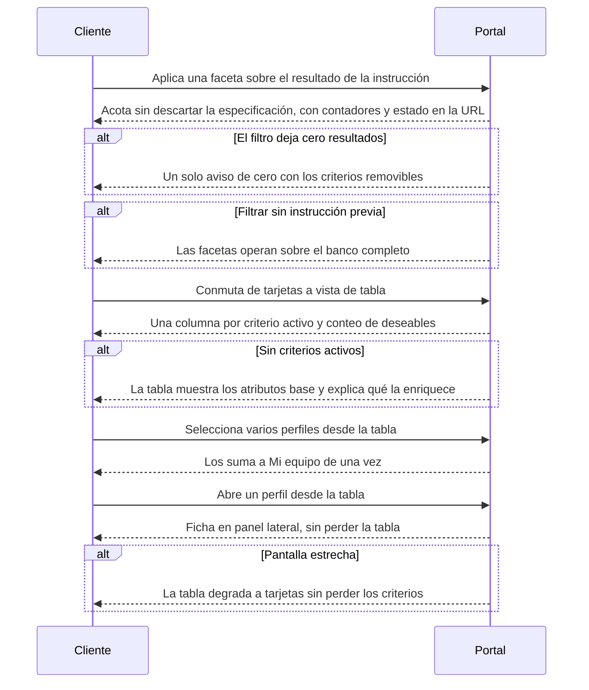

# Flow 002 — Refinamiento y descubrimiento del banco

## Resumen

Lo que el cliente hace **después** de que la instrucción devolvió resultados. Actor principal: el **Cliente**. Condición de éxito: acota o amplía el conjunto sin perder lo que la instrucción entendió, y puede leer muchos perfiles por el mismo criterio.

## Diagrama

## Trazabilidad

| Paso | HU | AC |
|---|---|---|
| Faceta sobre instrucción | HU-074 | AC-1 (happy) |
| Cero por filtro | HU-074 | AC-2 (error) |
| Faceta sin instrucción | HU-074 | AC-3 (edge) |
| Conmutar de vista | HU-121 | AC-1 (happy) |
| Tabla sin criterios | HU-121 | AC-4 (error) |
| Selección múltiple | HU-121 | AC-2 (happy) |
| Abrir perfil desde tabla | HU-121 | AC-3 (happy) |
| Pantalla estrecha | HU-121 | AC-5 (edge) |

## Notas

**Esta épica contiene la prueba que puede tumbar la Fase 2.** Si más de la mitad de las sesiones usa filtros después de haber escrito una instrucción, la subordinación de las facetas está mal hecha (PRD §14.2). El flujo se diagrama como refinamiento, no como entrada: si la medición dice lo contrario, este diagrama se invierte.

**Sin historia escrita en esta épica:** RF-10 (sondeo de agentes autónomos en el grid) y RF-11 (espacio no-perfil). Están en `epicas.md` y no tienen historia. Ver §Deuda de mapa.
