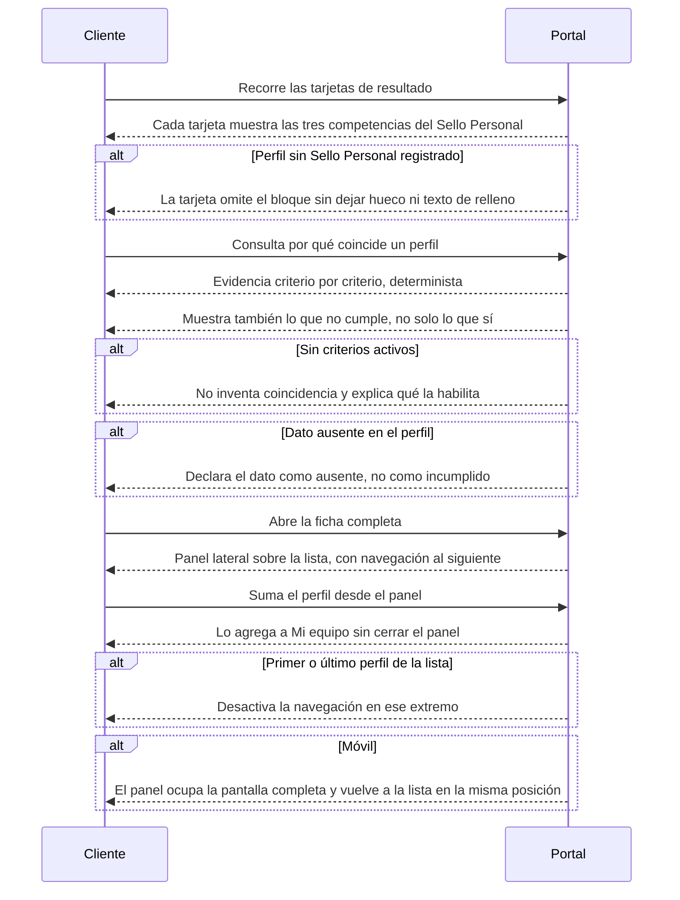

# Flow 003 — Evidencia del perfil

## Resumen

Cómo el cliente evalúa un perfil y entiende por qué coincide. Actor principal: el **Cliente**. Condición de éxito: distingue un perfil de otro por evidencia verificada, no por adjetivos, y puede pasar al siguiente sin perder la lista.

## Diagrama

## Trazabilidad

| Paso | HU | AC |
|---|---|---|
| Competencias en la tarjeta | HU-081 | AC-1 (happy) |
| Perfil sin Sello Personal | HU-081 | AC-2 (error) |
| Evidencia por criterio | HU-119 | AC-1 (happy) |
| Lo que no cumple | HU-119 | AC-2 (happy) |
| Sin criterios activos | HU-119 | AC-3 (error) |
| Dato ausente | HU-119 | AC-4 (edge) |
| Panel lateral con navegación | HU-120 | AC-1 (happy) |
| Sumar desde el panel | HU-120 | AC-2 (happy) |
| Extremo de la lista | HU-120 | AC-3 (error) |
| Móvil | HU-120 | AC-4 (edge) |

## Notas

**HU-079 (reconocer de un vistazo qué ha logrado un perfil) está descartada y no se diagrama.** D-15 la cerró: el logro cuantificado no existe en el banco entregado por Talento Humano, extraerlo tiene costo recurrente y es autoreportado por naturaleza, incompatible con la jerarquía verificado/autoreportado del producto. Lo reemplazan las tres competencias del Sello Personal (RF-14.1), que sí están en el flujo.

**La calidad de este flujo depende de D-5**, abierta. Con el nombre publicado (D-1 revertida), el grado de detalle de la trayectoria es lo único que carga la humanidad de la ficha. D-5 no bloquea la construcción; define si la ficha se siente humana o se siente un inventario.

**Alcance sin historia escrita:** la ficha completa en cuatro bloques (RF-3.2), la evidencia por dimensión Neural-Grid y la garantía Neural Speed no tienen historia redactada. Ver §Deuda de mapa.
