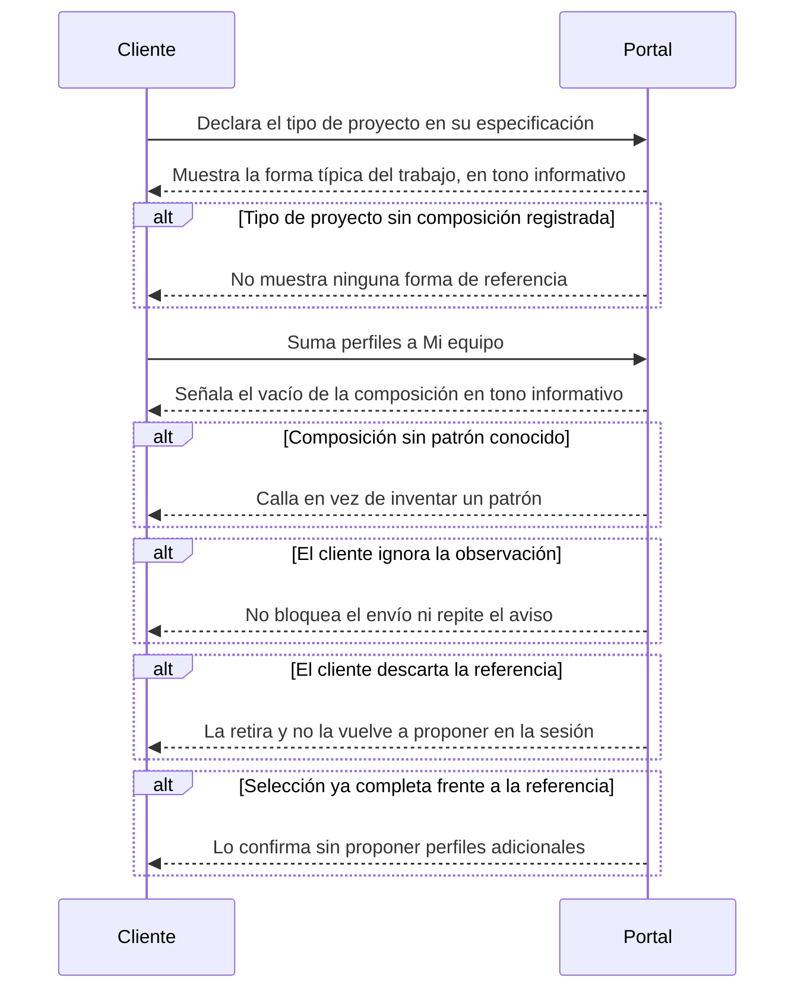

# Flow 004 — Armado de equipo

## Resumen

Lo que el portal aporta mientras el cliente compone su equipo. Actor principal: el **Cliente**. Condición de éxito: el cliente ve qué le falta a la composición sin que el portal le imponga una forma.

## Diagrama

## Trazabilidad

| Paso | HU | AC |
|---|---|---|
| Forma de referencia | HU-084 | AC-1 (happy) |
| Tipo sin composición registrada | HU-084 | AC-2 (error) |
| Vacío señalado | HU-080 | AC-1 (happy) |
| Composición sin patrón | HU-080 | AC-2 (error) |
| Observación ignorada | HU-080 | AC-3 (edge) |
| Referencia descartada | HU-084 | AC-3 (edge) |
| Selección completa | HU-084 | AC-4 (edge) |

## Notas

**Este flow diagrama los adornos de la épica, no su núcleo.** Sumar un perfil, quitarlo, ver el contador desde cualquier pantalla y recuperar Mi equipo al volver —RF-4 completo, que es la capability declarada de EP-004— **no tienen historia escrita**. Las dos únicas historias redactadas son las observaciones que el portal hace sobre la composición.

Mientras eso siga así, este flow no cubre el recorrido de la épica: cubre lo que se le añadió encima. Ver §Deuda de mapa en `docs/02-user-story-map/`.

**D-19 cerró el 2026-09-21: solo los tres tipos de proyecto más frecuentes.** Delivery entrega esas tres composiciones reales; fuera de ellas el portal calla, que es exactamente el ramal de AC-2. La historia queda libre con una dependencia de insumo —una sesión de trabajo con Delivery—, no de decisión. La regla dura se mantiene: composición real o ninguna.
