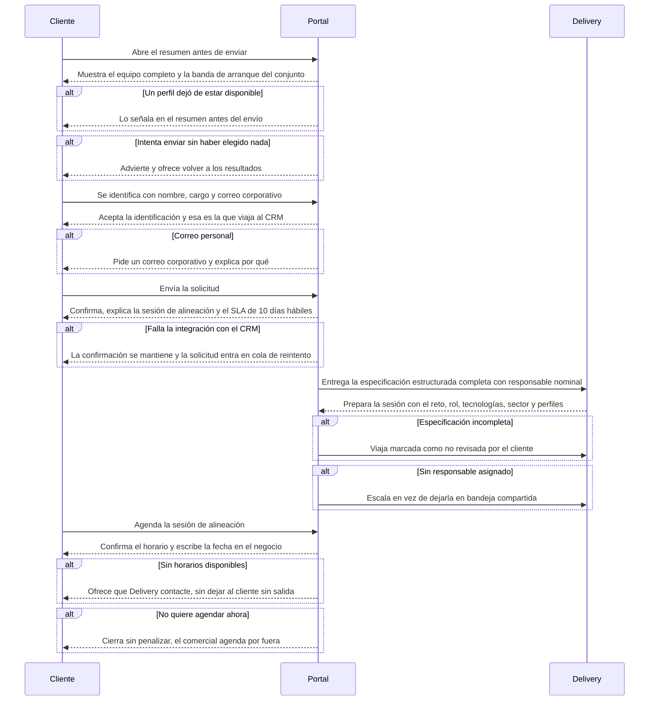

# Flow 005 — Solicitud de equipo y agendamiento

## Resumen

Del equipo armado a la sesión de alineación. Actores: el **Cliente** y **Delivery** (Coordinación de Servicio). Condición de éxito: la solicitud sale con contexto suficiente, el cliente sabe qué pasa después, y alguien del lado de Trycore tiene asignado provocarla.

## Diagrama

## Trazabilidad

| Paso | HU | AC |
|---|---|---|
| Resumen antes de enviar | HU-096 | AC-1 (happy) |
| Perfil no disponible en el resumen | HU-096 | AC-2 (error) |
| Envío sin selección | HU-100 | AC-1 (happy) |
| Identificación | HU-097 | AC-1 (happy) |
| Correo personal | HU-097 | AC-2 (error) |
| Envío y confirmación | HU-098 | AC-1 (happy) |
| Falla de integración | HU-098 | AC-2 (error) |
| Traspaso a Delivery | HU-101 | AC-1 (happy) |
| Especificación incompleta | HU-101 | AC-2 (error) |
| Sin responsable | HU-101 | AC-3 (edge) |
| Agendar | HU-099 | AC-1 (happy) |
| Sin horarios | HU-099 | AC-2 (error) |
| No agenda ahora | HU-099 | AC-3 (edge) |

## Notas

**HU-101 cierra RF-17, el hueco entre «se envió la solicitud» y «alguien la convirtió en sesión agendada».** Es donde vive O3. El requisito manda responsable nominal, no bandeja compartida: una bandeja sin dueño es una bandeja sin lector.

**HU-099 está en v1.1.** En el MVP la confirmación explica el paso siguiente y el comercial agenda por fuera. La consecuencia hay que aceptarla explícitamente: mientras HU-099 no exista, el numerador de O3 depende de que un humano escriba la fecha a mano (HU-107 en EP-007).

**AC no diagramados:** HU-096 AC-3 (equipo vacío, cubierto por HU-100), HU-097 AC-3 (contacto desconocido en empresa conocida, se resuelve en EP-007 con HU-104), HU-098 AC-3 (segunda solicitud parecida, se resuelve en EP-007 con HU-105 y la excepción de HU-077), HU-100 AC-2 y AC-3.
