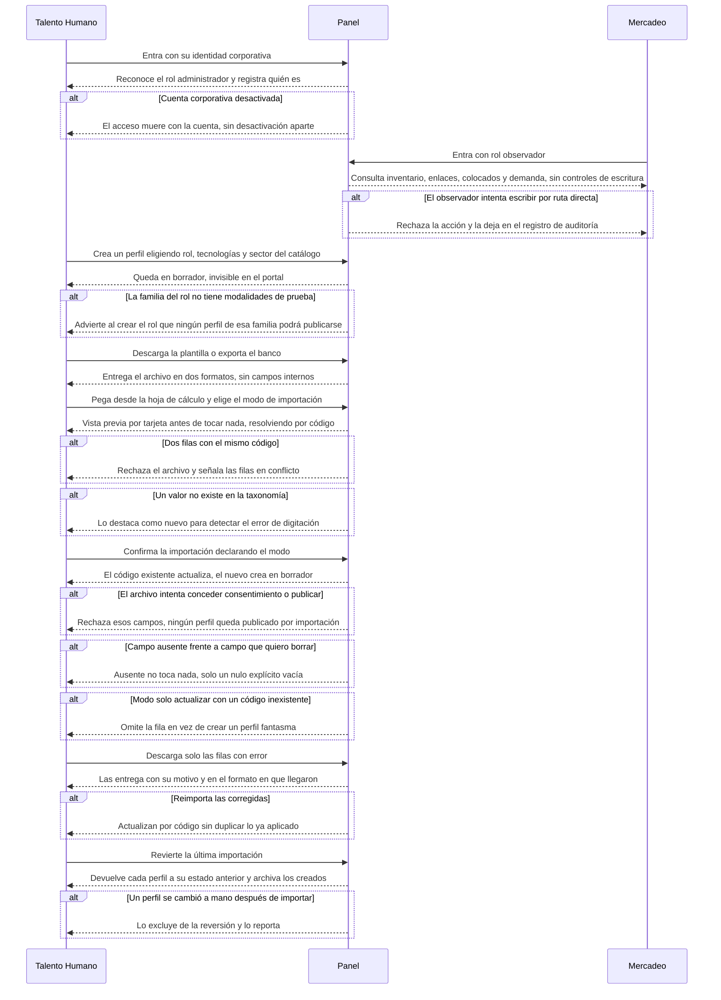
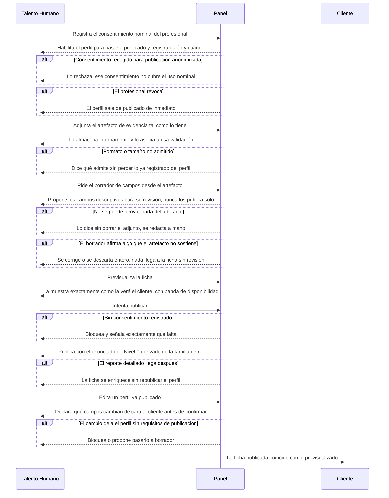
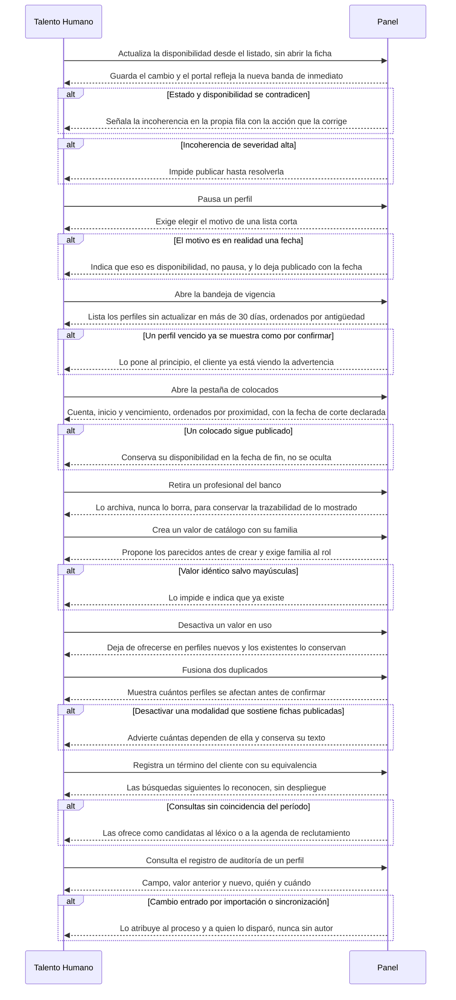

# Flow 006 — Administración del inventario

## Resumen

El ciclo completo del panel: entrar, crear, consentir, publicar, mantener y gobernar. Actores: **Talento Humano** (rol administrador de inventario) y **Mercadeo** (rol observador), según D-22. Condición de éxito: el banco se sostiene vivo sin que nadie edite registro por registro, y nada se publica sin respaldo.

## Diagrama — acceso y creación

## Diagrama — consentimiento, evidencia y publicación

## Diagrama — mantenimiento y gobierno

## Trazabilidad

| Paso | HU | AC |
|---|---|---|
| Entrar con identidad corporativa | HU-123 | AC-1 (happy) · AC-2 (error) |
| Observador consulta sin escribir | HU-124 | AC-1 (happy) · AC-2 (error) |
| Crear perfil desde catálogo | HU-125 | AC-1 (happy) · AC-2 (error) |
| Exportar y plantilla | HU-088 | AC-1, AC-2 y AC-4 (happy) · AC-5 (edge) |
| Pegar y previsualizar | HU-086 | AC-1 y AC-2 (happy) · AC-3 (error) · AC-4 (edge) |
| Confirmar con el modo correcto | HU-141 | AC-1 (happy) · AC-2 (error) · AC-3 y AC-4 (edge) |
| Corregir lo que falló | HU-142 | AC-1 (happy) · AC-3 (edge) |
| Revertir importación | HU-087 | AC-1 (happy) · AC-3 (edge) |
| Registrar consentimiento | HU-127 | AC-1 (happy) · AC-2 y AC-3 (error) |
| Adjuntar artefacto | HU-131 | AC-1 (happy) · AC-2 (error) |
| Borrador desde el artefacto | HU-140 | AC-1 (happy) · AC-2 (error) · AC-3 (edge) |
| Previsualizar | HU-129 | AC-1 (happy) |
| Bloqueo sin consentimiento | HU-128 | AC-1 (happy) |
| Publicar con Nivel 0 | HU-130 | AC-1 (happy) · AC-3 (edge) |
| Editar publicado | HU-126 | AC-1 (happy) · AC-2 (error) |
| Disponibilidad en dos clics | HU-132 | AC-1 (happy) |
| Incoherencias | HU-134 | AC-1 (happy) · AC-2 (error) |
| Pausar con motivo | HU-133 | AC-1 (happy) · AC-2 (error) |
| Bandeja de vigencia | HU-136 | AC-1 (happy) · AC-3 (edge) |
| Colocados | HU-137 | AC-1 (happy) · AC-3 (edge) |
| Archivar | HU-135 | AC-1 (happy) |
| Crear valores de catálogo | HU-089 | AC-1 y AC-2 (happy) · AC-3 y AC-4 (error) |
| Retirar y fusionar valores | HU-143 | AC-1 y AC-2 (happy) · AC-4 (edge) |
| Léxico | HU-139 | AC-1 (happy) · AC-3 (edge) |
| Auditoría | HU-138 | AC-1 (happy) · AC-2 (error) |

## Notas

**Este flow se reescribió el 2026-09-21.** Hasta esa fecha diagramaba cuatro historias —importación y catálogos— porque eran las únicas escritas, mientras la épica declaraba RF-8 completo. Con HU-123 a HU-139 redactadas, el panel tiene por fin un recorrido entero: acceso, creación, consentimiento, publicación, mantenimiento y gobierno.

**Tres diagramas y no uno.** El ciclo del panel no es un recorrido lineal: son tres momentos con actores y disparadores distintos —quien entra y carga, quien publica, quien mantiene—. Forzarlos en un solo diagrama produciría algo ilegible sin ganar precisión.

**El orden del segundo diagrama no es estético.** Consentimiento antes que publicación porque RF-8.4 lo bloquea; Nivel 0 después del bloqueo porque RF-8.10 es explícito en que la falta de reporte detallado **no** impide publicar. Invertirlos describiría un producto distinto.

**D-8 cerró el 2026-09-18 en CRUD completo**, así que todo lo diagramado está comprometido para el MVP. **D-22** fija los dos roles: administrador de inventario escribe, observador consulta.

**Dependencia dura:** HU-138 (auditoría) no existe sin HU-123 (identidad). RF-8.1.3 lo dice — el «quién» del registro solo existe si hay identidad. Igual **HU-140 no existe sin HU-131**: sin artefacto guardado no hay de qué derivar.

**Cuatro divisiones el 2026-09-22.** `METODOLOGIA.md` §4 usa el tope de cinco escenarios como detector de tamaño, y tres historias de esta épica lo excedían. HU-086 (8 AC) se partió en **HU-086** (pegar y previsualizar), **HU-141** (confirmar con el modo correcto) y **HU-142** (corregir lo que falló); HU-089 (6 AC) en **HU-089** (crear valores) y **HU-143** (retirar y fusionar). Las dos traían el corte propuesto en su propia tabla INVEST.

**HU-131 se dividió el mismo día.** Juntaba guardar el artefacto y derivar campos de él en una sola historia L de valor medio. Guardar un archivo y leer un video son trabajos de orden distinto: la mitad útil quedó en HU-131 (M) y la cara en HU-140 (L), que se puede posponer entera.

**AC no diagramados:** los escenarios de severidad media de HU-134, los límites de HU-125 AC-3 y AC-4, HU-086 AC-6 a AC-8, HU-087 AC-2, HU-089 AC-4 y AC-6, y los edge cases de móvil y bandeja de HU-133. Viven en los AC de su historia; incluirlos aquí no añade recorrido.
