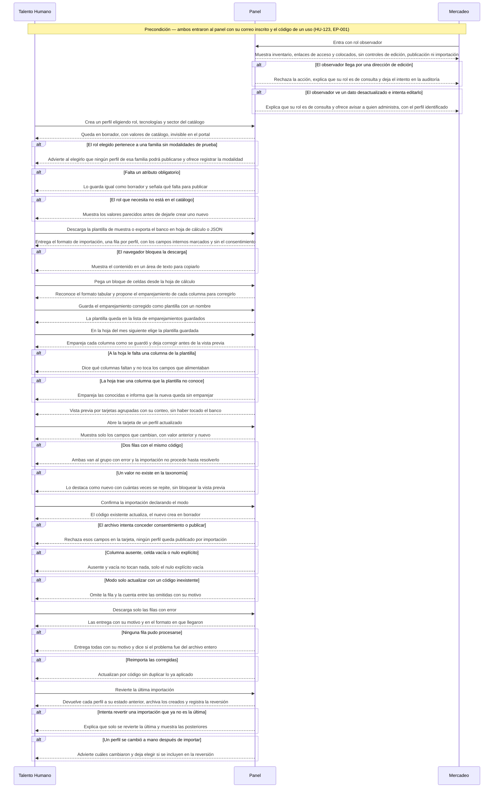
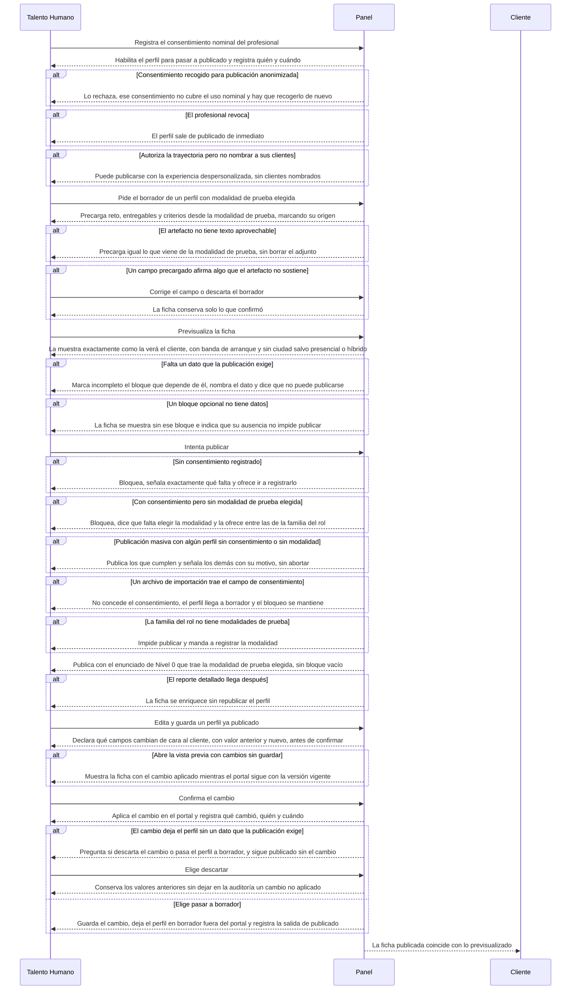

# Flow 006 — Administración del inventario

## Resumen

El ciclo completo del panel: consultar, crear, cargar, consentir, publicar, mantener y gobernar. Actores: **Talento Humano** (rol administrador de inventario) y **Mercadeo** (rol observador), según D-22. Condición de éxito: el banco se sostiene vivo sin que nadie edite registro por registro, y nada se publica sin respaldo.

## Diagrama — consulta, creación y carga

```mermaid
sequenceDiagram
  participant TH as Talento Humano
  participant P as Panel
  participant M as Mercadeo

  Note over TH,M: Precondición — ambos entraron al panel con su correo inscrito y el código de un uso (HU-123, EP-001)

  %% HU-124
  M->>P: Entra con rol observador
  %% HU-124
  P-->>M: Muestra inventario, enlaces de acceso y colocados, sin controles de edición, publicación ni importación

  %% HU-124
  alt El observador llega por una dirección de edición
    %% HU-124
    P-->>M: Rechaza la acción, explica que su rol es de consulta y deja el intento en la auditoría
  end

  %% HU-124
  alt El observador ve un dato desactualizado e intenta editarlo
    %% HU-124
    P-->>M: Explica que su rol es de consulta y ofrece avisar a quien administra, con el perfil identificado
  end

  %% HU-125
  TH->>P: Crea un perfil eligiendo rol, tecnologías y sector del catálogo
  %% HU-125
  P-->>TH: Queda en borrador, con valores de catálogo, invisible en el portal

  %% HU-125
  alt El rol elegido pertenece a una familia sin modalidades de prueba
    %% HU-125
    P-->>TH: Advierte al elegirlo que ningún perfil de esa familia podrá publicarse y ofrece registrar la modalidad
  end

  %% HU-125
  alt Falta un atributo obligatorio
    %% HU-125
    P-->>TH: Lo guarda igual como borrador y señala qué falta para publicar
  end

  %% HU-125
  alt El rol que necesita no está en el catálogo
    %% HU-125
    P-->>TH: Muestra los valores parecidos antes de dejarle crear uno nuevo
  end

  %% HU-088
  TH->>P: Descarga la plantilla de muestra o exporta el banco en hoja de cálculo o JSON
  %% HU-088
  P-->>TH: Entrega el formato de importación, una fila por perfil, con los campos internos marcados y sin el consentimiento

  %% HU-088
  alt El navegador bloquea la descarga
    %% HU-088
    P-->>TH: Muestra el contenido en un área de texto para copiarlo
  end

  %% HU-086
  TH->>P: Pega un bloque de celdas desde la hoja de cálculo
  %% HU-086
  P-->>TH: Reconoce el formato tabular y propone el emparejamiento de cada columna para corregirlo

  %% HU-148
  TH->>P: Guarda el emparejamiento corregido como plantilla con un nombre
  %% HU-148
  P-->>TH: La plantilla queda en la lista de emparejamientos guardados

  %% HU-148
  TH->>P: En la hoja del mes siguiente elige la plantilla guardada
  %% HU-148
  P-->>TH: Empareja cada columna como se guardó y deja corregir antes de la vista previa

  %% HU-148
  alt A la hoja le falta una columna de la plantilla
    %% HU-148
    P-->>TH: Dice qué columnas faltan y no toca los campos que alimentaban
  end

  %% HU-148
  alt La hoja trae una columna que la plantilla no conoce
    %% HU-148
    P-->>TH: Empareja las conocidas e informa que la nueva queda sin emparejar
  end

  %% HU-086
  P-->>TH: Vista previa por tarjetas agrupadas con su conteo, sin haber tocado el banco
  %% HU-086
  TH->>P: Abre la tarjeta de un perfil actualizado
  %% HU-086
  P-->>TH: Muestra solo los campos que cambian, con valor anterior y nuevo

  %% HU-086
  alt Dos filas con el mismo código
    %% HU-086
    P-->>TH: Ambas van al grupo con error y la importación no procede hasta resolverlo
  end

  %% HU-086
  alt Un valor no existe en la taxonomía
    %% HU-086
    P-->>TH: Lo destaca como nuevo con cuántas veces se repite, sin bloquear la vista previa
  end

  %% HU-141
  TH->>P: Confirma la importación declarando el modo
  %% HU-141
  P-->>TH: El código existente actualiza, el nuevo crea en borrador

  %% HU-141
  alt El archivo intenta conceder consentimiento o publicar
    %% HU-141
    P-->>TH: Rechaza esos campos en la tarjeta, ningún perfil queda publicado por importación
  end

  %% HU-141
  alt Columna ausente, celda vacía o nulo explícito
    %% HU-141
    P-->>TH: Ausente y vacía no tocan nada, solo el nulo explícito vacía
  end

  %% HU-141
  alt Modo solo actualizar con un código inexistente
    %% HU-141
    P-->>TH: Omite la fila y la cuenta entre las omitidas con su motivo
  end

  %% HU-142
  TH->>P: Descarga solo las filas con error
  %% HU-142
  P-->>TH: Las entrega con su motivo y en el formato en que llegaron

  %% HU-142
  alt Ninguna fila pudo procesarse
    %% HU-142
    P-->>TH: Entrega todas con su motivo y dice si el problema fue del archivo entero
  end

  %% HU-142
  alt Reimporta las corregidas
    %% HU-142
    P-->>TH: Actualizan por código sin duplicar lo ya aplicado
  end

  %% HU-087
  TH->>P: Revierte la última importación
  %% HU-087
  P-->>TH: Devuelve cada perfil a su estado anterior, archiva los creados y registra la reversión

  %% HU-087
  alt Intenta revertir una importación que ya no es la última
    %% HU-087
    P-->>TH: Explica que solo se revierte la última y muestra las posteriores
  end

  %% HU-087
  alt Un perfil se cambió a mano después de importar
    %% HU-087
    P-->>TH: Advierte cuáles cambiaron y deja elegir si se incluyen en la reversión
  end
```

## Diagrama — consentimiento, evidencia y publicación

```mermaid
sequenceDiagram
  participant TH as Talento Humano
  participant P as Panel
  participant C as Cliente

  %% HU-127
  TH->>P: Registra el consentimiento nominal del profesional
  %% HU-127
  P-->>TH: Habilita el perfil para pasar a publicado y registra quién y cuándo

  %% HU-127
  alt Consentimiento recogido para publicación anonimizada
    %% HU-127
    P-->>TH: Lo rechaza, ese consentimiento no cubre el uso nominal y hay que recogerlo de nuevo
  end

  %% HU-127
  alt El profesional revoca
    %% HU-127
    P-->>TH: El perfil sale de publicado de inmediato
  end

  %% HU-127
  alt Autoriza la trayectoria pero no nombrar a sus clientes
    %% HU-127
    P-->>TH: Puede publicarse con la experiencia despersonalizada, sin clientes nombrados
  end

  %% D29 (sponsor, 2026-10-01): adjuntar el artefacto se difiere a v2; sus arcos de adjuntar, descargar, observador y formato se retiran de esta versión

  %% HU-140
  TH->>P: Pide el borrador de un perfil con modalidad de prueba elegida
  %% HU-140
  P-->>TH: Precarga reto, entregables y criterios desde la modalidad de prueba, marcando su origen

  %% HU-140
  alt El artefacto no tiene texto aprovechable
    %% HU-140
    P-->>TH: Precarga igual lo que viene de la modalidad de prueba, sin borrar el adjunto
  end

  %% HU-140
  alt Un campo precargado afirma algo que el artefacto no sostiene
    %% HU-140
    TH->>P: Corrige el campo o descarta el borrador
    %% HU-140
    P-->>TH: La ficha conserva solo lo que confirmó
  end

  %% HU-129
  TH->>P: Previsualiza la ficha
  %% HU-129
  P-->>TH: La muestra exactamente como la verá el cliente, con banda de arranque y sin ciudad salvo presencial o híbrido

  %% HU-129
  alt Falta un dato que la publicación exige
    %% HU-129
    P-->>TH: Marca incompleto el bloque que depende de él, nombra el dato y dice que no puede publicarse
  end

  %% HU-129
  alt Un bloque opcional no tiene datos
    %% HU-129
    P-->>TH: La ficha se muestra sin ese bloque e indica que su ausencia no impide publicar
  end

  %% HU-128
  TH->>P: Intenta publicar
  %% HU-128
  alt Sin consentimiento registrado
    %% HU-128
    P-->>TH: Bloquea, señala exactamente qué falta y ofrece ir a registrarlo
  end

  %% HU-128
  alt Con consentimiento pero sin modalidad de prueba elegida
    %% HU-128
    P-->>TH: Bloquea, dice que falta elegir la modalidad y la ofrece entre las de la familia del rol
  end

  %% HU-128
  alt Publicación masiva con algún perfil sin consentimiento o sin modalidad
    %% HU-128
    P-->>TH: Publica los que cumplen y señala los demás con su motivo, sin abortar
  end

  %% HU-128
  alt Un archivo de importación trae el campo de consentimiento
    %% HU-128
    P-->>TH: No concede el consentimiento, el perfil llega a borrador y el bloqueo se mantiene
  end

  %% HU-130
  alt La familia del rol no tiene modalidades de prueba
    %% HU-130
    P-->>TH: Impide publicar y manda a registrar la modalidad
  end

  %% HU-130
  P-->>TH: Publica con el enunciado de Nivel 0 que trae la modalidad de prueba elegida, sin bloque vacío

  %% HU-130
  alt El reporte detallado llega después
    %% HU-130
    P-->>TH: La ficha se enriquece sin republicar el perfil
  end

  %% HU-126
  TH->>P: Edita y guarda un perfil ya publicado
  %% HU-126
  P-->>TH: Declara qué campos cambian de cara al cliente, con valor anterior y nuevo, antes de confirmar

  %% HU-129
  alt Abre la vista previa con cambios sin guardar
    %% HU-129
    P-->>TH: Muestra la ficha con el cambio aplicado mientras el portal sigue con la versión vigente
  end

  %% HU-126
  TH->>P: Confirma el cambio
  %% HU-126
  P-->>TH: Aplica el cambio en el portal y registra qué cambió, quién y cuándo

  %% HU-126
  alt El cambio deja el perfil sin un dato que la publicación exige
    %% HU-126
    P-->>TH: Pregunta si descarta el cambio o pasa el perfil a borrador, y sigue publicado sin el cambio
    %% HU-126
    TH->>P: Elige descartar
    %% HU-126
    P-->>TH: Conserva los valores anteriores sin dejar en la auditoría un cambio no aplicado
  else Elige pasar a borrador
    %% HU-126
    P-->>TH: Guarda el cambio, deja el perfil en borrador fuera del portal y registra la salida de publicado
  end

  %% HU-129
  P-->>C: La ficha publicada coincide con lo previsualizado
  %% D29: adjuntar el artefacto se difiere a v2; el arco «el artefacto nunca se publica» se retira con ella; sin artefacto guardado no hay nada que exponer
```

## Diagrama — mantenimiento y gobierno

```mermaid
sequenceDiagram
  participant TH as Talento Humano
  participant P as Panel
  participant M as Mercadeo
  participant PO as Portal

  %% HU-132
  TH->>P: Actualiza la disponibilidad desde el listado, sin abrir la ficha
  %% HU-132
  P-->>TH: Guarda el cambio, registra quién y cuándo, y el portal refleja la nueva banda de inmediato

  %% HU-132
  alt Varios perfiles que quedan libres el mismo día
    %% HU-132
    P-->>TH: Aplica el cambio en bloque y muestra el resultado por perfil
  end

  %% HU-132
  M->>P: Intenta cambiar la disponibilidad desde el listado
  %% HU-132
  P-->>M: No lo permite, la disponibilidad no cambia y no queda cambio registrado

  %% HU-134
  TH->>P: Pone una fecha de disponibilidad a un perfil pausado
  %% HU-134
  P-->>TH: Señala la incoherencia en rojo en su propia fila con la acción que la corrige

  %% HU-134
  alt Incoherencia de severidad alta al intentar publicar
    %% HU-134
    P-->>TH: Impide publicar hasta resolverla, con aviso en rojo que nombra la contradicción
  end

  %% HU-134
  alt Incoherencia de severidad media
    %% HU-134
    P-->>TH: Advierte en la fila sin rojo y el perfil sigue publicado
  end

  %% HU-134
  alt Fecha vencida y más de 30 días sin actualizar
    %% HU-134
    P-->>TH: Indica que el portal lo muestra como «Disponibilidad por confirmar» y lo lleva a la bandeja de vigencia
  end

  %% HU-133
  TH->>P: Pausa un perfil publicado
  %% HU-133
  P-->>TH: Exige elegir el motivo de una lista corta, lo retira del portal y registra quién y cuándo

  %% HU-133
  alt El motivo es en realidad una fecha
    %% HU-133
    P-->>TH: Indica que eso es disponibilidad, no pausa, y lo lleva a dejarlo publicado con la fecha
  end

  %% HU-136
  TH->>P: Abre la bandeja de vigencia
  %% HU-136
  P-->>TH: Lista los publicados sin actualizar en más de 30 días, por antigüedad, con actualización en dos clics por fila

  %% HU-136
  alt Un perfil lleva más de 30 días pausado
    %% HU-136
    P-->>TH: Lo marca para revisión con su motivo y desde qué fecha está pausado
    %% HU-133
    P-->>TH: Permite reactivarlo o archivarlo desde la bandeja
  end

  %% HU-136
  alt Un perfil no tiene fecha de última actualización
    %% HU-136
    P-->>TH: Lo incluye marcado como «dato incompleto», sin tratarlo como al día
  end

  %% HU-136
  alt Un perfil vencido ya se muestra como por confirmar
    %% HU-136
    P-->>TH: Lo pone al principio, el cliente ya está viendo la advertencia
  end

  %% HU-136
  alt No hay nada pendiente
    %% HU-136
    P-->>TH: Declara explícitamente que no hay perfiles pendientes de revisión
  end

  %% HU-137
  TH->>P: Marca un perfil como colocado con el cliente y la fecha de liberación
  %% HU-137
  P-->>TH: Lo pasa a la pestaña de colocados, su disponibilidad pasa a la fecha de liberación y el dato queda atribuido a ella

  %% HU-137
  TH->>P: Abre la pestaña de colocados
  %% HU-137
  P-->>TH: Cuenta, inicio y liberación, ordenados por proximidad, con los de menos de 60 días destacados

  %% HU-137
  alt Guarda el colocado sin fecha de liberación
    %% HU-137
    P-->>TH: No lo guarda, explica que un colocado siempre lleva su fecha de liberación y el perfil queda como estaba
  end

  %% HU-137
  alt Un colocado sigue publicado
    %% HU-137
    P-->>TH: Conserva su disponibilidad en la fecha de liberación y sigue visible en el portal
  end

  %% HU-150
  TH->>P: Carga en la pestaña de colocados el archivo JSON o CSV de Operaciones
  %% HU-150
  P-->>TH: Marca los colocados como procedentes de esa carga, fecha el corte en el momento de la carga e informa las columnas ignoradas

  %% HU-150
  alt Una fila difiere de un colocado registrado en el panel
    %% HU-150
    P-->>TH: Gana el panel, la fila no lo pisa y queda señalada «diferencia con Operaciones» para que ella decida
  end

  %% HU-150
  alt El archivo trae filas con errores de formato
    %% HU-150
    P-->>TH: Aplica solo las válidas y muestra cada fila mala con su número y motivo, sin aplicarla
  end

  %% HU-150
  alt El archivo no es JSON ni CSV
    %% HU-150
    P-->>TH: Lo rechaza entero y conserva la carga anterior con su fecha de corte
  end

  %% HU-150
  alt Pasaron más de 7 días sin una carga nueva
    %% HU-150
    P-->>TH: Muestra «dato desincronizado» junto a la fecha de corte, sin ocultar los colocados
  end

  %% HU-135
  TH->>P: Retira un profesional del banco
  %% HU-135
  P-->>TH: Lo archiva, nunca lo borra, y lo saca del portal conservando la trazabilidad

  %% HU-135
  alt El perfil ya estaba archivado
    %% HU-135
    P-->>TH: Indica que ya está archivado sin cambiar su fecha ni su historial
  end

  %% HU-135
  M->>P: Intenta archivar un perfil
  %% HU-135
  P-->>M: No lo permite y el perfil conserva su estado

  %% HU-135
  PO-->>PO: Un enlace curado con un perfil archivado muestra su estado real, sin omitirlo

  %% HU-089
  TH->>P: Crea un rol nuevo eligiendo su familia
  %% HU-089
  P-->>TH: El rol queda disponible en el editor, con la familia como campo obligatorio

  %% HU-089
  alt La familia no tiene modalidades de prueba
    %% HU-089
    P-->>TH: Crea el rol y advierte que ningún perfil de esa familia podrá publicarse
  end

  %% HU-089
  TH->>P: Escribe parte de una tecnología en un perfil
  %% HU-089
  P-->>TH: Ofrece los valores del catálogo que coinciden, sin aceptar texto libre

  %% HU-089
  alt Valor parecido a uno existente
    %% HU-089
    P-->>TH: Muestra el parecido para usarlo en un toque y exige confirmar que es distinto
  end

  %% HU-089
  alt Valor idéntico salvo mayúsculas
    %% HU-089
    P-->>TH: Lo impide e indica que ya existe
  end

  %% HU-143
  TH->>P: Desactiva un valor en uso
  %% HU-143
  P-->>TH: Advierte cuántas fichas dependen de él, deja de ofrecerlo y las fichas conservan su texto, sin opción de borrar

  %% HU-143
  TH->>P: Elige fusionar dos duplicados
  %% HU-143
  P-->>TH: Muestra cuántos perfiles pasarán al valor destino sin cambiar nada todavía

  %% HU-143
  alt Confirma la fusión
    %% HU-143
    P-->>TH: Los perfiles pasan al valor destino y el origen desaparece del catálogo
  else Nota que no son el mismo y cancela
    %% HU-143
    P-->>TH: Ambos valores siguen y ningún perfil cambia
  end

  %% HU-143
  alt Mismo valor o catálogos distintos
    %% HU-143
    P-->>TH: Rechaza la fusión con su motivo
  end

  %% HU-139
  TH->>P: Registra un término del cliente con su equivalencia
  %% HU-139
  P-->>TH: Las búsquedas siguientes lo reconocen, sin despliegue

  %% HU-139
  alt Equivalencia a un valor que no existe en el catálogo
    %% HU-139
    P-->>TH: La rechaza y ofrece los valores del catálogo
  end

  %% HU-139
  alt El modelo propuso una equivalencia
    %% HU-139
    TH->>P: La aprueba, con o sin editarla
    %% HU-139
    P-->>TH: Entra al léxico tal como quedó
  else La rechaza
    %% HU-139
    P-->>TH: No entra al léxico y deja de ofrecerse
  end

  %% HU-139
  alt Consultas sin coincidencia del período
    %% HU-139
    P-->>TH: Las ofrece como candidatas al léxico o a la agenda de reclutamiento
  end

  %% HU-147
  TH->>P: Guarda como contacto de Trycore un nombre, un cargo y un correo @trycore.com
  %% HU-147
  P-->>TH: Registra en la auditoría quién lo cambió, cuándo, el valor anterior y el nuevo
  %% HU-147
  P-->>PO: Las pantallas de contacto muestran el nuevo contacto en su siguiente carga

  %% HU-147
  alt El correo no es @trycore.com
    %% HU-147
    P-->>TH: No lo guarda, lo explica y el portal sigue con el contacto anterior
  end

  %% HU-147
  alt Solo se guardó un correo, sin nombre ni cargo
    %% HU-147
    PO-->>PO: Muestra «escribe a People Service» con el correo, nunca un nombre vacío
  end

  %% HU-147
  M->>P: Abre la configuración del contacto
  %% HU-147
  P-->>M: Muestra el contacto vigente en modo lectura

  %% HU-147
  alt Envía un cambio por petición directa
    %% HU-147
    P-->>M: Lo rechaza, el contacto no cambia y la auditoría no registra nada
  end

  %% HU-151
  TH->>P: Inscribe un correo @trycore.com con su rol en la lista de acceso
  %% HU-151
  P-->>TH: Aparece en la lista con su rol, ya puede recibir código y el alta queda en la auditoría

  %% HU-151
  TH->>P: Pasa a observador a otra administradora
  %% HU-151
  P-->>TH: La lista muestra el rol nuevo, su sesión se corta en la siguiente petición y la auditoría registra el anterior y el nuevo

  %% HU-151
  TH->>P: Da de baja un correo inscrito
  %% HU-151
  P-->>TH: Sale de los activos, su sesión se corta en la siguiente petición, ya no recibe código y la baja queda en la auditoría

  %% HU-151
  alt El correo no es @trycore.com
    %% HU-151
    P-->>TH: No lo inscribe, lo explica y la lista queda igual
  end

  %% HU-151
  alt Es la única administradora activa e intenta quitarse el rol
    %% HU-151
    P-->>TH: Lo impide, explica que el panel no puede quedarse sin administrador y sigue inscrita como administradora
  end

  %% HU-138
  TH->>P: Consulta el registro de auditoría de un perfil
  %% HU-138
  P-->>TH: Campo, valor anterior y nuevo, quién y cuándo, incluidos consentimiento y estado

  %% HU-138
  alt Cambio entrado por importación o por la carga del sistema de asignación
    %% HU-138
    P-->>TH: Lo atribuye al proceso y a quien lo disparó, con su fecha o fecha de corte
  end

  %% HU-138
  alt Perfil archivado
    %% HU-138
    P-->>TH: Muestra el historial completo con el archivado como un cambio de estado más
  end

  %% HU-138
  alt La sesión venció al guardar un cambio
    %% HU-138
    P-->>TH: No aplica el cambio y pide volver a entrar, nunca un cambio sin autor
  end
```

## Trazabilidad

La numeración AC-n sigue el orden de los escenarios en la sección de criterios de cada historia.

| Paso | HU | AC |
|---|---|---|
| Observador consulta sin escribir | HU-124 | AC-1 (happy) · AC-2 (error) · AC-3 (edge) |
| Crear perfil desde catálogo | HU-125 | AC-1 (happy) · AC-2 y AC-3 (error) · AC-4 (edge) |
| Exportar y plantilla | HU-088 | AC-1, AC-2 y AC-3 (happy) · AC-4 (error) · AC-5 (edge) |
| Pegar y previsualizar | HU-086 | AC-1, AC-2 y AC-3 (happy) · AC-4 (error) · AC-5 (edge) |
| Reutilizar emparejamiento de columnas | HU-148 | AC-1 y AC-2 (happy) · AC-3 (error) · AC-4 (edge) |
| Confirmar con el modo correcto | HU-141 | AC-1 (happy) · AC-2 (error) · AC-3 y AC-4 (edge) |
| Corregir lo que falló | HU-142 | AC-1 (happy) · AC-2 (error) · AC-3 (edge) |
| Revertir importación | HU-087 | AC-1 (happy) · AC-2 (error) · AC-3 (edge) |
| Registrar consentimiento | HU-127 | AC-1 (happy) · AC-2 y AC-3 (error) · AC-4 (edge) |
| Precargar borrador desde la modalidad de prueba | HU-140 | AC-1 (happy) · AC-2 (error) · AC-3 (edge) |
| Previsualizar | HU-129 | AC-1 (happy) · AC-2 (error) · AC-3 y AC-4 (edge) |
| Bloqueo sin consentimiento o sin modalidad | HU-128 | AC-1 (happy) · AC-2 y AC-3 (error) · AC-4 (edge) |
| Publicar con Nivel 0 | HU-130 | AC-1 (happy) · AC-2 (error) · AC-3 (edge) |
| Editar publicado | HU-126 | AC-1 y AC-2 (happy) · AC-3 y AC-4 (error) · AC-5 (edge) |
| Disponibilidad en dos clics | HU-132 | AC-1 (happy) · AC-2 (error) · AC-3 (edge) |
| Incoherencias | HU-134 | AC-1 (happy) · AC-2 (error) · AC-3 y AC-4 (edge) |
| Pausar con motivo | HU-133 | AC-1 (happy) · AC-2 (error) · AC-3 (edge) |
| Bandeja de vigencia | HU-136 | AC-1 y AC-2 (happy) · AC-3 (error) · AC-4 y AC-5 (edge) |
| Colocados | HU-137 | AC-1 y AC-2 (happy) · AC-3 (error) · AC-4 (edge) |
| Carga de colocados de Operaciones | HU-150 | AC-1 (happy) · AC-2 y AC-3 (error) · AC-4 y AC-5 (edge) |
| Archivar | HU-135 | AC-1 (happy) · AC-2 (error) · AC-3 y AC-4 (edge) |
| Crear valores de catálogo | HU-089 | AC-1 y AC-2 (happy) · AC-3 y AC-4 (error) · AC-5 (edge) |
| Retirar y fusionar valores | HU-143 | AC-1, AC-2 y AC-3 (happy) · AC-4 (error) · AC-5 (edge) |
| Léxico | HU-139 | AC-1 y AC-2 (happy) · AC-3 (edge) · AC-4 (error) · AC-5 (edge) |
| Contacto de Trycore | HU-147 | AC-1 (happy) · AC-2, AC-3 y AC-4 (error) · AC-5 (edge) |
| Lista de acceso al panel | HU-151 | AC-1, AC-2 y AC-3 (happy) · AC-4 (error) · AC-5 (edge) |
| Auditoría | HU-138 | AC-1 (happy) · AC-2 (error) · AC-3, AC-4 y AC-5 (edge) |

## Notas

**Revisión del 2026-09-30.** Se alinea con las historias revisadas antes del DoR y con las decisiones del sponsor D1–D9 (`.claude/state/evidencia/ep-006/decisiones-sponsor-2026-09-30.md`):

- **HU-123 sale de este flow.** Pertenece a EP-001 desde el 2026-09-27 (T-19); aquí solo queda como nota de precondición en el primer diagrama.
- **Nuevas:** HU-147 (contacto de Trycore que ve el cliente), HU-148 (reutilizar un emparejamiento de columnas, partida de HU-086 por D2) y HU-149 (reconocer fecha y resultado por patrones, partida de HU-140 por D9; descartada después por D11). Tras el DoR: HU-150 (carga de colocados de Operaciones, D12) y HU-151 (lista de acceso al panel, D13).
- **HU-140** es ahora «Precargar el borrador desde la modalidad de prueba»; los arcos de fecha y resultado propuestos desde el artefacto, el de lectura fallida con campos vacíos, el del caso ambiguo y el de «sin confirmar no llega a la ficha» pasan a HU-149 (D7, D9).
- **D1 · HU-126:** al quedar incompleto, el panel pregunta si descartar el cambio o pasar el perfil a borrador (ya no «bloquea o propone»).
- **D2:** exportar (HU-088) va antes que pegar (HU-086), que consume su formato.
- **D3 · HU-129:** vista previa fiel, sin comparación lado a lado; el antes/después por campo lo da HU-126 al guardar.
- **D4 · HU-133 / HU-136:** los pausados más de 30 días entran en la bandeja de vigencia.
- **D5 · HU-134:** la matriz ALTA/MEDIA vive en los AC; el diagrama muestra un arco por severidad.
- **D6:** el caso «pausado al que le ponen fecha» es de HU-134; HU-132 tiene como error propio el observador que intenta cambiar la disponibilidad.
- **D8 · HU-137:** el panel es la fuente (marcar colocado con cliente y fecha de liberación) y Operaciones puede cargar su hoja con fecha de corte visible.
- **Tras el DoR (D10–D14, mismo día):**
  - **D10 · HU-128 / HU-130:** la modalidad de prueba se elige del catálogo cerrado de su familia y es obligatoria para publicar; nuevo ramal de HU-128 «sin modalidad elegida» y el Nivel 0 sale de la modalidad elegida, no del rol.
  - **D11 · HU-149 descartada:** se retiran sus arcos (fecha y resultado leídos del artefacto, lectura fallida, caso ambiguo, «sin confirmar»); HU-131 gana la descarga y visualización en el panel y el rechazo de la descarga desde el portal.
  - **D12 · HU-150:** la carga de Operaciones (JSON o CSV, filas malas sin aplicar, fecha de corte, «dato desincronizado» a los más de 7 días) sale de HU-137, que gana el error «colocado sin fecha de liberación».
  - **D13 · HU-151:** alta, cambio de rol y baja en la lista de acceso, con correo externo rechazado y guarda del último administrador. El rechazo al observador lo cubren los arcos de HU-124 (ruta directa).
  - **D15–D18 (mismo día):** HU-150 gana el ramal «diferencia con Operaciones» (gana el panel) y fecha el corte en el momento de la carga con columnas ignoradas informadas; el límite de 7 días exactos sale del diagrama (vive en las notas de HU-150); HU-151 corta la sesión en la siguiente petición al dar de baja o pasar a observador; HU-131 niega la descarga al observador, que solo ve que el artefacto existe (Mercadeo entra como participante del segundo diagrama).
  - **D14 · HU-124:** el observador ve inventario, enlaces de acceso y colocados; demanda y cobertura se añaden con EP-010.
- **D29 · HU-131 diferida a v2 (sponsor, 2026-10-01):** adjuntar, descargar y ver el artefacto sale de EP-006 en esta versión porque cuesta más en producción; es diferir con acuerdo del sponsor, no descartar. Se retiran del segundo diagrama sus arcos (adjuntar, descargar en el panel, observador sin descarga, formato o tamaño no admitido, el artefacto nunca se publica) y su fila de cobertura, y Mercadeo deja de participar en ese diagrama. HU-140 pide el borrador sin artefacto adjunto. Los arcos se recuperan de la historia cuando se retome.
- **Correcciones de fidelidad a los AC:** HU-088 exporta los campos internos marcados (no los omite); HU-086 manda los códigos duplicados al grupo con error en vez de rechazar el archivo; HU-087 deja elegir si incluir los perfiles cambiados a mano; HU-125 advierte al elegir el rol en el editor (la advertencia al crear el rol es de HU-089); la advertencia de fichas dependientes al desactivar es el happy path de HU-143.

**Tres diagramas y no uno.** El ciclo del panel no es un recorrido lineal: son tres momentos con actores y disparadores distintos —quien consulta y carga, quien publica, quien mantiene y gobierna—. Forzarlos en un solo diagrama produciría algo ilegible sin ganar precisión.

**El orden del segundo diagrama no es estético.** Consentimiento antes que publicación porque RF-8.4 lo bloquea; Nivel 0 después del bloqueo porque RF-8.10 es explícito en que la falta de reporte detallado **no** impide publicar. Invertirlos describiría un producto distinto.

**D-8 cerró el 2026-09-18 en CRUD completo**, así que todo lo diagramado está comprometido. **D-22** fija los dos roles: administrador de inventario escribe, observador consulta.

**Dependencias duras:** HU-138 (auditoría) no existe sin la identidad de HU-123 (EP-001) — RF-8.1.3. ~~HU-140 no existe sin HU-131~~ *(corregida el 2026-10-01, D29: HU-140 no depende de HU-131; el borrador sale de la modalidad de prueba, no del artefacto, D11 y D19)*. **HU-148 no existe sin HU-086**: guarda el emparejamiento que HU-086 propone. **HU-150 no existe sin HU-137**: carga en la pestaña de colocados que HU-137 construye. **HU-151 no existe sin HU-123** (EP-001): mantiene la lista de acceso que HU-123 aplica al entrar.

**Divisiones.** El 2026-09-22 HU-086 se partió en HU-086, HU-141 y HU-142; HU-089 en HU-089 y HU-143; HU-131 en HU-131 y HU-140. El 2026-09-30 HU-086 cedió el guardado del emparejamiento a HU-148 y HU-140 cedió el reconocimiento de fecha y resultado a HU-149; tras el DoR, HU-137 cedió la carga de Operaciones a HU-150 (D12). Todas son particiones, no recortes: se construyen en EP-006. **HU-149 se descartó** por decisión del sponsor (D11), no del modelo.

**AC no diagramados:** HU-133 AC-4 (pausa dentro del umbral, que no aparece en la bandeja) y HU-134 AC-5 (fecha vencida pero actualizada hace poco). Son la negación de un arco ya dibujado; viven en los AC de su historia y no añaden recorrido.
