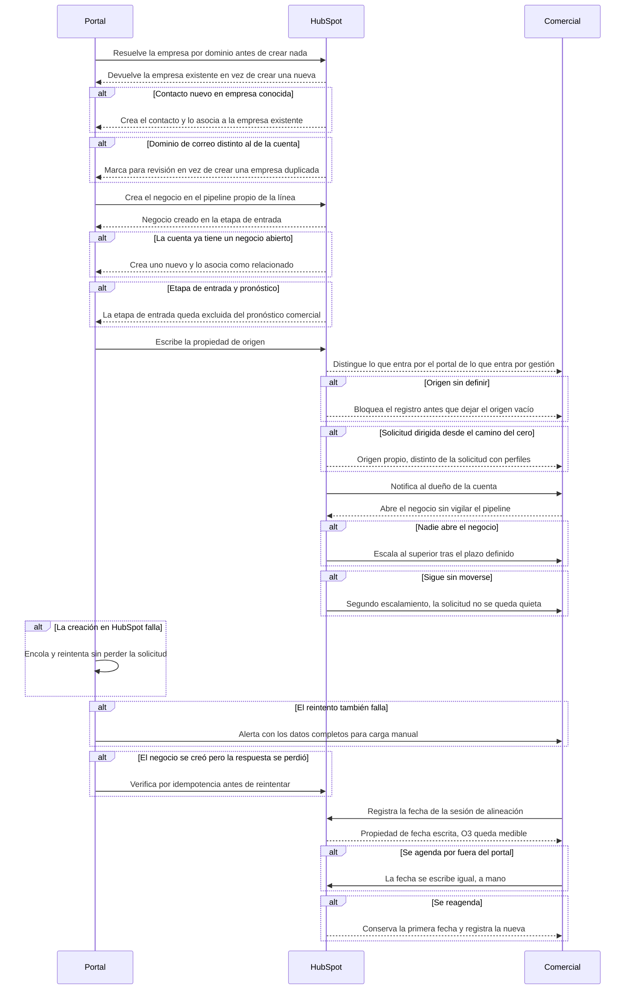

# Flow 007 — Integración con HubSpot

## Resumen

De la solicitud enviada al negocio en el pipeline, sin duplicar empresas ni perder solicitudes. Actores: el **Portal**, **HubSpot** y el **Comercial** dueño de la cuenta. Condición de éxito: la oportunidad llega atribuida, nadie tiene que vigilar el pipeline y ninguna falla es silenciosa.

## Diagrama

## Trazabilidad

| Paso | HU | AC |
|---|---|---|
| Resolver empresa por dominio | HU-104 | AC-1 (happy) |
| Contacto nuevo en empresa conocida | HU-104 | AC-2 (error) |
| Dominio distinto | HU-104 | AC-3 (edge) |
| Crear el negocio | HU-102 | AC-1 (happy) |
| Negocio abierto previo | HU-102 | AC-2 (error) |
| Etapa de entrada y pronóstico | HU-102 | AC-3 (edge) |
| Propiedad de origen | HU-106 | AC-1 (happy) |
| Origen sin definir | HU-106 | AC-2 (error) |
| Solicitud dirigida | HU-106 | AC-3 (edge) |
| Notificación al dueño | HU-103 | AC-1 (happy) |
| Nadie abre | HU-103 | AC-2 (error) |
| Sigue sin moverse | HU-103 | AC-3 (edge) |
| Cola de reintento | HU-105 | AC-1 (happy) |
| Reintento fallido | HU-105 | AC-2 (error) |
| Respuesta perdida | HU-105 | AC-3 (edge) |
| Fecha de alineación | HU-107 | AC-1 (happy) |
| Agendado por fuera | HU-107 | AC-2 (error) |
| Reagendamiento | HU-107 | AC-3 (edge) |

## Notas

**Esta épica quedó desbloqueada el 2026-09-15.** D-6 y D-7 se cerraron en el PRD v3.0: negocio en pipeline propio de la línea con propiedad de origen, y negocio nuevo asociado como relacionado cuando la cuenta ya tiene uno abierto. `epicas.md` la seguía marcando como bloqueada hasta la v4.0 de ese documento.

**HU-105 acompaña obligatoriamente a HU-102.** Sin cola de reintento el modo de falla es silencioso: la oportunidad se pierde y el cliente cree que lo ignoraron.

**HU-107 es el único registro del tramo de O3.** Al usar las etapas del pipeline comercial vigente (D-21), la alineación no tiene etapa propia y la propiedad de fecha de RF-9.1.3 es lo único que la mide.
