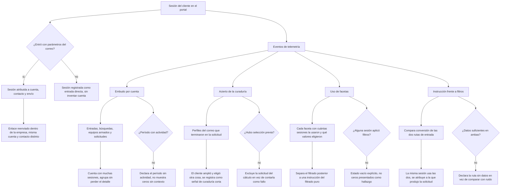

# Flow 008 — Telemetría y medición

## Resumen

De los eventos emitidos a las cinco lecturas que el equipo necesita. Actores: **Mercadeo** y **Talento Humano** como lectores. Condición de éxito: cada objetivo del PRD tiene una vista que lo mide, y cada sesión está atribuida a su envío.

## Diagrama

## Trazabilidad

| Paso | HU | AC |
|---|---|---|
| Atribución de sesión | HU-112 | AC-1 (happy) |
| Entrada sin parámetros | HU-112 | AC-2 (error) |
| Enlace reenviado | HU-112 | AC-3 (edge) |
| Embudo por cuenta | HU-108 | AC-1 (happy) |
| Período sin actividad | HU-108 | AC-2 (error) |
| Cuenta con muchas sesiones | HU-108 | AC-3 (edge) |
| Acierto de curaduría | HU-109 | AC-1 (happy) |
| Solicitud sin selección previa | HU-109 | AC-2 (error) |
| Amplió y eligió otra cosa | HU-109 | AC-3 (edge) |
| Uso de facetas por valor | HU-110 | AC-1 (happy) |
| Período sin uso de filtros | HU-110 | AC-2 (error) |
| Filtrado posterior a una instrucción | HU-110 | AC-3 (edge) |
| Comparación de rutas | HU-111 | AC-1 (happy) |
| Ruta sin datos | HU-111 | AC-2 (error) |
| Sesión mixta | HU-111 | AC-3 (edge) |

## Notas

**HU-110 se reescribió el 2026-09-22.** Duplicaba a HU-078 (EP-010): mismo actor, mismo *quiero*, mismo propósito, mismo escenario de error. Al revisarlo apareció que **RF-7.2 tiene dos mitades** —*«reporte de filtros más usados y de búsquedas sin resultados»*— y que las dos historias cubrían la segunda mientras la primera estaba huérfana. HU-110 pasó a cubrirla: **qué facetas y qué valores usan los clientes**. El registro de demanda queda entero en HU-078, donde vive su dueño y su cadencia (D-13).

**Por qué el nuevo HU-110 importa más de lo que parece.** Su edge case separa el filtrado que ocurre *después* de una instrucción del filtrado puro. RF-14.2 subordinó las facetas a la instrucción y §14.7 fija la prueba que puede tumbar esa decisión: saber **qué** se filtra después de instruir es más fino que saber cuánto. Si lo que la gente toca es disponibilidad y no rol, la instrucción acierta en lo importante y falla en lo operativo — conclusión distinta de «las facetas ganaron».

**Columna sin interfaz en el MVP.** Los eventos se emiten desde el primer día, pero HU-108 y HU-111 están en v1.1. Durante el primer trimestre alguien va a leer los datos a mano. Es decisión consciente, no olvido.

**HU-111 es la vista que falsea la Fase 2.** Es la que mide si la subordinación de las facetas a la instrucción está bien hecha (PRD §14.7). Sin ella, la regla asimétrica de D-17 no tiene con qué evaluarse.
