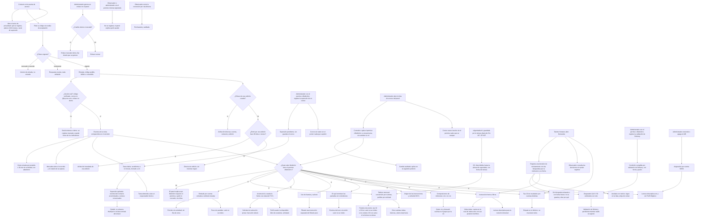

# Flow 008 — Telemetría y medición

## Resumen

De la puerta de acceso y los eventos que emite el portal a las lecturas que el equipo necesita en **Medición**. Actores: el **contacto de una cuenta cliente** (ve el aviso de privacidad y genera la visita), las personas con el **permiso «Medición»** (D74: por persona, independiente del rol; típicamente Mercadeo, Comercial y Dirección General) como lectores de Medición, **administradores** (conceden el permiso, casilla «demo», encender el A/B, supresión, validación de Delivery) y **Talento Humano** (en Demanda: ve el top 10 y registra decisiones de reclutamiento, D82 y D83). Condición de éxito: cada objetivo del PRD tiene una lectura que lo mide sobre **sesiones reales**, cada sesión está atribuida a su edición curada, y el tablero mensual sale sin trabajo manual.

## Diagrama

```mermaid
flowchart TD
  %% HU-187
  Puerta[Contacto en la puerta de acceso] --> Aviso[Abre el aviso de privacidad: qué se registra, plazos 12/24 meses, canal de supresión]
  %% HU-187
  Aviso --> Puerta
  %% HU-187
  Puerta --> SinCasilla[Pide su código sin casilla de aceptación]

  %% HU-188
  GenEnlace[Administrador genera un enlace en el panel] --> Demo{¿Casilla «demo» marcada?}
  %% HU-188
  Demo -- sí --> EnlaceDemo[Enlace marcado demo, fijo desde que se genera]
  %% HU-188
  Demo -- no --> EnlaceReal[Enlace normal]

  %% HU-168
  SinCasilla --> Apertura{¿Enlace vigente?}
  %% HU-168
  Apertura -- revocado o vencido --> Intento[Intento de entrada, no entrada]
  %% HU-168
  Apertura -- inexistente --> Neutra[Respuesta neutra, nada atribuido]
  %% HU-168
  Apertura -- vigente --> Codigo[Entrada, código pedido, fallido o concedido]

  %% HU-167
  Codigo --> Real{¿Sesión real? código verificado, correo no @trycore.com, enlace no demo}
  %% HU-167
  Real -- no --> Marcada[Sesión interna o demo: se registra marcada y queda fuera de los indicadores]
  %% HU-167
  Real -- sí --> Eventos[Eventos de la visita enriquecidos en el servidor]
  %% HU-167
  Eventos --> Fin[Visita cerrada por pestaña o 30 min sin actividad, con abandono]
  %% HU-167
  Eventos --> Recorrido[Mercadeo abre el recorrido y el estado de la captura]

  %% HU-112
  Codigo --> Atrib{¿Enlace de una edición curada?}
  %% HU-112
  Atrib -- sí --> AtribOK[Atribución directa a cuenta, contacto y edición]
  %% HU-112
  Atrib -- no --> Hereda{¿Entró por una edición hace 90 días o menos?}
  %% HU-112
  Hereda -- sí --> AtribHer[Atribución heredada de esa edición]
  %% HU-112
  Hereda -- no --> AtribDir[Directa sin edición, sin inventar origen]

  %% HU-169
  Eventos --> Retencion[Tarea diaria: seudónimo a 12 meses, borrado a 24]
  %% HU-193
  AdminSup[Administrador con el permiso «Medición» registra la supresión de un correo] --> SupPend[Supresión pendiente, sin guardar el correo]
  %% HU-193
  AdminSup --> SupSinRastro[Correo sin rastro en el portal: nada que suprimir]
  %% HU-193
  NoAdminSup[Observador o administrador sin el permiso intenta registrarla] --> SupRech[No se registra; el panel explica quién puede]
  %% HU-193
  SupPend --> Retencion
  %% HU-193
  Retencion --> Supresion[Supresión aplicada: eventos del contacto anonimizados, conteos conservados]
  %% HU-193
  Supresion --> SupAlcance[Detalle: no alcanza HubSpot ni la lista nominal del enlace]
  %% HU-169
  Retencion --> RetFalla[Tarea detenida: aviso al responsable técnico]

  %% HU-190
  AdminPerm[Administrador abre la lista de acceso del panel] --> Permiso[Concede o quita el permiso «Medición» a una persona, sin cambiar su rol]
  %% HU-190
  Permiso --> PermAud[Cambio auditado; aplica en la siguiente petición]
  %% HU-190
  AdminPerm --> PermNuevo[Correo nuevo inscrito sin el permiso salvo que se marque]
  %% HU-190
  NoAdmin[Observador envía la concesión por ruta directa] --> PermRech[Rechazada y auditada]

  %% HU-171
  Eventos --> Acceso{¿Quien abre Medición tiene el permiso «Medición»?}
  %% HU-190
  Permiso --> Acceso
  %% HU-171
  Acceso -- no --> Denegado[El panel explica que Medición requiere el permiso y quién lo concede, sin cifras]
  %% HU-171
  Acceso -- sí --> Tablero[Tablero mensual: conversión por cuentas, perfiles por solicitud]
  %% HU-171
  LecturaHS[«Agendada el» guardada por la lectura diaria de HU-107, EP-007] --> O3[O3: días hábiles hasta la alineación agendada, con fecha de lectura]
  %% HU-171
  O3 --> Tablero
  %% HU-171
  Tablero --> TabPend[Paneles de acierto, top 10 u O3 en «aún no se mide» si no existen; O3 con aviso si la lectura se atrasa]
  %% HU-171
  Tablero --> TabFuera[Dice cuántas visitas internas y demo dejó fuera]

  %% HU-108
  Acceso -- sí --> Embudo[Embudo por cuenta: entrada a solicitud enviada]
  %% HU-108
  Embudo --> EmbudoVacio[Período sin actividad, sin fila de ceros]
  %% HU-108
  Embudo --> EmbudoNoMide[Paso sin pantalla: «aún no se mide»]

  %% HU-109
  Acceso -- sí --> Acierto[Acierto de la curaduría frente a la meta del 70 %]
  %% HU-109
  Acierto --> AciertoNA[Solicitud sin selección previa: fuera del cálculo]
  %% HU-109
  Acierto --> AciertoNoDisp[Perfil curado no disponible: fallo de curaduría, señalado]

  %% HU-110
  Acceso -- sí --> Filtros[Uso de facetas y valores]
  %% HU-110
  Filtros --> FiltrosTras[Filtrado tras instrucción separado del filtrado puro]

  %% HU-111
  Acceso -- sí --> Rutas[Instrucción frente a filtros]
  %% HU-111
  Rutas --> RutasMixta[Visita mixta: cuenta en la ruta de instrucción con uso posterior de filtros]
  %% HU-111
  Rutas --> RutasDesc[Lectura descriptiva para la revisión trimestral]
  %% HU-189
  Demanda[Talento Humano abre Demanda] --> DecisionTH[Registra una decisión de reclutamiento con las búsquedas que la motivaron y su fecha]
  %% HU-189
  DecisionTH --> DecRech[Sin búsqueda enlazada o con fecha futura: no se guarda y dice por qué]
  %% HU-189
  DecisionTH --> DecAnul[Anulada con motivo: sigue en la lista y deja de contar]
  %% HU-189
  Demanda --> DecObs[Observador consulta las decisiones sin poder registrar]
  %% HU-111
  DecisionTH --> Rutas

  %% HU-170
  Acceso -- sí --> Cero[En qué terminan las pantallas sin coincidencia]
  %% HU-170
  Cero --> CeroNoMide[Eventos del cero sin emitir: «aún no se mide»]

  %% HU-172
  Acceso -- sí --> Top10[Top 10 sin resultados por cuentas distintas]
  %% HU-172
  Demanda --> Top10
  %% HU-172
  Top10 --> Empate[Empate en el décimo: se muestran todos]

  %% HU-173
  Acceso -- sí --> Sugerencias[Origen de las instrucciones y señal del 60 %]

  %% HU-184
  Acceso -- sí --> Composiciones[Composiciones de referencia: vio o no vio]
  %% HU-184
  Composiciones --> Descarte[Quien vio y descartó cuenta en el grupo que la vio]

  %% HU-185
  Acceso -- sí --> Disparador[Disparador §14.5: 50 solicitudes con reto]
  %% HU-185
  Disparador --> Delivery[Validación de Delivery: pendiente mientras nadie la registre]
  %% HU-185
  AdminDel[Administrador con el permiso «Medición» registra la validación de Delivery] --> DelOK[Condición cumplida por validación de Delivery, con fecha y quién]
  %% HU-185
  DelOK --> Disparador

  %% HU-186
  AdminAB[Administrador enciende o apaga el A/B] --> AB[Asignación por cuenta 50/50]
  %% HU-186
  AB --> LecturaAB[Lectura descriptiva con y sin Perfil Objetivo]
  %% HU-186
  Acceso -- sí --> LecturaAB
```

## Trazabilidad

| Paso | HU | AC |
|---|---|---|
| Abrir el aviso desde la puerta | HU-187 | AC-1 (happy) |
| Entrar sin casilla de aceptación | HU-187 | AC-2 (edge) |
| Aviso con enlace vencido | HU-187 | AC-3 (error) |
| Plazos del aviso iguales a la retención | HU-187 | AC-4 (edge) |
| Generar un enlace demo | HU-188 | AC-1 (happy) |
| Enlace sin casilla demo | HU-188 | AC-2 (edge) |
| Marca demo fija desde la generación | HU-188 | AC-3 (error) |
| Marca demo del lado del servidor | HU-188 | AC-4 (edge) |
| Apertura y entrada unidas | HU-168 | AC-1 (happy) |
| Enlace reenviado sin entrar | HU-168 | AC-2 (edge) |
| Código fallido | HU-168 | AC-3 (edge) |
| Enlace inexistente, respuesta neutra | HU-168 | AC-4 (error) |
| Enlace revocado o vencido: intento | HU-168 | AC-5 (edge) |
| Recorrido de una visita | HU-167 | AC-1 (happy) |
| Registro de eventos caído | HU-167 | AC-2 (error) |
| Fin de la visita (pestaña, 30 min) | HU-167 | AC-3 (edge) |
| Reloj desajustado | HU-167 | AC-4 (edge) |
| Sesión interna o demo | HU-167 | AC-5 (edge) |
| Atribución directa | HU-112 | AC-1 (happy) |
| Herencia o directa sin edición | HU-112 | AC-2 (error) |
| Límite de 90 días | HU-112 | AC-3 (edge) |
| Otro invitado del mismo enlace | HU-112 | AC-4 (edge) |
| Reparto de la atribución | HU-112 | AC-5 (edge) |
| Lo registrado sin datos de contacto | HU-169 | AC-1 (happy) |
| Lote con campos no admitidos | HU-169 | AC-2 (error) |
| Caducidad a 12 y 24 meses | HU-169 | AC-3 (edge) |
| Tarea de retención detenida | HU-169 | AC-4 (error) |
| Registrar la supresión de un contacto | HU-193 | AC-1 (happy) |
| Supresión aplicada en la siguiente corrida | HU-193 | AC-2 (happy) |
| Quien no puede registrar la supresión | HU-193 | AC-3 (error) |
| Correo sin rastro en el portal | HU-193 | AC-4 (edge) |
| Lo que la supresión no alcanza | HU-193 | AC-5 (edge) |
| Tablero del mes cerrado, con O3 de la lectura diaria de HU-107 | HU-171 | AC-1 (happy) |
| Paneles pendientes o lectura de HubSpot atrasada | HU-171 | AC-2 (edge) |
| Mes sin actividad o en curso | HU-171 | AC-3 (edge) |
| Internas y demo fuera | HU-171 | AC-4 (edge) |
| Sin el permiso «Medición» | HU-171 | AC-5 (error) |
| Conceder el permiso «Medición» | HU-190 | AC-1 (happy) |
| Quitar el permiso con Medición abierta | HU-190 | AC-2 (happy) |
| Concesión por ruta directa sin ser administrador | HU-190 | AC-3 (error) |
| Permiso independiente del rol | HU-190 | AC-4 (edge) |
| Correo nuevo sin el permiso | HU-190 | AC-5 (edge) |
| Embudo por cuenta | HU-108 | AC-1 (happy) |
| Período sin actividad | HU-108 | AC-2 (error) |
| Contacto con muchas visitas | HU-108 | AC-3 (edge) |
| Visita que se queda en la puerta | HU-108 | AC-4 (edge) |
| Paso que aún no se mide | HU-108 | AC-5 (edge) |
| Acierto de la curaduría | HU-109 | AC-1 (happy) |
| Solicitud mixta curada y descubierta | HU-109 | AC-2 (edge) |
| Solicitud sin selección previa | HU-109 | AC-3 (error) |
| Solo descubiertos | HU-109 | AC-4 (edge) |
| Perfil curado no disponible | HU-109 | AC-5 (edge) |
| Uso de facetas por valor | HU-110 | AC-1 (happy) |
| Visitas que refinan por su cuenta | HU-110 | AC-2 (happy) |
| Período sin uso de filtros | HU-110 | AC-3 (error) |
| Filtrado posterior a una instrucción | HU-110 | AC-4 (edge) |
| Comparación de rutas | HU-111 | AC-1 (happy) |
| Regla de retirada de RF-14.2 | HU-111 | AC-2 (happy) |
| Lectura descriptiva | HU-111 | AC-3 (error) |
| Visita mixta | HU-111 | AC-4 (edge) |
| Segunda condición de §14.7 | HU-111 | AC-5 (edge) |
| Registrar una decisión de reclutamiento | HU-189 | AC-1 (happy) |
| Decisión sin búsqueda enlazada | HU-189 | AC-2 (error) |
| Fecha posterior a hoy | HU-189 | AC-3 (error) |
| Anular una decisión | HU-189 | AC-4 (edge) |
| Observador consulta las decisiones | HU-189 | AC-5 (edge) |
| En qué terminan los ceros | HU-170 | AC-1 (happy) |
| Eventos del cero sin emitir | HU-170 | AC-2 (error) |
| Proporción descriptiva | HU-170 | AC-3 (error) |
| Salir del cero refinando | HU-170 | AC-4 (edge) |
| Top 10 por cuentas distintas, en Demanda y en Medición | HU-172 | AC-1 (happy) |
| Mes sin consultas fallidas | HU-172 | AC-2 (error) |
| Menos de diez consultas | HU-172 | AC-3 (edge) |
| Datos personales enmascarados | HU-172 | AC-4 (edge) |
| Empate en el décimo lugar | HU-172 | AC-5 (edge) |
| Origen de las instrucciones | HU-173 | AC-1 (happy) |
| Límite del 60 % | HU-173 | AC-2 (edge) |
| Sugerencia retocada | HU-173 | AC-3 (edge) |
| Instrucción sin emitir | HU-173 | AC-4 (error) |
| Efecto de las composiciones | HU-184 | AC-1 (happy) |
| Lectura descriptiva | HU-184 | AC-2 (error) |
| Composiciones sin emitir | HU-184 | AC-3 (error) |
| Tipo de proyecto sin composición | HU-184 | AC-4 (edge) |
| Vio y descartó | HU-184 | AC-5 (edge) |
| Cuánto falta para el disparador, con el límite de las 50 | HU-185 | AC-1 (happy) |
| Solicitudes que no cuentan | HU-185 | AC-2 (error) |
| Reto sin emitir | HU-185 | AC-3 (error) |
| Registrar la validación de Delivery | HU-185 | AC-4 (happy) |
| Validación de Delivery no registrada | HU-185 | AC-5 (edge) |
| Comparación con y sin Perfil Objetivo | HU-186 | AC-1 (happy) |
| Administrador enciende el A/B | HU-186 | AC-2 (happy) |
| Sin experimento y sin rol de administrador | HU-186 | AC-3 (error) |
| Señal de RF-13.1 | HU-186 | AC-4 (edge) |
| Visita sin perfil abierto | HU-186 | AC-5 (edge) |

## Notas

**Alineación del 2026-10-02 con las decisiones del sponsor (D65–D73).** El flow cubría solo HU-108 a HU-112; ahora cubre las historias de EP-008 (veinte tras HU-189, HU-190 y HU-193), incluidas las nuevas HU-187 (aviso de privacidad, D65) y HU-188 (casilla «demo», D68).

**Visita mixta (corrige la versión anterior).** Antes decía que la visita que usa instrucción y filtros «se atribuye a la que produjo la solicitud». Ahora cuenta como **ruta de instrucción con uso posterior de filtros**, igual que HU-111 y ADR-0006, que es lo que mide RF-14.2.

**Sesión real (D68).** Código verificado de un correo que no es `@trycore.com`, por un enlace sin la casilla «demo». Las internas y las demo se registran marcadas y quedan fuera de todos los indicadores. La visita termina al cerrar la pestaña o tras 30 minutos sin actividad (D73).

**Atribución (D69).** Hereda la de la última edición curada por la que entró el contacto, con ventana de 90 días; el reparto directa / heredada / sin edición se ve en Medición.

**Tablero en el MVP (D66).** Antes esta nota decía que HU-108 y HU-111 estaban en v1.1 y que el primer trimestre los datos se leerían a mano. El sponsor decidió el tablero y sus lecturas en el **MVP**. El backlog y el mapa de historias se alinearon el 2026-10-02 (HU-108, HU-111 y HU-171 en MVP, nota D66).

**Quién ve Medición (D67 corregida por D74).** D67 lo decía por área y con los dos roles del panel no se podía expresar. D74: un **permiso «Medición» por persona** en la lista nominal, independiente del rol, que concede y quita un administrador (HU-190); sin él, el panel explica el motivo (HU-171). Escribir dentro de Medición (el A/B de HU-186) exige además el rol administrador. Se enmiendan RF-8.1.2 (nota v4.18) y ADR-0006.

**Talento Humano en Demanda (D82, D83).** El top 10 de HU-172 se ve en Medición y también en Demanda; las decisiones de reclutamiento se registran en Demanda con HU-189 y HU-111 las lee para la segunda condición de §14.7. Se cierra el hueco que esta nota dejaba abierto (`DecisionTH` sin historia).

**O3 en el tablero (D75).** Excepción de lectura: la tarea diaria del worker que trae «Agendada el» de los negocios del pipeline «Comercial (People y Tecnología)» con `soluciones_ofrecidas` = «People Service» (D85) **vive en HU-107** (EP-007); el tablero (HU-171) solo muestra O3 con la fecha ya guardada. El arco `LecturaHS` depende de HU-107 y de que la propiedad exista en HubSpot.

**Supresión (D89).** La supresión a petición del titular sale de HU-169 a **HU-193**: la registra un administrador con el permiso «Medición» (el permiso da lectura, el rol da escritura), la aplica la tarea diaria de retención de HU-169 y el panel declara que no alcanza HubSpot ni la lista nominal del enlace. HU-169 queda con la retención y el aviso de tarea detenida.

**Validación de Delivery (HU-185, D74).** La registra un administrador con el permiso «Medición»; mientras nadie la registre, la lectura la muestra pendiente.

**HU-111 es la vista que falsea la Fase 2.** Mide si la subordinación de las facetas a la instrucción está bien hecha (PRD §14.7) y ahora lee las dos condiciones de retirada. Sin ella, la regla asimétrica de D-17 no tiene con qué evaluarse.
