# Flow 009 — Entrada por instrucción y Perfil Objetivo

## Resumen

La entrada real al producto desde la Fase 2 de diseño. Actor principal: el **Cliente**. Condición de éxito: dice lo que necesita en sus palabras, ve cómo lo entendió el portal, lo corrige sin reescribir, y la especificación resultante viaja con la solicitud.

## Diagrama

```mermaid
sequenceDiagram
  participant C as Cliente
  participant P as Portal

  %% HU-066
  P-->>C: Propone una sugerencia en vez de un campo vacío
  %% HU-066
  C->>P: Envía la sugerencia, editada o tal cual

  %% HU-066
  alt Cuenta sin proyecto activo conocido
    %% HU-066
    P-->>C: Ofrece una sugerencia genérica sin fingir contexto
  end

  %% HU-065
  C->>P: Escribe la instrucción en sus propias palabras
  %% HU-065
  P-->>C: Reconoce la instrucción y devuelve resultados

  %% HU-067
  C->>P: Pega un requerimiento ya escrito
  %% HU-067
  P-->>C: Extrae los criterios del texto

  %% HU-067
  alt Exceso de criterios extraídos
    %% HU-067
    P-->>C: Prioriza y deja el resto como deseables
  end

  %% HU-068
  P-->>C: Muestra cómo entendió lo que se pidió

  %% HU-068
  alt Interpretación de baja confianza
    %% HU-068
    P-->>C: Lo declara en vez de presentarla como certeza
  end

  %% HU-069
  C->>P: Quita un criterio mal interpretado
  %% HU-069
  P-->>C: Recalcula sin pedir que se reescriba

  %% HU-069
  alt Se quitan todos los criterios
    %% HU-069
    P-->>C: Vuelve al banco completo, no a una pantalla vacía
  end

  %% HU-118
  C->>P: Marca qué es obligatorio y qué es deseable
  %% HU-118
  P-->>C: Los deseables ordenan, los obligatorios filtran

  %% HU-118
  alt Ningún perfil cumple los obligatorios
    %% HU-118
    P-->>C: Señala qué obligatorio está vaciando el resultado
  end

  %% HU-083
  C->>P: Declara qué tiene que estar funcionando cuando el proyecto termine
  %% HU-083
  P-->>C: El reto encabeza la especificación y cambia la pantalla de cero

  %% HU-083
  alt Reto vacío
    %% HU-083
    P-->>C: Continúa sin reto, no bloquea la búsqueda
  end

  %% HU-082
  C->>P: Indica país y ciudad de la necesidad
  %% HU-082
  P-->>C: Obligatorio en presencial e híbrido, opcional en remoto

  %% HU-082
  alt Presencial sin ubicación
    %% HU-082
    P-->>C: Pide la ubicación antes de dejar solicitar
  end

  %% HU-082
  alt Necesidad presencial o híbrida
    %% HU-082
    P-->>C: Muestra la ciudad del profesional junto al país
  end

  %% HU-082
  alt Necesidad remota
    %% HU-082
    P-->>C: Muestra solo el país, la ciudad no decide nada
  end

  %% HU-085
  C->>P: Abre el panel de ajuste del Perfil Objetivo
  %% HU-085
  P-->>C: Cascada rol, familia y tecnologías con conteo real del banco

  %% HU-085
  alt Combinación sin ningún perfil
    %% HU-085
    P-->>C: Lo dice antes de aplicar y ofrece el criterio a soltar
  end

  %% HU-085
  alt Necesidad que el banco no cubre
    %% HU-085
    P-->>C: Conserva la demanda no cubierta en vez de borrarla del registro
  end

  %% HU-070
  C->>P: Revisa y ajusta la especificación de forma continua
  %% HU-070
  P-->>C: La especificación viaja con la solicitud

  %% HU-070
  alt El cliente nunca abre el Perfil Objetivo
    %% HU-070
    P-->>C: La especificación inferida viaja marcada como no revisada
  end

  %% HU-071
  P-->>C: Hace una pregunta de afinamiento en paralelo, sin tapar los resultados
  %% HU-071
  alt Más preguntas de las permitidas
    %% HU-071
    P-->>C: Deja de preguntar, el afinamiento no se vuelve interrogatorio
  end

  %% HU-072
  alt El servicio de interpretación no responde
    %% HU-072
    P-->>C: Degrada al léxico sin anunciar la falla y el portal sigue usable
  end

  %% HU-072
  alt El léxico tampoco reconoce nada
    %% HU-072
    P-->>C: Cae a las facetas, nunca a una pantalla muerta
  end

  %% HU-073
  C->>P: Vuelve más tarde con el mismo enlace de cuenta
  %% HU-073
  P-->>C: Recupera la especificación como la dejó

  %% HU-073
  alt Otro dispositivo, modo privado o almacenamiento limpiado
    %% HU-073
    P-->>C: Arranca en blanco sin prometer una recuperación que no puede cumplir
  end

  %% HU-073
  alt Un colega abre el enlace reenviado
    %% HU-073
    P-->>C: Arranca limpio, la especificación no viaja con el enlace
  end
```

## Trazabilidad

| Paso | HU | AC |
|---|---|---|
| Sugerencia de arranque | HU-066 | AC-1 y AC-2 (happy) · AC-3 (edge) |
| Instrucción reconocida | HU-065 | AC-1 (happy) |
| Pegar requerimiento | HU-067 | AC-1 (happy) · AC-3 (edge) |
| Interpretación visible | HU-068 | AC-1 (happy) · AC-2 (edge) |
| Corregir la interpretación | HU-069 | AC-1 (happy) · AC-2 (error) |
| Obligatorio frente a deseable | HU-118 | AC-1 (happy) · AC-3 (error) |
| El reto | HU-083 | AC-1 y AC-2 (happy) · AC-3 (error) |
| Ubicación de la necesidad | HU-082 | AC-1 (happy) · AC-2 (error) |
| Ciudad visible en presencial e híbrido | HU-082 | AC-4 (edge) |
| Solo país en remoto | HU-082 | AC-3 y AC-5 (edge) |
| Cascada del Perfil Objetivo | HU-085 | AC-1 y AC-2 (happy) · AC-3 (error) |
| Especificación continua | HU-070 | AC-1 y AC-2 (happy) · AC-4 (edge) |
| Pregunta de afinamiento | HU-071 | AC-1 (happy) · AC-2 (error) |
| Degradación de la interpretación | HU-072 | AC-1 (happy) · AC-2 (error) |
| Recuperar la especificación | HU-073 | AC-1 (happy) |
| Navegador sin el dato | HU-073 | AC-2 (error) |
| Enlace reenviado a otro dispositivo | HU-073 | AC-3 (edge) |

## Notas

**Esta es la apuesta de producto y tiene su prueba de falsación escrita.** La Fase 2 invirtió la jerarquía: la instrucción es la entrada y las facetas el refinamiento. §14.7 del PRD fija la regla asimétrica que puede tumbarla, fijada **antes** de observar: solo se reduce el alcance si los tres participantes completan la tarea con la lista y al menos dos lo hacen con menos fricción visible. Cualquier otro resultado es evidencia insuficiente, no un voto a favor de la lista.

**HU-072 es la historia que protege a todas las demás.** Si la interpretación falla y el portal muere con ella, la sesión con clientes mide frustración en vez de medir la hipótesis. Por eso está entre las quick wins del orden de construcción.

**D-16 cerró el 2026-09-21 en persistencia por dispositivo.** El Perfil Objetivo queda en el navegador de quien lo escribió, no en el servidor contra la cuenta. Por eso el último ramal del diagrama cambió de sentido: un enlace reenviado **no** arrastra la especificación, y quien lo abre en otro dispositivo arranca limpio. Es el comportamiento correcto, no una carencia — y es lo que elimina la implicación ISO 27000.

**HU-067 está condicionada** a la prueba previa de RF-12.2. Sale del MVP por eso, no por falta de valor.

**AC no diagramados:** HU-065 AC-2 y AC-3 (los cubre HU-072 como degradación), HU-067 AC-2, HU-068 AC-3, HU-069 AC-3 (lo cubre HU-075 en EP-010), HU-070 AC-3, HU-071 AC-3, HU-072 AC-3, HU-073 AC-3, HU-082 AC-4, HU-083 AC-4, HU-085 AC-4, HU-118 AC-2 y AC-4.
