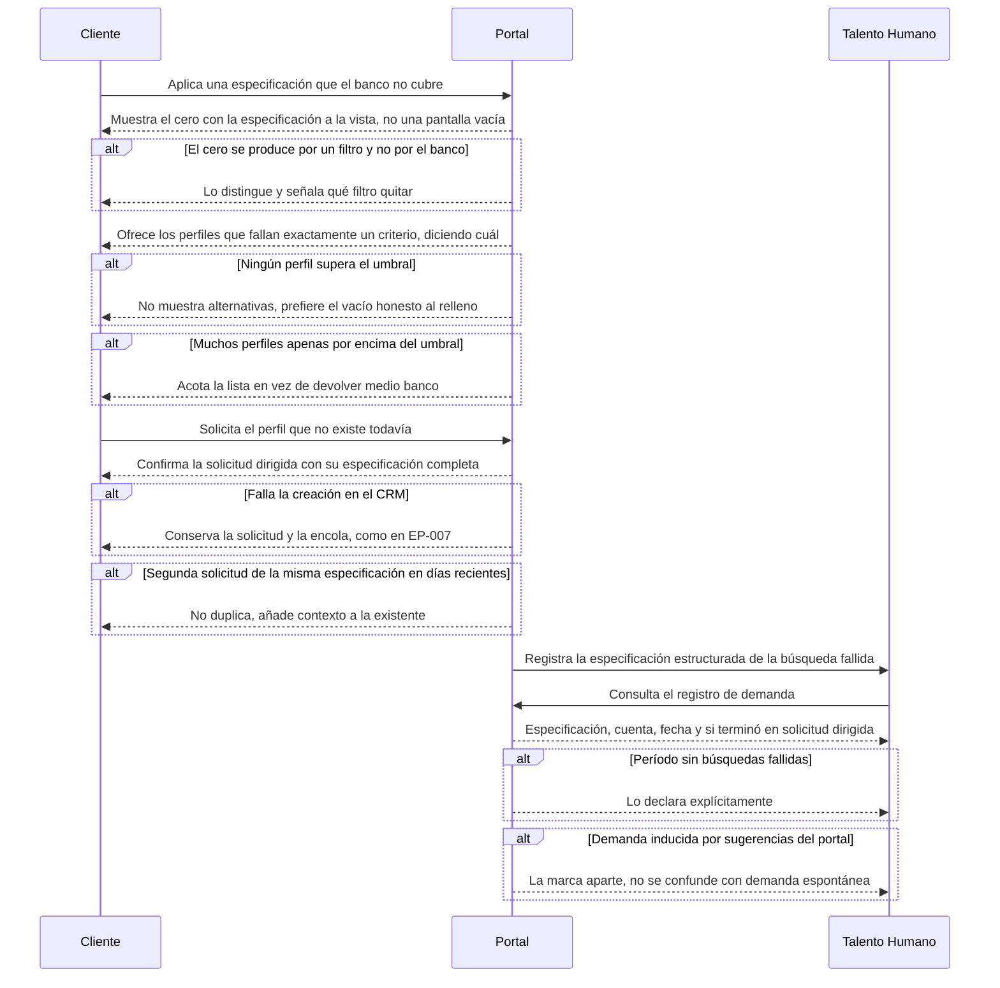

# Flow 010 — El camino del cero

## Resumen

Qué pasa cuando el banco no tiene lo que el cliente pidió. Actores: el **Cliente** y **Talento Humano** como lector del registro. Condición de éxito: el cero deja de ser un callejón sin salida y se convierte en demanda registrada.

## Diagrama

## Trazabilidad

| Paso | HU | AC |
|---|---|---|
| Cero con especificación | HU-075 | AC-1 (happy) |
| Cero por filtro | HU-075 | AC-3 (edge) |
| Cercanos por un criterio | HU-076 | AC-1 (happy) |
| Nada supera el umbral | HU-076 | AC-2 (error) |
| Muchos apenas por encima | HU-076 | AC-3 (edge) |
| Solicitud dirigida | HU-077 | AC-1 (happy) |
| Falla en el CRM | HU-077 | AC-2 (error) |
| Segunda solicitud igual | HU-077 | AC-3 (edge) |
| Registro de demanda | HU-078 | AC-1 (happy) |
| Período sin fallos | HU-078 | AC-2 (error) |
| Demanda inducida | HU-078 | AC-3 (edge) |

## Notas

**D-14 cerró sin umbral numérico.** «Lo más cercano» son los perfiles que fallan **exactamente un criterio**, indicando cuál. No hay porcentaje de similitud que calibrar, y esa es la razón por la que HU-076 es construible hoy.

**Esta épica no existe sin EP-009.** El camino del cero funciona porque hay un Perfil Objetivo que mostrar cuando no hay resultados. Construirlo sobre facetas sería volver al estado de error: un cero sin especificación a la vista es una pantalla vacía.

**HU-078 quedó como la historia canónica del registro de demanda** (2026-09-22). HU-110 la duplicaba y se reescribió para cubrir la otra mitad de RF-7.2 —el reporte de filtros más usados—, que no tenía historia. El registro de demanda vive entero aquí, donde están su dueño y su cadencia: Talento Humano, revisión mensual (D-13).

**AC no diagramado:** HU-075 AC-2 (especificación demasiado vaga para solicitar).
