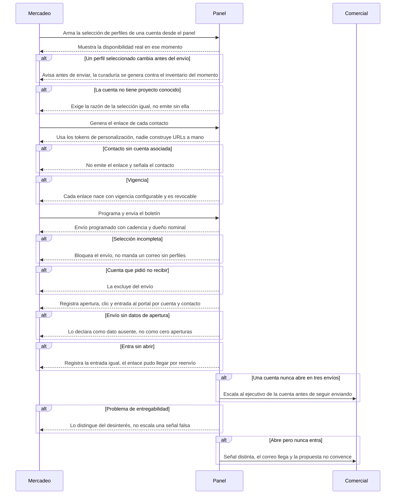

# Flow 011 — Correo curado y distribución

## Resumen

La fuente de todo el tráfico del portal. Actor principal: **Mercadeo**, con Talento Humano como dueña de la disponibilidad. Condición de éxito: cada cuenta recibe una selección construida para su proyecto, con enlace generado desde el envío, y la falta de apertura se lee como señal comercial.

## Diagrama

## Trazabilidad

| Paso | HU | AC |
|---|---|---|
| Armar la selección | HU-113 | AC-1 (happy) |
| Perfil cambiado antes del envío | HU-113 | AC-2 (error) |
| Cuenta sin proyecto conocido | HU-113 | AC-3 (edge) |
| Generar enlaces | HU-114 | AC-1 (happy) |
| Contacto sin cuenta | HU-114 | AC-2 (error) |
| Vigencia | HU-114 | AC-3 (edge) |
| Programar y enviar | HU-115 | AC-1 (happy) |
| Selección incompleta | HU-115 | AC-2 (error) |
| Cuenta que pidió no recibir | HU-115 | AC-3 (edge) |
| Apertura y entrada | HU-116 | AC-1 (happy) |
| Envío sin datos | HU-116 | AC-2 (error) |
| Entra sin abrir | HU-116 | AC-3 (edge) |
| Cuenta que nunca abre | HU-117 | AC-1 (happy) |
| Entregabilidad | HU-117 | AC-2 (error) |
| Abre y no entra | HU-117 | AC-3 (edge) |

## Notas

**Esta épica entró en el PRD v4.0** como cierre de hueco: el correo curado era la fuente de todo el tráfico y vivía en el PRD como supuesto. Especificación completa en `docs/10-specs/correo-curado.md`.

**RF-18.4 es la regla que evita la decepción.** La curaduría se genera contra el inventario del momento del envío. Una selección fija se degrada entre que se arma y que el cliente abre, y el cliente encuentra menos perfiles de los que le prometimos.

**HU-117 convierte una métrica en una acción comercial.** Una cuenta que nunca abre en tres envíos no es un fallo de entregabilidad: es una señal que se escala al ejecutivo antes de seguir enviando. Por eso AC-2 existe — hay que descartar primero el problema técnico.

**Relación con RF-19 (enlaces curados, HU-122 en EP-001).** El correo es distribución masiva programada; el enlace curado es una emisión puntual de Talento Humano para una cuenta. Comparten el mecanismo del enlace y no el disparador. Ver `docs/10-specs/enlaces-curados.md`.
