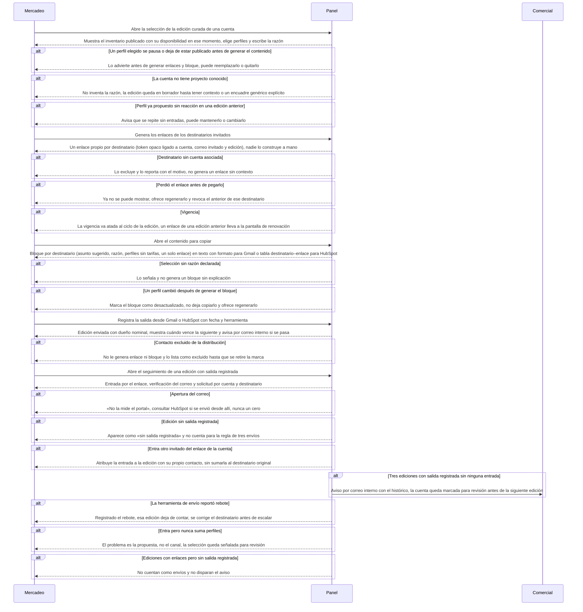

# Flow 011 — Correo curado y distribución

## Resumen

La fuente de todo el tráfico del portal. Actor principal: **Mercadeo**, con Talento Humano como dueña de la disponibilidad. **El portal no compone, no programa ni envía el boletín** (decisión del sponsor del 2026-09-27, PRD v4.14, RF-18): el panel arma la selección curada, genera el enlace de cada destinatario y un bloque de contenido listo para copiar; el correo se confecciona y sale desde Gmail o HubSpot. Condición de éxito: cada cuenta recibe una selección construida para su proyecto, con un enlace propio por destinatario generado desde la edición curada, y la falta de entradas por el enlace se lee como señal comercial.

## Diagrama

```mermaid
sequenceDiagram
  participant M as Mercadeo
  participant P as Panel
  participant CO as Comercial

  %% HU-113
  M->>P: Abre la selección de la edición curada de una cuenta
  %% HU-113
  P-->>M: Muestra el inventario publicado con su disponibilidad en ese momento, elige perfiles y escribe la razón

  %% HU-113
  alt Un perfil elegido se pausa o deja de estar publicado antes de generar el contenido
    %% HU-113
    P-->>M: Lo advierte antes de generar enlaces y bloque, puede reemplazarlo o quitarlo
  end

  %% HU-113
  alt La cuenta no tiene proyecto conocido
    %% HU-113
    P-->>M: No inventa la razón, la edición queda en borrador hasta tener contexto o un encuadre genérico explícito
  end

  %% HU-113
  alt Perfil ya propuesto sin reacción en una edición anterior
    %% HU-113
    P-->>M: Avisa que se repite sin entradas, puede mantenerlo o cambiarlo
  end

  %% HU-114
  M->>P: Genera los enlaces de los destinatarios invitados
  %% HU-114
  P-->>M: Un enlace propio por destinatario (token opaco ligado a cuenta, correo invitado y edición), nadie lo construye a mano

  %% HU-114
  alt Destinatario sin cuenta asociada
    %% HU-114
    P-->>M: Lo excluye y lo reporta con el motivo, no genera un enlace sin contexto
  end

  %% HU-114
  alt Perdió el enlace antes de pegarlo
    %% HU-114
    P-->>M: Ya no se puede mostrar, ofrece regenerarlo y revoca el anterior de ese destinatario
  end

  %% HU-114
  alt Vigencia
    %% HU-114
    P-->>M: La vigencia va atada al ciclo de la edición, un enlace de una edición anterior lleva a la pantalla de renovación
  end

  %% HU-115
  M->>P: Abre el contenido para copiar
  %% HU-115
  P-->>M: Bloque por destinatario (asunto sugerido, razón, perfiles sin tarifas, un solo enlace) en texto con formato para Gmail o tabla destinatario–enlace para HubSpot

  %% HU-115
  alt Selección sin razón declarada
    %% HU-115
    P-->>M: Lo señala y no genera un bloque sin explicación
  end

  %% HU-115
  alt Un perfil cambió después de generar el bloque
    %% HU-115
    P-->>M: Marca el bloque como desactualizado, no deja copiarlo y ofrece regenerarlo
  end

  %% HU-115
  M->>P: Registra la salida desde Gmail o HubSpot con fecha y herramienta
  %% HU-115
  P-->>M: Edición enviada con dueño nominal, muestra cuándo vence la siguiente y avisa por correo interno si se pasa

  %% HU-115
  alt Contacto excluido de la distribución
    %% HU-115
    P-->>M: No le genera enlace ni bloque y lo lista como excluido hasta que se retire la marca
  end

  %% HU-116
  M->>P: Abre el seguimiento de una edición con salida registrada
  %% HU-116
  P-->>M: Entrada por el enlace, verificación del correo y solicitud por cuenta y destinatario

  %% HU-116
  alt Apertura del correo
    %% HU-116
    P-->>M: «No la mide el portal», consultar HubSpot si se envió desde allí, nunca un cero
  end

  %% HU-116
  alt Edición sin salida registrada
    %% HU-116
    P-->>M: Aparece como «sin salida registrada» y no cuenta para la regla de tres envíos
  end

  %% HU-116
  alt Entra otro invitado del enlace de la cuenta
    %% HU-116
    P-->>M: Atribuye la entrada a la edición con su propio contacto, sin sumarla al destinatario original
  end

  %% HU-117
  alt Tres ediciones con salida registrada sin ninguna entrada
    %% HU-117
    P->>CO: Aviso por correo interno con el histórico, la cuenta queda marcada para revisión antes de la siguiente edición
  end

  %% HU-117
  alt La herramienta de envío reportó rebote
    %% HU-117
    P-->>M: Registrado el rebote, esa edición deja de contar, se corrige el destinatario antes de escalar
  end

  %% HU-117
  alt Entra pero nunca suma perfiles
    %% HU-117
    P-->>M: El problema es la propuesta, no el canal, la selección queda señalada para revisión
  end

  %% HU-117
  alt Ediciones con enlaces pero sin salida registrada
    %% HU-117
    P-->>M: No cuentan como envíos y no disparan el aviso
  end
```

## Trazabilidad

| Paso | HU | AC |
|---|---|---|
| Armar la selección | HU-113 | Happy path |
| Perfil cambiado antes de generar el contenido | HU-113 | Error |
| Cuenta sin proyecto conocido | HU-113 | Edge — sin proyecto |
| Perfil repetido sin reacción | HU-113 | Edge — ya propuesto |
| Generar enlaces por destinatario | HU-114 | Happy path |
| Destinatario sin cuenta | HU-114 | Error |
| Enlace perdido antes de pegarlo | HU-114 | Edge — regenerar |
| Vigencia | HU-114 | Edge — vigencia |
| Copiar el contenido curado | HU-115 | Happy path |
| Selección sin razón | HU-115 | Error — sin razón |
| Bloque desactualizado | HU-115 | Error — inventario cambió |
| Registrar la salida y la cadencia | HU-115 | Edge — salida y cadencia |
| Contacto excluido | HU-115 | Edge — excluido |
| Seguimiento de entradas | HU-116 | Happy path |
| Apertura no medida por el portal | HU-116 | Error |
| Edición sin salida registrada | HU-116 | Edge — sin salida |
| Otro invitado del mismo enlace | HU-116 | Edge — otro invitado |
| Tres envíos sin entrar | HU-117 | Happy path |
| Rebote | HU-117 | Error |
| Entra y no suma perfiles | HU-117 | Edge — no suma |
| Ediciones sin salida registrada | HU-117 | Edge — sin salida |

## Notas

**Esta épica entró en el PRD v4.0** como cierre de hueco: el correo curado era la fuente de todo el tráfico y vivía en el PRD como supuesto. Especificación completa en `docs/10-specs/correo-curado.md`.

**Decisión del sponsor del 2026-09-27 (PRD v4.14).** Redactar el correo, programarlo, enviarlo, gestionar las bajas y medir la apertura pasan a Gmail o HubSpot; no es un recorte de alcance. El panel entrega la selección, el enlace de cada destinatario y el bloque para copiar, y mide lo que ocurre en el portal: entradas por enlace, verificación y solicitud. Mailgun queda solo para códigos de acceso y avisos internos. HU-115 sustituye a «Programar y enviar el boletín» y HU-116 a «Ver quién abrió y quién entró».

**RF-18.4 es la regla que evita la decepción.** La curaduría se genera contra el inventario del momento en que se genera el contenido; si un perfil cambia después, el bloque se marca desactualizado y el enlace reevalúa cada perfil al abrirse (RF-19.2).

**HU-117 convierte una métrica en una acción comercial.** Una cuenta que no entra en tres envíos con salida registrada no es un fallo de entregabilidad: es una señal que se avisa al ejecutivo antes de preparar la siguiente edición. Por eso existe el escenario del rebote: hay que descartar primero el problema de entrega. «Abre pero nunca entra» solo se puede leer en HubSpot cuando el envío salió desde allí.

**Relación con RF-19 (enlaces curados, HU-122 en EP-001).** La edición curada genera un enlace por destinatario para cada ciclo; el enlace curado es una emisión puntual de Talento Humano para una cuenta. Ambos los emite el panel con el mismo mecanismo de token opaco (ADR-0002) y cambia el disparador. Ver `docs/10-specs/enlaces-curados.md`.
