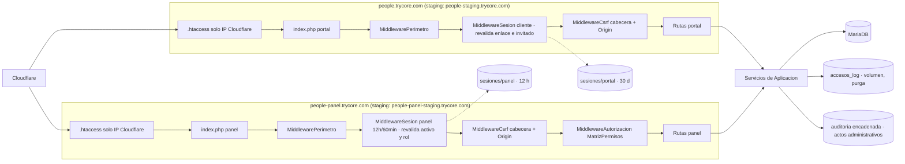

# ADR 0002 — Identidad, acceso y sesiones

> Plantilla alineada al método **ADD** (Attribute-Driven Design, Len Bass — *Software Architecture in
> Practice*). Cada sección numerada corresponde a un paso del método. Las decisiones deben trazar a
> [0000-drivers-y-asrs.md](0000-drivers-y-asrs.md) y actualizar
> [_backlog-arquitectonico.md](_backlog-arquitectonico.md). Generada por la skill `setup-architecture`
> (`/build:architect`); un humano la promueve `proposed → accepted`.
>
> **Revisión:** incorpora las correcciones de la evaluación adversarial ATAM-lite (respuesta neutra
> con envío tras cerrar la respuesta, bloqueo acumulado, perímetro solo Cloudflare, token en el
> fragmento, registro de accesos separado, sesiones por host).

## 1. Objetivo de la iteración y drivers seleccionados (Pasos 2–3)

- **Objetivo de la iteración:** decidir cómo se identifica cada persona (cliente y Talento Humano)
  sin proveedor de identidad, cómo se mantiene su sesión, cómo se revoca el acceso y cómo se autoriza
  cada acción en servidor, sobre el estilo fijado en [ADR-0001](0001-estilo-y-stack-base.md).
- **Hosts del sistema:**
  - Producción: `people.trycore.com` (portal del cliente) y `people-panel.trycore.com` (panel de
    Talento Humano).
  - Staging: `people-staging.trycore.com` y `people-panel-staging.trycore.com`.
  - Los cuatro cuelgan de `trycore.com`, así que son **mismo sitio** (*same-site*) entre sí y con
    cualquier otro subdominio de `trycore.com`. Esto condiciona la defensa CSRF (§2).
- **Elementos a refinar:** `server/src/Aplicacion` (servicios de acceso y enlaces), los dos front
  controllers (`server/public/portal/api/index.php`, `server/public/panel/api/index.php`), el esquema
  de identidad en MariaDB y la configuración de sesiones PHP por host.
- **Drivers abordados:**
  - Funcionales: UC-1 (acceso nominal del cliente), UC-2 (invitar a un colega), UC-3 (enlace curado
    como objeto con registro), UC-9 (acceso al panel).
  - Atributos de calidad: QA-3 (0 accesos con correo no invitado; 5 intentos; código de 6 dígitos,
    un uso, ≤ 10 min; enlace manipulado → 0 bytes; revocación en la siguiente petición), QA-4 (matriz
    rol × acción al 100 %; respuesta indistinguible; 12 h / 60 min ±1 min; 0 rutas del panel en el host
    del cliente), QA-5 (sin sesión → 401). De forma parcial: QA-8 (el código llega al buzón en
    P95 ≤ 60 s) y QA-21 (la «apertura» del enlace es un dato de atribución).
  - Restricciones: CON-1 (hosting compartido: sin Redis ni workers), CON-4 (sin proveedor de
    identidad), CON-6 (secretos solo en servidor), CON-10 (privacidad, Ley 1581), CON-15 (Cloudflare y
    ModSecurity delante).
  - Concerns: CRN-16 (duración de sesión, vigencia de enlace y de código sin fijar), CRN-10
    (retención de datos personales, aquí los registros de acceso).

## 2. Conceptos de diseño elegidos (Paso 4)

| Driver | Concepto / Táctica | Alternativas descartadas | Razón |
|--------|--------------------|--------------------------|-------|
| UC-3, QA-3 | **Token opaco aleatorio** de 32 bytes (`random_bytes`, base64url); en BD solo `SHA-256(token)`. El enlace es una fila con estado, no un documento autocontenido | JWT o URL firmada con HMAC que lleva la lista de perfiles | Un token firmado no se puede revocar sin lista negra y crece con los perfiles (UC-3 pide token en servidor pasadas unas decenas). Con hash en BD, una fuga de la base no entrega enlaces usables |
| UC-3, QA-3, QA-21 | **Token en el fragmento de la URL** (`https://people.trycore.com/e/#t=…`). El JS lo lee de `location.hash`, lo envía por `POST` y lo borra de la barra con `history.replaceState`. Cabecera `Referrer-Policy: no-referrer` en el portal | Token en la ruta o en la query (`?t=`) | El fragmento nunca viaja al servidor: no queda en logs de Cloudflare, de Apache ni de ModSecurity, ni sale en la cabecera `Referer` hacia terceros. `no-referrer` cierra la fuga residual |
| QA-21, UC-3 | **La «apertura» se registra al verificar el código**, no al cargar la página ni al consultar el enlace | Contar la apertura en el `GET` o en `POST /acceso/enlace` | Los escáneres de correo corporativos (Defender, Mimecast, Proofpoint) abren y a veces ejecutan los enlaces para inspeccionarlos. Solo una verificación correcta prueba que una persona invitada entró. La consulta previa se guarda como `enlace_consultado`, sin contar como apertura |
| UC-1, CON-4 | **Código de un uso por correo** (6 dígitos, `random_int`), guardado como `HMAC-SHA256(código, secreto_codigos)`, 10 min, un uso, comparado con `hash_equals` | Enlace mágico por correo; contraseña; proveedor de identidad (Google/Microsoft) | CON-4 excluye proveedor. La contraseña añade ciclo de vida y recuperación que el PRD no pide. El enlace mágico lo consumen los escáneres al previsualizar. HMAC en vez de hash simple porque 10⁶ valores se recorren en milisegundos |
| QA-3, QA-4, CON-10 | **Respuesta neutra con trabajo diferido**: `POST /acceso/codigo` hace el mismo trabajo previo en ambas ramas (consulta de intentos, consulta de invitado, escritura en `accesos_log`), responde `202` con cuerpo idéntico y **cierra la respuesta** (`fastcgi_finish_request()` o `litespeed_finish_request()`). Solo después genera el código y, si el correo está invitado, lo guarda y lo envía; si no, genera, calcula y descarta el HMAC y escribe una fila de descarte equivalente | Enviar por SMTP antes de responder (el tiempo delata al invitado); mensaje «este correo no está invitado» | El envío SMTP tarda cientos de ms a varios s: si ocurre antes de responder, cualquiera mide la latencia y deduce la lista de invitados. Con la respuesta ya cerrada, la parte que difiere no se observa desde el cliente |
| QA-3 | **Verificación con mensaje único**: cualquier fallo de `POST /acceso/verificar` (código erróneo, vencido, usado, correo no invitado, bloqueo activo) devuelve el mismo `403 {motivo: "codigo_invalido"}` con el texto «Código inválido o vencido» | Motivos distintos (`no_invitado`, `codigo_vencido`, `bloqueado`) | Un motivo `no_invitado` en la verificación reabre la enumeración que la respuesta neutra cierra. Se elimina ese motivo del contrato |
| QA-3 | **Limitación en tres capas**: (1) ventana corta: 5 fallos por enlace+correo y 5 por IP en 15 min; (2) **tope diario**: 20 fallos por enlace+correo en 24 h → bloqueo de 24 h de ese par y alerta a Talento Humano y al responsable técnico; (3) regla de límite de Cloudflare sobre `/api/v1/acceso/*` | Solo ventana de 15 min; solo Cloudflare; CAPTCHA | Con solo la ventana, un atacante paciente prueba 480 códigos al día por par. El tope diario lo baja a 20 (probabilidad de acierto ≈ 2·10⁻⁵ por día y par). Cloudflare no conoce el par enlace+correo; la aplicación sola no frena volumen distribuido. CAPTCHA añade fricción a un cliente B2B invitado |
| CON-15, QA-3 | **El origen solo acepta rangos IP de Cloudflare** (`.htaccess` con `Require ip` sobre los rangos publicados, coordinado con [ADR-0007](0007-entornos-despliegue-y-perimetro.md)). La aplicación lee `CF-Connecting-IP` **solo** si `REMOTE_ADDR` está en esos rangos | Confiar siempre en `CF-Connecting-IP`; usar `REMOTE_ADDR` | Si el origen acepta tráfico directo, cualquiera falsifica `CF-Connecting-IP` y esquiva el límite por IP y el de Cloudflare. Con `REMOTE_ADDR` siempre sería la IP de Cloudflare y el límite por IP no serviría |
| UC-1, UC-9, CON-1 | **Sesiones PHP nativas separadas por host**: `session.save_path` propio por host y entorno en la carpeta privada, `session.gc_maxlifetime` propio (portal 30 días, panel 12 h), purga por cron en vez de recolección probabilística; cookies `__Host-ps` (portal) y `__Host-pp` (panel), `Secure`, `HttpOnly`, `SameSite=Lax`; `session_regenerate_id(true)` al autenticar | Un solo `save_path` compartido; JWT en `localStorage`; sesiones en BD; Redis | Con un `save_path` y un `gc_maxlifetime` comunes, el recolector del panel (12 h) borraría sesiones del portal (30 días) o al revés. cPanel compartido no ofrece Redis. JWT en el navegador expone el token a XSS y complica la revocación |
| QA-1, QA-2, CON-1 | **`read_and_close` en las lecturas**: las peticiones que no mutan abren la sesión con `session_start(['read_and_close' => true])`; solo las mutantes y la autenticación la abren en escritura | Abrir la sesión siempre en escritura | PHP bloquea el fichero de sesión mientras la petición vive: los `fetch` concurrentes del portal (catálogo, catálogos, telemetría) se serializarían. Con `read_and_close` el bloqueo dura microsegundos |
| QA-3, UC-3 | **Revalidación del cliente en cada petición**: el middleware comprueba enlace no revocado ni vencido e invitado activo antes de servir nada | Confiar en la sesión hasta que caduque | QA-3 exige revocación efectiva en la siguiente petición; una sesión de 30 días sin revalidar la dejaría abierta semanas |
| QA-4, UC-9 | **Revalidación del panel en cada petición**: el middleware lee `usuarios_panel.activo` y `rol` de BD en cada petición; la sesión guarda solo el id del usuario, nunca el rol | Rol guardado en la sesión al autenticar | Dar de baja a una administradora o degradarla a observadora debe surtir efecto en la siguiente petición, no a las 12 h |
| QA-4 | **Middleware de autorización por host** + **matriz rol × acción** declarada en código y probada contra la tabla de rutas registradas | Comprobaciones dispersas en cada caso de uso; ACL en BD | Un solo punto hace testeable el 100 % de endpoints de escritura. Dos roles fijos no justifican ACL configurable |
| QA-4 | **Aislamiento por host**: el front controller del portal no registra rutas del panel | Una sola API con prefijo `/panel` | Una ruta que no existe no se puede alcanzar por error de configuración de permisos |
| QA-3, QA-4 | **CSRF en dos comprobaciones**: cabecera obligatoria `X-PS-CSRF` con el token de sesión en toda petición mutante **y** `Origin` igual al host que atiende (si `Origin` falta, se usa `Referer`; si faltan ambos, se rechaza). Coherente con [ADR-0001](0001-estilo-y-stack-base.md) | Solo `SameSite`; token en campo de formulario | Los hosts son *same-site* bajo `trycore.com`: `SameSite=Lax` no frena una petición desde otro subdominio de `trycore.com`. La cabecera personalizada obliga a pasar por `fetch` con preflight; `Origin` distingue `people.trycore.com` de `people-panel.trycore.com` y de cualquier otro subdominio |
| QA-11, QA-3 | **Registro de accesos separado** (`accesos_log`, solo inserción, sin cadena de hashes, con retención y purga) para consultas de enlace, peticiones de código, verificaciones, fallos y bloqueos. La **auditoría encadenada** ([ADR-0003](0003-datos-persistencia-y-auditoria.md)) recibe solo actos administrativos: generar o revocar enlace, aprobar o rechazar invitación, alta, baja o cambio de rol, desbloqueo | Escribir cada intento en la auditoría encadenada | La cadena de hashes serializa las inserciones: un ataque de volumen contra `/acceso/*` bloquearía la auditoría de todo el panel y la inflaría con ruido. Los accesos necesitan volumen y purga; la auditoría necesita integridad y permanencia |
| UC-1, UC-3 | **Estados de acceso tipados** sobre el enlace: `410 {motivo: enlace_revocado}` o `410 {motivo: enlace_vencido}`, `401 {motivo: sesion_expirada}`, `403 {motivo: codigo_invalido}`; la interfaz los traduce a pantallas propias | Error HTTP genérico | UC-1 exige pantallas de vencido, revocado y renovación, nunca error crudo. El estado del enlace se puede revelar a quien tiene el token; la pertenencia del correo, no |

## 3. Instanciación: responsabilidades e interfaces (Paso 5)

- **Elementos instanciados:**
  - `Aplicacion/Acceso/ServicioAccesoCliente` — consulta el enlace, solicita código, verifica código,
    cierra sesión.
  - `Aplicacion/Acceso/ServicioAccesoPanel` — solicita y verifica código para `usuarios_panel`.
  - `Aplicacion/Acceso/TrabajoPosRespuesta` — ejecuta la parte diferida de `/acceso/codigo` tras
    cerrar la respuesta, con el mismo recorrido para invitado y no invitado.
  - `Aplicacion/Enlaces/ServicioEnlaces` — genera, revoca, renueva y lista enlaces; gestiona
    invitaciones solicitadas (UC-2); desbloquea pares bloqueados.
  - `Dominio/Acceso/PoliticaIntentos` (ventana 15 min, tope diario, bloqueo 24 h),
    `Dominio/Acceso/MatrizPermisos` — reglas puras, testeables sin BD y con reloj inyectado.
  - `Adapters/Http/MiddlewarePerimetro` (IP de Cloudflare → IP real), `MiddlewareSesion`,
    `MiddlewareCsrf` (cabecera + `Origin`), `MiddlewareAutorizacion` — encadenados en Slim por host.
  - Adaptador de correo `EnviadorCorreo` (frontera `otp-mail`, detalle en ADR-0005).
- **Esquema (MariaDB, esquema lógico de identidad):**
  - `enlaces` (id, token_hash CHAR(64) único, cuenta, razon, codigos_perfil JSON, vigente_desde,
    vigente_hasta, estado `activo|revocado|vencido`, generado_por, revocado_por, revocado_en).
  - `enlace_invitados` (enlace_id, correo_normalizado, origen `inicial|invitacion_aprobada`, activo).
    Normalización: minúsculas y recorte de espacios; el alias `+etiqueta` se conserva literal salvo
    que Talento Humano decida otra cosa.
  - `invitaciones_solicitadas` (enlace_id, solicitado_por, correo_propuesto, estado
    `pendiente|aprobada|rechazada`, resuelto_por, resuelto_en).
  - `codigos_acceso` (ambito `cliente|panel`, sujeto, codigo_hmac, expira_en, usado_en).
  - `intentos` (clave `enlace+correo` o `ip`, ambito, ventana_inicio, fallos_ventana, fallos_dia,
    dia_inicio, bloqueado_hasta) — la política vive en `PoliticaIntentos`.
  - `accesos_log` (id, ts, host, ambito, evento `enlace_consultado|codigo_pedido|codigo_descartado|
    verificacion_ok|verificacion_fallida|bloqueo|desbloqueo|sesion_cerrada`, enlace_id, correo_hash,
    ip, user_agent_resumido) — solo inserción, índice por (enlace_id, ts); retención propuesta
    180 días con purga por cron (*a validar*, CRN-10). El correo se guarda como HMAC para cruzarlo sin
    exponerlo; la `verificacion_ok` guarda además `invitado_id`, que es la apertura atribuida.
  - `usuarios_panel` (correo `@trycore.com`, rol `administrador|observador`, activo, creado_por).
    El primer administrador se siembra desde `config.php` en la migración inicial.
- **Respuesta neutra de `POST /acceso/codigo` (portal y panel):**
  1. Antes de responder, igual en ambas ramas: resolver IP real, leer `intentos`, buscar el correo
     en `enlace_invitados` (o `usuarios_panel`), sumar el intento a la ventana, escribir
     `codigo_pedido` en `accesos_log`.
  2. Responder `202` con cuerpo fijo y cerrar con `fastcgi_finish_request()` o
     `litespeed_finish_request()` (el que exista en el hosting).
  3. Después: generar el código y su HMAC en ambas ramas; si hay invitado vigente y sin bloqueo,
     guardar en `codigos_acceso` y enviar por SMTP (fallo → cola `trabajos`, ADR-0005); si no, escribir
     `codigo_descartado`.
  4. Si ninguna de las dos funciones existe en el hosting, las dos ramas encolan la parte 3 en
     `trabajos` y el cron la ejecuta: se pierde latencia de entrega, no neutralidad.
- **Responsabilidades clave:**
  - El secreto de códigos, el secreto del HMAC de correos y el `LINK_SIGNING_SECRET` viven en
    `~/portal-config/config.php` (y `~/portal-config/staging/config.php`) (CON-6).
  - Perímetro: `.htaccess` de cada host con `Require ip` de los rangos de Cloudflare; la lista se
    genera desde `https://www.cloudflare.com/ips-v4` e `ips-v6` y se revisa por tarea programada
    semanal que alerta si cambió (detalle operativo en ADR-0007).
  - Sesiones: rutas `~/portal-data/sesiones/{portal,panel,portal-staging,panel-staging}`, permisos
    700, fuera de `public_html`; `session.gc_probability = 0` y purga por cron según el
    `gc_maxlifetime` de cada host.
  - Cliente: sesión por dispositivo, duración propuesta 30 días, acotada siempre a `vigente_hasta` del
    enlace (*a validar*, CRN-16). La sesión guarda `enlace_id` e `invitado_id`, nunca la lista de
    perfiles.
  - Panel: sesión ≤ 12 h absolutas desde la autenticación y cierre a los 60 min sin actividad. La
    marca de última actividad se reescribe como mucho una vez por minuto (así casi todas las lecturas
    siguen en `read_and_close` y el margen de ±1 min de QA-4 se respeta). Rol y `activo` se leen de BD
    en cada petición.
  - Bloqueo: al llegar a 20 fallos en 24 h para un par enlace+correo, `bloqueado_hasta = ahora + 24 h`,
    evento `bloqueo` y alerta. Durante el bloqueo `/codigo` sigue respondiendo la neutra sin enviar y
    `/verificar` responde «Código inválido o vencido». Una administradora puede desbloquear desde el
    panel (acto auditado en la cadena).
  - Auditoría encadenada (ADR-0003): generación, revocación y renovación de enlaces, aprobación o
    rechazo de invitaciones, alta, baja y cambio de rol, desbloqueos. Nada de intentos de acceso.
- **Interfaces / contratos (`/api/v1`, tipos en `packages/contratos`):**
  - Portal: `POST /acceso/enlace` {token} → 200 {estado_enlace} | 410 {motivo}; `POST /acceso/codigo`
    {token, correo} → 202 siempre (neutra); `POST /acceso/verificar` {token, correo, codigo} → 204 +
    cookie | 403 {motivo: "codigo_invalido"}; `POST /acceso/salir`; `POST /invitaciones` {correo} (UC-2).
  - Panel: `POST /acceso/codigo` → 202 siempre; `POST /acceso/verificar` → 204 | 403
    {motivo: "codigo_invalido"}; `GET/POST /enlaces`, `POST /enlaces/{id}/revocar`,
    `POST /invitaciones/{id}/aprobar|rechazar`, `POST /accesos/desbloquear`, `GET/POST /usuarios`.
  - Todas las mutantes exigen `X-PS-CSRF` y `Origin` del propio host; sin sesión → 401.
  - Cabeceras del portal: `Referrer-Policy: no-referrer` (prevalece sobre el valor general de
    ADR-0007 en este host).

## 4. Vistas y registro de la decisión (Paso 6)

Secuencia de acceso del cliente:

```mermaid
sequenceDiagram
  autonumber
  participant N as Navegador (apps/portal)
  participant CF as Cloudflare
  participant API as API portal (Slim)
  participant DB as MariaDB
  participant SMTP as SMTP (ADR-0005)
  Note over N: URL /e/#t=TOKEN · el fragmento no viaja al servidor
  N->>N: leer location.hash · history.replaceState
  N->>CF: POST /api/v1/acceso/enlace {token}
  CF->>API: (límite de peticiones · origen solo acepta IP de Cloudflare)
  API->>DB: enlaces.token_hash = SHA-256(token) · accesos_log enlace_consultado
  alt revocado o vencido
    API-->>N: 410 {motivo}
  else activo
    API-->>N: 200 {estado_enlace}
  end
  N->>API: POST /acceso/codigo {token, correo}
  API->>DB: intentos · ¿correo invitado? · accesos_log codigo_pedido (igual en ambas ramas)
  API-->>N: 202 neutra (cuerpo fijo)
  Note over API: fastcgi_finish_request / litespeed_finish_request
  alt invitado vigente y sin bloqueo
    API->>DB: guardar HMAC(código), expira 10 min
    API->>SMTP: enviar código (fallo → cola trabajos)
  else no invitado o bloqueado
    API->>API: generar y descartar HMAC · accesos_log codigo_descartado
  end
  N->>API: POST /acceso/verificar {token, correo, código}
  API->>DB: hash_equals · marcar usado · intentos · accesos_log
  alt correcto
    API-->>N: 204 + Set-Cookie __Host-ps (id regenerado) · apertura atribuida
  else cualquier fallo
    API-->>N: 403 «Código inválido o vencido»
  end
  loop cada petición
    N->>API: GET /catalogo (cookie; read_and_close)
    API->>DB: ¿enlace activo y vigente? ¿invitado activo?
    API-->>N: 200 | 401/410 {motivo}
  end
```

Vista de componentes por host:



**Decisión:** enlace curado con token opaco hasheado en BD que viaja en el fragmento de la URL;
identificación por correo invitado más código de un uso guardado como HMAC; respuesta neutra que se
cierra antes de generar y enviar el código, con trabajo equivalente en ambas ramas; mensaje único de
fallo al verificar; limitación por ventana, tope diario con bloqueo de 24 h y Cloudflare, con el
origen cerrado a las IP de Cloudflare; sesiones PHP nativas separadas por host, con vida propia y
`read_and_close` en lecturas; revalidación en cada petición (enlace e invitado en el portal; `activo`
y rol en el panel); autorización centralizada con matriz probada; CSRF por cabecera y `Origin`;
accesos en `accesos_log` y actos administrativos en la auditoría encadenada.

**Trade-offs aceptados:**
- Revalidar en cada petición cuesta una o dos consultas indexadas extra; se acepta a cambio de
  revocación y baja inmediatas.
- El código por correo depende de la entrega SMTP: si el correo tarda, el usuario espera. No hay canal
  alternativo.
- Sesiones en ficheros ligan la sesión a un solo servidor; aceptable mientras el hosting sea uno.
- El bloqueo de 24 h puede usarse para negar el acceso a un invitado legítimo si alguien conoce su
  enlace y su correo. Se acepta porque la alerta llega a Talento Humano, que puede desbloquear.
- Los accesos fuera de la cadena de hashes no tienen evidencia de manipulación; se acepta porque no
  son cambios de datos.

## 5. Análisis del diseño (Paso 7)

> Tabla final tras la evaluación adversarial ATAM-lite (`architecture-evaluator`) y las correcciones
> incorporadas. ✅ solo donde hay una medida o un plan de verificación concreto; ⚠️ donde el diseño
> cubre el driver pero depende de algo sin verificar o de una decisión de negocio.

| Driver | ✅/⚠️/❌ | Evidencia / medida | Riesgo residual |
|--------|---------|--------------------|-----------------|
| UC-1 | ✅ | Flujo fragmento → enlace → correo → código → sesión. Plan: test de integración por cada estado (vencido, revocado, código inválido, bloqueado, sesión expirada) que comprueba el código HTTP, el motivo y la pantalla propia; journey-smoke del recorrido completo en staging | Latencia SMTP visible para el usuario (ver QA-8) |
| UC-2 | ✅ | `invitaciones_solicitadas` con aprobación en el panel; el invitado entra con `origen=invitacion_aprobada`. Plan: tests de aceptación de HU-095 (pendiente → aprobada → entra; rechazada → no entra) | El aviso a Talento Humano de una solicitud pendiente depende de ADR-0006; dónde vive «Mi equipo» del colega sigue abierto (CRN-12) |
| UC-3 | ⚠️ | Enlace como fila con estado, token solo como hash, revocación con efecto en la siguiente petición, apertura atribuida al verificar | La reevaluación del estado de cada perfil del enlace se resuelve en ADR-0003. Un redirector de medición de clics (ADR-0006) debe conservar el fragmento `#t=`; sin prueba aún |
| UC-9 | ✅ | Lista nominal `usuarios_panel`, código, 12 h / 60 min, `activo` y rol leídos de BD en cada petición, sembrado desde config. Plan: tests con reloj inyectado (11 h 59 min pasa, 12 h 01 min cae; 59 min inactivo pasa, 61 min cae) y test de baja: desactivar y la siguiente petición da 401 | — |
| QA-3 | ⚠️ | Respuesta cerrada antes del trabajo que difiere; mensaje único al verificar; 5 fallos / 15 min por par y por IP, 20 / día → bloqueo 24 h + alerta; código 6 dígitos, 10 min, un uso, HMAC. Plan: prueba de temporización N = 200 peticiones por rama (invitado / no invitado) desde fuera de Cloudflare hacia staging, sin diferencia estadística (Mann-Whitney, α = 0,05) y diferencia de medianas < 5 ms; test de enlace manipulado → 0 bytes de inventario; test de revocación → la siguiente petición da 410 | `fastcgi_finish_request` / `litespeed_finish_request` sin confirmar en el hosting (si falta, el camino de cola mantiene la neutralidad pero retrasa el código). Regla de límite de Cloudflare sin confirmar en el plan contratado. Bloqueo de 24 h utilizable para negar acceso a un invitado concreto |
| QA-4 | ✅ | Matriz rol × acción en código; host del portal sin rutas del panel; respuesta neutra también en el panel. Plan: test que recorre la tabla de rutas registradas de Slim y falla si una ruta mutante no está en la matriz o si el observador obtiene algo distinto de 403 con 0 cambios; test de que ninguna ruta del panel responde en `people.trycore.com`; prueba de temporización N = 200 por rama (inscrito / no inscrito); reloj inyectado para 12 h / 60 min | El margen de ±1 min depende de reescribir la actividad como mucho una vez por minuto; cubierto por el test de reloj |
| QA-5 (sin sesión → 401) | ✅ | Middleware de sesión antes de toda ruta de datos. Plan: test que llama cada ruta de datos sin cookie y exige 401 y cuerpo sin inventario | — |
| QA-8 (entrega del código) | ⚠️ | Envío tras cerrar la respuesta; fallo SMTP → cola `trabajos` | P95 ≤ 60 s del código en bandeja sin medir; entrega en buzones corporativos con IP compartida sin probar (ADR-0005) |
| QA-21 (apertura atribuida) | ⚠️ | Apertura = `verificacion_ok` con `invitado_id` y `enlace_id` en `accesos_log`; los escáneres no la inflan | La atribución a un envío concreto del boletín depende de ADR-0006; ADR-0006 debe leer la apertura de `accesos_log`, no del `GET` |
| CON-1 | ⚠️ | Sesiones en ficheros por host, `read_and_close`, purga por cron; sin Redis ni workers | Disponibilidad de las funciones de cierre de respuesta y comportamiento del bloqueo de ficheros de sesión en el hosting sin verificar; se prueba en staging antes de EP-001 |
| CON-4 | ✅ | Sin proveedor de identidad; lista nominal + código en las dos caras. Plan: revisión de dependencias en el gate de stack (0 librerías de identidad externas) | — |
| CON-6 | ✅ | Secretos en `~/portal-config/config.php` fuera de `public_html`. Plan: grep de secretos en el bundle y en el repositorio en CI | Rotar el secreto de códigos invalida los códigos vivos (10 min): aceptable. Rotar el secreto del HMAC de correos rompe el cruce histórico de `accesos_log` |
| CON-10 | ⚠️ | Respuesta neutra en ambas ramas; sin motivo `no_invitado`; token fuera de logs y de `Referer`; correo en `accesos_log` como HMAC | `accesos_log` guarda IP y actividad por persona: la retención de 180 días está sin validar (CRN-10, Ley 1581) |
| CON-15 | ⚠️ | Origen cerrado a los rangos de Cloudflare; `CF-Connecting-IP` solo si `REMOTE_ADDR` es de Cloudflare; límite de Cloudflare sobre `/api/v1/acceso/*`. Plan: petición directa al origen saltándose Cloudflare → 403; petición con `CF-Connecting-IP` falsificado → se ignora | La lista de rangos de Cloudflare cambia: si la tarea semanal falla, una IP nueva de Cloudflare quedaría fuera (caída parcial). Regla de límite sin confirmar en el plan. ModSecurity podría bloquear los POST de acceso (CRN-18, ADR-0007) |
| CRN-16 | ⚠️ | Propuesta: sesión del cliente 30 días acotada al enlace; código 10 min; panel 12 h / 60 min; bloqueo 24 h | Valores sin validar por negocio; la vigencia por defecto del enlace sigue sin fijar |

**Drivers no resueltos en esta iteración:** vigencia por defecto del enlace (CRN-16); proyección del
catálogo y estado real de cada perfil del enlace (UC-4, ADR-0003); entrega y cola del correo
(QA-8, ADR-0005); atribución por envío y notificación de invitaciones pendientes (QA-21, ADR-0006);
retención de `accesos_log` (CRN-10).

## 6. Consecuencias

- **Positivas:**
  - Nadie puede saber desde fuera si un correo está invitado: ni por el mensaje, ni por el código
    HTTP, ni por el tiempo de respuesta.
  - Revocar un enlace, dar de baja a un invitado o quitar un rol en el panel surte efecto en la
    siguiente petición.
  - El token del enlace no queda en logs ni sale hacia terceros; una fuga de la base no entrega
    enlaces ni códigos usables.
  - Las aperturas que se reportan son personas que entraron, no escáneres de correo.
  - Un único punto de autorización por host, probado contra la tabla de rutas real.
  - La auditoría encadenada no se degrada por ataques de volumen contra el acceso.
  - Cero dependencia de terceros de identidad y cero dependencias nuevas.
- **Negativas:**
  - SMTP sigue en el camino crítico del acceso: si el correo no llega, no hay entrada.
  - Sesiones en ficheros impiden escalar a varios servidores sin migrar el almacén.
  - El enlace depende de JavaScript para leer el fragmento; sin JS no hay acceso (el portal ya lo
    exige por ADR-0001).
  - Dos registros (accesos y auditoría) en vez de uno: más esquema y dos políticas de retención.
  - La normalización de correos (alias, mayúsculas) puede dejar fuera a un invitado legítimo si se
    aplica mal.
- **Riesgos:**
  - Las funciones de cierre de respuesta pueden no estar disponibles en el hosting; mitigado por el
    camino de cola con la misma neutralidad y verificado en staging antes de EP-001.
  - Negación de acceso dirigida mediante el bloqueo de 24 h; mitigada por la alerta y el desbloqueo
    desde el panel.
  - Desactualización de los rangos de Cloudflare en `.htaccess`; mitigada por la tarea semanal con
    alerta.
  - Un redirector de clics que pierda el fragmento dejaría al cliente sin token; mitigado con una
    prueba en ADR-0006 antes del primer envío.
  - ModSecurity puede bloquear los POST de acceso; mitigado por las pruebas de humo de ADR-0007.
- **Trade-offs de negocio abiertos (decide Dirección de Mercadeo con Tecnología):**
  - **Sesión del cliente de 30 días** por dispositivo: comodidad para el cliente frente a exposición en
    equipos compartidos. Alternativas: 7 días, o 30 días con cierre por inactividad de 7.
  - **Vigencia por defecto del enlace**: sin fijar. Propuesta de arquitectura: 60 días, renovable desde
    el panel. Más larga favorece que el cliente vuelva; más corta reduce el riesgo de reenvíos.
  - **Tope diario y bloqueo de 24 h**: ¿Talento Humano acepta recibir alertas y desbloquear a mano?
  - **Retención de `accesos_log`** (propuesta 180 días) bajo Ley 1581.
  - **Normalización de alias `+etiqueta`** en correos invitados.
- **Operacionales:** cron de purga de `intentos`, `codigos_acceso` usados o vencidos, `accesos_log`
  vencido y ficheros de sesión de cada host; tarea semanal que compara los rangos de Cloudflare con
  `.htaccess`; primer administrador sembrado una vez desde `config.php`; carpetas de sesión fuera de
  `public_html` con permisos 700.

## 7. Trazabilidad

- Drivers: [0000-drivers-y-asrs.md](0000-drivers-y-asrs.md) — UC-1, UC-2, UC-3, UC-9, QA-3, QA-4,
  QA-5, QA-8 (parcial), QA-21 (parcial), CON-1, CON-4, CON-6, CON-10, CON-15, CRN-10 (parcial), CRN-16.
- PRD / HU / Flows: [portal-people-service.md](../01-prd/portal-people-service.md) RF-1.1–1.6,
  RF-1.2.7, 1.2.9, 1.2.10, 1.2.11, RF-8.1–8.1.6, RF-19, §8.3; D-4, D-22; EP-001 (HU-090–095, HU-122,
  HU-144), EP-006 (HU-123, HU-124);
  [requisitos-tecnicos-hosting.md](../01-prd/requisitos-tecnicos-hosting.md) §5.
- Relacionadas: [ADR-0001](0001-estilo-y-stack-base.md) (hosts y CSRF),
  [ADR-0003](0003-datos-persistencia-y-auditoria.md) (auditoría encadenada),
  [ADR-0005](0005-integraciones-y-trabajo-diferido.md) (correo y cola `trabajos`),
  [ADR-0006](0006-telemetria-y-atribucion.md) (aperturas, atribución, notificaciones),
  [ADR-0007](0007-entornos-despliegue-y-perimetro.md) (perímetro Cloudflare, `.htaccess`, staging,
  cabeceras).
- Stack operacionalizado en: `.claude/config/stack-allowlist.json` — sin dependencias nuevas (PHP
  nativo: `random_bytes`, `random_int`, `hash_hmac`, `hash_equals`, sesiones,
  `fastcgi_finish_request` / `litespeed_finish_request`).
