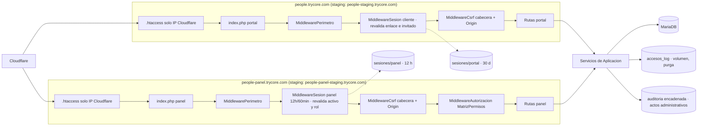

# ADR 0002 — Identidad, acceso y sesiones

> **Enmienda de plataforma (iteración 8, 2026-09-25):** el diseño de esta ADR se conserva; su
> implementación pasa de PHP/MariaDB/cPanel a TypeScript/PostgreSQL/App Platform. Ver la sección
> «Enmienda de plataforma» al final y [ADR-0008](0008-plataforma-contenedores-y-stack.md).
>
> **Revisión adversarial (2026-09-26):** la subsección homónima dentro de la enmienda incorpora los
> hallazgos H0, H5, H8, H9, H19, H22, H31 y H40 de la revisión multiagente. Donde contradiga al cuerpo
> o a la tabla de la enmienda, rige ella (en particular, §2 filas «Revalidación del cliente/panel en
> cada petición» ya no las hace el middleware).
>
> **Consolidación (2026-09-26, tras la revisión en paralelo):** esta ADR es la referencia única de la
> guarda de páginas (`exigirSesion`), la matriz rol × acción y su verificación (V2-3), el encolado con
> lista blanca y el origen de los trabajos, el modo degradado del acceso y los nombres de las tablas de
> identidad. ADR-0008 y ADR-0009 la citan sin redefinirla (incoherencias I-1 e I-3 del backlog,
> resueltas).

> Plantilla alineada al método **ADD** (Attribute-Driven Design, Len Bass — *Software Architecture in
> Practice*). Cada sección numerada corresponde a un paso del método. Las decisiones deben trazar a
> [0000-drivers-y-asrs.md](0000-drivers-y-asrs.md) y actualizar
> [_backlog-arquitectonico.md](_backlog-arquitectonico.md). Generada por la skill `setup-architecture`
> (`/build:architect`); un humano la promueve `proposed → accepted`.
>
> **Revisión:** incorpora las correcciones de la evaluación adversarial ATAM-lite (respuesta neutra
> con envío tras cerrar la respuesta, bloqueo acumulado, perímetro solo Cloudflare, token en el
> fragmento, registro de accesos separado, sesiones por host).

## 1. Objetivo de la iteración y drivers seleccionados (Pasos 2–3)

- **Objetivo de la iteración:** decidir cómo se identifica cada persona (cliente y Talento Humano)
  sin proveedor de identidad, cómo se mantiene su sesión, cómo se revoca el acceso y cómo se autoriza
  cada acción en servidor, sobre el estilo fijado en [ADR-0001](0001-estilo-y-stack-base.md).
- **Hosts del sistema:**
  - Producción: `people.trycore.com` (portal del cliente) y `people-panel.trycore.com` (panel de
    Talento Humano).
  - Staging: `people-staging.trycore.com` y `people-panel-staging.trycore.com`.
  - Los cuatro cuelgan de `trycore.com`, así que son **mismo sitio** (*same-site*) entre sí y con
    cualquier otro subdominio de `trycore.com`. Esto condiciona la defensa CSRF (§2).
- **Elementos a refinar:** `server/src/Aplicacion` (servicios de acceso y enlaces), los dos front
  controllers (`server/public/portal/api/index.php`, `server/public/panel/api/index.php`), el esquema
  de identidad en MariaDB y la configuración de sesiones PHP por host.
- **Drivers abordados:**
  - Funcionales: UC-1 (acceso nominal del cliente), UC-2 (invitar a un colega), UC-3 (enlace curado
    como objeto con registro), UC-9 (acceso al panel).
  - Atributos de calidad: QA-3 (0 accesos con correo no invitado; 5 intentos; código de 6 dígitos,
    un uso, ≤ 10 min; enlace manipulado → 0 bytes; revocación en la siguiente petición), QA-4 (matriz
    rol × acción al 100 %; respuesta indistinguible; 12 h / 60 min ±1 min; 0 rutas del panel en el host
    del cliente), QA-5 (sin sesión → 401). De forma parcial: QA-8 (el código llega al buzón en
    P95 ≤ 60 s) y QA-21 (la «apertura» del enlace es un dato de atribución).
  - Restricciones: CON-1 (hosting compartido: sin Redis ni workers), CON-4 (sin proveedor de
    identidad), CON-6 (secretos solo en servidor), CON-10 (privacidad, Ley 1581), CON-15 (Cloudflare y
    ModSecurity delante).
  - Concerns: CRN-16 (duración de sesión, vigencia de enlace y de código sin fijar), CRN-10
    (retención de datos personales, aquí los registros de acceso).

## 2. Conceptos de diseño elegidos (Paso 4)

| Driver | Concepto / Táctica | Alternativas descartadas | Razón |
|--------|--------------------|--------------------------|-------|
| UC-3, QA-3 | **Token opaco aleatorio** de 32 bytes (`random_bytes`, base64url); en BD solo `SHA-256(token)`. El enlace es una fila con estado, no un documento autocontenido | JWT o URL firmada con HMAC que lleva la lista de perfiles | Un token firmado no se puede revocar sin lista negra y crece con los perfiles (UC-3 pide token en servidor pasadas unas decenas). Con hash en BD, una fuga de la base no entrega enlaces usables |
| UC-3, QA-3, QA-21 | **Token en el fragmento de la URL** (`https://people.trycore.com/e/#t=…`). El JS lo lee de `location.hash`, lo envía por `POST` y lo borra de la barra con `history.replaceState`. Cabecera `Referrer-Policy: no-referrer` en el portal | Token en la ruta o en la query (`?t=`) | El fragmento nunca viaja al servidor: no queda en logs de Cloudflare, de Apache ni de ModSecurity, ni sale en la cabecera `Referer` hacia terceros. `no-referrer` cierra la fuga residual |
| QA-21, UC-3 | **La «apertura» se registra al verificar el código**, no al cargar la página ni al consultar el enlace | Contar la apertura en el `GET` o en `POST /acceso/enlace` | Los escáneres de correo corporativos (Defender, Mimecast, Proofpoint) abren y a veces ejecutan los enlaces para inspeccionarlos. Solo una verificación correcta prueba que una persona invitada entró. La consulta previa se guarda como `enlace_consultado`, sin contar como apertura |
| UC-1, CON-4 | **Código de un uso por correo** (6 dígitos, `random_int`), guardado como `HMAC-SHA256(código, secreto_codigos)`, 10 min, un uso, comparado con `hash_equals` | Enlace mágico por correo; contraseña; proveedor de identidad (Google/Microsoft) | CON-4 excluye proveedor. La contraseña añade ciclo de vida y recuperación que el PRD no pide. El enlace mágico lo consumen los escáneres al previsualizar. HMAC en vez de hash simple porque 10⁶ valores se recorren en milisegundos |
| QA-3, QA-4, CON-10 | **Respuesta neutra con trabajo diferido**: `POST /acceso/codigo` hace el mismo trabajo previo en ambas ramas (consulta de intentos, consulta de invitado, escritura en `accesos_log`), responde `202` con cuerpo idéntico y **cierra la respuesta** (`fastcgi_finish_request()` o `litespeed_finish_request()`). Solo después genera el código y, si el correo está invitado, lo guarda y lo envía; si no, genera, calcula y descarta el HMAC y escribe una fila de descarte equivalente | Enviar por SMTP antes de responder (el tiempo delata al invitado); mensaje «este correo no está invitado» | El envío SMTP tarda cientos de ms a varios s: si ocurre antes de responder, cualquiera mide la latencia y deduce la lista de invitados. Con la respuesta ya cerrada, la parte que difiere no se observa desde el cliente |
| QA-3 | **Verificación con mensaje único**: cualquier fallo de `POST /acceso/verificar` (código erróneo, vencido, usado, correo no invitado, bloqueo activo) devuelve el mismo `403 {motivo: "codigo_invalido"}` con el texto «Código inválido o vencido» | Motivos distintos (`no_invitado`, `codigo_vencido`, `bloqueado`) | Un motivo `no_invitado` en la verificación reabre la enumeración que la respuesta neutra cierra. Se elimina ese motivo del contrato |
| QA-3 | **Limitación en tres capas**: (1) ventana corta: 5 fallos por enlace+correo y 5 por IP en 15 min; (2) **tope diario**: 20 fallos por enlace+correo en 24 h → bloqueo de 24 h de ese par y alerta a Talento Humano y al responsable técnico; (3) regla de límite de Cloudflare sobre `/api/v1/acceso/*` | Solo ventana de 15 min; solo Cloudflare; CAPTCHA | Con solo la ventana, un atacante paciente prueba 480 códigos al día por par. El tope diario lo baja a 20 (probabilidad de acierto ≈ 2·10⁻⁵ por día y par). Cloudflare no conoce el par enlace+correo; la aplicación sola no frena volumen distribuido. CAPTCHA añade fricción a un cliente B2B invitado |
| CON-15, QA-3 | **El origen solo acepta rangos IP de Cloudflare** (`.htaccess` con `Require ip` sobre los rangos publicados, coordinado con [ADR-0007](0007-entornos-despliegue-y-perimetro.md)). La aplicación lee `CF-Connecting-IP` **solo** si `REMOTE_ADDR` está en esos rangos | Confiar siempre en `CF-Connecting-IP`; usar `REMOTE_ADDR` | Si el origen acepta tráfico directo, cualquiera falsifica `CF-Connecting-IP` y esquiva el límite por IP y el de Cloudflare. Con `REMOTE_ADDR` siempre sería la IP de Cloudflare y el límite por IP no serviría |
| UC-1, UC-9, CON-1 | **Sesiones PHP nativas separadas por host**: `session.save_path` propio por host y entorno en la carpeta privada, `session.gc_maxlifetime` propio (portal 30 días, panel 12 h), purga por cron en vez de recolección probabilística; cookies `__Host-ps` (portal) y `__Host-pp` (panel), `Secure`, `HttpOnly`, `SameSite=Lax`; `session_regenerate_id(true)` al autenticar | Un solo `save_path` compartido; JWT en `localStorage`; sesiones en BD; Redis | Con un `save_path` y un `gc_maxlifetime` comunes, el recolector del panel (12 h) borraría sesiones del portal (30 días) o al revés. cPanel compartido no ofrece Redis. JWT en el navegador expone el token a XSS y complica la revocación |
| QA-1, QA-2, CON-1 | **`read_and_close` en las lecturas**: las peticiones que no mutan abren la sesión con `session_start(['read_and_close' => true])`; solo las mutantes y la autenticación la abren en escritura | Abrir la sesión siempre en escritura | PHP bloquea el fichero de sesión mientras la petición vive: los `fetch` concurrentes del portal (catálogo, catálogos, telemetría) se serializarían. Con `read_and_close` el bloqueo dura microsegundos |
| QA-3, UC-3 | **Revalidación del cliente en cada petición**: el middleware comprueba enlace no revocado ni vencido e invitado activo antes de servir nada | Confiar en la sesión hasta que caduque | QA-3 exige revocación efectiva en la siguiente petición; una sesión de 30 días sin revalidar la dejaría abierta semanas |
| QA-4, UC-9 | **Revalidación del panel en cada petición**: el middleware lee `usuarios_panel.activo` y `rol` de BD en cada petición; la sesión guarda solo el id del usuario, nunca el rol | Rol guardado en la sesión al autenticar | Dar de baja a una administradora o degradarla a observadora debe surtir efecto en la siguiente petición, no a las 12 h |
| QA-4 | **Middleware de autorización por host** + **matriz rol × acción** declarada en código y probada contra la tabla de rutas registradas | Comprobaciones dispersas en cada caso de uso; ACL en BD | Un solo punto hace testeable el 100 % de endpoints de escritura. Dos roles fijos no justifican ACL configurable |
| QA-4 | **Aislamiento por host**: el front controller del portal no registra rutas del panel | Una sola API con prefijo `/panel` | Una ruta que no existe no se puede alcanzar por error de configuración de permisos |
| QA-3, QA-4 | **CSRF en dos comprobaciones**: cabecera obligatoria `X-PS-CSRF` con el token de sesión en toda petición mutante **y** `Origin` igual al host que atiende (si `Origin` falta, se usa `Referer`; si faltan ambos, se rechaza). Coherente con [ADR-0001](0001-estilo-y-stack-base.md) | Solo `SameSite`; token en campo de formulario | Los hosts son *same-site* bajo `trycore.com`: `SameSite=Lax` no frena una petición desde otro subdominio de `trycore.com`. La cabecera personalizada obliga a pasar por `fetch` con preflight; `Origin` distingue `people.trycore.com` de `people-panel.trycore.com` y de cualquier otro subdominio |
| QA-11, QA-3 | **Registro de accesos separado** (`accesos_log`, solo inserción, sin cadena de hashes, con retención y purga) para consultas de enlace, peticiones de código, verificaciones, fallos y bloqueos. La **auditoría encadenada** ([ADR-0003](0003-datos-persistencia-y-auditoria.md)) recibe solo actos administrativos: generar o revocar enlace, aprobar o rechazar invitación, alta, baja o cambio de rol, desbloqueo | Escribir cada intento en la auditoría encadenada | La cadena de hashes serializa las inserciones: un ataque de volumen contra `/acceso/*` bloquearía la auditoría de todo el panel y la inflaría con ruido. Los accesos necesitan volumen y purga; la auditoría necesita integridad y permanencia |
| UC-1, UC-3 | **Estados de acceso tipados** sobre el enlace: `410 {motivo: enlace_revocado}` o `410 {motivo: enlace_vencido}`, `401 {motivo: sesion_expirada}`, `403 {motivo: codigo_invalido}`; la interfaz los traduce a pantallas propias | Error HTTP genérico | UC-1 exige pantallas de vencido, revocado y renovación, nunca error crudo. El estado del enlace se puede revelar a quien tiene el token; la pertenencia del correo, no. Un **token inexistente** recibe exactamente el mismo `410 {motivo: enlace_revocado}` que uno revocado (código y cuerpo idénticos; *revisión de coherencia*: contrato único de `POST /acceso/enlace`, que ADR-0006 cita) |

## 3. Instanciación: responsabilidades e interfaces (Paso 5)

- **Elementos instanciados:**
  - `Aplicacion/Acceso/ServicioAccesoCliente` — consulta el enlace, solicita código, verifica código,
    cierra sesión.
  - `Aplicacion/Acceso/ServicioAccesoPanel` — solicita y verifica código para `usuarios_panel`.
  - `Aplicacion/Acceso/TrabajoPosRespuesta` — ejecuta la parte diferida de `/acceso/codigo` tras
    cerrar la respuesta, con el mismo recorrido para invitado y no invitado.
  - `Aplicacion/Enlaces/ServicioEnlaces` — genera, revoca, renueva y lista enlaces; gestiona
    invitaciones solicitadas (UC-2); desbloquea pares bloqueados.
  - `Dominio/Acceso/PoliticaIntentos` (ventana 15 min, tope diario, bloqueo 24 h),
    `Dominio/Acceso/MatrizPermisos` — reglas puras, testeables sin BD y con reloj inyectado.
  - `Adapters/Http/MiddlewarePerimetro` (IP de Cloudflare → IP real), `MiddlewareSesion`,
    `MiddlewareCsrf` (cabecera + `Origin`), `MiddlewareAutorizacion` — encadenados en Slim por host.
  - Adaptador de correo `EnviadorCorreo` (frontera `otp-mail`, detalle en ADR-0005).
- **Esquema (MariaDB, esquema lógico de identidad):**
  - `enlaces` (id, token_hash CHAR(64) único, cuenta, razon, codigos_perfil JSON, vigente_desde,
    vigente_hasta, estado `activo|revocado|vencido`, generado_por, revocado_por, revocado_en).
  - `enlace_invitados` (enlace_id, correo_normalizado, origen `inicial|invitacion_aprobada`, activo).
    Normalización: minúsculas y recorte de espacios; el alias `+etiqueta` se conserva literal salvo
    que Talento Humano decida otra cosa.
  - `invitaciones_solicitadas` (enlace_id, solicitado_por, correo_propuesto, estado
    `pendiente|aprobada|rechazada`, resuelto_por, resuelto_en).
  - `codigos_acceso` (ambito `cliente|panel`, sujeto, codigo_hmac, expira_en, usado_en).
  - `intentos` (clave `enlace+correo` o `ip`, ambito, ventana_inicio, fallos_ventana, fallos_dia,
    dia_inicio, bloqueado_hasta) — la política vive en `PoliticaIntentos`.
  - `accesos_log` (id, ts, host, ambito, evento `enlace_consultado|codigo_pedido|codigo_descartado|
    verificacion_ok|verificacion_fallida|bloqueo|desbloqueo|sesion_cerrada`, enlace_id, correo_hash,
    ip, user_agent_resumido) — solo inserción, índice por (enlace_id, ts); retención propuesta
    180 días con purga por cron (*a validar*, CRN-10). El correo se guarda como HMAC para cruzarlo sin
    exponerlo; la `verificacion_ok` guarda además `invitado_id`, que es la apertura atribuida.
  - `usuarios_panel` (correo `@trycore.com`, rol `administrador|observador`, activo, creado_por).
    El primer administrador se siembra desde `config.php` en la migración inicial.
- **Respuesta neutra de `POST /acceso/codigo` (portal y panel):**
  1. Antes de responder, igual en ambas ramas: resolver IP real, leer `intentos`, buscar el correo
     en `enlace_invitados` (o `usuarios_panel`), sumar el intento a la ventana, escribir
     `codigo_pedido` en `accesos_log`.
  2. Responder `202` con cuerpo fijo y cerrar con `fastcgi_finish_request()` o
     `litespeed_finish_request()` (el que exista en el hosting).
  3. Después: generar el código y su HMAC en ambas ramas; si hay invitado vigente y sin bloqueo,
     guardar en `codigos_acceso` y enviar por SMTP (fallo → cola `trabajos`, ADR-0005); si no, escribir
     `codigo_descartado`.
  4. Si ninguna de las dos funciones existe en el hosting, las dos ramas encolan la parte 3 en
     `trabajos` y el cron la ejecuta: se pierde latencia de entrega, no neutralidad.
- **Responsabilidades clave:**
  - El secreto de códigos, el secreto del HMAC de correos y el `LINK_SIGNING_SECRET` viven en
    `~/portal-config/config.php` (y `~/portal-config/staging/config.php`) (CON-6).
  - Perímetro: `.htaccess` de cada host con `Require ip` de los rangos de Cloudflare; la lista se
    genera desde `https://www.cloudflare.com/ips-v4` e `ips-v6` y se revisa por tarea programada
    semanal que alerta si cambió (detalle operativo en ADR-0007).
  - Sesiones: rutas `~/portal-data/sesiones/{portal,panel,portal-staging,panel-staging}`, permisos
    700, fuera de `public_html`; `session.gc_probability = 0` y purga por cron según el
    `gc_maxlifetime` de cada host.
  - Cliente: sesión por dispositivo de **30 días**, acotada siempre a `vigente_hasta` del enlace
    (aceptado el 2026-09-25, CRN-16). Vigencia por defecto del enlace: **30 días**. La sesión guarda `enlace_id` e `invitado_id`, nunca la lista de
    perfiles.
  - Panel: sesión ≤ 12 h absolutas desde la autenticación y cierre a los 60 min sin actividad. La
    marca de última actividad se reescribe como mucho una vez por minuto (así casi todas las lecturas
    siguen en `read_and_close` y el margen de ±1 min de QA-4 se respeta). Rol y `activo` se leen de BD
    en cada petición.
  - Bloqueo: al llegar a 20 fallos en 24 h para un par enlace+correo, `bloqueado_hasta = ahora + 24 h`,
    evento `bloqueo` y alerta. Durante el bloqueo `/codigo` sigue respondiendo la neutra sin enviar y
    `/verificar` responde «Código inválido o vencido». Una administradora puede desbloquear desde el
    panel (acto auditado en la cadena).
  - Auditoría encadenada (ADR-0003): generación, revocación y renovación de enlaces, aprobación o
    rechazo de invitaciones, alta, baja y cambio de rol, desbloqueos. Nada de intentos de acceso.
- **Interfaces / contratos (`/api/v1`, tipos en `packages/contratos`):**
  - Portal: `POST /acceso/enlace` {token} → 200 {estado_enlace} | 410 {motivo} (token inexistente = el mismo 410 que revocado); `POST /acceso/codigo`
    {token, correo} → 202 siempre (neutra); `POST /acceso/verificar` {token, correo, codigo} → 204 +
    cookie | 403 {motivo: "codigo_invalido"}; `POST /acceso/salir`; `POST /invitaciones` {correo} (UC-2).
  - Panel: `POST /acceso/codigo` → 202 siempre; `POST /acceso/verificar` → 204 | 403
    {motivo: "codigo_invalido"}; `GET/POST /enlaces`, `POST /enlaces/{id}/revocar`,
    `POST /invitaciones/{id}/aprobar|rechazar`, `POST /accesos/desbloquear`, `GET/POST /usuarios`.
  - Todas las mutantes exigen `X-PS-CSRF` y `Origin` del propio host; sin sesión → 401.
  - Cabeceras del portal: `Referrer-Policy: no-referrer` (prevalece sobre el valor general de
    ADR-0007 en este host).

## 4. Vistas y registro de la decisión (Paso 6)

Secuencia de acceso del cliente:

```mermaid
sequenceDiagram
  autonumber
  participant N as Navegador (apps/portal)
  participant CF as Cloudflare
  participant API as API portal (Slim)
  participant DB as MariaDB
  participant SMTP as SMTP (ADR-0005)
  Note over N: URL /e/#t=TOKEN · el fragmento no viaja al servidor
  N->>N: leer location.hash · history.replaceState
  N->>CF: POST /api/v1/acceso/enlace {token}
  CF->>API: (límite de peticiones · origen solo acepta IP de Cloudflare)
  API->>DB: enlaces.token_hash = SHA-256(token) · accesos_log enlace_consultado
  alt inexistente, revocado o vencido
    API-->>N: 410 {motivo} (inexistente = mismo 410 que revocado)
  else activo
    API-->>N: 200 {estado_enlace}
  end
  N->>API: POST /acceso/codigo {token, correo}
  API->>DB: intentos · ¿correo invitado? · accesos_log codigo_pedido (igual en ambas ramas)
  API-->>N: 202 neutra (cuerpo fijo)
  Note over API: fastcgi_finish_request / litespeed_finish_request
  alt invitado vigente y sin bloqueo
    API->>DB: guardar HMAC(código), expira 10 min
    API->>SMTP: enviar código (fallo → cola trabajos)
  else no invitado o bloqueado
    API->>API: generar y descartar HMAC · accesos_log codigo_descartado
  end
  N->>API: POST /acceso/verificar {token, correo, código}
  API->>DB: hash_equals · marcar usado · intentos · accesos_log
  alt correcto
    API-->>N: 204 + Set-Cookie __Host-ps (id regenerado) · apertura atribuida
  else cualquier fallo
    API-->>N: 403 «Código inválido o vencido»
  end
  loop cada petición
    N->>API: GET /catalogo (cookie; read_and_close)
    API->>DB: ¿enlace activo y vigente? ¿invitado activo?
    API-->>N: 200 | 401/410 {motivo}
  end
```

Vista de componentes por host:

```mermaid
flowchart LR
  CF[Cloudflare] --> HT1
  CF --> HT2
  subgraph portal["people.trycore.com (staging: people-staging.trycore.com)"]
    HT1[.htaccess solo IP Cloudflare] --> P1[index.php portal] --> M0[MiddlewarePerimetro] --> M1[MiddlewareSesion cliente · revalida enlace e invitado] --> M2[MiddlewareCsrf cabecera + Origin] --> R1[Rutas portal]
  end
  subgraph panel["people-panel.trycore.com (staging: people-panel-staging.trycore.com)"]
    HT2[.htaccess solo IP Cloudflare] --> P2[index.php panel] --> M0b[MiddlewarePerimetro] --> M3[MiddlewareSesion panel 12h/60min · revalida activo y rol] --> M4[MiddlewareCsrf cabecera + Origin] --> M5[MiddlewareAutorizacion MatrizPermisos] --> R2[Rutas panel]
  end
  R1 --> S[Servicios de Aplicacion]
  R2 --> S
  S --> DB[(MariaDB)]
  S --> AL[(accesos_log · volumen, purga)]
  S --> AU[(auditoria encadenada · actos administrativos)]
  M1 -.-> SP1[(sesiones/portal · 30 d)]
  M3 -.-> SP2[(sesiones/panel · 12 h)]
```

**Decisión:** enlace curado con token opaco hasheado en BD que viaja en el fragmento de la URL;
identificación por correo invitado más código de un uso guardado como HMAC; respuesta neutra que se
cierra antes de generar y enviar el código, con trabajo equivalente en ambas ramas; mensaje único de
fallo al verificar; limitación por ventana, tope diario con bloqueo de 24 h y Cloudflare, con el
origen cerrado a las IP de Cloudflare; sesiones PHP nativas separadas por host, con vida propia y
`read_and_close` en lecturas; revalidación en cada petición (enlace e invitado en el portal; `activo`
y rol en el panel); autorización centralizada con matriz probada; CSRF por cabecera y `Origin`;
accesos en `accesos_log` y actos administrativos en la auditoría encadenada.

**Trade-offs aceptados:**
- Revalidar en cada petición cuesta una o dos consultas indexadas extra; se acepta a cambio de
  revocación y baja inmediatas.
- El código por correo depende de la entrega SMTP: si el correo tarda, el usuario espera. No hay canal
  alternativo.
- Sesiones en ficheros ligan la sesión a un solo servidor; aceptable mientras el hosting sea uno.
- El bloqueo de 24 h puede usarse para negar el acceso a un invitado legítimo si alguien conoce su
  enlace y su correo. Se acepta porque la alerta llega a Talento Humano, que puede desbloquear.
- Los accesos fuera de la cadena de hashes no tienen evidencia de manipulación; se acepta porque no
  son cambios de datos.

## 5. Análisis del diseño (Paso 7)

> Tabla final tras la evaluación adversarial ATAM-lite (`architecture-evaluator`) y las correcciones
> incorporadas. ✅ solo donde hay una medida o un plan de verificación concreto; ⚠️ donde el diseño
> cubre el driver pero depende de algo sin verificar o de una decisión de negocio.

| Driver | ✅/⚠️/❌ | Evidencia / medida | Riesgo residual |
|--------|---------|--------------------|-----------------|
| UC-1 | ✅ | Flujo fragmento → enlace → correo → código → sesión. Plan: test de integración por cada estado (vencido, revocado, código inválido, bloqueado, sesión expirada) que comprueba el código HTTP, el motivo y la pantalla propia; journey-smoke del recorrido completo en staging | Latencia SMTP visible para el usuario (ver QA-8) |
| UC-2 | ✅ | `invitaciones_solicitadas` con aprobación en el panel; el invitado entra con `origen=invitacion_aprobada`. Plan: tests de aceptación de HU-095 (pendiente → aprobada → entra; rechazada → no entra) | El aviso a Talento Humano de una solicitud pendiente depende de ADR-0006; dónde vive «Mi equipo» del colega sigue abierto (CRN-12) |
| UC-3 | ⚠️ | Enlace como fila con estado, token solo como hash, revocación con efecto en la siguiente petición, apertura atribuida al verificar | La reevaluación del estado de cada perfil del enlace se resuelve en ADR-0003. Un redirector de medición de clics (ADR-0006) debe conservar el fragmento `#t=`; sin prueba aún |
| UC-9 | ✅ | Lista nominal `usuarios_panel`, código, 12 h / 60 min, `activo` y rol leídos de BD en cada petición, sembrado desde config. Plan: tests con reloj inyectado (11 h 59 min pasa, 12 h 01 min cae; 59 min inactivo pasa, 61 min cae) y test de baja: desactivar y la siguiente petición da 401 | — |
| QA-3 | ⚠️ | Respuesta cerrada antes del trabajo que difiere; mensaje único al verificar; 5 fallos / 15 min por par y por IP, 20 / día → bloqueo 24 h + alerta; código 6 dígitos, 10 min, un uso, HMAC. Plan: prueba de temporización N = 200 peticiones por rama (invitado / no invitado) desde fuera de Cloudflare hacia staging, sin diferencia estadística (Mann-Whitney, α = 0,05) y diferencia de medianas < 5 ms; test de enlace manipulado → 0 bytes de inventario; test de revocación → la siguiente petición da 410 | `fastcgi_finish_request` / `litespeed_finish_request` sin confirmar en el hosting (si falta, el camino de cola mantiene la neutralidad pero retrasa el código). Regla de límite de Cloudflare sin confirmar en el plan contratado. Bloqueo de 24 h utilizable para negar acceso a un invitado concreto |
| QA-4 | ✅ | Matriz rol × acción en código; host del portal sin rutas del panel; respuesta neutra también en el panel. Plan: test que recorre la tabla de rutas registradas de Slim y falla si una ruta mutante no está en la matriz o si el observador obtiene algo distinto de 403 con 0 cambios; test de que ninguna ruta del panel responde en `people.trycore.com`; prueba de temporización N = 200 por rama (inscrito / no inscrito); reloj inyectado para 12 h / 60 min | El margen de ±1 min depende de reescribir la actividad como mucho una vez por minuto; cubierto por el test de reloj |
| QA-5 (sin sesión → 401) | ✅ | Middleware de sesión antes de toda ruta de datos. Plan: test que llama cada ruta de datos sin cookie y exige 401 y cuerpo sin inventario | — |
| QA-8 (entrega del código) | ⚠️ | Envío tras cerrar la respuesta; fallo SMTP → cola `trabajos` | P95 ≤ 60 s del código en bandeja sin medir; entrega en buzones corporativos con IP compartida sin probar (ADR-0005) |
| QA-21 (apertura atribuida) | ⚠️ | Apertura = `verificacion_ok` con `invitado_id` y `enlace_id` en `accesos_log`; los escáneres no la inflan | La atribución a una edición curada concreta (enlace por destinatario con `envio_id`; el correo sale de Gmail o HubSpot, RF-18) depende de ADR-0006; ADR-0006 debe leer la apertura de `accesos_log`, no del `GET` |
| CON-1 | ⚠️ | Sesiones en ficheros por host, `read_and_close`, purga por cron; sin Redis ni workers | Disponibilidad de las funciones de cierre de respuesta y comportamiento del bloqueo de ficheros de sesión en el hosting sin verificar; se prueba en staging antes de EP-001 |
| CON-4 | ✅ | Sin proveedor de identidad; lista nominal + código en las dos caras. Plan: revisión de dependencias en el gate de stack (0 librerías de identidad externas) | — |
| CON-6 | ✅ | Secretos en `~/portal-config/config.php` fuera de `public_html`. Plan: grep de secretos en el bundle y en el repositorio en CI | Rotar el secreto de códigos invalida los códigos vivos (10 min): aceptable. Rotar el secreto del HMAC de correos rompe el cruce histórico de `accesos_log` |
| CON-10 | ⚠️ | Respuesta neutra en ambas ramas; sin motivo `no_invitado`; token fuera de logs y de `Referer`; correo en `accesos_log` como HMAC | `accesos_log` guarda IP y actividad por persona: la retención de 180 días está sin validar (CRN-10, Ley 1581) |
| CON-15 | ⚠️ | Origen cerrado a los rangos de Cloudflare; `CF-Connecting-IP` solo si `REMOTE_ADDR` es de Cloudflare; límite de Cloudflare sobre `/api/v1/acceso/*`. Plan: petición directa al origen saltándose Cloudflare → 403; petición con `CF-Connecting-IP` falsificado → se ignora | La lista de rangos de Cloudflare cambia: si la tarea semanal falla, una IP nueva de Cloudflare quedaría fuera (caída parcial). Regla de límite sin confirmar en el plan. ModSecurity podría bloquear los POST de acceso (CRN-18, ADR-0007) |
| CRN-16 | ⚠️ | Propuesta: sesión del cliente 30 días acotada al enlace; código 10 min; panel 12 h / 60 min; bloqueo 24 h | Sesión 30 días y vigencia por defecto del enlace 30 días aceptadas (2026-09-25); código, panel y bloqueo se calibran con datos reales |

**Drivers no resueltos en esta iteración:** proyección del
catálogo y estado real de cada perfil del enlace (UC-4, ADR-0003); entrega y cola del correo
(QA-8, ADR-0005); atribución por envío y notificación de invitaciones pendientes (QA-21, ADR-0006);
retención de `accesos_log` (CRN-10).

## 6. Consecuencias

- **Positivas:**
  - Nadie puede saber desde fuera si un correo está invitado: ni por el mensaje, ni por el código
    HTTP, ni por el tiempo de respuesta.
  - Revocar un enlace, dar de baja a un invitado o quitar un rol en el panel surte efecto en la
    siguiente petición.
  - El token del enlace no queda en logs ni sale hacia terceros; una fuga de la base no entrega
    enlaces ni códigos usables.
  - Las aperturas que se reportan son personas que entraron, no escáneres de correo.
  - Un único punto de autorización por host, probado contra la tabla de rutas real.
  - La auditoría encadenada no se degrada por ataques de volumen contra el acceso.
  - Cero dependencia de terceros de identidad y cero dependencias nuevas.
- **Negativas:**
  - SMTP sigue en el camino crítico del acceso: si el correo no llega, no hay entrada.
  - Sesiones en ficheros impiden escalar a varios servidores sin migrar el almacén.
  - El enlace depende de JavaScript para leer el fragmento; sin JS no hay acceso (el portal ya lo
    exige por ADR-0001).
  - Dos registros (accesos y auditoría) en vez de uno: más esquema y dos políticas de retención.
  - La normalización de correos (alias, mayúsculas) puede dejar fuera a un invitado legítimo si se
    aplica mal.
- **Riesgos:**
  - Las funciones de cierre de respuesta pueden no estar disponibles en el hosting; mitigado por el
    camino de cola con la misma neutralidad y verificado en staging antes de EP-001.
  - Negación de acceso dirigida mediante el bloqueo de 24 h; mitigada por la alerta y el desbloqueo
    desde el panel.
  - Desactualización de los rangos de Cloudflare en `.htaccess`; mitigada por la tarea semanal con
    alerta.
  - Un redirector de clics que pierda el fragmento dejaría al cliente sin token; mitigado con una
    prueba en ADR-0006 antes del primer envío.
  - ModSecurity puede bloquear los POST de acceso; mitigado por las pruebas de humo de ADR-0007.
- **Decisiones de la revisión única (sponsor, 2026-09-25):**
  - **Sesión del cliente: 30 días** por dispositivo, acotada a la vigencia del enlace (CRN-16).
  - **Vigencia por defecto del enlace: 30 días** (se descarta la propuesta de 60 días renovable).
- **Trade-offs de negocio abiertos (decide Dirección de Mercadeo con Tecnología):**
  - **Tope diario y bloqueo de 24 h**: ¿Talento Humano acepta recibir alertas y desbloquear a mano?
  - **Retención de `accesos_log`** (propuesta 180 días) bajo Ley 1581.
  - **Normalización de alias `+etiqueta`** en correos invitados.
- **Operacionales:** cron de purga de `intentos`, `codigos_acceso` usados o vencidos, `accesos_log`
  vencido y ficheros de sesión de cada host; tarea semanal que compara los rangos de Cloudflare con
  `.htaccess`; primer administrador sembrado una vez desde `config.php`; carpetas de sesión fuera de
  `public_html` con permisos 700.

## 7. Trazabilidad

- Drivers: [0000-drivers-y-asrs.md](0000-drivers-y-asrs.md) — UC-1, UC-2, UC-3, UC-9, QA-3, QA-4,
  QA-5, QA-8 (parcial), QA-21 (parcial), CON-1, CON-4, CON-6, CON-10, CON-15, CRN-10 (parcial), CRN-16.
- PRD / HU / Flows: [portal-people-service.md](../01-prd/portal-people-service.md) RF-1.1–1.6,
  RF-1.2.7, 1.2.9, 1.2.10, 1.2.11, RF-8.1–8.1.6, RF-19, §8.3; D-4, D-22; EP-001 (HU-090–095, HU-122,
  HU-144), EP-006 (HU-123, HU-124);
  [requisitos-tecnicos-hosting.md](../01-prd/requisitos-tecnicos-hosting.md) §5.
- Relacionadas: [ADR-0001](0001-estilo-y-stack-base.md) (hosts y CSRF),
  [ADR-0003](0003-datos-persistencia-y-auditoria.md) (auditoría encadenada),
  [ADR-0005](0005-integraciones-y-trabajo-diferido.md) (correo y cola `trabajos`),
  [ADR-0006](0006-telemetria-y-atribucion.md) (aperturas, atribución, notificaciones),
  [ADR-0007](0007-entornos-despliegue-y-perimetro.md) (perímetro Cloudflare, `.htaccess`, staging,
  cabeceras).
- Stack operacionalizado en: `.claude/config/stack-allowlist.json` — sin dependencias nuevas (PHP
  nativo: `random_bytes`, `random_int`, `hash_hmac`, `hash_equals`, sesiones,
  `fastcgi_finish_request` / `litespeed_finish_request`).

## Enmienda de plataforma (iteración 8, 2026-09-25)

> El cambio de plataforma (ADR-0008, 0009, 0010) conserva **todo el diseño** de esta ADR: token opaco en
> el fragmento, apertura al verificar, código de un uso con HMAC, respuesta neutra, mensaje único al
> verificar, limitación en tres capas, revalidación en cada petición, matriz rol × acción, cookies
> `__Host-` por host, sesión de 30 días acotada al enlace y panel 12 h / 60 min. Cambia cómo se
> implementa. Donde el texto anterior diga PHP, MariaDB, cron o `config.php`, rige esta tabla.

| Mecanismo (texto anterior) | Implementación vigente | Efecto |
|----------------------------|------------------------|--------|
| Sesiones PHP nativas en ficheros por host, `session_regenerate_id`, `read_and_close` | Tabla `identidad.sesiones` (`id_hash` = SHA-256 de un identificador aleatorio de 32 bytes, `host`, `sujeto`, `creada`, `ultima_actividad`, `expira`); la cookie `__Host-ps` / `__Host-pp` lleva el identificador; se emite uno nuevo al autenticar y se borra la fila al cerrar sesión. Las lecturas no bloquean (no hay fichero de sesión) | Desaparece el problema de serialización que motivaba `read_and_close`. La tabla única con columna `host` se parte en dos (ver «Revisión adversarial», H0) |
| Respuesta neutra cerrando con `fastcgi_finish_request()` / `litespeed_finish_request()`; código generado en la petición | En **ambas ramas** y en una sola transacción: misma lectura de `intentos` e invitado, `codigo_pedido` en `accesos_log` y **una fila en `trabajos`** de tipo `enviar_codigo` con `payload = {ref: invitado_id \| null, ambito}` (misma forma en las dos ramas) + `NOTIFY`; después `202` con cuerpo fijo. **El worker genera el código**, guarda su HMAC en `codigos_acceso` (invalidando el anterior) y lo envía por Mailgun; con `ref` nulo cierra sin efecto (`codigo_descartado`). Reintentos a 5/15/30 s con código nuevo en cada uno y `caducado` a los 10 min. Si el worker está caído (> 2 min sin ciclo), el Route Handler procesa el trabajo tras confirmar, en ambas ramas, y responde en un tiempo fijo de 2 s (ADR-0009). *Corregido en «Revisión adversarial»: el encolado pasa por `encolar_portal`/`encolar_panel` (H0), `codigos_acceso` se parte en `codigos_cliente`/`codigos_panel` (H0), el modo degradado reclama la fila y envía con `after()` por las funciones de H8 y un reintento ambiguo ya no invalida el código anterior (H22)* | Mismas escrituras en ambas ramas; el código nunca viaja en claro por la cola; sale en < 1 s. **Se cierra R-9** |
| Cadena `Adapters/Http/Middleware*` de Slim | `middleware.ts` (borde, CSP, cabeceras) + envoltorios de Route Handler `conSesion`, `conCsrf`, `conAutorizacion`, `conLimite` compuestos en cada `route.ts`. Las páginas se protegen con `exigirSesion` (ver «Revisión adversarial», H5) | La matriz rol × acción se prueba recorriendo `app/api/**/route.ts` del panel con **V2-3** (V8-2 solo cubre Server Actions, Edge y `conCsrf`) |
| Origen cerrado a rangos IP de Cloudflare con `.htaccess`; `CF-Connecting-IP` si `REMOTE_ADDR` es de Cloudflare | Cabecera secreta de borde `X-PS-Edge` (ADR-0010); `CF-Connecting-IP` solo se acepta con cabecera de borde válida | R-11 se sustituye por R-45 |
| Secretos en `~/portal-config/config.php` | Variables `SECRET` de App Platform (`LINK_SIGNING_SECRET`, `OTP_PEPPER`, secreto del HMAC de correos), solo en los procesos que las usan. *Corregido en «Revisión adversarial»: pepper por ámbito y `LINK_SIGNING_SECRET` retirado (H0, H9)* | CON-6 se mantiene |
| Primer administrador sembrado desde `config.php` | Semilla desde la variable `PANEL_ADMIN_INICIAL`. *Corregido en la consolidación (2.ª pasada): no es una migración (las migraciones solo cambian esquema, ADR-0003, y `migrar` no tiene `AUDIT_HMAC_KEY`) sino la tarea `sembrar_admin_inicial` del worker (ADR-0009), que por la unidad de trabajo, auditada con `origen = migracion`, llama a `identidad_panel.sembrar_admin_inicial(correo)` (`SECURITY DEFINER` de `ps_duenio`, `EXECUTE` solo para `ps_worker`; excepción si ya existe algún usuario del panel, así que no sirve para añadir administradores después). `PANEL_ADMIN_INICIAL` la recibe el worker (ADR-0010 §3.3)* | Un worker comprometido no puede inscribir administradores en un panel ya sembrado |
| Purgas por cron (`intentos`, `codigos_acceso`, `accesos_log`, sesiones) | Tarea `purgar` del planificador del worker (ADR-0009) sobre `intentos_cliente`, `intentos_panel`, `codigos_cliente`, `codigos_panel`, `sesiones_portal`, `sesiones_panel` y `accesos_log` (nombres de «Revisión adversarial», H0), solo por `identidad.purgar_vencidos()` e `identidad_panel.purgar_vencidos()` (*consolidación, 2.ª pasada*) | `ps_worker` no tiene `DELETE` directo sobre identidad |
| `random_bytes`, `random_int`, `hash_hmac`, `hash_equals` | `crypto.randomBytes`, `crypto.randomInt`, `crypto.createHmac`, `crypto.timingSafeEqual` (Node) | Sin dependencias nuevas |
| ModSecurity puede bloquear los POST de acceso | No aplica (no hay ModSecurity); el conjunto gestionado de Cloudflare se prueba en el humo de staging | — |

**Veredictos que cambian en §5:** QA-3 mantiene ⚠️ solo por los umbrales frente a NAT (R-13) y el
bloqueo usable para negar acceso (R-10); CON-1 deja de aplicar (reemplazada por CON-18/19, ✅); CON-15
pasa a CON-22 (⚠️ por V10-1, V10-2, V10-9); QA-8 (entrega del código) ⚠️ solo por la colocación
en bandeja (V10-4).

### Revisión adversarial (2026-09-26)

> Incorpora los hallazgos H0, H5, H8, H9, H19, H22, H31 (parcial) y H40 (parcial) de la revisión
> multiagente. Rige sobre el cuerpo y sobre la tabla anterior donde los contradiga. Convención de IDs:
> las verificaciones de esta ADR son **V2-n**; las de otras ADR se citan como V8-n (ADR-0008) y V10-n
> (ADR-0010).

| Hallazgo | Decisión | Razón |
|----------|----------|-------|
| H5 — protección de páginas | **Guarda de página `exigirSesion(host, opciones)`** en `apps/{portal,panel}/src/sesion/` con `import "server-only"` y `cache()` de React (una revalidación por petición). Lee la cookie, busca `SHA-256(id)` en la tabla de sesiones de su host y revalida lo mismo que `conSesion`: en el portal, enlace activo y vigente e invitado activo; en el panel, `usuarios_panel.activo`, `rol`, 12 h absolutas y 60 min de inactividad. Devuelve un tipo marcado `SesionVerificada` que solo ella construye. **Cada `page.tsx` protegida la llama en su primera línea**, antes de cualquier lectura; el layout puede llamarla para la cabecera, pero nunca es la única guarda (los layouts no se re-renderizan en navegación cliente). `ProyeccionCatalogo` y todo puerto que lea inventario o identidad desde un Server Component **exige `SesionVerificada` como parámetro**: sin sesión no compila. `conSesion` (Route Handlers) y `exigirSesion` comparten la misma función de revalidación en `packages/dominio` (`validarSesion`); solo difiere la salida. Es la única guarda de página: el nombre `obtenerSesion`, la ruta `lib/sesion.ts` y la «pantalla 410» servida por la propia página protegida que describía ADR-0008 quedan sustituidos por esta fila y la siguiente (I-1) | El middleware no abre la BD (ADR-0008) y los envoltorios solo cubren `route.ts`: sin guarda de página, un Server Component serviría HTML con sesión revocada. El tipo marcado convierte la precondición en error de compilación y no en disciplina |
| H5 — redirecciones | Sin sesión, Server Component → `redirect()` (307) **antes de emitir nada**; Route Handler → 401/410 JSON (§2, sin cambios). Portal: sin cookie o sesión inexistente → `/acceso` (pantalla «abre el enlace que recibiste», sin datos); enlace revocado o vencido → `/acceso?motivo=enlace_revocado\|enlace_vencido` (pantalla 410 propia); sesión caducada → `/acceso?motivo=sesion_expirada`. Panel: → `/acceso` (inicio con correo `@trycore.com`) con el mismo `motivo`. `motivo` es un enum cerrado validado con zod; ninguna otra query se propaga (nada de `?volver=` abierto). El middleware sí hace una **comprobación optimista sin BD**: sin cookie del host en una ruta no pública, redirige directo (ahorra un render), pero la autoridad es la guarda de página | Estados tipados de §2 llevados a páginas; `redirect()` en Server Component corta el render y en navegación cliente devuelve la redirección sin payload RSC de la página. Un parámetro de retorno abierto sería un redirector abierto |
| H5 — orden frente a `#t=` | `/e/` es **pública** y no lee inventario: su HTML solo contiene la puerta de acceso. El JS lee `location.hash`, lo borra con `history.replaceState` y hace `POST /acceso/enlace`. Si ya hay sesión del portal: mismo `enlace_id` → navega al catálogo sin pedir código; enlace distinto → **prevalece el token** (flujo de código para el enlace nuevo, la sesión anterior se borra al verificar). Sin fragmento en `/e/` → `/acceso`. Ninguna página protegida intenta leer `#t=`; la guarda nunca redirige desde `/e/` | El fragmento solo existe en el navegador: la página que lo recibe no puede depender de la sesión. Hacer prevalecer el token evita que una sesión vieja oculte el enlace nuevo que el comercial acaba de enviar |
| H0 — aislamiento portal/panel en identidad | **Dos esquemas.** `identidad` (cara cliente): `enlaces`, `enlace_tokens` (H9), `enlace_invitados`, `invitaciones_solicitadas`, `codigos_cliente`, `intentos_cliente`, `sesiones_portal`, `accesos_log`. `identidad_panel`: `usuarios_panel`, `codigos_panel`, `intentos_panel`, `sesiones_panel`. `ps_portal` **no tiene `USAGE`** sobre `identidad_panel`; en `identidad` tiene `SELECT` en `enlaces`, `enlace_tokens`, `enlace_invitados`; `INSERT` en `invitaciones_solicitadas`; `SELECT` y `UPDATE (usado_en)` en `codigos_cliente`; `SELECT`, `INSERT` y `UPDATE` en `intentos_cliente` y `sesiones_portal` (sin `DELETE`); `EXECUTE` de `identidad.cerrar_sesion(id_hash)`; `INSERT` en `accesos_log` con RLS `WITH CHECK (host = 'portal')`; `EXECUTE` de `identidad.guardar_codigo_cliente`, `operacion.reclamar_propio` y `operacion.cerrar_propio` (modo degradado, fila H8). Ni `INSERT` ni `UPDATE` en `enlaces`, `enlace_tokens` ni `enlace_invitados` (los escribe el panel). `ps_panel` (*revisión de coherencia: privilegios explícitos por tabla, sin `DELETE` directo*): `SELECT`, `INSERT` y `UPDATE` en `usuarios_panel`, `sesiones_panel` e `intentos_panel`; `SELECT` y `UPDATE (usado_en)` en `codigos_panel`; `EXECUTE` de `identidad_panel.cerrar_sesion(id_hash)`; `SELECT`, `INSERT` y `UPDATE` en `enlaces`, `enlace_tokens` (incluye emitir y revocar los tokens por destinatario de la edición curada, H9), `enlace_invitados` e `invitaciones_solicitadas`; `SELECT` y `UPDATE` en `intentos_cliente` (solo lo usa `POST /accesos/desbloquear`); `INSERT` en `accesos_log` con `host = 'panel'`; `EXECUTE` de `identidad_panel.guardar_codigo_panel`, `reclamar_propio` y `cerrar_propio`. `ps_worker`: `SELECT` por columnas (`id`, `correo`, `activo`) en `enlace_invitados` y `usuarios_panel`, `INSERT`/`UPDATE` en `codigos_cliente` y `codigos_panel` (*2026-09-27: sin `INSERT` en `enlace_tokens`; los tokens por destinatario de la edición curada los emite el panel, H9*), `INSERT` en `accesos_log` con su política RLS propia `FOR INSERT TO ps_worker WITH CHECK (evento = 'codigo_descartado')` (sin ella, con RLS activo, su `INSERT` fallaría); `EXECUTE` de `identidad.purgar_vencidos()` e `identidad_panel.purgar_vencidos()` (tarea `purgar`) y de `identidad_panel.sembrar_admin_inicial(correo)` (primer administrador, ver la tabla de la enmienda). **Ningún rol de conexión tiene `DELETE`** sobre `codigos_*`, `intentos_*`, `sesiones_*` ni `accesos_log`: el cierre de sesión pasa por `identidad.cerrar_sesion(id_hash)` e `identidad_panel.cerrar_sesion(id_hash)`, `SECURITY DEFINER` de `ps_duenio` que borran solo la fila con ese hash (`EXECUTE` para `ps_portal` y `ps_panel` respectivamente), y las purgas pasan por `purgar_vencidos()`, `SECURITY DEFINER` de `ps_duenio`, sin parámetros de fecha (usa el reloj del servidor y los plazos fijados en la migración: códigos vencidos o consumidos, intentos fuera de su ventana, sesiones caducadas, `accesos_log` de más de 180 días, plazo pendiente de T-6). Esta es la **lista normativa de permisos sobre identidad**; ADR-0008 la cita sin copiarla, los permisos sobre `eventos` son los de ADR-0006, los de vistas, inventario, auditoría e `identidad.claves_titular` los de ADR-0003 (`SELECT`/`INSERT` para `ps_panel` y `ps_worker`, sin `UPDATE`; la destrucción de la clave solo por `auditoria.suprimir_titular(perfil_id)`), los de las tablas de búsqueda (`lexico`, `consultas_sin_coincidencia`, `llamadas_llm`, `estados_largos`) los de ADR-0004 y los de la cola, tareas, `solicitudes`, `worker_ciclo`, `aperturas` y correo los de ADR-0009, fila «Permisos sobre la cola, tareas y correo». *Completada en la consolidación (2.ª pasada): funciones del modo degradado, desbloqueo del panel, purga y primer administrador.* Se elige esquema y no RLS por tabla porque el `GRANT` es auditable de un vistazo y no depende de variables de sesión (incompatibles con PgBouncer en modo transacción) | Un portal comprometido (el proceso más expuesto) no puede crear una sesión del panel, inscribirse como administrador ni añadirse como invitado: la BD lo rechaza aunque el código falle (QA-4, RF-8.1.4) |
| H0 — encolado | **Ningún rol de conexión tiene `INSERT` directo en `operacion.trabajos`**, y solo `ps_worker` tiene `UPDATE` directo (por columnas, sin `origen`) para reclamar y cerrar; portal y panel procesan su propia fila del modo degradado solo por `reclamar_propio`/`cerrar_propio` (fila H8). Se encola con tres funciones: `operacion.encolar_portal(tipo, payload)`, `operacion.encolar_panel(tipo, payload)` y `operacion.encolar_worker(tipo, payload)`, todas `SECURITY DEFINER`, propiedad del grupo `NOLOGIN` dueño de los esquemas (`ps_duenio`, ADR-0008), `SET search_path = operacion, pg_temp` y `EXECUTE` solo para su rol. Cada función **escribe `trabajos.origen` con un literal propio** (`'portal'`, `'panel'` o `'worker'`); la columna no tiene `DEFAULT` y ningún rol de conexión puede escribirla (dentro de una función `SECURITY DEFINER`, `current_user` es el dueño de la función, así que un `DEFAULT current_user` no distinguiría el origen). **Lista blanca única, cerrada en la migración** (ADR-0009 la aplica sin redefinirla): portal = `enviar_codigo` con `ambito='cliente'` y `ref` nulo o id de `enlace_invitados` activo, `crear_negocio`, `voto` y `notificar` solo con `motivo='invitacion_solicitada'` (UC-2); panel = `enviar_codigo` con `ambito='panel'` y `ref` nulo o id de `usuarios_panel` activo, `aplicar_importacion`, `revertir_importacion` y `retirar_supresion` (los tipos del correo curado de RF-18 se añaden por migración en su épica, EP-011); worker = `notificar` (avisos comerciales, escalamiento y aviso degradado). Fuera de lista, o `payload` que no pasa su esquema `zod` → excepción. La función hace el `NOTIFY`. El worker, antes de ejecutar, vuelve a comprobar que el `origen` de la fila está en la lista del tipo y, si no, la marca `Permanente` con alerta de seguridad. La comprobación de `ref` lee lo mismo en ambas ramas: la neutralidad no cambia | Impide que un portal comprometido encole `aplicar_importacion` o una reversión que el worker ejecutaría con permisos de escritura de inventario. Ampliar la lista exige migración revisada |
| H0 — secretos por ámbito | `OTP_PEPPER_CLIENTE` (portal y worker) y `OTP_PEPPER_PANEL` (panel y worker) sustituyen a `OTP_PEPPER`. `EMAIL_HMAC_KEY` la reciben portal, panel y worker (los tres escriben `correo_hash` en `accesos_log`); su fuga solo permite relacionar hashes, no entrar. `LINK_SIGNING_SECRET` se retira (H9). ADR-0010 §3.3 debe reflejar este reparto | El portal deja de tener material para fabricar o verificar códigos del panel |
| H9 — modelo único de token | **Un solo modelo: token opaco aleatorio de 32 bytes, en BD solo `SHA-256`, en el fragmento `#t=`.** Se descarta todo token firmado o derivado. Tabla `enlace_tokens` (`enlace_id`, `invitado_id` nulo o fijo, `envio_id` nulo o fijo, `token_hash` único, `emitido_en`, `revocado_en`; *revisión de coherencia: se añade `envio_id`, nulo para el token de cuenta y rellenado por el panel al generar los enlaces de la edición curada (RF-18.2), para medir la entrada por enlace*): el enlace de cuenta que genera el panel tiene un token con `invitado_id` nulo; la edición curada (RF-18) lleva **un token por destinatario** con `invitado_id` y `envio_id` (la edición) fijos, que **emite el panel** al generar los enlaces, en la misma petición: `INSERT` de `ps_panel` en `enlace_tokens`, ya concedido en la lista normativa de «H0 — aislamiento», así que no hace falta una función `SECURITY DEFINER`. El enlace se muestra en claro **una sola vez** y nunca se guarda en claro (igual que los códigos); regenerarlo marca `revocado_en` en el token vigente de ese destinatario (`UPDATE` de `ps_panel`) e inserta el nuevo en la misma transacción, y el anterior deja de abrir. **El worker no emite ni revoca tokens** (*2026-09-27, decisión del sponsor sobre RF-18, PRD v4.14; alinea esta fila con la fila UC-16 de ADR-0009 y cierra R-81*). Un token de destinatario no ahorra el código: solo preselecciona el correo en la puerta. El bloque para copiar de la edición lleva el enlace **directo** `/e/#t=…`; el correo lo confecciona y envía una persona desde Gmail o HubSpot, nunca el portal ni Mailgun. **Medida única de la entrada por enlace:** el evento `enlace_abierto` de ADR-0006, que **escribe el servidor** en `POST /acceso/enlace`, en la misma transacción que `enlace_consultado` de `accesos_log` (con el `visita_id` del cuerpo y, si el token es de destinatario, su `envio_id` e `invitado_id`); la verificación del correo se mide con `verificacion_ok`. La apertura del mensaje no la mide el portal (RF-18.6). **El token solo viaja en el cuerpo de `POST /acceso/enlace`**: no hay endpoint de eventos que lo reciba (el anónimo `POST /api/v1/eventos/acceso` se retira, ADR-0006) y el navegador nunca envía el token en eventos; con sesión, la telemetría atribuye por `enlace_id`/`invitado_id` de la sesión en servidor. `/r/<id>` queda **solo** para avisos internos al comercial (señal de apertura CRN-1) y su contrato (host del panel, destino el negocio en HubSpot, tabla `aperturas` y permisos) es el de **ADR-0009, fila CRN-1**, que esta ADR cita; no concede acceso a inventario ni a sesión. *Corregido en la consolidación (2.ª pasada): el texto anterior medía el clic con `enlace_consultado` y hacía que `/r/` redirigiese al inicio del panel, en contradicción con ADR-0006 y ADR-0009.* `LINK_SIGNING_SECRET` se retira de todos los procesos. ADR-0006 y ADR-0009 deben alinear sus menciones a «token firmado» y «enlace firmado por destinatario» | Mantiene la garantía de §6: una fuga de la BD no entrega enlaces usables, y ninguna credencial viaja en la ruta (logs de Cloudflare y App Platform). Revocar un enlace revoca todos sus tokens |
| H8 — modo degradado | Con `worker_ciclo` > 2 min, el Route Handler de acceso: (1) hace **exactamente la misma transacción** que en modo normal (lecturas, `accesos_log`, `encolar_*`) y responde `202` **sin relleno de tiempo**; (2) programa con `after()` de Next (≥ 15.1, runtime Node; ADR-0008 fija ≥ 15.5) el procesamiento de **su propia fila**, en ambas ramas: reclamo con `operacion.reclamar_propio(id, reclamo)`, que ejecuta dentro el mismo `UPDATE … SET estado='en_curso', locked_by=$reclamo, locked_until=now()+10 min WHERE id=$1 AND estado='pendiente' RETURNING` del worker; si no obtiene la fila, no hace nada. (3) Con la fila: transacción corta (generar código y guardar su HMAC con `identidad.guardar_codigo_cliente(id, reclamo, hmac)` o `identidad_panel.guardar_codigo_panel(id, reclamo, hmac)`) → **libera la conexión** → `fetch` a Mailgun con timeout 10 s → transacción corta de cierre con `operacion.cerrar_propio(id, reclamo, resultado)` (`AND locked_by=$reclamo` dentro; `resultado` ∈ `ok\|ambiguo\|definitivo\|reintentar` marca también el `resultado_envio` del código, H22). Rama nula: cierre sin efecto equivalente con la misma función. (4) Un solo intento: si falla, `cerrar_propio(…, 'reintentar')` devuelve la fila a `pendiente` con `proximo_intento = now()+5 s` para el worker (o para la siguiente petición del mismo usuario). **Funciones del modo degradado** (*consolidación, 2.ª pasada*: sin ellas el modo degradado exigía `UPDATE` directo en `trabajos` e `INSERT` en `codigos_cliente`, que la fila «H0 — aislamiento» prohíbe): las cuatro son `SECURITY DEFINER`, propiedad de `ps_duenio`, `SET search_path` fijo y `EXECUTE` solo para `ps_portal` y `ps_panel` (las de código, cada una solo para su rol); solo actúan sobre filas con `tipo = 'enviar_codigo'` cuyo `origen` es el del llamante, derivado de `session_user` (con un *pool* de PgBouncer por usuario es el rol de conexión; `current_user` sería el dueño de la función), y `reclamar_propio` solo sobre filas en `pendiente`. `guardar_codigo_*` exige que la fila esté `en_curso` con ese `locked_by`, toma `ref` y ámbito del `payload` de la fila (el llamante no elige sujeto) y aplica la regla de ranuras de H22. (5) No procesa filas ajenas encoladas antes del umbral; quedan para el worker. (6) Semáforo de 2 envíos degradados por instancia; por encima, la fila se queda pendiente y se alerta. Si un `SIGTERM` corta el `after()`, la fila vuelve por arrendamiento vencido. **Es la única definición del modo degradado** (I-3): ADR-0009 la cita y su V9-1 queda cubierta por V2-4 | Con el envío fuera de la ventana medida, el tiempo de respuesta es igual en las dos ramas sin relleno; el reclamo impide que worker y handler generen dos códigos; liberar la conexión antes del `fetch` evita agotar el pool (`max` 4) justo en degradación |
| H22 — códigos ante envío ambiguo | Se distingue fallo **definitivo** (4xx de Mailgun salvo 429, dirección suprimida) de **ambiguo** (timeout, 5xx, red). Ante ambiguo, el reintento genera código nuevo **sin invalidar los anteriores**; también una nueva petición del usuario. Hasta **3 HMAC vigentes** por (ámbito, sujeto), cada uno con sus 10 min; al generar el 4.º se marca el más antiguo `invalidado_por_sistema`. Ante definitivo, el código de ese intento se marca `invalidado_por_sistema`. La verificación compara siempre contra 3 ranuras fijas con `timingSafeEqual` (tiempo constante); acertar una consume todas las del sujeto. Un código que coincide con un HMAC `invalidado_por_sistema` responde el mismo 403 pero **no suma fallo** en `intentos`. Las filas invalidadas se purgan al vencer | Un correo retrasado por listas grises sigue sirviendo y el usuario no gasta intentos por culpa del sistema. Coste: la probabilidad de acierto por intento pasa de 1/10⁶ a 3/10⁶ (≈ 6·10⁻⁵ por día y par con el tope de 20, frente a ≈ 2·10⁻⁵ con un solo código). **Propuesta por defecto, pendiente de T-31** (no normativa): aceptar ese riesgo es decisión de negocio, no de arquitectura. Si T-31 elige un solo código vigente, cada reintento invalida el anterior y el tope de 3 ranuras pasa a 1 |
| H19 — matriz rol × acción | `conAutorizacion(accion)` exige una `accion` que sea clave de `MatrizPermisos` y registra el metadato en el módulo (`export const permisos = {POST: "enlaces.revocar", …}`). **Fuente única de la matriz: `MatrizPermisos` en `packages/dominio`**; **verificación única: V2-3** sobre `app/api/**/route.ts` del panel. El fichero `apps/panel/matriz-autorizacion.json` y la verificación V8-13 de ADR-0008 se retiran (V8-13 queda como alias de V2-3) | La prueba citada antes (V8-2) no recorría la matriz; QA-4 quedaba sin verificación nombrada; dos fuentes de la matriz podían divergir |
| H40 — datos personales en errores | Unicidad de correos por **`correo_hmac`** (`HMAC(EMAIL_HMAC_KEY, correo_normalizado)`), no por el correo en claro: índice único `(enlace_id, correo_hmac)` en `enlace_invitados` y `(correo_hmac)` en `usuarios_panel`. El correo en claro se guarda solo para enviar. Un `23505` expone así un hash, no un correo. La redacción general de logs es de ADR-0010 | Cierra en el esquema de identidad la fuga más probable (alta duplicada de un invitado) sin depender del logger |
| H31 — cascada de carga (parcial) | `/e/` no puede renderizar datos (el token solo existe en el navegador): la cascada fragmento → `POST /acceso/enlace` → código es inevitable una vez. Tras verificar, el catálogo es una página protegida por `exigirSesion` y puede servir el bloque curado por SSR (decisión de ADR-0003/0004); las visitas siguientes con sesión no pasan por `/e/` | Acota la parte de la cascada que pertenece al acceso |

**Verificaciones (bloqueantes en CI salvo indicación):**

| ID | Verificación | Driver |
|----|--------------|--------|
| V2-1 | **Guardas de página por manifiesto** (única verificación de la guarda; V8-12 de ADR-0008 queda como alias): tras `next build` de cada app, un test recorre `.next/app-path-routes-manifest.json`; toda ruta de página que no esté en `rutas-publicas.json` (portal: `/e`, `/acceso`; panel: `/acceso` y `/r/[id]`, contrato de ADR-0009) se pide (a) sin cookie, (b) con cookie de un enlace revocado y de uno vencido, (c) con sesión del panel de un usuario desactivado y otra con 61 min de inactividad, cada una con y sin cabecera `RSC: 1`. Exige 307 a `/acceso` con el `motivo` correcto y cuerpo sin payload RSC ni valores sembrados de inventario. Toda ruta `route.ts` no pública sin cookie → 401 (QA-5). Un test estático falla si una `page.tsx` protegida no llama `exigirSesion` antes de cualquier otra expresión `await` | QA-3, QA-5, UC-1, UC-9 |
| V2-2 | **Aislamiento en BD**: conectado como `ps_portal` (rol real, sin superusuario): `SELECT`/`INSERT` en `identidad_panel.*` → error; `INSERT` en `enlace_invitados`, `enlaces`, `enlace_tokens` → error; `INSERT` en `accesos_log` con `host='panel'` → error; `INSERT` o `UPDATE` directo en `operacion.trabajos` (incluida la columna `origen`) → error; `encolar_portal('aplicar_importacion', …)`, `encolar_portal('enviar_codigo', {ambito:'panel'})` y `encolar_portal('notificar', {motivo: otro})` → excepción; `encolar_portal('crear_negocio', …)` deja `origen = 'portal'`. **Funciones del modo degradado (H8):** como `ps_portal`, `reclamar_propio` sobre su propia fila `enviar_codigo` pendiente la obtiene; sobre una fila de origen `panel`, de otro tipo o ya reclamada devuelve 0 filas; `guardar_codigo_cliente` con un reclamo ajeno → excepción; `INSERT` o `DELETE` directo en `codigos_cliente` → error; lo mismo como `ps_panel` con sus funciones (`INSERT` o `DELETE` directo en `codigos_panel` → error; `UPDATE (usado_en)` permitido). Como `ps_panel`, `UPDATE` en `intentos_cliente` permitido. **Cierre de sesión:** como `ps_portal` y `ps_panel`, `DELETE` directo en `sesiones_portal`/`sesiones_panel` → error; `cerrar_sesion(id_hash)` borra solo esa fila y con un hash ajeno o inexistente no borra nada. **`accesos_log`:** como `ps_worker`, `INSERT` con `evento = 'codigo_descartado'` → pasa; con otro evento → error de RLS. Como `ps_worker`, `DELETE` directo en `codigos_*`, `intentos_*`, `sesiones_*` o `accesos_log` → error y `purgar_vencidos()` borra solo lo vencido; `sembrar_admin_inicial` con algún usuario del panel ya creado → excepción. Worker: fila con `origen` fuera de la lista de su tipo (insertada en el test como dueño) → `Permanente` y alerta (lo mismo que V9-10). Se ejecuta en CI con roles sin superusuario y se repite en producción en oscuro junto a V10-10 | QA-4, CON-9, RF-8.1.4 |
| V2-3 | **Matriz rol × acción**: el test importa cada módulo de `app/api/**/route.ts` del panel listado en el manifiesto; falla si un método mutante no exporta `permisos` o su acción no está en `MatrizPermisos`, o si un `GET` no usa `conSesion`. Para cada acción: como observador → 403 y 0 cambios (recuento de filas afectadas e `inventario_version` iguales); como administradora → distinto de 403 | QA-4 |
| V2-4 | **Tiempos por rama en modo degradado**: worker detenido, Mailgun simulado con 3-5 s de latencia; N = 200 por rama (invitado / no invitado), Mann-Whitney α = 0,05 y diferencia de medianas < 5 ms (mismo criterio que QA-3). Con 4 peticiones concurrentes el pool del portal no se agota (ninguna espera > 1 s por conexión). Carrera: worker vivo con `worker_ciclo` retrasado → exactamente un código generado por petición. Se ejecuta con `ps_portal` y `ps_panel` reales, sin superusuario, por las funciones de H8: V2-2 y V2-4 pasan a la vez | QA-3, QA-4, R-52 |
| V2-5 | **Código ante envío ambiguo** (*condicionada a T-31*; si T-31 elige un solo código, se sustituye por «cada reintento invalida el anterior y un código `invalidado_por_sistema` no suma fallo»): Mailgun simulado que entrega y luego responde timeout → el primer código sigue siendo válido; tras usarlo, los otros dos fallan; introducir un código `invalidado_por_sistema` no suma fallo en `intentos` | QA-8, UC-1, QA-3 |
| V2-6 | **Token único**: `grep` en CI de `LINK_SIGNING_SECRET` y de rutas `/r/` que lean `enlace_tokens` → 0; test de que `/r/<id>` no crea sesión ni devuelve datos; test de la edición curada: como `ps_panel`, generar enlaces inserta un token por destinatario con `invitado_id` y `envio_id`, devuelve `/e/#t=…` una sola vez y en `enlace_tokens` solo queda su hash; regenerar marca `revocado_en` en el anterior, que deja de abrir en `POST /acceso/enlace`; el bloque para copiar contiene solo el enlace de su destinatario; como `ps_worker`, `INSERT` o `UPDATE` en `enlace_tokens` → error; `POST /api/v1/eventos/acceso` no está en el manifiesto del portal y ningún esquema `zod` de eventos acepta un campo `token`; `POST /acceso/enlace` con un token de destinatario escribe `enlace_abierto` con su `envio_id` en la misma transacción que `enlace_consultado` (lo mismo que V6-5) | QA-3, UC-3, UC-16 |

**Veredictos que cambian en §5:** QA-4 sigue ✅, ahora con V2-2 y V2-3 como evidencia (antes apuntaba a
una prueba que no recorría la matriz). QA-5 sigue ✅ con V2-1 (páginas y Route Handlers). UC-3 sigue ⚠️:
el riesgo del redirector que pierde `#t=` desaparece (no hay redirector con credencial, V2-6); queda la
reevaluación de perfiles (ADR-0003). QA-3 mantiene ⚠️ por R-13 y R-10; el modo degradado pasa a tener
prueba de tiempos (V2-4).

**Consecuencias y trade-offs (adenda a §6):**

- **Positivas:** un portal comprometido no alcanza el panel ni el worker por la BD; ninguna página
  protegida se renderiza sin revalidar; un solo modelo de token, sin secreto de firma que custodiar;
  el correo lento ya no deja al usuario con un código inservible.
- **Negativas:** una llamada obligatoria por página (cubierta por V2-1); dos esquemas de identidad y
  tres funciones de encolado que mantener; si T-31 acepta la propuesta por defecto, tres códigos
  vigentes triplican la probabilidad de acierto por intento (≈ 6·10⁻⁵ por día y par).
- **Nuevos riesgos (para numerar en el backlog):** (a) una `page.tsx` nueva que olvide `exigirSesion`
  pasa a producción si no está en el manifiesto de la build probada; mitigado por V2-1 sobre el
  manifiesto real y el tipo `SesionVerificada`. (b) La lista blanca de `encolar_portal` puede quedarse
  corta cuando una épica añada un tipo de origen portal; ampliarla exige migración y revisión.
  (c) `after()` corta con `SIGTERM`: un código degradado puede perderse durante un despliegue; se
  recupera por arrendamiento vencido cuando vuelve el worker.
- **Dependencias con otras ADR (alineadas en la consolidación del 2026-09-26):** ADR-0008 (roles y
  V8-10 citan esta lista de permisos; guarda y matriz retiradas de allí: V8-12 y V8-13 son alias de
  V2-1 y V2-3); ADR-0009 (cita el modo degradado, los códigos y la lista blanca de esta ADR; columna
  `trabajos.origen` fijada por las funciones; edición curada sin enlace firmado: token opaco por destinatario emitido por el panel); ADR-0006 (atribución sin
  token firmado; variante en `sesiones_portal`; `enlace_abierto` escrito en `POST /acceso/enlace` y
  endpoint anónimo retirado); ADR-0009 (contrato de `/r/` y `aperturas`, tarea `sembrar_admin_inicial`);
  ADR-0004 (permisos de las tablas de búsqueda); ADR-0010 §3.3 (peppers por ámbito, sin
  `LINK_SIGNING_SECRET`). El alta de los usuarios `ps_*` con `doctl` es de ADR-0010 y el script de
  roles de ADR-0008 (H28).
- **Trade-offs de negocio:** esta revisión abre **T-31** (aceptar hasta 3 códigos vigentes y
  triplicar la probabilidad de acierto por intento, o quedarse con uno). Siguen abiertos los de §6
  (tope diario y desbloqueo manual, retención de `accesos_log`, normalización de alias).
