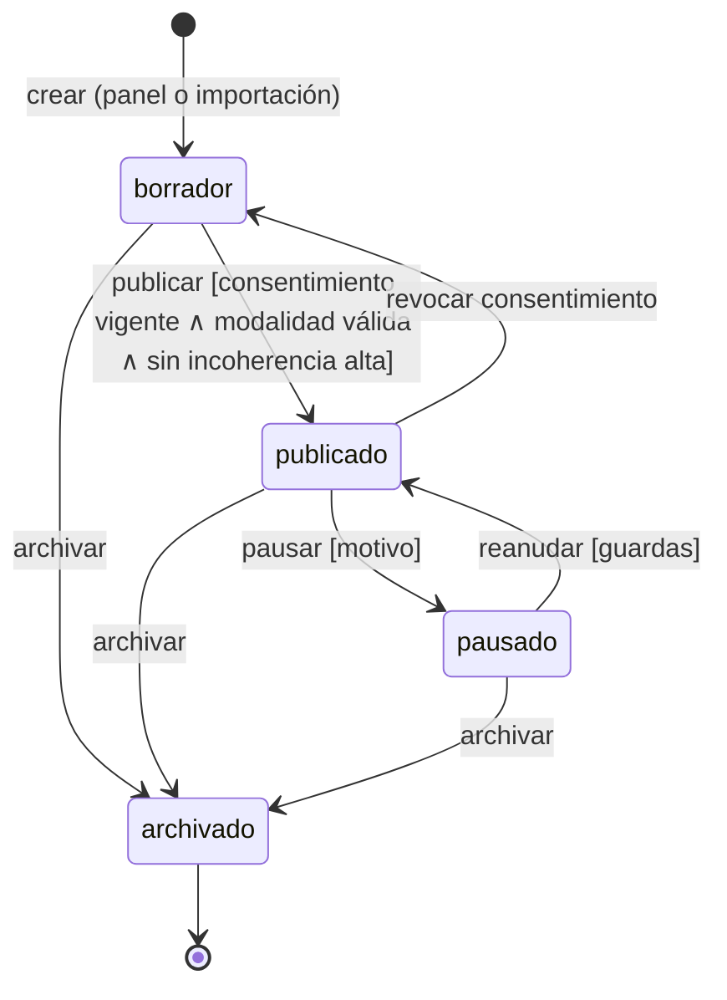
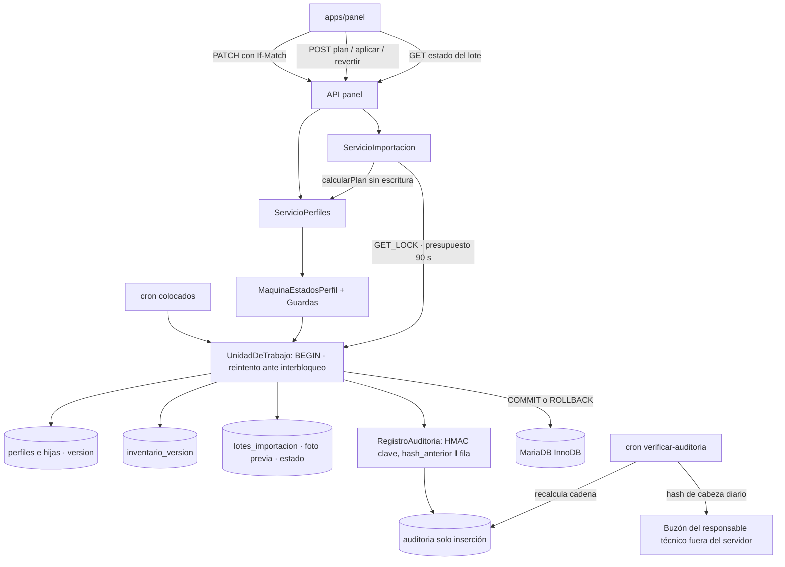
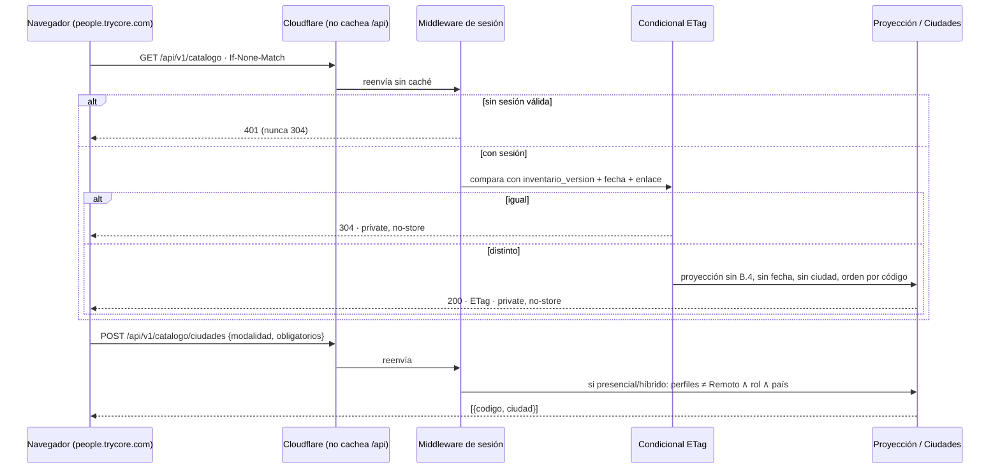

# ADR 0003 — Datos, persistencia, auditoría e importación

> Plantilla alineada al método **ADD** (Attribute-Driven Design, Len Bass — *Software Architecture in
> Practice*). Cada sección numerada corresponde a un paso del método. Las decisiones deben trazar a
> [0000-drivers-y-asrs.md](0000-drivers-y-asrs.md) y actualizar
> [_backlog-arquitectonico.md](_backlog-arquitectonico.md). Generada por la skill `setup-architecture`
> (`/build:architect`); un humano la promueve `proposed → accepted`.
>
> **Revisión tras ATAM-lite adversarial (2026-09-25):** se incorporan la decisión de ciudades en
> servidor, el bloqueo y presupuesto de tiempo de la importación, la auditoría con HMAC y ancla externa
> diaria, las reglas de `version` y de ETag, y la consecuencia explícita de perder el servidor.

## 1. Objetivo de la iteración y drivers seleccionados (Pasos 2–3)

- **Objetivo de la iteración:** fijar el modelo de datos del inventario, la única vía de escritura de
  perfiles, cómo se audita cada cambio, cómo se importa y revierte en bloque, cómo se proyecta el
  catálogo que ve el cliente y cómo se recupera el sistema tras una pérdida.
- **Elemento(s) a refinar:** `server/src/Dominio` (perfil, consentimiento, catálogos),
  `server/src/Aplicacion` (perfiles, importación, catálogo, auditoría), `server/src/Adapters/Persistencia`,
  `server/db/migrations` y `server/cron`.
- **Drivers abordados:**
  - Funcionales: UC-4 (catálogo recortado solo con sesión), UC-10 (ciclo de vida del perfil y
    consentimiento), UC-11 (importación y reversión), UC-12 (auditoría por campo), UC-13 (catálogos y
    léxico), UC-14 (colocados y evidencia).
  - Atributos de calidad: QA-5 (0 campos B.4, 0 fechas, 0 ciudades fuera de contexto, 0 publicados sin
    consentimiento), QA-9 (todo o nada; P95 ≤ 30 s con 200 filas), QA-10 (reversión con diff = 0),
    QA-11 (1:1 mutación ↔ entrada; evidencia de manipulación), QA-12 (pérdida ≤ 24 h, restauración
    ≤ 4 h), QA-17 (0 omitidos en silencio; banda contra la fecha del día), QA-20 (sin despliegue; fusión
    en una transacción).
  - Restricciones: CON-2 (180 s, 512 MB, 64 MB de subida), CON-9 (el portal solo lee), CON-11 (sin
    borrado físico; la importación no publica ni concede consentimiento), CON-15 (Cloudflare delante),
    CON-16 (JetBackup en el mismo servidor).
  - Concerns: CRN-9 (pérdida del servidor), CRN-14 (nivel 0 de validación contradictorio), CRN-15
    (concurrencia entre administradoras). CRN-10 (retención) se trata como propuesta.

## 2. Conceptos de diseño elegidos (Paso 4)

| Driver | Concepto / Táctica | Alternativas descartadas | Razón |
|--------|--------------------|--------------------------|-------|
| CON-9, QA-20 | **MariaDB 10.6 InnoDB**, `utf8mb4_unicode_ci`, **una BD con dos esquemas lógicos** (identidad y operación / inventario) separados por prefijo y por repositorio | Dos bases de datos; SQLite; archivos JSON | cPanel otorga privilegios por BD, no por tabla, así que dos BD no aíslan más. InnoDB da transacciones y FK que la importación y la fusión necesitan |
| Todos | **Migraciones SQL versionadas** en `server/db/migrations` con runner propio mínimo y tabla `schema_migraciones` | Doctrine Migrations / Phinx | Sin ORM (ADR-0001); un runner de ~100 líneas evita una dependencia para aplicar ficheros en orden |
| UC-10, QA-5, CON-11 | **Máquina de estados del perfil en el dominio** (`borrador · publicado · pausado · archivado`) como única vía de escritura para panel, importación, reversión y fusión; guardas de publicación | Validar en cada controlador; restricciones solo en BD | Un único punto hace imposible publicar por una vía que olvidó la guarda. Las reglas (consentimiento vigente, modalidad) cruzan tablas y no caben en un `CHECK` |
| QA-5 | **Invariante verificable por consulta** (0 publicados sin consentimiento vigente) en CI y en el Release Gate | Confiar en la guarda | Defensa en profundidad: detecta datos corruptos por restauración o SQL manual |
| CRN-15 | **Concurrencia optimista** con columna `version` en `perfiles`, que **sube en toda escritura del perfil o de sus tablas hijas** (roles, tecnologías, sectores, consentimientos), en todo cambio de consentimiento y en toda fusión de catálogo que lo reasigne; 409 si cambió. **Reintento acotado ante interbloqueo** (deadlock) en la unidad de trabajo | Bloqueo pesimista; «gana el último»; `version` solo en la fila principal | Dos administradoras rara vez chocan; el bloqueo deja registros tomados si se cierra la pestaña. Si la versión no cubriera las hijas, una edición de roles pisaría otra sin 409 |
| QA-11, UC-12 | **Auditoría de solo inserción en la misma transacción** que la mutación + **cadena HMAC** (`hash = HMAC-SHA256(clave_auditoria, hash_anterior ‖ contenido)`) con clave en `config.php`, **distinta de las credenciales de BD** + **ancla externa diaria obligatoria** (correo al responsable técnico con el hash de cabeza) + trigger que rechaza `UPDATE/DELETE` si el hosting lo permite (*a verificar*) | Hash simple sin clave; trigger como única fuente; log en fichero; tabla con `UPDATE` permitido | En cPanel no se puede quitar `UPDATE/DELETE` por tabla al usuario de la aplicación. Un hash sin clave lo recalcula cualquiera con la credencial de BD; con HMAC hace falta además la clave del fichero. El ancla fuera del servidor detecta incluso a quien tenga ambas. Escribir desde el servicio garantiza autor y origen, que un trigger no conoce |
| UC-4, QA-5, QA-17 | **Proyección del catálogo en servidor por sesión** desde la BD, con **ETag por versión global del inventario**; el 304 se emite **solo después del middleware de sesión**; `Cache-Control: private, no-store` para que Cloudflare no guarde nada | JSON estático generado en la carpeta privada; filtrar en el navegador; caché de Cloudflare con clave por cookie | La banda de disponibilidad depende de la fecha del día y el enlace pide el estado real de cada perfil; un estático caducaría. Filtrar en el cliente enviaría campos prohibidos. Un 304 antes de la sesión confirmaría a un tercero que su ETag sigue vigente |
| UC-4, QA-5, CON-10 | **Ciudades decididas por el servidor**: recibe la modalidad de la necesidad y los criterios obligatorios, aplica en PHP la parte mínima del filtro (modalidad del perfil ≠ Remoto y obligatorios de rol y país) y devuelve solo esas ciudades; **nunca por ids elegidos por el cliente** | `GET /ciudades?ids=…` con ids del navegador; ciudad en el catálogo general; reimplementar el motor completo en PHP | Con ids del cliente, cualquiera con sesión pediría la ciudad de todo el banco. Reimplementar el motor entero en PHP duplicaría D-14 y rompería la regla de un motor único. La parte mínima basta para respetar «ciudad solo en presencial/híbrido» |
| QA-9, QA-10 | **Importación en dos fases**: `calcularPlan` (sin escritura) y `aplicarPlan` (una transacción), con `lote_importacion` y **foto previa JSON** por perfil tocado; **`GET_LOCK` exclusivo** para aplicar y revertir; **presupuesto de 90 s** por petición; **endpoint de estado del lote** | Importar fila a fila con commit; cola asíncrona; sin bloqueo | Todo o nada es requisito; la foto permite revertir con diff = 0. Con ≤ 200 filas la vía síncrona evita depender del cron (*a validar*). Cloudflare corta la conexión a los 100 s aunque PHP permita 180 s: el presupuesto de 90 s y el estado consultable evitan que la administradora quede sin saber si se aplicó |
| QA-20, UC-13 | **Catálogos con `activo` y fusión transaccional**; el léxico apunta solo a IDs de catálogo (FK) | Borrado de valores; léxico por texto libre | CON-11 prohíbe borrar. La FK impide entradas de léxico hacia valores inexistentes |
| UC-14, QA-5 | **Evidencia en carpeta privada** `~/portal-privado/evidencia/<hash>` servida por el panel (`people-panel.trycore.com`) tras autorización | Carpeta dentro de `public_html`; almacenamiento externo (S3) | 0 URL públicas (QA-5); S3 añade proveedor y secreto sin necesidad |
| QA-12, CRN-9 | **JetBackup diario + exportación semanal cifrada del banco a Google Drive de Trycore** (en v1, procedimiento manual del responsable técnico: descarga el export cifrado y lo carga a Drive; sin integración nueva) + restauración de prueba. Objetivo aceptado: **RPO 24 h / RTO 4 h** (revisión única 2026-09-25). **Perder el servidor entero = hasta 7 días de pérdida**, consentimientos incluidos | Réplica en otro servidor; exportación diaria automática a Drive | Coste y operación fuera de alcance del hosting compartido; riesgo aceptado en §10.3. El RPO de 24 h lo cubre JetBackup; ante pérdida total del servidor manda la exportación semanal |
| CRN-11, UC-14 | **Borrador de evidencia de colocado (HU-140) por plantilla determinista, sin IA** (decisión del sponsor, 2026-09-25): precarga desde la modalidad de prueba del catálogo y extrae fecha y resultado con patrones; ningún dato sale del servidor; una persona confirma el resultado antes de guardarlo | Ampliar D-24 para usar Gemini con saneamiento; diferir HU-140 | D-24 y CON-8 impiden enviar datos de perfiles a un modelo; los patrones son explicables y testeables; diferir exige acuerdo del equipo |
| CRN-12 | **«Mi equipo» por invitado en servidor** (`equipos`, `equipo_perfiles`), ligado al invitado verificado y al enlace (detalle en ADR-0004) | En la URL por dispositivo | Decisión del sponsor (2026-09-25): continuidad entre dispositivos y equipo completo en la solicitud |

## 3. Instanciación: responsabilidades e interfaces (Paso 5)

- **Elementos instanciados:**
  - `Dominio/Perfil/Perfil` + `MaquinaEstadosPerfil` + `GuardasPublicacion`.
  - `Dominio/Consentimiento`, `Dominio/Catalogo`, `Dominio/Lexico`.
  - `Aplicacion/Perfiles/ServicioPerfiles`, `Aplicacion/Importacion/ServicioImportacion`,
    `Aplicacion/Catalogo/ServicioProyeccionCatalogo`, `Aplicacion/Catalogo/ServicioCiudades`,
    `Aplicacion/Catalogos/ServicioCatalogos`, `Aplicacion/Auditoria/RegistroAuditoria`,
    `Aplicacion/Auditoria/AnclaAuditoria`, `Aplicacion/Evidencia/ServicioEvidencia`,
    `Aplicacion/Colocados/ServicioColocados`, `Aplicacion/Exportacion/ServicioExportacion`.
  - `Adapters/Persistencia/*` (repositorios PDO, `UnidadDeTrabajo` que abre y cierra la transacción
    y reintenta ante interbloqueo), `Adapters/Http/MiddlewareSesion`, `Adapters/Http/CondicionalEtag`.
  - `cron/verificar-auditoria.php` (verifica la cadena y envía el ancla), `cron/sincronizar-colocados.php`,
    `cron/exportar-banco.php`.
- **Entidades principales:**

| Tabla | Campos clave | Notas |
|-------|--------------|-------|
| `perfiles` | codigo (único), estado, familia_id, modalidad_id, pais_id, ciudad_id, disponibilidad_fecha, disponibilidad_actualizada_en, motivo_pausa_id, version | Sin borrado físico; `archivado` es el final. `version` cubre también las tablas hijas |
| `perfil_roles`, `perfil_tecnologias`, `perfil_sectores` | perfil_id, valor_id, orden | Toda escritura sube `perfiles.version` en la misma transacción |
| `catalogo_*` | roles, familias, modalidades (texto_cliente), tecnologias, sectores, motivos_pausa, paises, ciudades; `activo`, `fusionado_en_id` | Dependencia rol → familia → modalidades |
| `consentimientos` | perfil_id, alcance, evidencia_id, vigente, otorgado_en, revocado_en | Nominal; revocar despublica; todo cambio sube `perfiles.version` |
| `inventario_version` | fila única: valor, actualizado_en | Versión global; la sube **toda** vía de escritura |
| `lexico`, `propuestas_lexico` | termino, catalogo_tipo, catalogo_id (FK); propuesta con estado `pendiente|aprobada|rechazada` | Gemini propone, persona aprueba (D-24) |
| `enlaces` y anexas | ver ADR-0002 | |
| `solicitudes`, `trabajos` | ver ADR-0005 | |
| `eventos` | ver ADR-0006 | |
| `colocados` | codigo_perfil, cuenta, fecha_corte | Espejo de solo lectura |
| `equipos` | id, invitado_id (correo verificado), enlace_id, creado_en, actualizado_en; único (invitado_id, enlace_id) | «Mi equipo» (CRN-12): cada invitado ve solo el suyo; se copia completo a la solicitud |
| `equipo_perfiles` | equipo_id, codigo_perfil, orden, agregado_en | Solo perfiles publicables del enlace |
| `borradores_evidencia` | colocado_id, modalidad_prueba_id, fecha_extraida, resultado_extraido, texto_plantilla, confirmado_por, confirmado_en | HU-140 (CRN-11): plantilla determinista; no vale como evidencia hasta que una persona lo confirma |
| `artefactos` | hash_sha256, ruta_privada, tipo, tamano, perfil_id | Nunca URL pública |
| `lotes_importacion` | id, archivo_hash, modo, estado (`calculado|aplicando|aplicado|abortado|revertido`), iniciado_en, terminado_en, filas_aplicadas, error, aplicado_por, foto_previa JSON por perfil | Solo el último aplicado es reversible |
| `auditoria` | id, actor, entidad, entidad_id, campo, antes, despues, origen, cuando, hash_anterior, hash (HMAC) | Solo inserción; índice por (entidad, entidad_id) |
| `anclas_auditoria` | fecha, ultimo_id, hash_cabeza, total_filas, enviado_a, enviado_en | Registro local de lo enviado; la copia que vale es la del buzón |

- **Responsabilidades clave:**
  - **Máquina de estados:** transiciones `borrador→publicado` (guardas: consentimiento nominal vigente,
    modalidad válida para la familia, sin incoherencias de severidad alta), `publicado→pausado`
    (exige motivo), `pausado→publicado`, `*→archivado`. Revocar consentimiento fuerza
    `publicado→borrador`. La regla de modalidad obligatoria depende de CRN-14.
  - **Versión y concurrencia:** `perfiles.version` sube en cada escritura del perfil, de sus tablas
    hijas, de su consentimiento y en cada fusión que reasigne alguno de sus valores. El panel envía
    `If-Match: <version>`; si no coincide, 409 con los campos que cambiaron. `inventario_version` sube
    en la misma transacción que cualquier escritura que cambie lo que el cliente puede ver: panel,
    importación, reversión, fusión y catálogos, revocación de consentimiento y **cron de colocados**.
    La `UnidadDeTrabajo` reintenta hasta 3 veces, con espera corta y aleatoria, cuando MariaDB devuelve
    interbloqueo (1213) o espera de bloqueo agotada (1205); al tercer fallo responde 503 sin escribir
    nada. Los bloqueos se toman siempre en el mismo orden (perfil → hijas → versión global →
    auditoría) para reducir interbloqueos.
  - **Auditoría:** `RegistroAuditoria::registrar()` solo se invoca dentro de la `UnidadDeTrabajo`; una
    fila por campo cambiado; `origen ∈ {panel, importacion, reversion, sincronizacion, fusion,
    revocacion}`. La cadena se encadena con `SELECT … FOR UPDATE` sobre la última fila para
    serializar. `hash = HMAC-SHA256(clave_auditoria, hash_anterior ‖ contenido canónico)`; la clave
    vive en `config.php` fuera de `public_html`, es distinta de la contraseña de BD y de los demás
    secretos, y no se guarda en la BD ni en las exportaciones. Si el hosting permite triggers, se
    añade uno que rechace `UPDATE/DELETE` sobre `auditoria` (*a verificar* en el servidor antes de
    EP-006).
  - **Ancla externa (obligatoria):** el cron diario verifica la cadena completa y envía por correo al
    responsable técnico (buzón en Google Workspace, fuera del servidor) la fecha, el último id, el
    total de filas y el hash de cabeza. Si la verificación falla, el correo lo dice en el asunto. Si el
    correo no sale dos días seguidos, lo detecta la vigilancia de tareas (ADR-0005, QA-13). Para
    verificar tras un incidente se recalcula la cadena y se compara con los hashes de cabeza del buzón.
  - **Proyección (UC-4):** `ServicioProyeccionCatalogo::paraSesion(enlace)` devuelve solo publicados,
    sin campos del Anexo B.4, con `banda_disponibilidad` calculada con `Reloj` (fecha vencida > 30
    días → «Por confirmar»), sin ciudad. El orden de la respuesta es por código (o por un criterio que
    no dependa de la fecha); nunca por `disponibilidad_fecha`, para que el orden no revele la fecha.
    Para cada código del enlace curado informa el estado real (`disponible | colocado | pausado |
    fuera_del_banco`).
  - **ETag y caché:** ETag = `inventario_version` + fecha del día + enlace. Orden en la petición:
    primero el middleware de sesión (sin sesión válida → 401, nunca 304); después la comparación de
    `If-None-Match`. Todas las respuestas del catálogo y de ciudades llevan `Cache-Control: private,
    no-store` y `Vary: Cookie`; Cloudflare tiene una regla de no cachear `/api/*`. Como `no-store`
    impide que el navegador guarde la respuesta, el portal conserva en memoria el último cuerpo y su
    ETag y envía `If-None-Match` a mano con `fetch`; un 304 le ahorra descargar y analizar el catálogo.
  - **Ciudades (UC-4, CON-10):** `ServicioCiudades::paraNecesidad(sesion, modalidad_necesidad,
    obligatorios)`. Si la modalidad de la necesidad no es presencial ni híbrida, devuelve lista vacía.
    Si lo es, toma los perfiles publicados del conjunto de la sesión, descarta los de modalidad Remoto,
    aplica solo los obligatorios de rol y de país y devuelve `{codigo, ciudad}` de los que quedan. El
    cliente no puede pedir ciudades por código. El resto de criterios los sigue aplicando el motor del
    navegador (ADR-0004), así que el servidor puede devolver la ciudad de algunos perfiles que el
    navegador luego no muestra; cuánta precisión exigir es un trade-off de negocio abierto (§6).
  - **Importación:** `calcularPlan(archivo, modo)` → vista previa por fila (crear, actualizar, sin
    cambios, error); `aplicarPlan(plan)` toma `GET_LOCK('importacion', 0)`: si otra aplicación o
    reversión está en curso, responde 423 al momento sin esperar. Con el bloqueo, marca el lote
    `aplicando`, activa `ignore_user_abort(true)` y aplica en una transacción que revalida `version`.
    Presupuesto de 90 s de reloj (Cloudflare corta a 100 s): si se agota, `ROLLBACK`, lote `abortado`
    con motivo, y la administradora ve «no se aplicó nada, divide el archivo». `GET
    /importaciones/{id}/estado` devuelve estado, filas aplicadas y error, para que la pantalla lo
    consulte si la conexión se corta. Límite de 200 filas por archivo (*a validar* contra el
    presupuesto); idempotente; nunca cambia estado a `publicado` ni crea consentimiento.
    `revertir(lote)` usa el mismo bloqueo y presupuesto, solo sobre el último lote aplicado: restaura
    la foto de los actualizados, archiva los creados y aborta si algún perfil tiene `version` posterior
    al lote, listando conflictos.
  - **Catálogos:** `fusionar(origen, destino)` muestra antes el recuento de referencias y luego las
    reasigna en una transacción, sube `version` de cada perfil afectado y la versión global, deja
    `origen.activo=false` y `fusionado_en_id=destino`.
  - **Colocados:** cron diario o importación del archivo del sistema de asignación; pasa por la misma
    unidad de trabajo (auditoría con origen `sincronizacion`, sube la versión global); muestra
    `fecha_corte` en el panel.
  - **Recuperabilidad:** JetBackup diario (mismo servidor, CRN-9 aceptado); exportación JSON/CSV del
    banco semanal (RF-8.15.9) copiada fuera del servidor; restauración de prueba antes de producción.
    **Si se pierde el servidor, se pierde hasta 7 días de trabajo** (lo hecho desde la última
    exportación), **consentimientos incluidos**: la reconstrucción desde exportación no restituye
    consentimientos vigentes, así que todos los perfiles quedan en `borrador` hasta que Talento Humano
    vuelva a registrar cada consentimiento con su evidencia. La cola de solicitudes, la auditoría y los
    artefactos de evidencia de esa ventana también se pierden.
  - **Borrador de evidencia (HU-140, CRN-11):** `ServicioBorradorEvidencia` arma el texto desde una
    plantilla por modalidad de prueba del catálogo y extrae fecha y resultado del material de entrada
    con patrones (regex de fecha y de resultado sobre un vocabulario cerrado). Si un patrón no
    encuentra valor, el campo queda vacío para que la persona lo complete. No llama a ningún servicio
    externo. Guardarlo exige confirmación nominal (queda en la auditoría).
  - **Retención (propuesta, CRN-10, a validar):** consentimientos revocados y su evidencia se
    conservan 5 años como prueba y luego se anonimizan; `intentos` y códigos se purgan a los 30 días;
    auditoría se conserva mientras exista el perfil más 5 años.
- **Interfaces / contratos:**
  - Portal (`people.trycore.com`): `GET /api/v1/catalogo` (ETag, 304 solo con sesión válida,
    `Cache-Control: private, no-store`); `POST /api/v1/catalogo/ciudades` con cuerpo
    `{modalidad_necesidad, obligatorios: {roles[], pais}}` → `[{codigo, ciudad}]`. Es `POST` por el
    tamaño del cuerpo, pero no escribe nada (CON-9).
  - Panel (`people-panel.trycore.com`): `PATCH /perfiles/{codigo}` con `If-Match: <version>` → 200 |
    409; `POST /perfiles/{codigo}/transicion`; `POST /importaciones/plan`; `POST
    /importaciones/{id}/aplicar` → 200 | 409 | 423; `GET /importaciones/{id}/estado`; `POST
    /importaciones/{id}/revertir`; `POST /catalogos/{tipo}/{id}/fusionar`; `GET /auditoria`; `GET
    /evidencia/{id}` (autorizado); `GET /exportacion`.
  - Staging: los mismos contratos en `people-staging.trycore.com` y `people-panel-staging.trycore.com`,
    con su propia clave de auditoría y su propio destinatario del ancla.

## 4. Vistas y registro de la decisión (Paso 6)

Máquina de estados del perfil:

Escritura con auditoría encadenada, versión e importación en dos fases:

Lectura del catálogo y de ciudades por el cliente:

**Decisión:** MariaDB única con esquemas lógicos y migraciones propias; toda escritura de perfiles pasa
por la máquina de estados del dominio dentro de una unidad de trabajo que también escribe la auditoría
encadenada con HMAC, sube la versión del perfil y la versión global, y reintenta ante interbloqueo; la
cadena se ancla a diario fuera del servidor por correo; el catálogo del cliente es una proyección
calculada por sesión, sin caché compartida y con 304 solo tras validar la sesión; las ciudades las
decide el servidor con la parte mínima del filtro; la importación separa plan y aplicación, se
serializa con `GET_LOCK`, cabe en 90 s, expone su estado y es reversible solo en su último lote;
evidencia en carpeta privada; respaldo diario más exportación semanal fuera del servidor, con la
pérdida de hasta 7 días declarada.

**Trade-offs aceptados:**
- La cadena serializa las escrituras de auditoría (bloqueo sobre la última fila); con el volumen de
  Talento Humano es aceptable, y el reintento cubre los interbloqueos ocasionales.
- La cadena detecta manipulación, no la impide. Con HMAC, la credencial de BD sola no basta para
  reescribirla; quien tenga además el fichero de configuración sí puede, pero no puede cambiar los
  hashes de cabeza que ya llegaron al buzón. Queda una ventana de hasta 24 h (desde el último ancla).
- Proyectar por sesión cuesta CPU en cada carga; el ETag lo reduce a una consulta de versión, pero
  como Cloudflare no cachea, todo el tráfico del catálogo llega al hosting.
- El filtro mínimo de ciudades devuelve un superconjunto de lo que el navegador mostrará.
- Una sola importación a la vez y archivos acotados por el presupuesto de 90 s.
- Revertir solo el último lote simplifica el modelo a costa de no poder deshacer uno anterior.

## 5. Análisis del diseño (Paso 7)

> Tras la evaluación ATAM-lite adversarial. ✅ solo cuando hay medida o un plan de verificación
> concreto; ⚠️ cuando depende de algo sin medir o sin decidir; ❌ cuando no se resuelve aquí.

| Driver | ✅/⚠️/❌ | Evidencia / medida | Riesgo residual |
|--------|---------|--------------------|-----------------|
| UC-4 | ⚠️ | Proyección por sesión sin B.4 ni fecha; ciudades decididas en servidor por modalidad y obligatorios de rol/país; estado real por código del enlace. Plan: test de contrato del payload (campos permitidos, orden por código, 401 sin sesión) | Precisión del filtro de ciudades sin decidir: el servidor puede revelar la ciudad de perfiles que el navegador no mostrará |
| UC-10 | ⚠️ | Máquina de estados única con guardas; revocar despublica y sube `version` | Guarda de modalidad depende de CRN-14, sin resolver en discovery |
| UC-11 | ✅ | Plan/aplicación, lote con foto, reversión del último, idempotencia. Plan: test de dos aplicaciones simultáneas (la segunda recibe 423); test de corte de conexión a los 100 s con consulta de estado; reimportar el mismo archivo → 100 % «sin cambios» | Límite de 200 filas aún no confirmado contra el presupuesto de 90 s (ver QA-9) |
| UC-12 | ✅ | Una fila por campo, origen tipado, misma transacción, índice por entidad. Plan: batería 1:1 mutación ↔ entrada por cada origen, incluido el cron de colocados | — |
| UC-13 | ✅ | `activo`, fusión transaccional que sube versiones, léxico con FK, propuestas con estado. Plan: test de fusión con recuento previo = reasignados | — |
| UC-14 | ⚠️ | Espejo con `fecha_corte` por la unidad de trabajo; evidencia privada servida tras autorización | `post_max_size` = 64 MB deja el límite real de archivo algo por debajo de 64 MB; ModSecurity sin probar con subidas grandes. Plan: subir un artefacto de 60 MB en staging |
| QA-5 | ✅ | Proyección sin B.4, sin fecha y orden neutro; ciudad solo si la necesidad es presencial/híbrida y el perfil no es Remoto; 401 antes de cualquier 304; `private, no-store`; invariante de consentimiento por consulta en CI y Release Gate. Plan: test de contrato de campos, de orden (dos fechas distintas no cambian el orden) y de cabeceras; prueba en staging de que Cloudflare no devuelve `cf-cache-status: HIT` en `/api/*` | Superconjunto de ciudades dentro del contexto presencial/híbrido (ver UC-4) |
| QA-9 | ⚠️ | Transacción única; vista previa sin escritura; `GET_LOCK`; presupuesto de 90 s con `ROLLBACK`; estado del lote consultable | P95 ≤ 30 s con 200 filas sin medir en el hosting; el corte de Cloudflare a 100 s es la cota real, no los 180 s de PHP. Plan: medir en staging con archivo de 200 filas reales |
| QA-10 | ✅ | Foto previa, archivado de creados, detección de conflictos por `version` (que ahora cubre hijas y consentimiento). Plan: test diff = 0 tras revertir; test de rechazo al revertir un lote que no es el último | ≤ 30 s sin medir (mismo plan que QA-9) |
| QA-11 | ⚠️ | Solo inserción en la transacción; cadena HMAC con clave separada de la BD; ancla diaria por correo obligatoria; cron de verificación. Plan: test que altera una fila y comprueba que la verificación falla; test que reescribe la cadena sin la clave y falla | Trigger de solo-inserción sin verificar en el hosting; quien comprometa BD y fichero puede reescribir hasta 24 h sin detección; el ancla depende de que el correo salga (vigilado por QA-13) |
| QA-12 | ⚠️ | JetBackup diario cubre fallo de BD y error humano (pérdida ≤ 24 h); exportación semanal fuera del servidor; restauración de prueba antes de producción | Restauración ≤ 4 h no ensayada. Perder el servidor = hasta 7 días de pérdida, consentimientos incluidos (todos los perfiles a `borrador`). Destino de la exportación y RPO/RTO sin decidir |
| QA-17 | ✅ | Banda con `Reloj` contra la fecha del día; «Por confirmar» > 30 días; fecha del día en el ETag; estados explícitos por código. Plan: tests con reloj simulado al cruzar medianoche y a 31 días | — |
| QA-20 | ✅ | Catálogos editables en panel; toda escritura sube la versión global, así que el ETag cambia y el portal los ve en la siguiente carga. Plan: test de que cada vía de escritura (incluido el cron de colocados) sube `inventario_version` | — |
| CON-2 | ⚠️ | Presupuesto de 90 s por debajo de 180 s y del corte de 100 s de Cloudflare | Memoria con 200 filas y foto previa JSON sin medir contra 512 MB |
| CON-9 | ✅ | El portal solo tiene lecturas; `POST /ciudades` no escribe. Plan: test que recorre las rutas del portal y verifica 0 escrituras en BD | — |
| CON-11 | ✅ | Sin `DELETE` en repositorios de perfiles ni catálogos; importación sin publicar ni conceder consentimiento. Plan: grep en CI de `DELETE` en esos repositorios | — |
| CON-15 | ✅ | `private, no-store`, `Vary: Cookie` y regla de Cloudflare de no cachear `/api/*`; presupuesto por debajo de los 100 s. Plan: prueba en staging de cabeceras y `cf-cache-status` | — |
| CON-16 | ✅ | JetBackup diario asumido; restauración de prueba planificada | — |
| CRN-9 | ⚠️ | Consecuencia declarada con cifra (hasta 7 días, consentimientos incluidos); exportación fuera del servidor | Consentimientos no reconstruibles desde exportación; destino de la exportación sin decidir |
| CRN-10 | ⚠️ | Retención propuesta (5 años consentimientos y auditoría, 30 días intentos) | Propuesta sin validar legalmente |
| CRN-11 | ✅ | Plantilla determinista sin IA; plan: unitarios de extracción por patrón (fechas en formatos locales, resultados del vocabulario, campo vacío si no hay coincidencia), test de contrato de 0 llamadas salientes y test de que sin confirmación no se guarda como evidencia | Divergencia con el texto actual de HU-140, a reflejar por discovery |
| CRN-12 | ✅ | `equipos`/`equipo_perfiles` con único (invitado, enlace); plan en ADR-0004 | — |
| CRN-14 | ❌ | No se resuelve aquí | Devuelto a discovery |
| CRN-15 | ✅ | `If-Match` + `version` que sube en hijas, consentimiento y fusión; 409; reintento ante interbloqueo. Plan: test de dos ediciones concurrentes, una sobre roles y otra sobre el perfil (la segunda recibe 409); test de interbloqueo inyectado que termina en éxito o 503 sin escritura parcial | — |

**Drivers no resueltos en esta iteración:** CRN-14 (modalidad obligatoria para publicar, a corregir en
discovery); CRN-10 (retención: propuesta sin validar); verificaciones pendientes en el hosting
(permiso de triggers, tiempo y memoria de importación, subida de artefactos grandes) para QA-9,
QA-11, UC-14 y CON-2; las decisiones de negocio de UC-4 y QA-12 quedaron tomadas en la revisión única (§6).

## 6. Consecuencias

- **Positivas:**
  - Una sola vía de escritura hace auditable y verificable el 100 % de las mutaciones, incluidas las
    del cron de colocados.
  - El cliente nunca recibe campos prohibidos ni la ciudad de un perfil remoto, porque la decisión
    se toma en el servidor; ni Cloudflare ni un tercero sin sesión pueden obtener el catálogo.
  - Importar es seguro de repetir y de deshacer, no puede solaparse y nunca deja a la administradora
    sin saber si se aplicó.
  - Manipular la auditoría exige la BD, el fichero de configuración y además no deja rastro en el
    buzón externo, que ya tiene los hashes anteriores.
  - Ninguna edición se pisa en silencio: la versión cubre todo lo que forma el perfil.
- **Negativas:**
  - SQL a mano en repositorios exige disciplina de pruebas.
  - Sin caché en Cloudflare, cada carga del catálogo llega al hosting compartido.
  - Una importación a la vez y archivos limitados por el presupuesto de 90 s; los archivos grandes
    hay que dividirlos.
  - El filtro de ciudades en PHP es una segunda implementación parcial de reglas del motor del
    navegador; hay que mantener ambas coherentes (test compartido de casos).
  - La recuperación ante pérdida total del servidor es parcial y lenta: sin consentimientos, todo el
    banco vuelve a `borrador`.
- **Riesgos:**
  - Triggers no permitidos en el hosting: la solo-inserción descansa solo en la cadena HMAC y el ancla.
  - El correo del ancla no sale (SMTP caído, rebote): se detecta por la vigilancia de tareas, pero
    ese día queda sin ancla.
  - Filtración de `config.php` (clave de auditoría y credencial de BD a la vez): reescritura posible
    dentro de la ventana de 24 h.
  - Tiempo de importación de 200 filas por encima de 90 s en el hosting real: habría que bajar el
    límite de filas.
  - Interbloqueos más frecuentes de lo previsto si coinciden importación, panel y cron de colocados.
- **Trade-offs de negocio abiertos (decide el equipo, no la arquitectura):**
  - **Destinatario del ancla diaria:** qué persona o buzón es el «responsable técnico» y cuánto tiempo
    conserva esos correos (debe ser al menos lo que dure la auditoría).
- **Decisiones de la revisión única (sponsor, 2026-09-25):**
  - **CRN-11 (HU-140):** borrador de evidencia por plantilla determinista, sin IA; ningún dato sale
    del servidor; el resultado lo confirma una persona. Discovery debe reflejarlo en HU-140.
  - **CRN-12:** «Mi equipo» por invitado en servidor (`equipos`, `equipo_perfiles`); el Perfil
    Objetivo sigue por dispositivo (D-16).
  - **Ciudad:** solo cuando la necesidad es presencial o híbrida, con el filtro mínimo en servidor
    (se acepta la pequeña exposición extra de R-20).
  - **Exportación y recuperación:** semanal, cifrada, a Google Drive de Trycore; en v1 la hace a mano
    el responsable técnico (descarga el export cifrado y lo carga a Drive), sin integración nueva.
    Objetivo RPO 24 h / RTO 4 h (QA-12). Ante pérdida total del servidor la ventana sigue siendo de
    hasta 7 días (R-8 aceptado).
- **Operacionales:** tres crons diarios (verificar auditoría y enviar ancla, colocados, purga) y uno
  semanal (exportación); ensayo de restauración antes de producción y tras cada cambio de esquema
  mayor; rotar la clave de auditoría exige empezar un nuevo tramo de cadena y anclarlo.

## 7. Trazabilidad

- Drivers: [0000-drivers-y-asrs.md](0000-drivers-y-asrs.md) — UC-4, UC-10, UC-11, UC-12, UC-13,
  UC-14, QA-5, QA-9, QA-10, QA-11, QA-12, QA-17, QA-20, CON-2, CON-9, CON-11, CON-15, CON-16, CRN-9,
  CRN-14, CRN-15 (y CRN-10 como propuesta). Se añaden CON-2 y CON-15 por el presupuesto de 90 s y la
  política de caché.
- PRD / HU / Flows: [portal-people-service.md](../01-prd/portal-people-service.md) RF-3.7, 3.13,
  RF-8.2–8.5, 8.7, 8.9–8.16 (incl. 8.15.7, 8.15.9, 8.16.5), RF-13.5.5.2, RF-14.0, RF-19.2, §8.3,
  §10.3, Anexo B (B.4, B.8, B.9); D-14, D-24; EP-003, EP-006, EP-009 (HU-086–089, HU-125–143);
  [requisitos-tecnicos-hosting.md](../01-prd/requisitos-tecnicos-hosting.md).
- Relacionadas: [ADR-0001](0001-estilo-y-stack-base.md), [ADR-0002](0002-identidad-acceso-y-sesiones.md)
  (middleware de sesión), [ADR-0004](0004-busqueda-determinista-y-estado.md) (motor del navegador y
  filtro de ciudades), [ADR-0005](0005-integraciones-y-trabajo-diferido.md) (solicitudes, trabajos,
  vigilancia de crons y correo del ancla), [ADR-0006](0006-telemetria-y-atribucion.md) (eventos),
  [ADR-0007](0007-entornos-despliegue-y-perimetro.md) (reglas de Cloudflare, respaldo y exportación).
- Stack operacionalizado en: `.claude/config/stack-allowlist.json` — sin dependencias nuevas (PDO,
  `hash_hmac` nativo de PHP, runner de migraciones propio).
