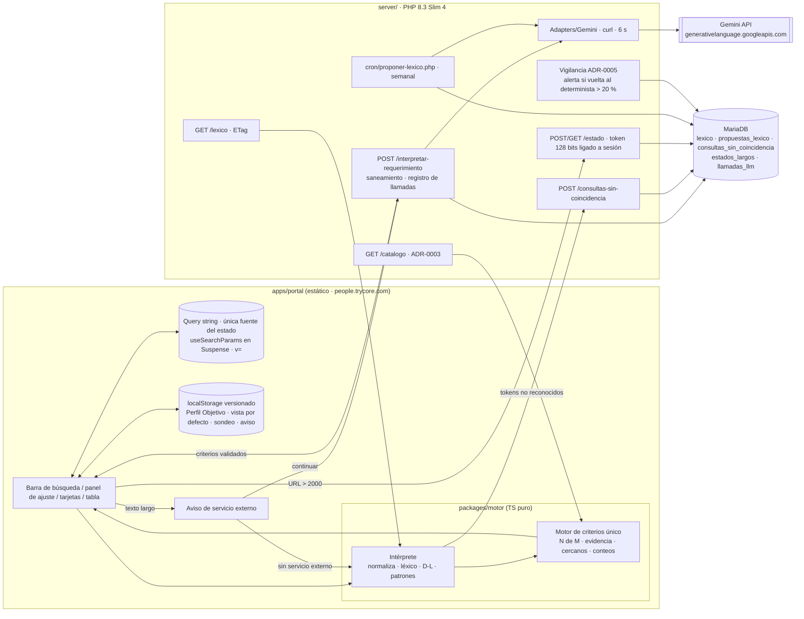
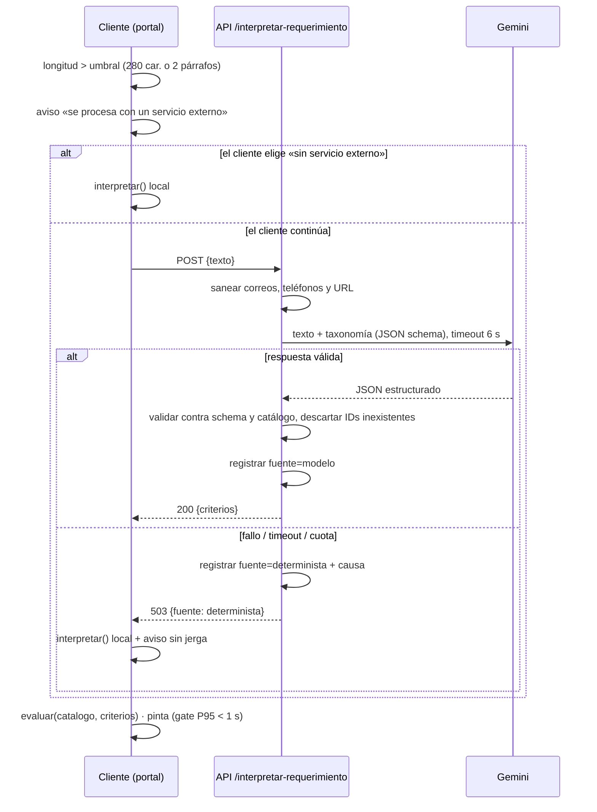

# ADR 0004 — Búsqueda determinista, estado en la URL e interpretación con Gemini

> Plantilla alineada al método **ADD** (Attribute-Driven Design, Len Bass — *Software Architecture in
> Practice*). Cada sección numerada corresponde a un paso del método. Las decisiones deben trazar a
> [0000-drivers-y-asrs.md](0000-drivers-y-asrs.md) y actualizar
> [_backlog-arquitectonico.md](_backlog-arquitectonico.md). Generada por la skill `setup-architecture`
> (`/build:architect`) e incorpora la evaluación adversarial ATAM-lite; un humano la promueve
> `proposed → accepted`.

## 1. Objetivo de la iteración y drivers seleccionados (Pasos 2–3)

- **Objetivo de la iteración:** diseñar la búsqueda del cliente de punta a punta: cómo se interpreta
  lo que escribe (algoritmo propio primero, Gemini solo para requerimientos pegados largos, D-24), cómo
  se calculan resultados, panel y evidencia con un único motor, dónde vive el estado (query string,
  dispositivo, servidor) y cómo se registra la demanda no cubierta, sin cerrar las decisiones
  irreversibles de §13.7. Cada driver de calidad sale de esta iteración con una forma concreta de
  medirlo.
- **Elemento(s) a refinar:** `packages/motor` (intérprete + motor de criterios), `packages/contratos`
  (esquema del Perfil Objetivo y del estado), `apps/portal` (codificador de estado y persistencia local),
  `server/` (endpoint de interpretación, adaptador `Gemini`, cron de propuestas de léxico, token de
  estado largo), todo servido desde `people.trycore.com`; la aprobación de léxico vive en
  `people-panel.trycore.com` (EP-006).
- **Drivers abordados:**
  - Funcionales: UC-5 (motor único e intérprete), UC-6 (estado en la URL y persistencia local),
    UC-8 (camino del cero y registro de demanda), UC-18 (Gemini acotado).
  - Atributos de calidad: QA-1 (P95 < 1 000 ms de la entrada al pintado, contador = resultados en el
    100 %, holgura con 300 perfiles sintéticos), QA-15 (vuelta al determinista ≤ 8 s, 100 % de consultas
    cortas sin modelo, 0 pantallas de error, 0 léxico sin aprobación), QA-16 (100 % de ida y vuelta,
    URL ≤ 2 000 caracteres, parámetros desconocidos sin error).
  - Restricciones: CON-6 (`GEMINI_API_KEY` solo en servidor), CON-8 (Gemini solo en RF-12.2.1 y
    RF-8.12.1, nunca datos de perfiles), CON-13 (estado en la URL es requisito duro), CON-14
    (interpretación separada de recuperación, rol como lista, Perfil Objetivo por dispositivo).
  - Concerns: CRN-6 (salida HTTPS a Gemini, cuota y coste), CRN-12 (dónde vive «Mi equipo»), CRN-16
    (umbrales sin fijar: texto largo y confianza de RF-12.3), CRN-19 (entrada por instrucción
    retirable).

## 2. Conceptos de diseño elegidos (Paso 4)

| Driver | Concepto / Táctica | Alternativas descartadas | Razón |
|--------|--------------------|--------------------------|-------|
| UC-5, QA-1 | **Recuperación en el cliente sobre el catálogo recortado completo** (táctica: *reducir sobrecarga / mantener copias de datos*). El navegador recibe el catálogo (ADR-0003) y calcula todo en memoria | Búsqueda en servidor por cada cambio (PHP + SQL); índice full-text de MariaDB; índice vectorial | Con ~30 perfiles el recálculo local es de microsegundos y evita un viaje de red por toque; RF-2.6.4 excluye índice semántico/vectorial y el hosting no lo soporta (CON-1) |
| QA-1 | **Presupuesto de latencia verificado como gate de CI** (táctica: *monitorizar / probar el rendimiento*): prueba Playwright sobre el build estático, Chromium con la CPU frenada 4× (aproximación a un teléfono de gama media) y un catálogo de **300 perfiles sintéticos**; se mide de la entrada del usuario al pintado y el merge se bloquea si el **P95 ≥ 1 s** | Benchmark solo del motor en Node (no mide el render de React, que es el coste real); medición manual en un teléfono; Lighthouse (no mide interacciones sucesivas) | El riesgo de QA-1 está en el render, no en el cálculo; solo una medida de extremo a extremo con CPU limitada lo detecta antes de producción |
| UC-5 | **Intérprete determinista propio en TypeScript puro**: normalización NFD sin tildes + minúsculas + plurales simples, tokenización, léxico término → IDs de catálogo con coincidencia exacta y difusa Damerau-Levenshtein con umbral por longitud de token, patrones regex (seniority, «8 años», modalidad, país/ciudad) | Librería de búsqueda difusa (Fuse.js, MiniSearch); Gemini para toda consulta; solo facetas sin texto libre | Sin dependencias (inodos, bundle, CON-3); la distancia acotada es explicable y testeable; D-24 fija algoritmo primero; RF-2.6 exige texto libre |
| UC-5, QA-1 | **Un solo motor de criterios** (RF-13.8) para panel de ajuste, tarjetas y tabla: obligatorio/deseable, tecnologías por «cualquiera», «cumple N de M» sin porcentajes, evidencia ✓/– con texto determinista desde el dato, «lo más cercano» = falla exactamente un obligatorio, opciones consecuentes con conteo (RF-13.7) | Lógica separada para panel y resultados; puntaje ponderado o porcentaje de ajuste; justificaciones redactadas por modelo | Un solo cálculo garantiza contador = resultados; el porcentaje oculta qué falla; RF-13.10.1 y RF-16.1 prohíben que un modelo redacte sobre personas |
| CON-14, CRN-19 | **Separación interpretación ↔ recuperación** tras la interfaz `Criterios` (esquema versionado del Perfil Objetivo, `rol` como lista). El intérprete y la entrada por instrucción son módulos retirables | Intérprete que filtra directamente el catálogo; `rol` escalar | RF-16.3/16.4: barata ahora, cara después; D-17 exige poder retirar la instrucción sin tocar ficha, cero ni demanda |
| QA-16, CON-13 | **Estado solo en la query string** (ADR-0001): la URL es la única fuente de verdad del estado de búsqueda (criterios, vista, ámbito, ficha abierta; «Mi equipo» no es estado de búsqueda y vive en servidor, CRN-12). Se lee con `useSearchParams` **dentro de un `<Suspense>`** (exigencia del export estático de Next.js) y se escribe con `router.replace`; parseadores tipados propios en `packages/contratos`; formato legible (`?rol=o:Backend|Frontend`), parámetro `v=` de versión de esquema, parámetros desconocidos ignorados | Estado en memoria/Redux o contexto de React duplicando la URL; estado completo en `localStorage`; base64 del JSON en un solo parámetro; siempre token en servidor | Una sola fuente evita desincronizar URL y pantalla; la URL legible es compartible y requisito duro; base64 no se lee ni degrada por parámetro; siempre-servidor agrega red a cada cambio |
| QA-16, QA-3 | **Desborde a token de estado largo** por encima de 2 000 caracteres (RF-19.8): el servidor guarda el estado y la URL queda `?v=1&s=<token>`. El token es **aleatorio de 128 bits** (`random_bytes(16)`, base64url, 22 caracteres), no derivado del contenido, **ligado a la sesión que lo creó** (guarda sesión y cuenta) y solo se resuelve con una sesión válida de la misma cuenta; en cualquier otro caso responde 404 neutro. Caduca a los 90 días (*a validar*) (tácticas: *limitar la exposición*, *autenticar*) | Token secuencial o hash del estado (adivinable o enumerable); token sin sesión (cualquiera con el enlace ve los criterios de la cuenta); ligar solo a la sesión exacta | 128 bits aleatorios hacen inviable adivinar un token; exigir sesión alinea el token con la puerta de acceso (ADR-0002). Ligarlo solo a la sesión exacta impediría que otro invitado de la misma cuenta abra una URL compartida (QA-16), por eso el alcance es sesión válida + misma cuenta |
| CON-14, UC-6 | **Persistencia local versionada solo para lo que es por dispositivo** (`localStorage` con esquema `v`, migración o descarte): Perfil Objetivo (D-16), vista por defecto cuando la URL no trae `vista`, descarte del sondeo y la elección del aviso de servicio externo. Nunca guarda estado de búsqueda | IndexedDB; cookies; persistencia en servidor por invitado | Volumen mínimo; D-16 fija por dispositivo; una cookie viaja en cada petición sin necesidad; separar preferencia de estado mantiene la regla de la query string |
| CRN-12 | **«Mi equipo» por invitado en servidor** (decisión del sponsor, revisión única 2026-09-25): tablas `equipos`/`equipo_perfiles` (ADR-0003) ligadas al invitado verificado y al enlace; cada invitado ve solo el suyo, lo recupera desde otro dispositivo y viaja completo a la solicitud. El Perfil Objetivo sigue por dispositivo (D-16) | En la URL (`equipo=`), por dispositivo | La identidad ya está verificada (ADR-0002), así que el equipo puede seguir al invitado; en la URL se perdía si el cliente no la conservaba y no sobrevivía al cambio de dispositivo |
| UC-18, QA-15, CON-8 | **Gemini tras el adaptador `Adapters/Gemini`** (frontera `llm-interpreter`), invocado solo si el texto supera un umbral (propuesta: 280 caracteres o 2 párrafos); salida estructurada con JSON schema contra la taxonomía; validación del JSON contra el catálogo (se descartan IDs inexistentes); timeout duro 6 s; ante fallo o demora el cliente aplica el intérprete determinista y avisa sin jerga (tácticas: *degradación*, *timeout*, *validación de entrada*) | Llamada directa desde el navegador; streaming; texto libre del modelo parseado con regex; reintentos síncronos | La llave nunca sale del servidor (CON-6); JSON schema elimina el parseo frágil; sin reintento síncrono se respeta QA-15 |
| UC-18, CRN-6 | **Verificación de la salida y vigilancia de la vuelta al determinista** (tácticas: *condición de entrada*, *monitorizar*): antes de EP-009 se prueba desde el hosting una llamada HTTPS real a `generativelanguage.googleapis.com` (condición de entrada de la épica). En producción cada llamada registra resultado y causa (sin el texto); si la **tasa de vuelta al determinista supera el 20 %** en una ventana de 24 h (mínimo 10 llamadas elegibles) se alerta al responsable técnico | Descubrir en producción que el hosting no sale a Google (hoy solo se ha probado `api.hubapi.com` y `api.anthropic.com`); sin métrica de vuelta al determinista | Si el hosting bloquea la salida, la degradación esconde el fallo: el cliente nunca ve un error y UC-18 queda muerto en silencio. La alerta convierte ese silencio en señal |
| CON-8, CON-10 | **Aviso al cliente antes de enviar el texto pegado** (táctica: *informar al actor*): cuando el texto supera el umbral, antes de llamar a Gemini el portal indica que el texto se procesará con un servicio externo y ofrece dos opciones: «Continuar» o «Interpretar sin servicio externo» (determinista). La elección se recuerda por dispositivo. Además se quitan del texto, antes de enviarlo, correos, teléfonos y URL (saneamiento determinista) | Enviar sin aviso; bloquear toda llamada hasta un consentimiento formal | El cliente puede pegar datos de terceros; avisar antes cumple el deber de información. La base legal de la transferencia internacional queda como trade-off de negocio abierto (§6) |
| CON-8 | **Minimización de datos hacia el modelo**: solo viaja el texto del cliente saneado + la taxonomía, nunca perfiles (RF-16.2); test de contrato sobre el payload saliente | Enviar perfiles para que el modelo «elija»; confiar en revisión manual | RF-16.1: el modelo no recupera ni ve perfiles; un test automatizado hace la regla verificable |
| UC-13, UC-18 | **Propuestas de léxico por cron semanal** con Gemini sobre consultas sin coincidencia (RF-2.6.3) + taxonomía, guardadas como propuestas pendientes de aprobación humana (RF-8.12.1) | Aprendizaje automático sin aprobación; propuestas en línea durante la búsqueda | D-24: nada entra al léxico sin persona; fuera de línea no afecta la latencia |
| UC-8 | **Especificación estructurada completa en la solicitud a medida** (RF-15.1) y **sondeo como tarjeta no-perfil** con reglas (≥ 8 resultados, fuera del curado, una vez por sesión, descarte persistente); voto como trabajo hacia HubSpot (ADR-0005) | Guardar solo el texto libre; sondeo como banner o modal; voto síncrono a HubSpot | RF-15.1 pide la especificación, no el texto; RF-10.1–10.4 fijan el formato; la cola desacopla del CRM |

## 3. Instanciación: responsabilidades e interfaces (Paso 5)

- **Elementos instanciados:**
  - `packages/contratos`: `PerfilObjetivo` (versionado, `v: 1`, `rol: string[]`), `Criterio`
    (`{campo, valores, peso: 'obligatorio'|'deseable', fueraDelBanco: string[]}`), `EstadoBusqueda`,
    parseadores/serializadores de query string, `ResultadoInterpretacion`, esquema JSON de salida para
    Gemini (generado del mismo tipo).
  - `packages/motor/interprete`: `normalizar`, `tokenizar`, `Lexico` (índice exacto + difuso),
    `patrones` (seniority, años, modalidad, geografía), `interpretar()`.
  - `packages/motor/criterios`: `evaluar()`, `opcionesConsecuentes()`, `masCercanos()`, `evidencia()`.
  - `apps/portal`: `useEstadoBusqueda` (envuelve `useSearchParams` + `router.replace`; todo componente
    que lo usa cuelga de un `<Suspense>`), `almacenLocal` (versionado con migraciones, solo
    preferencias), aviso de servicio externo, tarjeta de sondeo, pantalla del cero, flujo de solicitud
    a medida.
  - `server/`: `POST /api/v1/interpretar-requerimiento`, `GET /api/v1/lexico` (ETag),
    `POST /api/v1/estado` y `GET /api/v1/estado/{token}` (estado largo),
    `POST /api/v1/consultas-sin-coincidencia`, `GET /api/v1/equipo` y `PUT /api/v1/equipo` (CRN-12), puerto `InterpreteLlm` con adaptador
    `server/src/Adapters/Gemini`, tablas `estados_largos` y `llamadas_llm`,
    `server/cron/proponer-lexico.php`, `server/bin/verificar-salida-gemini.php`.
  - `e2e/rendimiento-filtrado.spec.ts` (Playwright) y fixture `catalogo-300-sinteticos.json`.
- **Responsabilidades:**
  - El **intérprete** convierte texto → `Criterios` + `confianza` + `tokensNoReconocidos`; nunca filtra.
    Los tokens no reconocidos se envían al servidor como consulta sin coincidencia (RF-2.6.3).
  - El **motor** es función pura `(catalogo, criterios) → {resultados, cercanos, conteoPorOpcion, evidencia}`;
    opciones `fueraDelBanco` no filtran pero se conservan en `criterios` y viajan a la solicitud (RF-13.7.3).
    Mismo motor para panel, tarjetas y tabla.
  - El **codificador de estado** serializa `EstadoBusqueda` ↔ query string; es la única fuente de verdad
    (ningún estado de búsqueda en memoria global ni en `localStorage`); ignora parámetros desconocidos;
    si la longitud supera 2 000 caracteres pide un token al servidor y la URL queda `?v=1&s=<token>`.
  - El **servicio de estado largo** genera el token con `random_bytes(16)` (128 bits, base64url), guarda
    `{token, estado, sesion_id, cuenta_id, creado, caduca}`, limita la creación a 30 tokens por sesión y
    hora (*a validar*), resuelve solo con sesión válida de la misma cuenta y responde 404 neutro en
    cualquier otro caso (token inexistente, caducado, de otra cuenta o sin sesión). Un cron diario borra
    los caducados.
  - El **servicio de «Mi equipo»** (CRN-12) resuelve el equipo por `invitado_id` y `enlace_id` de la
    sesión (nunca por un id que mande el cliente); crea el equipo en la primera adición; responde solo
    el del invitado de la sesión (404 neutro a cualquier otro); solo admite perfiles publicables del
    enlace; al crear la solicitud (ADR-0005) se copia completo a ella.
  - El **almacén local** lee con `v`; si la versión no se reconoce, migra o descarta sin error.
  - El **aviso de servicio externo** se muestra antes de la primera llamada a Gemini del dispositivo
    (o de cada llamada si el cliente no pidió recordarlo); «Interpretar sin servicio externo» aplica
    `interpretar()` local sin llamar al servidor.
  - El **endpoint de interpretación** rechaza textos bajo el umbral (400 → el cliente ya usa el
    determinista), sanea correos, teléfonos y URL, llama a Gemini con `curl` y timeout 6 s, valida la
    respuesta contra el JSON schema y el catálogo, registra en `llamadas_llm` el resultado
    (`modelo` | `determinista`), la causa (`timeout`, `5xx`, `429`, `schema`, `red`) y la latencia (nunca
    el texto), y devuelve `Criterios`; no persiste el texto salvo como consulta sin coincidencia.
  - El **vigilante de la vuelta al determinista** (dentro del cron de vigilancia de ADR-0005) calcula la
    tasa de las últimas 24 h y alerta al responsable técnico si supera el 20 % con al menos 10 llamadas.
  - El **verificador de salida** (`verificar-salida-gemini.php`, ejecutado por SSH en staging y
    producción) hace una llamada real con la llave del entorno y deja resultado, latencia y versión TLS;
    su salida en verde es condición de entrada de EP-009.
  - El **cron de léxico** (semanal) lee consultas sin coincidencia no procesadas, envía lote + taxonomía,
    guarda filas en `propuestas_lexico` con estado `pendiente`; el panel (EP-006) aprueba o descarta.
  - La **prueba de rendimiento** sirve el build estático, carga el fixture de 300 perfiles, frena la CPU
    4× por CDP (`Emulation.setCPUThrottlingRate`), ejecuta 50 interacciones (cambiar criterio, cambiar
    filtro, quitar etiqueta), mide cada una con `performance.mark` en el manejador de la entrada y un
    doble `requestAnimationFrame` tras el commit, comprueba en cada paso que el contador coincide con el
    número de tarjetas y falla si el P95 ≥ 1 000 ms.
- **Interfaces / contratos:**
  - `interpretar(texto: string, lexico: Lexico): ResultadoInterpretacion`
  - `evaluar(catalogo: PerfilPublicable[], criterios: Criterio[]): Evaluacion`
  - `interface InterpreteLlm { extraer(texto: string, taxonomia: Taxonomia): ?Criterios }` (PHP, puerto)
  - `POST /api/v1/interpretar-requerimiento` `{texto}` → `200 {criterios, fuente:'modelo'}` |
    `204/503 {fuente:'determinista'}` (el cliente cae al intérprete local).
  - `POST /api/v1/estado` `{estado}` → `201 {token}` (requiere sesión) ·
    `GET /api/v1/estado/{token}` → `200 {estado}` | `404` neutro.
  - `GET /api/v1/lexico` → `200` con `ETag` + `version`; `304` si no cambió.
  - Parámetros de URL: `v`, `rol`, `tec`, `sen`, `mod`, `pais`, `vista`, `ambito`, `ficha`, `s`.
  - `GET /api/v1/equipo` → `200 {perfiles: [codigo]}` · `PUT /api/v1/equipo` `{perfiles: [codigo]}` →
    `200` (requieren sesión; siempre el equipo del invitado de la sesión).

## 4. Vistas y registro de la decisión (Paso 6)

Vista de módulos y conectores de la búsqueda:

Secuencia del requerimiento pegado con aviso y degradación:

Vista de verificación (cómo se demuestra cada medida antes de producción):

| Medida | Dónde | Cuándo bloquea |
|--------|-------|----------------|
| QA-1: P95 < 1 000 ms entrada → pintado, CPU 4×, 300 perfiles; contador = tarjetas en cada paso | Playwright en CI sobre el build estático | Cada PR que toque `packages/motor` o `apps/portal` |
| QA-16: ida y vuelta 100 % y parámetros desconocidos sin error | fast-check en CI | Cada PR que toque `packages/contratos` |
| QA-16: URL de 2 000 caracteres y `s=<token>` atraviesan Cloudflare y ModSecurity | E2E en `people-staging.trycore.com` | Antes de cerrar EP-002 |
| QA-15: vuelta al determinista ≤ 8 s con fallo inyectado (timeout, 5xx, 429, JSON inválido) | Integración con doble de Gemini + E2E en staging con el POST real | Antes de cerrar EP-009 |
| CRN-6: salida HTTPS real a `generativelanguage.googleapis.com` | `verificar-salida-gemini.php` en el hosting | Condición de entrada de EP-009 |
| CON-8: payload saliente = texto saneado + taxonomía | Test de contrato del adaptador | Cada PR que toque `Adapters/Gemini` |

**Decisión:** la búsqueda es determinista y corre en el navegador sobre el catálogo recortado: un
intérprete propio produce `Criterios` y un único motor calcula resultados, conteos, evidencia y «lo más
cercano»; su latencia se defiende con un gate de CI (Playwright, CPU 4×, 300 perfiles, P95 < 1 s). El
estado de búsqueda vive **solo en la query string**, leído con `useSearchParams` dentro de `<Suspense>`
(ADR-0001), con desborde a un token de servidor aleatorio de 128 bits ligado a la sesión por encima de
2 000 caracteres; lo que es por dispositivo vive en `localStorage` versionado y nunca duplica el estado.
Gemini queda detrás de un puerto del servidor, solo para textos largos y para proponer léxico, con aviso
previo al cliente, saneamiento, timeout duro, salida estructurada validada contra el catálogo y vuelta
al determinista vigilada (alerta por encima del 20 %). La salida HTTPS a Google se verifica antes de
EP-009.

**Trade-offs aceptados:**
- El catálogo completo viaja al navegador (con sesión): a cambio de latencia nula por toque se acepta
  que un invitado vea toda la proyección publicable (ya recortada por ADR-0003).
- La CPU frenada 4× en Chromium de escritorio es una aproximación a un teléfono de gama media, no una
  medida en el dispositivo; se acepta a cambio de una medida repetible en cada PR.
- El léxico lo mantiene Talento Humano: la calidad del intérprete depende de esa curaduría.
- «Mi equipo» en servidor añade dos tablas y una escritura por cambio del equipo, a cambio de que el
  invitado lo recupere en otro dispositivo (CRN-12).
- El token largo exige sesión de la misma cuenta: una URL con `s=` reenviada fuera de la cuenta no abre
  (404), a cambio de que los criterios de una cuenta no se lean con solo conocer el enlace.
- El aviso previo añade un paso a quien pega un requerimiento largo.

## 5. Análisis del diseño (Paso 7)

> Resultado final tras la evaluación adversarial ATAM-lite. ✅ solo cuando hay medida o un plan de
> verificación concreto (dónde, cómo y cuándo bloquea); ⚠️ cuando falta calibrar o verificar una
> premisa; ❌ cuando el diseño no satisface el driver.

| Driver | ✅/⚠️/❌ | Evidencia / medida | Riesgo residual |
|--------|---------|--------------------|-----------------|
| UC-5 | ✅ | Motor único como función pura; conteos y evidencia salen del mismo `evaluar()`; test de propiedades (fast-check) de contador = resultados; la prueba de rendimiento lo reafirma en cada interacción | Calidad del léxico inicial; depende de la curaduría de Talento Humano |
| UC-6 | ✅ | Query string como única fuente + `localStorage` versionado solo para preferencias, con migración/descarte probada en unitarios; E2E de recarga reconstruye el mismo estado | — |
| UC-8 | ✅ | Test de contrato: la solicitud a medida lleva los `Criterios` completos (incluido `fueraDelBanco`); unitarios de las reglas RF-10 del sondeo; voto por la cola (ADR-0005) | — |
| UC-18 | ⚠️ | Adaptador, endpoint, aviso y registro diseñados; umbral de 280 car./2 párrafos propuesto sin calibrar; salida HTTPS a Google aún sin probar desde el hosting | Si el hosting no sale a Google, UC-18 no existe (la degradación lo oculta, la alerta del 20 % lo destapa); umbral mal calibrado |
| QA-1 | ✅ | Gate de CI: Playwright sobre el build estático, CPU 4×, 300 perfiles sintéticos, 50 interacciones, P95 < 1 000 ms de la entrada al pintado; bloquea el merge | La CPU 4× aproxima, no reproduce, un teléfono real (GPU, memoria, térmica); conviene contrastar una vez en un teléfono de gama media antes de la release |
| QA-15 | ✅ | Timeout duro 6 s + intérprete local; integración con doble de Gemini para timeout, 5xx, 429 y JSON inválido, más E2E en staging con el POST real, medida ≤ 8 s; umbral aplicado en cliente y servidor (100 % de cortas sin modelo); léxico solo por propuesta pendiente | ModSecurity o Cloudflare pueden cortar el POST largo; se detecta en el E2E de staging y se corrige con excepción por regla (CRN-18) |
| QA-16 | ⚠️ | fast-check de ida y vuelta; parámetros desconocidos ignorados; token de 128 bits ligado a sesión con 404 neutro; E2E en staging planificado | El límite de 2 000 caracteres es *a validar*: sin probar contra ModSecurity ni contra clientes de correo que truncan URLs; caducidad de 90 días sin validar con negocio |
| CON-6 | ✅ | `GEMINI_API_KEY` solo en `config.php` fuera de la carpeta pública; grep de secretos sobre el bundle en CI (ADR-0007) | — |
| CON-8 | ✅ | Test de contrato: payload saliente = texto saneado + taxonomía; saneamiento de correos, teléfonos y URL; desarrollo con token personal y solo datos ficticios | El saneamiento no detecta nombres propios en el texto pegado; queda cubierto solo por el aviso |
| CON-13 | ✅ | Todo `EstadoBusqueda` se serializa a la URL (fast-check); revisión de código y prueba E2E sin estado de búsqueda fuera de la query string | — |
| CON-14 | ✅ | `PerfilObjetivo` versionado, `rol: string[]`, interpretación separada tras `Criterios` (verificado por tipos en `packages/contratos`) | — |
| CRN-6 | ⚠️ | Verificación real de salida como condición de entrada de EP-009; registro por llamada y alerta si la vuelta al determinista supera el 20 % en 24 h | Cuota, coste y términos de la llave de producción desconocidos; sin tope de llamadas por invitado y día definido |
| CRN-12 | ✅ | Decidido: por invitado en servidor. Plan: tests de aceptación de aislamiento (otro invitado de la misma cuenta recibe 404 y no ve el equipo), recuperación desde un segundo dispositivo con la misma identidad y copia completa a la solicitud | Divergencia con el texto actual del PRD/HU-095, a reflejar por discovery |
| CRN-16 | ⚠️ | Umbral de texto largo y de confianza de RF-12.3 propuestos; el registro de `llamadas_llm` da datos para calibrar | Sin requerimientos reales para calibrar antes de EP-009 |
| CRN-19 | ✅ | Intérprete y entrada por instrucción aislados en módulo retirable; E2E del panel de ajuste con el módulo desactivado | — |

**Puntos de sensibilidad:** el umbral de texto largo (decide coste de Gemini y calidad), el límite de
2 000 caracteres (decide cuándo aparece la dependencia del servidor en el estado) y el alcance del
token (sesión exacta frente a cuenta: seguridad frente a compartir entre invitados).

**Drivers no resueltos en esta iteración:** CRN-6 (verificación de
salida HTTPS, cuota y coste antes de EP-009), CRN-16 (calibración del umbral de texto largo y del de
confianza de RF-12.3) y la validación del límite de 2 000 caracteres de QA-16. Se devuelven al backlog
arquitectónico.

## 6. Consecuencias

- **Positivas:**
  - La búsqueda no depende de la red ni del modelo; el mismo motor mantiene coherentes panel, tarjetas
    y tabla.
  - La latencia de QA-1 se defiende en cada PR con una medida de extremo a extremo, no con una
    suposición.
  - El estado es compartible por URL y tiene una sola fuente; recargar o abrir en otro dispositivo
    reconstruye la misma pantalla.
  - La privacidad hacia el modelo es verificable por test, y el cliente sabe antes de enviar que su
    texto sale a un servicio externo.
  - Un fallo silencioso de Gemini (bloqueo de salida, cuota agotada) genera alerta en lugar de pasar
    desapercibido.
  - La ruta por reto (§14) no exige migrar datos (rol como lista, esquema versionado).
- **Negativas:**
  - El léxico se vuelve un activo que hay que curar.
  - La tabla `estados_largos` crece y necesita la limpieza diaria; `llamadas_llm` también necesita
    retención (CRN-10).
  - El catálogo en el navegador debe mantenerse pequeño; si el banco crece a cientos se reevalúa (el
    gate con 300 perfiles avisa antes).
  - Dos intérpretes (modelo y determinista) pueden dar criterios distintos para el mismo texto.
  - El aviso previo añade fricción al recorrido del requerimiento pegado.
  - La prueba Playwright con CPU frenada añade minutos al CI y puede ser inestable si el runner es
    ruidoso; exige varias repeticiones por corrida.
- **Riesgos:**
  - Si el hosting no permite la salida HTTPS a `generativelanguage.googleapis.com`, EP-009 no puede
    cerrar con Gemini; mitigación: verificación antes de empezar la épica y, si falla, excepción del
    proveedor del hosting o decisión de negocio.
  - La CPU 4× no garantiza el comportamiento en un teléfono real; mitigación: contraste puntual en un
    teléfono de gama media antes de la release.
  - ModSecurity puede cortar el POST del texto pegado o las URL largas; mitigación: E2E en staging con
    cargas reales (CRN-18).
  - Coste y cuota de Gemini sin conocer; mitigación: umbral, registro por llamada y alerta.
- **Trade-offs de negocio abiertos (no los decide la arquitectura):**
  - **Tope y presupuesto de Gemini (CRN-6):** límite de llamadas por invitado y día y coste mensual
    aceptable.
  - **Caducidad del token de estado largo:** 90 días propuestos; depende de cuánto tiempo debe seguir
    abriendo una URL compartida.
- **Decisiones de la revisión única (sponsor, 2026-09-25):**
  - **CRN-12 «Mi equipo»: por invitado en servidor.** Tablas `equipos`/`equipo_perfiles` ligadas al
    correo invitado verificado y al enlace; cada invitado ve solo el suyo, lo recupera desde otro
    dispositivo y viaja completo a la solicitud. El Perfil Objetivo sigue por dispositivo (D-16). El
    parámetro `equipo=` sale de la URL. Discovery debe reflejar la divergencia en el PRD.
  - **Aviso previo al enviar texto largo a Gemini: aceptado** (opción de aviso informativo con
    «Interpretar sin servicio externo»). Descartadas la autorización explícita y la cara cliente sin
    Gemini.
- **Operacionales:** `GEMINI_API_KEY` en `config.php` fuera de la carpeta pública; cron semanal de
  léxico y cron diario de limpieza de tokens con registro en `tareas_ejecucion` (ADR-0005); alerta de
  vuelta al determinista en la vigilancia de ADR-0005; prueba de rendimiento y tests de propiedades en
  CI (ADR-0007).

## 7. Trazabilidad

- Drivers: [0000-drivers-y-asrs.md](0000-drivers-y-asrs.md) · UC-5, UC-6, UC-8, UC-18 · QA-1, QA-15,
  QA-16 · CON-6, CON-8, CON-13, CON-14 · CRN-6, CRN-12, CRN-16, CRN-19 (también toca QA-3 por el token
  ligado a la sesión y CON-10 por el aviso de servicio externo)
- PRD v4.11: RF-2.5, RF-2.6 (2.6.1–2.6.4), RF-8.12.1, RF-10.1–10.8, RF-12.2.1, RF-12.3, RF-13.7
  (13.7.1–13.7.4), RF-13.8 (13.8.1–13.8.2), RF-13.10.1, RF-14.3, RF-15.1, RF-16.1–16.4, RF-19.8 ·
  D-12, D-16, D-17, D-24 · §8, §13.5, §13.7, §14
- Épicas: EP-002, EP-009, EP-010 (y EP-006 para la aprobación de léxico en `people-panel.trycore.com`)
- ADR relacionados: [0001](0001-estilo-y-stack-base.md) (monorepo, `packages/motor`, estado solo en
  query string con `useSearchParams` en `<Suspense>`),
  [0002](0002-identidad-acceso-y-sesiones.md) (sesión e identidad del invitado a las que se liga el
  token), [0003](0003-datos-persistencia-y-auditoria.md) (catálogo recortado, léxico),
  [0005](0005-integraciones-y-trabajo-diferido.md) (cola, voto del sondeo, vigilancia de crons y
  alerta de vuelta al determinista), [0007](0007-entornos-despliegue-y-perimetro.md) (CI, staging,
  grep de secretos)
- Stack a operacionalizar en `.claude/config/stack-allowlist.json`: `vitest`, `fast-check`,
  `@playwright/test`
