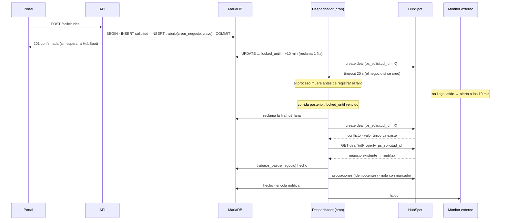

# ADR 0005 — Integraciones y trabajo diferido: HubSpot, correo, notificaciones y cron

> ⛔ **SUPERSEDED (iteración 8, 2026-09-25)** por [ADR-0009](0009-trabajo-diferido-worker-y-correo.md) tras el cambio de plataforma
> (cPanel → Docker/DigitalOcean App Platform, Next.js TS, PostgreSQL, Mailgun). Se conserva como rastro;
> no es criterio de construcción.

> Plantilla alineada al método **ADD** (Attribute-Driven Design, Len Bass — *Software Architecture in
> Practice*). Cada sección numerada corresponde a un paso del método. Las decisiones deben trazar a
> [0000-drivers-y-asrs.md](0000-drivers-y-asrs.md) y actualizar
> [_backlog-arquitectonico.md](_backlog-arquitectonico.md). Generada por la skill `setup-architecture`
> (`/build:architect`); un humano la promueve `proposed → accepted`.
>
> **Revisión 2 (2026-09-25):** incorpora los hallazgos de la evaluación adversarial ATAM-lite
> (idempotencia por paso con propiedad única en HubSpot, arrendamiento por fila, presupuesto de tiempo
> en CLI, monitor externo obligatorio, reintento del código de acceso por cola, riesgo de escalamiento
> falso y peor caso de entrega declarado).

## 1. Objetivo de la iteración y drivers seleccionados (Pasos 2–3)

- **Objetivo de la iteración:** que ninguna solicitud se quede solo en el portal; que cada una llegue a
  HubSpot sin duplicados, se notifique y se escale a tiempo; que el correo (códigos, avisos, boletín)
  tenga un camino único y medible; y que todo el trabajo diferido sea observable **también cuando el
  cron deja de correr**, dentro de un hosting sin colas, sin workers y sin procesos largos (CON-1, CON-2).
- **Elemento(s) a refinar:** `server/` — cola de trabajos, despachador, adaptadores
  `server/src/Adapters/HubSpot` y `server/src/Adapters/Mail`, escalador, vigilante, crontab y el
  monitor externo.
- **Drivers abordados:**
  - Funcionales: UC-7 (solicitud durable hacia HubSpot), UC-15 (notificación y escalamiento por horas
    hábiles), UC-16 (correo curado), UC-19 (tareas programadas vigiladas).
  - Atributos de calidad: QA-6 (0 solicitudes perdidas, confirmación P95 ≤ 2 s, alerta al 3.er fallo,
    entrega ≤ 60 min tras recuperación), QA-7 (0 duplicados con 50 respuestas perdidas y corridas
    solapadas), QA-8 (SPF/DKIM/DMARC pass, código P95 ≤ 60 s, 0 `sendmail`), QA-13 (alerta a 2× intervalo,
    100 % de corridas registradas, < 180 s, vigilancia no solo por cron), QA-14 (escalamiento entre
    vencimiento y +15 min, 0 escalamientos en horas no hábiles), QA-22 (aviso P95 ≤ 5 min, 5 campos).
  - Restricciones: CON-1 (sin colas ni workers), CON-2 (180 s por proceso), CON-5 (solo SMTP
    autenticado de `notify@people.trycore.com`), CON-7 (solo `curl`).
  - Concerns: CRN-1 (señal de apertura), CRN-2 (canal diario), CRN-3 (calendario hábil), CRN-4 (bandeja
    de fallos vs. reintento infinito), CRN-5 (medición de correo), CRN-7 (permisos y correspondencia
    HubSpot), CRN-8 (caída del crontab).

## 2. Conceptos de diseño elegidos (Paso 4)

| Driver | Concepto / Táctica | Alternativas descartadas | Razón |
|--------|--------------------|--------------------------|-------|
| QA-6, UC-7 | **Patrón outbox transaccional**: la solicitud se inserta en `solicitudes` y en la misma transacción se encola un trabajo en `trabajos`; el cliente recibe confirmación sin esperar a HubSpot (tácticas: *persistir antes de actuar*, *desacoplar por cola*) | Llamada síncrona a HubSpot en la petición; cola externa (Redis, RabbitMQ, SQS); archivo en disco como cola | El hosting no admite colas ni workers (RF-9.6.1, CON-1); la llamada síncrona ata la confirmación a HubSpot; el archivo no es transaccional con la solicitud |
| QA-6, QA-7, QA-13 | **Despachador por cron cada 5 min con arrendamiento por fila**: cada trabajo se reclama con un `UPDATE` atómico que fija `locked_by` (id de corrida) y `locked_until = ahora + 10 min`; solo procesa quien obtuvo la fila. `GET_LOCK` de MariaDB se mantiene como **optimización** (evita corridas paralelas inútiles), no como garantía. Un trabajo `en_curso` con `locked_until` vencido (> 10 min) se considera abandonado y se vuelve a tomar (táctica: *lease*, *recuperación de trabajos huérfanos*) | Depender solo de `GET_LOCK` (se libera si cae la conexión y no protege contra una corrida que muere a mitad de un trabajo); proceso daemon; cron cada minuto | Sin procesos largos (CON-1); un proceso que muere deja el trabajo marcado y otra corrida lo recupera sin intervención; la corrección no depende de un candado de sesión |
| CON-2, QA-13 | **Presupuesto de tiempo propio en el bucle CLI**: PHP CLI ignora `max_execution_time`, así que el despachador mide su reloj y **no toma un trabajo nuevo** si `transcurrido + coste_máximo(tipo) > 150 s`. Todo HTTP con `CURLOPT_CONNECTTIMEOUT` 5 s y `CURLOPT_TIMEOUT` 20 s; SMTP con timeout 15 s. Coste máximo por tipo declarado (p. ej. `crear_negocio` ≤ 4 llamadas × 20 s + margen = 90 s; `notificar` ≤ 15 s SMTP + 20 s canal = 35 s) | Confiar en `max_execution_time` (no aplica en CLI); lotes por número de filas; sin timeouts de red | Una llamada colgada no puede alargar la corrida más allá de 180 s (CON-2) ni solaparla con la siguiente; el arrendamiento de 10 min es muy superior al peor trabajo (90 s) |
| CRN-4, QA-6 | **Reintento infinito + bandeja de fallos**: backoff 5-10-20-40-60 min con tope 60 min; a partir del 3.er fallo el trabajo pasa a `fallando`, aparece en la «bandeja de fallos» del panel (`people-panel.trycore.com`) y se avisa por correo al responsable (una vez por umbral), **sin dejar de reintentar** | Agotar reintentos y mover a *dead letter* (HU-105 literal); reintentar sin avisar (RF-9.6.1 literal) | Cumple HU-105 (bandeja visible) y RF-9.6.1 (nunca deja de reintentar) a la vez |
| QA-7 | **Idempotencia por paso con clave por subpaso**: el trabajo `crear_negocio` se divide en subpasos (`negocio`, `asociaciones`, `nota`), cada uno con clave `ps:<solicitud_id>:<paso>` registrada en `trabajos_pasos` junto con la referencia externa obtenida. Un reintento **salta los pasos hechos** y reanuda el primero pendiente. Además `clave_idempotencia` única en `trabajos` impide encolar dos veces el mismo hecho, y el dedupe de especificación reciente (hash normalizado, ventana configurable, D-7) evita negocios por reenvíos del cliente | Idempotencia solo a nivel de trabajo completo (un reintento repetiría asociaciones y nota); confiar solo en el id devuelto por HubSpot | Una respuesta perdida puede caer en cualquier subpaso; la clave por subpaso hace que cada efecto externo ocurra a lo sumo una vez |
| QA-7, CRN-7 | **Propiedad `ps_solicitud_id` del negocio declarada de valor único en HubSpot** (`hasUniqueValue = true`): un segundo intento de crear el mismo negocio **falla en HubSpot** (conflicto) en vez de duplicar; el adaptador trata ese conflicto como «ya existe» y lee el negocio por `GET /crm/v3/objects/deals/{valor}?idProperty=ps_solicitud_id`, que es lectura directa y **no depende de la indexación de la Search API**. Al arrancar, el adaptador verifica que la propiedad exista y sea única; si no, no despacha `crear_negocio` y alerta | Buscar antes de crear con la Search API (retraso de indexación: una corrida rápida puede no ver el negocio recién creado); propiedad no única | La garantía pasa a HubSpot mismo: el duplicado es imposible aunque falle toda la lógica local |
| QA-7 | **Asociaciones y nota idempotentes**: las asociaciones (negocio↔contacto, negocio↔empresa, negocio↔negocio abierto relacionado) se crean con la API de asociaciones, que es idempotente para el mismo par; la nota lleva el marcador `[ps:<solicitud_id>:nota]` en el cuerpo y antes de crearla se listan las notas **asociadas al negocio** (lectura por asociación, no por búsqueda) buscando el marcador. El contacto se lee por `idProperty=email`; si la creación devuelve conflicto se reutiliza el id existente. La empresa **no se crea**: se usa `hubspot_company_id` de la cuenta | Crear nota y contacto sin comprobación; crear empresa por dominio | Evita notas y contactos repetidos; 0 empresas duplicadas por construcción |
| UC-7, CRN-7 | **Resolución de contacto y empresa** desde la cuenta del portal (`hubspot_company_id`, propietario); contacto creado asociado a la empresa del enlace si no existe; si la cuenta tiene un negocio abierto se crea uno nuevo **relacionado** (D-7); resumen como nota en la línea de tiempo | Buscar la empresa por dominio del correo; actualizar el negocio abierto | El dominio no identifica la cuenta de forma fiable; D-7 manda negocio nuevo relacionado |
| QA-6 | **Respeto de rate limits**: 429 → backoff con `Retry-After` si viene, sin contar como fallo de negocio | Reintento inmediato | Evita agravar el límite y falsas alertas |
| UC-15, QA-22 | **Notificación como trabajo en la misma cola**, encolada al completar `crear_negocio` y procesada **en la misma corrida** si el presupuesto lo permite; 5 campos de RF-9.7.2 **solo por correo**; el segundo canal es la **notificación nativa de HubSpot al asignar propietario** (sin integración nueva; CRN-2 decidido el 2026-09-25). El puerto `CanalAviso` queda sin adaptador en v1. Si `crear_negocio` llega a `fallando` (3.er fallo), se envía un **aviso degradado** sin enlace al negocio y con enlace a la solicitud en el panel (propuesta, a confirmar) | Google Chat por webhook; WhatsApp; notificación síncrona en la petición; esperar indefinidamente al negocio | RF-9.7.1 pide «no solo por correo»: la notificación de HubSpot cuenta como segundo canal sin integración nueva (divergencia a reflejar en el PRD por discovery); la cola da reintento; el aviso degradado evita que una caída de HubSpot deje al comercial sin saber de la solicitud |
| CRN-1, QA-14 | **Señal de apertura propia**: el negocio se considera abierto por (a) primer clic en el enlace rastreado `/r/<token>` de la notificación, que registra y redirige al negocio, o (b) cambio de etapa o de propietario leído de HubSpot. **Riesgo declarado:** si el comercial abre el negocio directamente en HubSpot y no cambia etapa ni propietario, el portal no lo ve y escalará a Dirección Comercial a las 4 h hábiles (**escalamiento falso**). Mitigaciones: el aviso de escalamiento incluye «ya lo estoy atendiendo» (`/r/<token>?atender`) que corta la cadena; se evalúa como señal adicional la actividad registrada por un usuario en el negocio (nota, llamada, correo) si la API la expone de forma fiable (a verificar) | Esperar que la API de HubSpot exponga «visto»; píxel en el correo de aviso; `hs_lastmodifieddate` (cambia también por procesos del sistema) | La API no expone apertura; el píxel es poco fiable (CRN-5); preferimos un falso positivo visible y cortable a un escalamiento que nunca ocurre |
| QA-14, CRN-3 | **Escalador por cron cada 15 min** con calendario hábil en tabla (**L–V 8:00–18:00 `America/Bogota` con festivos de Colombia**, administrable; valores aceptados el 2026-09-25); 4 h hábiles sin apertura → Dirección Comercial; **24 h hábiles** (no naturales) sin cambio de etapa → Dirección General; registra tiempo hasta la primera apertura (RF-9.7.4). **Puerto `Reloj`** para pruebas con reloj simulado. Mismo presupuesto de tiempo y timeouts que el despachador | Workflows de HubSpot para escalar; festivos fijos en código; hora del servidor sin zona | Los workflows dependen de permisos y del plan (CRN-7) y dejan la métrica fuera del portal; festivos móviles cambian cada año |
| QA-8, CON-5 | **Un solo adaptador de correo** con PHPMailer por SMTP autenticado (587, STARTTLS, timeout 15 s) de `notify@people.trycore.com`; códigos de acceso **en línea** (P95 ≤ 60 s); si el envío en línea falla (error o timeout), el **mismo código** se encola como trabajo `enviar_codigo` de prioridad alta y se reintenta en la siguiente corrida, y la pantalla lo dice («puede tardar unos minutos»). Avisos y boletín siempre por la cola | `mail()`/`sendmail`; proveedor transaccional externo (SendGrid, SES); todo por la cola; fallo en línea sin reintento | `sendmail` prohibido (CON-5); un proveedor externo no está en el stack del PRD; el código no puede esperar 5 min en el camino normal, pero tampoco perderse si el SMTP falla una vez |
| UC-16, CRN-5 | **Boletín por lotes** dentro de cada corrida (presupuesto de 150 s), enlace firmado por destinatario (ADR-0002), bajas persistentes, píxel propio con estado «sin dato» explícito, clic rastreado, rebotes leídos del buzón por IMAP si la extensión está disponible o marcados «sin dato» | Envío masivo en una sola petición; herramienta de marketing de HubSpot | Límite de 180 s por proceso; RF-18.2 exige enlace generado desde el envío por contacto |
| QA-13, CRN-8 | **Vigilancia en tres capas**: (1) tabla `tareas_ejecucion` escrita por cada corrida (en `finally`, también si hay excepción) y vigilante que compara con 2× intervalo; (2) chequeo muestreado en el middleware de la API; (3) **monitor externo OBLIGATORIO tipo «dead man's switch»**: al terminar cada corrida del despachador se hace un ping HTTPS (`curl`, timeout 5 s) a una URL del monitor; si el monitor no recibe ping en 10 min, avisa por su propio canal al responsable técnico. Además el monitor sondea `GET /api/v1/salud`, que devuelve 503 si el último despacho tiene más de 10 min (tácticas: *heartbeat*, *dead man's switch*, *monitor externo*) | Solo el correo de salida del cron de cPanel; solo un vigilante en cron; monitor externo opcional solo sobre `/salud` | Si cae el crontab entero caen el vigilante y el despachador (CRN-8); sin tráfico nocturno el chequeo muestreado no corre; si cae el SMTP la alerta local tampoco sale. Solo un observador fuera del hosting que espera un latido detecta todos esos casos |

## 3. Instanciación: responsabilidades e interfaces (Paso 5)

- **Elementos instanciados:**
  - Tablas: `solicitudes`; `trabajos` (`id`, `tipo`, `prioridad`, `payload` JSON, `clave_idempotencia`
    UNIQUE, `intentos`, `proximo_intento`, `estado` `pendiente|en_curso|hecho|fallando`, `locked_by`,
    `locked_until`, `ultimo_error`); `trabajos_pasos` (`trabajo_id`, `paso`, `clave` UNIQUE,
    `ref_externa`, `hecho_en`); `tareas_ejecucion`; `calendario_habil` (horario semanal + festivos);
    `aperturas` (token, primer clic, origen de la señal); `envios_boletin`; `bajas`; `eventos_correo`
    (apertura, clic, rebote, `sin_dato`).
  - Casos de uso (núcleo hexagonal): `RegistrarSolicitud`, `DespacharTrabajos`, `CrearNegocioHubSpot`,
    `NotificarSolicitud`, `EscalarSolicitudes`, `EnviarCodigoAcceso`, `EnviarLoteBoletin`,
    `VigilarTareas`, `RegistrarVoto`.
  - Puertos: `CrmPort` (→ `Adapters/HubSpot`), `CorreoPort` (→ `Adapters/Mail`, PHPMailer),
    `CanalAviso` (sin adaptador en v1: CRN-2 decidido como solo correo + notificación nativa de HubSpot), `LectorRebotes` (IMAP o nulo), `Reloj`,
    `Arrendamiento` (reclamo de filas), `Latido` (→ monitor externo), repositorios en
    `Adapters/Persistencia`.
  - Crons (`/usr/local/bin/php`, salida a log propio en la carpeta privada):
    `server/cron/despachar.php` (*/5), `server/cron/escalar.php` (*/15), `server/cron/vigilar.php` (*/15),
    `server/cron/proponer-lexico.php` (semanal, ADR-0004), sincronización diaria (ADR-0003).
  - Endpoints: `POST /api/v1/solicitudes`, `POST /api/v1/sondeo/voto`, `GET /r/{token}`,
    `GET /api/v1/salud`, bandeja de fallos en la API del panel (`people-panel.trycore.com`).
  - Configuración (`config.php`, fuera de la raíz web): `HUBSPOT_PRIVATE_APP_TOKEN`, `SMTP_PASSWORD`,
    `LATIDO_URL` (URL secreta del monitor externo).
- **Responsabilidades:**
  - `RegistrarSolicitud`: valida, calcula hash de especificación, aplica dedupe D-7, inserta solicitud +
    trabajo `crear_negocio` en una transacción y responde.
  - `DespacharTrabajos`: intenta `GET_LOCK('despachador', 0)` (si no lo obtiene, sale y lo registra);
    en bucle, mientras `transcurrido + coste_máximo(tipo) ≤ 150 s`: reclama una fila con
    `UPDATE trabajos SET estado='en_curso', locked_by=:corrida, locked_until=NOW()+INTERVAL 10 MINUTE
    WHERE id=:id AND ((estado IN ('pendiente','fallando') AND proximo_intento<=NOW()) OR
    (estado='en_curso' AND locked_until<NOW()))` y procesa solo si afectó 1 fila; ejecuta el manejador
    por `tipo` (primero `prioridad` alta, p. ej. `enviar_codigo`); en éxito `hecho`; en fallo incrementa
    `intentos`, calcula backoff, a partir de 3 marca `fallando` y encola aviso al responsable (una vez
    por umbral). Al final escribe `tareas_ejecucion` y envía el latido al monitor externo.
  - `CrearNegocioHubSpot` (por subpasos, cada uno saltado si `trabajos_pasos` ya lo tiene):
    1. `negocio`: crea el negocio en el pipeline propio con `ps_solicitud_id` y propiedades (origen,
       fecha de alineación, perfiles, roles, sector, inicio, duración, modalidad, campaña, correo de
       origen); ante conflicto por valor único, lee el existente por `idProperty=ps_solicitud_id`.
    2. `asociaciones`: resuelve contacto por `idProperty=email` (o lo crea asociado a
       `hubspot_company_id`), asocia negocio↔contacto, negocio↔empresa y, si hay uno abierto,
       negocio↔negocio relacionado (D-7).
    3. `nota`: lista notas asociadas al negocio; si ninguna tiene el marcador `[ps:<id>:nota]`, la crea.
    Al completar los tres, encola `notificar` con el enlace al negocio.
  - `NotificarSolicitud`: envía los 5 campos por correo (el aviso nativo de HubSpot sale al asignar
    propietario en `crear_negocio`, sin código propio), con enlace rastreado
    `/r/<token>`; variante degradada (sin enlace al negocio) si `crear_negocio` está `fallando`.
  - `EscalarSolicitudes`: con `Reloj` y `calendario_habil`, calcula horas hábiles transcurridas; consulta
    apertura (clic `/r/`, «ya lo estoy atendiendo», o cambio de propietario/etapa en HubSpot); encola aviso
    de escalamiento.
  - `EnviarCodigoAcceso`: intenta en línea con timeout SMTP 15 s; si falla, encola `enviar_codigo`
    (prioridad alta, `clave_idempotencia` = id del código) y responde al usuario que el código puede
    tardar; la vigencia del código cuenta desde su emisión (ADR-0002).
  - `VigilarTareas` + chequeo muestreado en el middleware de la API: comparan `tareas_ejecucion` con
    2× intervalo y envían alerta **en línea** (no por la cola, que podría estar detenida). El monitor
    externo es independiente de ambos.
- **Interfaces / contratos:**
  - `interface CrmPort { leerNegocioPorSolicitud(string $id): ?NegocioRef; crearNegocio(NegocioNuevo $n): NegocioRef /* lanza Conflicto si ps_solicitud_id existe */; resolverContacto(string $correo, string $companyId): ContactoRef; asociar(ObjetoRef $a, ObjetoRef $b): void; notaConMarcador(NegocioRef $n, string $marcador): bool; anotar(NegocioRef $n, ContactoRef $c, string $nota): void; leerEstado(NegocioRef $n): EstadoNegocio; verificarPropiedadUnica(string $nombre): bool; }`
  - `interface CorreoPort { enviar(Mensaje $m): ResultadoEnvio; }`
  - `interface Arrendamiento { reclamar(int $trabajoId, string $corrida, int $segundos): bool; }`
  - `interface Latido { latir(string $tarea, ResultadoCorrida $r): void; /* nunca lanza; timeout 5 s */ }`
  - `interface Reloj { ahora(): DateTimeImmutable; }`
  - Errores de adaptador tipificados: `Transitorio` (5xx, timeout, 429) → reintento; `Conflicto`
    (valor único ya existe) → leer y reutilizar; `Permanente` (4xx de validación) → `fallando` con aviso
    inmediato, sin dejar de reintentar tras corrección.

## 4. Vistas y registro de la decisión (Paso 6)

Vista de componentes y conectores del trabajo diferido:

```mermaid
flowchart LR
  C[Portal · people.trycore.com] -- POST /solicitudes --> API
  subgraph API["server/ · Slim 4"]
    RS[RegistrarSolicitud]
    CO[EnviarCodigoAcceso · en línea]
    SAL[GET /salud · 503 si despacho > 10 min]
    MW[Middleware · chequeo muestreado]
    R[GET /r/token]
  end
  RS -- 1 transacción --> DB[(MariaDB<br/>solicitudes · trabajos · trabajos_pasos<br/>tareas_ejecucion · calendario_habil<br/>aperturas · eventos_correo)]
  CO -- si falla: encola enviar_codigo --> DB
  CO --> ML
  subgraph CRON["crontab cPanel"]
    D[despachar.php */5<br/>lease por fila 10 min · presupuesto 150 s]
    E[escalar.php */15<br/>calendario hábil · Reloj]
    V[vigilar.php */15]
  end
  D --> DB
  E --> DB
  V --> DB
  MW --> DB
  D --> HS[Adapters/HubSpot · curl 20 s]
  D --> ML[Adapters/Mail · PHPMailer SMTP 587 · 15 s]
  D --> CA[CanalAviso · sin adaptador en v1]
  E --> HS
  HS --> HUB[[HubSpot API<br/>ps_solicitud_id único]]
  ML --> SMTP[[notify@people.trycore.com]]
  R -- primer clic --> DB
  R -- 302 --> HUB
  D -- latido al terminar --> EXT[[Monitor externo · dead man's switch]]
  EXT -- sondeo --> SAL
  EXT -. sin latido 10 min .-> RESP([Responsable técnico])
  PAN[Panel · people-panel.trycore.com<br/>bandeja de fallos] --> DB
```

Secuencia de una solicitud con respuesta perdida y corrida caída:



**Decisión:** todo efecto externo (HubSpot, avisos, boletín, voto del sondeo y reintento de códigos) se
modela como trabajo en una tabla, encolado en la misma transacción que el hecho de negocio y procesado
por crons cortos que reclaman cada fila con un arrendamiento de 10 min, respetan un presupuesto de
150 s medido por ellos mismos y aplican timeouts de red de 20 s (HTTP) y 15 s (SMTP); backoff con tope
de 60 min y reintento infinito con bandeja de fallos visible. La idempotencia hacia HubSpot se ancla a
la propiedad **de valor único** `ps_solicitud_id` y a una clave por subpaso (negocio, asociaciones,
nota). El correo sale por un único adaptador SMTP autenticado; los códigos van en línea con reintento
por cola si fallan. La vigilancia no depende del hosting: un monitor externo **obligatorio** espera un
latido por corrida del despachador y sondea `/api/v1/salud`.

**Peor caso declarado de entrega tras recuperación de HubSpot:** un trabajo que acaba de fallar con el
backoff en su tope espera hasta 60 min para el siguiente intento, y ese intento ocurre en el primer tick
de cron posterior (hasta 5 min más) → **~65 min** desde que HubSpot vuelve. Supera en ~5 min la meta de
QA-6 (≤ 60 min tras la recuperación, *a validar*) y arrastra el aviso de QA-22 en el mismo escenario
degradado (QA-22 se mide en entorno normal, así que su meta no se incumple por esto). Mitigaciones
propuestas, a decidir en la revisión: (a) bajar el tope del backoff a 55 min (coste nulo, deja el peor
caso en ~60 min); (b) **sonda de recuperación**: si hay trabajos HubSpot en espera, cada corrida hace una
llamada barata de lectura y, si responde bien, adelanta sus `proximo_intento` (peor caso ~10 min, una
llamada extra cada 5 min mientras dure la caída).

**Trade-offs aceptados:**
- Latencia de entrega de hasta ~5 min en entorno normal (más backoff en caídas) a cambio de
  confirmación inmediata y durabilidad.
- Dependencia de que Mercadeo/Comercial creen `ps_solicitud_id` como propiedad única; sin ella el
  despachador no crea negocios (falla cerrado) en vez de arriesgar duplicados.
- Un servicio externo más (monitor de latido) fuera del hosting: una cuenta y una URL secreta que
  mantener, y posibles falsas alarmas si la salida HTTPS falla puntualmente.
- Escalamientos falsos posibles cuando el comercial trabaja el negocio sin pasar por el enlace ni
  cambiar etapa/propietario; se prefieren visibles y cortables a silenciosos.
- El calendario hábil y los destinatarios los mantiene una persona; datos vacíos bloquean el escalamiento.
- Medición de correo con estados «sin dato» honestos en lugar de cifras infladas.

## 5. Análisis del diseño (Paso 7)

> Evaluación adversarial ATAM-lite incorporada. ✅ solo cuando hay medida o un plan de verificación
> concreto; ⚠️ cuando el diseño cubre el driver pero falta una medida, una decisión o una verificación
> en el hosting real; ❌ cuando no está cubierto.

| Driver | ✅/⚠️/❌ | Evidencia / medida | Riesgo residual |
|--------|---------|--------------------|-----------------|
| UC-7 | ⚠️ | Outbox + `CrearNegocioHubSpot` por subpasos con resolución de contacto/empresa y D-7. Verificación: prueba de integración contra un portal de pruebas de HubSpot en staging | Bloqueado por CRN-7: pipeline, scopes de la private app y propiedad única `ps_solicitud_id` sin crear |
| UC-15 | ⚠️ | Aviso por correo con 5 campos + notificación nativa de HubSpot al asignar propietario + escalador con calendario y reloj simulado | Destinatarios nominales sin definir; escalamiento falso (CRN-1) |
| UC-16 | ⚠️ | Lotes dentro del presupuesto de 150 s, enlace firmado, bajas, píxel/clic propios | Límite de envío por hora del SMTP compartido y extensión IMAP sin verificar en el hosting |
| UC-19 | ✅ | `tareas_ejecucion` escrita en `finally` por cada corrida + vigilante + monitor externo. Plan: test que fuerza excepción y comprueba el registro; en staging, apagar el crontab y medir la alerta | — |
| QA-6 | ⚠️ | 100 % persistido antes de responder (outbox en 1 transacción); confirmación sin HubSpot; alerta al 3.er fallo; recuperación automática de trabajos `en_curso` > 10 min | **Peor caso ~65 min tras la recuperación** > meta de 60 min (mitigable con tope 55 min o sonda de recuperación); P95 ≤ 2 s sin medir en el hosting; ModSecurity sobre el POST sin probar con cargas reales |
| QA-7 | ✅ | Propiedad única en HubSpot (duplicado imposible por construcción) + clave por subpaso + lease por fila + `clave_idempotencia` + hash D-7. Plan: inyección de 50 respuestas perdidas y corridas solapadas (doble de HubSpot en CI y repetición en el portal de pruebas en staging) con 0 negocios, 0 empresas y 0 notas duplicadas | Depende de que la propiedad se cree única (el adaptador lo verifica al arrancar y no despacha si no); una nota podría repetirse si la lectura por asociación falla justo después de crearla (fuera de la medida de QA-7) |
| QA-8 | ⚠️ | Un solo adaptador SMTP con timeout 15 s; 0 `sendmail` por diseño; código en línea con reintento por cola | SPF/DKIM/DMARC de `people.trycore.com` y colocación en bandeja con IP compartida 192.99.84.46 sin prueba con buzones reales; si el SMTP falla, el código sale en la siguiente corrida (hasta ~5 min) y rompe el P95 ≤ 60 s en ese caso |
| QA-13 | ✅ | 100 % de corridas registradas; presupuesto propio de 150 s + timeouts 20 s/15 s (corrida < 180 s); alerta a 2× intervalo por vigilante y por latido externo (sin latido 10 min → alerta), independiente del cron, del tráfico y del SMTP. Plan: en staging, detener el crontab y medir alerta ≤ 10 min; doble de HubSpot que tarda 20 s por llamada y medir duración < 180 s | Proveedor del monitor sin elegir; posibles falsas alarmas por fallos puntuales de salida HTTPS |
| QA-14 | ⚠️ | Cron cada 15 min cumple «vencimiento + 15 min»; prueba con reloj simulado sobre semana con festivo | Festivos de Colombia a cargar y mantener en la tabla cada año; escalamiento falso si abren el negocio directo en HubSpot (CRN-1) |
| QA-22 | ⚠️ | `notificar` encolado al completar el negocio y procesado en la misma corrida; aviso degradado al 3.er fallo | Tick de 5 min + llamadas a HubSpot + SMTP puede rozar o pasar los 5 min en el P95; sin medir en el hosting; aviso degradado pendiente de confirmar |
| CON-1 | ✅ | Solo MariaDB + cron + PHP CLI; sin workers ni colas externas | — |
| CON-2 | ✅ | Presupuesto medido por el propio bucle (PHP CLI no aplica `max_execution_time`), coste máximo por tipo y timeouts; plan de medición en QA-13 | Si el hosting admite `pcntl_alarm`, añadirlo como corte duro (a verificar) |
| CON-5 | ✅ | PHPMailer SMTP 587 STARTTLS con `notify@people.trycore.com`; `SMTP_PASSWORD` en `config.php`; grep en CI de `mail(`/`sendmail` = 0 | — |
| CON-7 | ✅ | Todos los adaptadores HTTP, incluido el latido, con `curl`; grep en CI de `file_get_contents('http` = 0 | — |
| CRN-1 | ⚠️ | Clic rastreado `/r/<token>` + cambio de etapa/propietario + «ya lo estoy atendiendo» | Escalamiento falso si el comercial trabaja el negocio en HubSpot sin esas señales; actividad de usuario como señal adicional sin verificar |
| CRN-2 | ✅ | Decidido: solo correo + notificación nativa de HubSpot al asignar propietario. Plan: test de contrato de que `crear_negocio` asigna `hubspot_owner_id` (dispara el aviso nativo) y prueba en staging de que el comercial lo recibe | RF-9.7.1 pide «no solo por correo»; se cumple con el aviso de HubSpot. Divergencia a reflejar en el PRD por discovery |
| CRN-3 | ✅ | Valores aceptados: L–V 8:00–18:00 `America/Bogota`, festivos de Colombia en tabla administrable, 24 h en horas hábiles. Plan: prueba con reloj simulado sobre semana con festivo | Carga anual de festivos |
| CRN-4 | ✅ | Reintento infinito + bandeja de fallos desde el 3.er fallo; test de un trabajo que pasa a `fallando` sin dejar de reintentar | — |
| CRN-5 | ✅ | Estados «sin dato» explícitos para apertura y rebotes | Extensión IMAP de PHP sin verificar: si falta, todos los rebotes quedan «sin dato» |
| CRN-7 | ⚠️ | `hubspot_company_id` y propietario en la cuenta; verificación de propiedad única al arrancar | Scopes, pipeline y propiedad `ps_solicitud_id` (única) dependen de Mercadeo y Comercial |
| CRN-8 | ✅ | Monitor externo obligatorio con latido por corrida + sondeo de `/salud`; plan de prueba en QA-13 | Ver QA-13 |

**Drivers no resueltos en esta iteración:** CRN-7
(configuración de HubSpot, incluida la propiedad única), el peor caso de ~65 min de QA-6 (elegir
mitigación), el aviso degradado de QA-22, y las verificaciones en el hosting (límite de envío SMTP,
extensión IMAP, SPF/DKIM/DMARC, ModSecurity con cargas reales, P95 de confirmación). Se devuelven al
backlog arquitectónico.

## 6. Consecuencias

- **Positivas:**
  - Ninguna solicitud depende de la disponibilidad de HubSpot; se confirma al cliente en cuanto está en
    la base de datos.
  - Un duplicado de negocio es imposible aunque falle toda la lógica local: lo impide HubSpot con la
    propiedad única, y la clave por subpaso evita repetir asociaciones y notas.
  - Un proceso que muere a mitad de un trabajo no lo bloquea: el arrendamiento vence a los 10 min y otra
    corrida lo retoma.
  - Ninguna corrida pasa de 180 s aunque HubSpot o el SMTP se cuelguen.
  - La caída del crontab, del SMTP o de todo el hosting se detecta desde fuera en ≤ 10 min.
  - Un solo mecanismo (tabla + cron) cubre reintento, avisos, voto, boletín y códigos fallidos; el
    escalamiento es testeable con reloj simulado.
- **Negativas:**
  - Más estado que mantener (`trabajos_pasos`, arrendamientos) y purga periódica de trabajos `hecho`
    antiguos.
  - Más llamadas a HubSpot (lectura por conflicto, listado de notas, estado para escalamiento) dentro de
    los rate limits.
  - Avisos y boletín heredan la latencia del cron (hasta ~5 min en entorno normal).
  - Un servicio externo más (monitor de latido) que dar de alta y vigilar.
- **Riesgos:**
  - Peor caso de entrega tras recuperación ~65 min frente a la meta de 60 min de QA-6 (mitigación por
    decidir: tope 55 min o sonda de recuperación).
  - Escalamientos falsos a Dirección Comercial cuando el negocio se trabaja directo en HubSpot (CRN-1).
  - Propiedad `ps_solicitud_id` no creada como única: el despachador no creará negocios hasta
    corregirlo (falla cerrado, con alerta).
  - Reputación y límites del SMTP compartido desconocidos (QA-8, UC-16); un fallo SMTP retrasa el
    código de acceso hasta la siguiente corrida.
  - Falsas alarmas del monitor si la salida HTTPS del hosting falla de forma intermitente.
- **Trade-offs de negocio abiertos (requieren decisión humana):**
  - **Destinatarios nominales** de escalamiento (Dirección Comercial, Dirección General) y responsable
    técnico de la bandeja de fallos y del monitor.
  - **Peor caso de QA-6:** aceptar ~65 min, bajar el tope a 55 min o añadir la sonda de recuperación.
  - **Aviso degradado de QA-22:** avisar sin enlace al negocio cuando HubSpot falla, o esperar.
  - **Tolerancia al escalamiento falso:** aceptarlo con «ya lo estoy atendiendo» o pedir al equipo
    comercial que siempre abra desde el enlace del aviso.
  - **Proveedor del monitor externo** (servicio de latido gratuito o de pago).
- **Decisiones de la revisión única (sponsor, 2026-09-25):**
  - **CRN-2 canal de notificaciones:** solo correo + notificación nativa de HubSpot al asignar
    propietario, sin integración nueva. RF-9.7.1 pide «no solo por correo»; la notificación de
    HubSpot cuenta como segundo canal. Divergencia a reflejar en el PRD por discovery.
  - **CRN-3 horario hábil:** L–V 8:00–18:00 `America/Bogota` con festivos de Colombia en tabla
    administrable; las 24 h de escalamiento de RF-9.7 son horas hábiles.
  - **Regla «3 envíos sin abrir» (RF-18.6):** se mide por clic o entrada al portal, no por apertura
    (píxel). Detalle en ADR-0006.
- **Operacionales:** crons con `/usr/local/bin/php` y salida redirigida a log propio en la carpeta
  privada (el cron de cPanel envía por correo toda salida no redirigida); `HUBSPOT_PRIVATE_APP_TOKEN`,
  `SMTP_PASSWORD` y `LATIDO_URL` en `config.php`; pruebas de ModSecurity con cargas reales antes de
  producción (CRN-18, ADR-0007); bandeja de fallos operada por el responsable técnico desde
  `people-panel.trycore.com`; prueba de apagado del crontab en staging antes de producción.

## 7. Trazabilidad

- Drivers: [0000-drivers-y-asrs.md](0000-drivers-y-asrs.md) · UC-7, UC-15, UC-16, UC-19 · QA-6, QA-7,
  QA-8, QA-13, QA-14, QA-22 · CON-1, CON-2, CON-5, CON-7 · CRN-1, CRN-2, CRN-3, CRN-4, CRN-5, CRN-7, CRN-8
- PRD v4.11: RF-5, RF-9.1–9.6.2, RF-9.7 (9.7.1–9.7.4), RF-10.8, RF-17, RF-18 (18.1–18.6), RF-1.6 · D-6,
  D-7, D-21 · §8.3 · `docs/01-prd/requisitos-tecnicos-hosting.md` (cron, salida HTTPS, SMTP, límites PHP)
- Specs: `docs/10-specs/correo-curado.md`, `docs/10-specs/enlaces-curados.md`
- HU: HU-096–HU-107, HU-077, HU-113–HU-117
- Épicas: EP-005, EP-007, EP-011
- ADR relacionados: [0001](0001-estilo-y-stack-base.md) (hexagonal, adaptadores, hosts),
  [0002](0002-identidad-acceso-y-sesiones.md) (enlaces firmados, códigos de acceso),
  [0003](0003-datos-persistencia-y-auditoria.md) (MariaDB, sincronización diaria),
  [0004](0004-busqueda-determinista-y-estado.md) (voto del sondeo, cron de léxico),
  [0007](0007-entornos-despliegue-y-perimetro.md) (crontab, ModSecurity, staging, monitor)
- Stack operacionalizado en: `.claude/config/stack-allowlist.json` (`phpmailer/phpmailer`); el monitor
  externo es un servicio, no una dependencia de código (se llama con `curl`)
