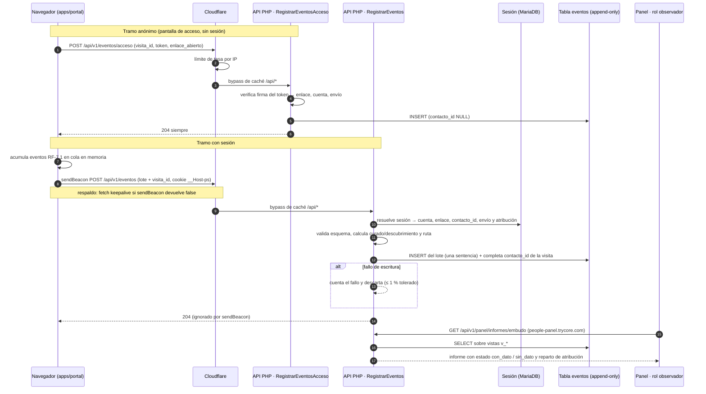
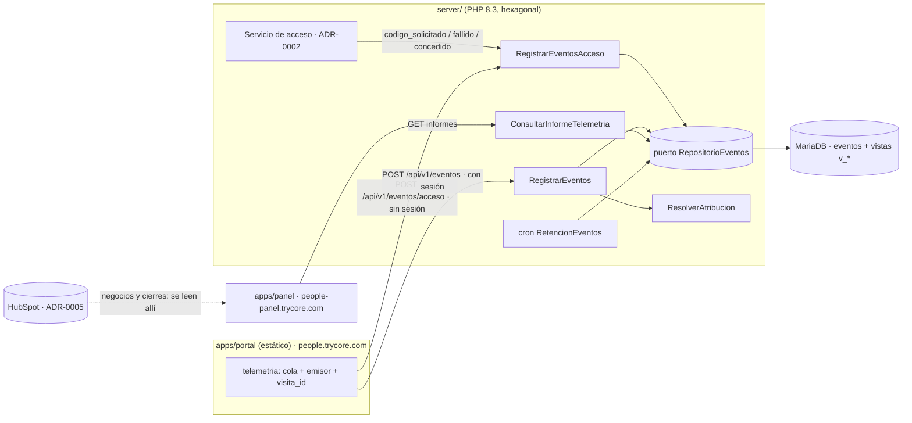

# ADR 0006 — Telemetría y atribución

> Plantilla alineada al método **ADD** (Attribute-Driven Design, Len Bass — *Software Architecture in
> Practice*). Cada sección numerada corresponde a un paso del método. Las decisiones deben trazar a
> [0000-drivers-y-asrs.md](0000-drivers-y-asrs.md) y actualizar
> [_backlog-arquitectonico.md](_backlog-arquitectonico.md). Generada por la skill `setup-architecture`
> (`/build:architect`); un humano la promueve `proposed → accepted`.
>
> **Revisión 2 (tras evaluación ATAM-lite adversarial):** se añade un endpoint anónimo acotado para el
> paso de acceso, los eventos guardan `contacto_id` en lugar del correo, la referencia a HubSpot pasa a
> ADR-0005, las definiciones de los informes se fijan en el slice de EP-008 y las entradas sin
> parámetros se atribuyen por defecto al último envío por el que entró el contacto.

## 1. Objetivo de la iteración y drivers seleccionados (Pasos 2–3)

- **Objetivo de la iteración:** decidir cómo se capturan, atribuyen, guardan y explotan los eventos
  de RF-7 para que los informes del embudo, del acierto de la curaduría, de los filtros usados y de
  las búsquedas sin resultados salgan solos, sin trabajo manual, sin enviar datos personales a
  terceros y sin que la telemetría pueda tumbar la solicitud. El embudo empieza en la apertura del
  enlace, antes de que exista sesión, así que también hay que medir el paso de acceso sin debilitarlo.
- **Elemento(s) a refinar:** capa de eventos (cliente en `apps/portal` + módulo `Telemetria` de la
  API PHP en `server/`), tabla `eventos` en MariaDB y la vista de informes del panel (`apps/panel`,
  rol observador).
- **Drivers abordados:**
  - Funcionales: UC-17 (telemetría con atribución: RF-7.1–RF-7.4, RF-2.6.3, RF-18.6; EP-008 ·
    HU-108–112). Apoyo: UC-1 (el paso de acceso genera los primeros eventos del embudo) y UC-16 (la
    entrada al portal alimenta la medición del correo curado y la regla de tres envíos).
  - Atributos de calidad: QA-21 (100 % de solicitudes vinculadas a cuenta, contacto, sesión,
    conjunto curado y correo de origen; ≥ 99 % de sesiones por enlace atribuidas a un envío
    *a validar*; pérdida de eventos ≤ 1 % *a validar*). Se apoya en QA-5 (0 datos de perfil fuera
    del sistema, Ley 1581), QA-2 (la telemetría no puede engordar el JS inicial ni el LCP), QA-3 (el
    endpoint anónimo no puede convertirse en un oráculo de invitados ni en una vía de abuso), QA-6
    (la solicitud no depende de la telemetría) y QA-13 (la tarea de retención queda vigilada).
  - Restricciones: CON-3 (sin `node_modules` en servidor: nada de SDK de analítica en runtime) y
    la plataforma de §8.3 (PHP 8.3 + MariaDB 10.6, sin colas ni procesos largos).
  - Concerns: CRN-10 (telemetría y notificaciones llevan datos personales; retención no definida),
    CRN-5 (la apertura por píxel no es fiable con SMTP propio) y CRN-18 (ModSecurity puede bloquear
    los POST de eventos).

## 2. Conceptos de diseño elegidos (Paso 4)

| Driver | Concepto / Táctica | Alternativas descartadas | Razón |
|--------|--------------------|--------------------------|-------|
| QA-21, QA-2 | **Emisión por lotes desde el cliente** con `navigator.sendBeacon` al cerrar/ocultar la página y `fetch(..., {keepalive: true})` de respaldo; cola en memoria que se vacía cada N eventos o cada pocos segundos | (a) Un `fetch` por evento; (b) `XMLHttpRequest` síncrono en `unload`; (c) píxel `` | (a) multiplica peticiones y choca con el límite de tasa de Cloudflare; (b) está obsoleto y bloquea la navegación; (c) no transporta lotes JSON. `sendBeacon` sobrevive al cierre de pestaña, que es justo cuando ocurre el evento «abandono» |
| QA-21, QA-5 | **Enriquecimiento del lado servidor** (táctica *autenticar y derivar identidad en el borde confiable*): el cliente manda solo tipo de evento, marca de tiempo y carga funcional; el servidor añade cuenta, enlace, contacto, envío de origen y bandera curado/descubrimiento desde la sesión | Que el cliente mande `cuenta_id`, `contacto_id` o `envio_id` en el cuerpo | Un cliente manipulado podría falsear la atribución o atribuir eventos a otra cuenta. La sesión ya tiene todo eso (RF-1.2, ADR-0002); duplicarlo en el cliente solo abre superficie |
| UC-17, UC-1, QA-3 | **Endpoint anónimo acotado para el paso de acceso** (táctica *limitar la exposición* + *limitar la tasa*): antes de que haya sesión solo se aceptan cuatro tipos cerrados (`enlace_abierto`, `codigo_solicitado`, `codigo_fallido`, `acceso_concedido`), atribuidos al enlace y al envío que el servidor deduce del token firmado, nunca a un correo; límite de tasa por IP en la aplicación (fuera de la única regla de Cloudflare, ADR-0007); respuesta `204` idéntica pase lo que pase | (a) No medir nada antes de la sesión; (b) abrir el endpoint general sin sesión; (c) registrar el paso de acceso solo desde el servidor de acceso | (a) el embudo perdería su primer escalón (cuántos abren el enlace y no llegan a entrar), que es lo que RF-7.1 llama «entrada» y lo que el correo curado necesita; (b) cualquiera podría inyectar eventos de cualquier tipo; (c) cubre `codigo_solicitado`/`fallido` pero no la apertura en el navegador ni el abandono de la pantalla de código. Se combinan: el servidor de acceso registra lo que ya sabe y el navegador solo aporta `enlace_abierto` |
| QA-5, CRN-10 | **Identificador de contacto en lugar del correo**: los eventos guardan `contacto_id` (el id interno del invitado que la sesión ya conoce, ADR-0002); el correo vive solo en la tabla de invitados | Guardar el correo en cada evento | El correo repetido en millones de filas multiplica el dato personal y complica la retención y el derecho de supresión. Con `contacto_id` basta un `JOIN` para el informe por contacto, y suprimir o seudonimizar a un contacto es tocar una fila, no la tabla de eventos |
| QA-21, UC-16 | **Atribución por defecto al último envío por el que entró el contacto** (último toque): una entrada con parámetros de envío fija `envio_id`; una entrada sin parámetros hereda el último `envio_id` con el que ese contacto entró, marcada como `atribucion = heredada`; si nunca entró por un envío queda `directo` | (a) Toda entrada sin parámetros = directo; (b) atribuir al último envío mandado a la cuenta, haya entrado o no el contacto por él; (c) atribución multitoque | (a) castiga al cliente que guarda el enlace o vuelve desde el historial y hunde el ≥ 99 % de QA-21; (b) atribuye a un correo que ese contacto quizá no leyó; (c) es desproporcionada para decenas de cuentas. La marca `heredada` deja ver cuánto pesa la regla y permite cambiarla sin reescribir eventos. **Regla a validar por negocio** (ventana máxima incluida) |
| QA-21, UC-17 | **Registro append-only** en una tabla `eventos` con partición lógica por mes (columna `mes` + índices por `(fecha)` y `(cuenta_id, fecha)`) | (a) Particionado nativo de MariaDB (`PARTITION BY RANGE`); (b) una tabla por tipo de evento; (c) ficheros de log planos | (a) añade operación (crear particiones futuras por cron) para un volumen de decenas de cuentas que no lo justifica; se puede adoptar después sin cambiar el contrato; (b) complica los informes que cruzan tipos (embudo); (c) no se consultan con SQL desde el panel |
| UC-17 | **Informes como consultas SQL / vistas** servidas por la API al panel (rol observador), con estado «sin dato» explícito cuando no hay eventos. Las **definiciones exactas** de cada informe (qué es «abandono», ventana del embudo, qué cuenta como «acierto de curaduría») **se escriben en el slice de EP-008** (su OpenSpec change) como especificación verificable, no en esta ADR | (a) Herramienta externa de analítica (GA4, Matomo Cloud, PostHog, Mixpanel); (b) Matomo autoalojado en el hosting; (c) exportar a hoja de cálculo | (a) envía datos personales de invitados a un tercero (Ley 1581, QA-5) y obliga a abrir la CSP a su dominio (ADR-0007); (b) consume inodos, otra BD y otra superficie de ataque para informes que son 5 consultas; (c) es trabajo manual, lo que UC-17 prohíbe |
| KPIs §11 | **Métricas de negocio leídas de HubSpot**, no duplicadas: negocios creados, cierres y tiempos de alineación se consultan donde nacen | Copiar el estado del negocio a la BD del portal | Dos fuentes para el mismo número divergen; HubSpot es el sistema de registro comercial (ADR-0005). El portal solo guarda el vínculo solicitud ↔ negocio |
| CRN-10, QA-5 | **Minimización de datos**: no se registran textos de ficha ni datos de perfiles (solo su id opaco); sí la consulta literal sin coincidencia (RF-2.6.3), con un filtro que enmascara correos y teléfonos; retención de 24 meses y, a los 12 meses, sustitución de `contacto_id` por un seudónimo (hash con sal de servidor) por tarea programada | (a) Guardar todo indefinidamente; (b) anonimizar desde el primer día | (a) incumple el principio de finalidad y temporalidad de la Ley 1581; (b) rompe RF-7.3 (atribución a contacto) y el informe del correo por cuenta, que el comercial necesita durante el ciclo de venta |
| QA-21, QA-6 | **Degradación aceptada** (táctica *ignorar fallos no críticos*): si la escritura del lote falla, el evento se pierde y se cuenta; la solicitud nunca depende de telemetría | (a) Cola persistente con reintentos; (b) escribir el evento en la misma transacción que la solicitud | (a) el hosting no ofrece colas y el volumen no lo justifica; (b) acoplaría la durabilidad de la solicitud (QA-6) a la de una tabla secundaria. El evento «solicitud enviada» se deriva además de la propia tabla de solicitudes, así el informe del embudo no depende de la entrega del beacon |

## 3. Instanciación: responsabilidades e interfaces (Paso 5)

- **Elementos instanciados:**
  - `apps/portal` → módulo `telemetria` (cola en memoria, serializador del lote, emisor
    `sendBeacon`/`keepalive`, identificador de visita). Sin dependencias externas; tamaño objetivo
    < 2 KB comprimido.
  - `packages/contratos` → esquema del evento (`TipoEvento` enumerado de RF-7.1 más los cuatro tipos
    de acceso, y carga permitida por tipo), compartido por portal y por los tests PHP vía JSON Schema
    generado.
  - `server/` → casos de uso `RegistrarEventos` (con sesión) y `RegistrarEventosAcceso` (sin sesión),
    puerto `RepositorioEventos` (dominio), adaptador `EventosMariaDb` (infraestructura); servicio de
    dominio `ResolverAtribucion`; caso de uso `ConsultarInformeTelemetria` para el panel; tarea
    programada `RetencionEventos` (diaria).
  - MariaDB → tabla `eventos` y vistas `v_embudo_cuenta`, `v_acierto_curaduria`, `v_filtros_usados`,
    `v_ruta_entrada`, `v_busquedas_sin_resultado`. El SQL de cada vista lo fija el slice de EP-008.
- **Responsabilidades:**
  - Cliente: emitir solo lo que ocurrió (tipo, `ocurrido_en` del cliente, `perfil_id` opaco, filtros
    aplicados, texto de consulta cuando no hubo coincidencia). Nunca identidad. En la pantalla de
    acceso genera un `visita_id` aleatorio (en `sessionStorage`) que viaja en el lote anónimo y en el
    primer lote con sesión, para enlazar ambos tramos del embudo.
  - `RegistrarEventosAcceso` (sin sesión):
    - Acepta solo `enlace_abierto` desde el navegador; `codigo_solicitado`, `codigo_fallido` y
      `acceso_concedido` los inserta el propio servicio de acceso (ADR-0002) desde el servidor.
    - Verifica la firma del token del enlace; si no es válida, descarta en silencio.
    - Deduce `enlace_id`, `cuenta_id` y `envio_id` del token. Nunca recibe ni guarda un correo:
      `contacto_id` queda `NULL` en este tramo.
    - Máx. 5 eventos y 2 KB por cuerpo; límite de tasa de 30 peticiones por minuto por IP en la API
      (*a validar*) en el limitador de la aplicación; los eventos quedan **fuera** de la única regla de Cloudflare, reservada al acceso (ADR-0007).
    - Responde siempre `204`, sea el token válido, inválido o esté revocado, para no revelar el
      estado del enlace ni quién está invitado (QA-3).
  - `RegistrarEventos` (con sesión): validar sesión, validar cada evento contra el esquema (descarta
    los inválidos sin rechazar el lote), enriquecer con `ResolverAtribucion`, insertar el lote en
    una sola sentencia, contar descartes y fallos. Al recibir un `visita_id` ya visto en el tramo
    anónimo, completa `contacto_id` en esos eventos de acceso (un `UPDATE` acotado a esa visita y a
    las últimas 24 h).
  - `ResolverAtribucion` (se calcula una vez al abrir la sesión y se guarda en ella; RF-1.2 / RF-7.3):
    - Entrada con parámetros de envío → `envio_id` del correo de origen, `atribucion = directa`.
    - Entrada **sin parámetros** → `envio_id` = último envío por el que **ese contacto** entró antes,
      `atribucion = heredada`; si nunca entró por un envío, `envio_id = NULL`,
      `atribucion = directo`. La ventana máxima de herencia es un parámetro de configuración
      (propuesta: 90 días, *a validar por negocio*).
    - **Otro invitado del mismo enlace** → mismo `envio_id`, `contacto_id` distinto (su propio correo
      verificado).
    - Bandera `curado | descubrimiento` (RF-7.4) calculada en servidor comparando el `perfil_id`
      con el conjunto curado vigente de la cuenta.
    - Ruta `instruccion | filtros` según cómo llegó el cliente al resultado (RF-2.6).
  - `ConsultarInformeTelemetria`: solo rol observador (o superior); devuelve cada informe con
    `estado: con_dato | sin_dato`, periodo consultado y el reparto de atribución
    (`directa | heredada | directo`) para que la regla sea visible.
  - `RetencionEventos`: sustituye `contacto_id` por `contacto_seudonimo` (hash con sal de servidor)
    en eventos con más de 12 meses y borra los de más de 24; registra su corrida en
    `tareas_ejecucion` como las demás tareas (QA-13, ADR-0005).
- **Interfaces / contratos:**
  - `POST /api/v1/eventos` en el host del portal (`people.trycore.com`), mismo origen (sin CORS),
    cookie de sesión `__Host-ps`, cuerpo
    `{"visita_id":"…","eventos":[{"tipo":"ficha_abierta","ocurrido_en":"…","perfil_id":"…"}]}`,
    máx. 50 eventos por lote y 16 KB por cuerpo; responde `204` siempre que la sesión sea válida
    (incluso con descartes) y `401` sin sesión. `sendBeacon` ignora la respuesta.
  - `POST /api/v1/eventos/acceso` en `people.trycore.com`, sin cookie, cuerpo
    `{"visita_id":"…","token":"<token firmado del enlace>","eventos":[{"tipo":"enlace_abierto","ocurrido_en":"…"}]}`;
    responde siempre `204`; `429` solo lo emite el limitador de la aplicación.
  - `GET /api/v1/panel/informes/{embudo|curaduria|filtros|ruta|sin-resultados}?desde=&hasta=&cuenta=`
    en `people-panel.trycore.com`, rol observador.
  - Esquema de `eventos` (propuesto): `id BIGINT`, `mes CHAR(7)`, `recibido_en`, `ocurrido_en`,
    `tipo`, `visita_id NULL`, `sesion_id NULL`, `cuenta_id`, `enlace_id`, `envio_id NULL`,
    `atribucion` (`directa|heredada|directo`), `contacto_id NULL`, `contacto_seudonimo NULL`,
    `perfil_id NULL`, `ambito` (curado/descubrimiento), `ruta`, `carga JSON` (filtros, texto de
    consulta sin coincidencia ya enmascarado). **Ninguna columna de correo.** Índices
    `(mes, recibido_en)`, `(cuenta_id, recibido_en)`, `(tipo, recibido_en)`, `(visita_id)`,
    `(contacto_id, envio_id)`.

## 4. Vistas y registro de la decisión (Paso 6)

**Decisión:** la telemetría es una capa propia, mínima y de primera parte. El cliente emite lotes
sin identidad; el servidor los atribuye con la sesión (o, en el paso de acceso, con el token firmado
del enlace) y los guarda en una tabla append-only que identifica a la persona solo por `contacto_id`.
Las entradas sin parámetros heredan el último envío por el que entró ese contacto, con la marca
`heredada` visible en los informes. Los informes son SQL servido al panel, con definiciones fijadas
en el slice de EP-008, y las métricas comerciales se leen de HubSpot (ADR-0005). Ninguna herramienta
externa de analítica.

**Trade-offs aceptados:**
- Se pierde la riqueza «gratis» de una herramienta de analítica (mapas de calor, cohortes
  prediseñadas) a cambio de no enviar datos personales a terceros y de mantener la CSP cerrada.
- Un endpoint sin sesión amplía la superficie de ataque; se acota con tipos cerrados, token firmado,
  respuesta constante y límite de tasa. Los eventos anónimos pueden inflarse con tokens válidos
  robados; se acepta porque solo afectan al primer escalón del embudo y quedan separados por
  `contacto_id NULL`.
- Sin cola persistente: un fallo de BD pierde eventos. Se acepta porque la solicitud (el dato que de
  verdad importa) tiene su propia durabilidad y porque el embudo toma «solicitud enviada» de la tabla
  de solicitudes.
- `sendBeacon` no confirma entrega: la pérdida real en el cliente solo se estima (comparando
  sesiones con evento «entrada» contra sesiones abiertas en servidor).
- La atribución heredada puede acreditar a un envío una visita que en realidad vino de otra parte
  (un reenvío interno, un marcador guardado hace meses). Se limita con la ventana y se hace visible.

## 5. Análisis del diseño (Paso 7)

> Resultado final tras la evaluación adversarial (ATAM-lite). ✅ solo cuando hay medida o un plan de
> verificación concreto; ⚠️ cuando el diseño lo permite pero falta validar un número o una regla de
> negocio; ❌ cuando el diseño no lo satisface.

| Driver | ✅/⚠️/❌ | Evidencia / medida | Riesgo residual |
|--------|---------|--------------------|-----------------|
| UC-17 · informes sin trabajo manual | ⚠️ | Cinco vistas SQL servidas al panel con `con_dato / sin_dato`. Plan: el slice de EP-008 escribe la definición de cada informe como escenario G/W/T y un test de contrato por vista con un conjunto de eventos fijo y resultado esperado | Las definiciones («abandono», ventana del embudo, «acierto») aún no existen; hasta que el slice las fije, el informe puede medir algo distinto de lo que el negocio espera |
| QA-21 · 100 % de solicitudes vinculadas | ✅ | La solicitud toma cuenta, contacto, sesión, conjunto curado y envío de la sesión al crearse, no de los eventos. Plan: columnas `NOT NULL` en la tabla de solicitudes (salvo `envio_id`, que admite `directo` explícito) y test de integración que crea solicitudes en los tres casos de atribución y comprueba los cinco vínculos | Una solicitud `directo` cumple la regla pero no tiene correo de origen; la medida debe leerse como «vinculada o declarada directa» |
| QA-21 · ≥ 99 % de sesiones atribuidas a un envío | ⚠️ | Atribución directa por parámetros más herencia del último envío del contacto; el informe muestra el reparto `directa / heredada / directo`. Plan: medir el reparto en las dos primeras semanas tras el primer boletín | La cifra depende de una regla aún no validada por negocio (ventana incluida); con herencia amplia el 99 % se alcanza «por construcción» y deja de medir algo real |
| QA-21 · pérdida de eventos ≤ 1 % | ⚠️ | `sendBeacon` + `keepalive`; fallos de servidor contados. Plan: comparar sesiones abiertas en servidor contra sesiones con evento de entrada, y `acceso_concedido` (servidor) contra `enlace_abierto` (navegador) de la misma visita | Sin medida en el navegador (bloqueadores, Safari, ModSecurity sobre el POST, CRN-18); la tolerancia del 1 % sigue *a validar* y exige prueba real tras Cloudflare y ModSecurity |
| QA-5 · Ley 1581 | ⚠️ | 0 correos en `eventos` (solo `contacto_id`); 0 textos de ficha ni datos de perfil; sin terceros; seudonimización a 12 meses y borrado a 24 por tarea. Plan: test de esquema que falla si aparece una columna o clave JSON con correo; test del enmascarado sobre consultas con correos y teléfonos | La consulta literal puede traer nombres propios que el enmascarado no detecta; la retención es una propuesta, no una decisión validada |
| QA-3 · el endpoint anónimo no filtra ni se abusa | ⚠️ | Tipos cerrados, token firmado verificado en servidor, `204` constante, sin correo en el cuerpo, 5 eventos / 2 KB por petición, límite por IP en la aplicación (fuera de la regla de Cloudflare). Plan: test de respuesta idéntica (cuerpo, código y tiempo) para token válido, inválido y revocado; prueba de carga que confirme el `429` | El límite de 30 peticiones por minuto por IP está *a validar*; oficinas detrás de una misma IP pueden chocar con él |
| QA-2 · sin coste en el primer render | ✅ | Módulo propio sin SDK, emisión diferida fuera del camino crítico. Plan: comprobación en CI del tamaño comprimido del módulo (< 2 KB) y del JS inicial total (≤ 200 KB), y Lighthouse con y sin el módulo en Slow 4G | — |
| QA-6 · la solicitud no depende de la telemetría | ✅ | Tablas y transacciones separadas; «solicitud enviada» se deriva de la tabla de solicitudes. Plan: test de integración con la tabla `eventos` bloqueada o caída que confirma que la solicitud se persiste y se confirma | — |
| QA-13 · retención vigilada | ✅ | `RetencionEventos` registra cada corrida en `tareas_ejecucion` y entra en la alerta de 2× su intervalo (ADR-0005). Plan: test con reloj simulado sobre eventos de 11, 13 y 25 meses | Si la tarea deja de correr, la retención se incumple en silencio hasta que salte la alerta (≤ 48 h) |
| CON-3 · sin dependencias de runtime | ✅ | Sin SDK de analítica ni paquetes nuevos; `stack-allowlist.json` prohíbe SDKs de terceros en `apps/portal` y `apps/panel`. Plan: el hook `stack-guard.sh` y el gate `stack_arch` lo comprueban | — |
| CRN-10 · retención y datos personales | ⚠️ | Retención de 24 meses aceptada por el sponsor (2026-09-25), seudónimo a los 12, con mecanismo técnico | Falta reflejarla en el texto del aviso de privacidad |
| CRN-5 · medición del correo sin píxel fiable | ⚠️ | La entrada al portal y el clic se miden en primera parte y sirven de señal fiable; la apertura por píxel queda como `sin_dato` cuando no llega | La regla «3 envíos sin abrir» (RF-18.6) pasa a medirse por clic o entrada, lo que cambia su significado (ver §6) |

**Drivers no resueltos en esta iteración:** la
regla de atribución heredada y su ventana (QA-21), la tolerancia de pérdida (QA-21), el límite de
tasa del endpoint anónimo (QA-3) se devuelven al backlog
arquitectónico. Las definiciones de los informes (UC-17) pasan al slice de EP-008.

## 6. Consecuencias

- **Positivas:**
  - Atribución confiable: la identidad sale de la sesión verificada o del token firmado, nunca del
    cliente.
  - El embudo empieza donde empieza de verdad: la apertura del enlace, antes del código de acceso.
  - Menos dato personal repetido: los eventos solo conocen `contacto_id`; suprimir o seudonimizar a
    una persona es un cambio acotado.
  - Cero dependencia de terceros para analítica; la CSP se mantiene en `'self'`.
  - El insumo de reclutamiento inverso (V2-1) queda recogido desde el MVP con la consulta literal.
  - Una sola fuente por número: telemetría en el portal, negocio en HubSpot (ADR-0005).
  - La regla de atribución es visible y reversible: cambiarla no exige reescribir eventos.
- **Negativas:**
  - Cada informe nuevo es trabajo de desarrollo (consulta + pantalla), no configuración.
  - Dos endpoints de eventos en lugar de uno; su límite de tasa vive en la aplicación (la única regla gratuita de Cloudflare se reserva al acceso, ADR-0007), así que cada petición abusiva cuesta un proceso PHP.
  - Pérdida de eventos no totalmente medible en el navegador.
  - Nueva tarea programada `RetencionEventos` que mantener dentro de la vigilancia de QA-13.
- **Riesgos:**
  - El texto literal de búsqueda puede traer datos personales no previstos que el enmascarado no
    reconoce (nombres propios).
  - El endpoint anónimo puede recibir ruido con tokens válidos reenviados; infla solo el primer
    escalón y se distingue por `contacto_id NULL`.
  - Si la herencia es demasiado amplia, el indicador de ≥ 99 % se cumple sin significar nada.
  - ModSecurity puede bloquear los POST de eventos (CRN-18); hay que probarlo con cargas reales antes
    de producción.
  - El crecimiento de la tabla es bajo (decenas de cuentas); se revisa en cada release y se migra a
    particionado nativo solo si una consulta de informe supera su presupuesto.
- **Decisiones de la revisión única (sponsor, 2026-09-25):**
  - **Retención de la telemetría (CRN-10): 24 meses**, con seudónimo a los 12. Hay que reflejarla en
    el aviso de privacidad.
  - **Regla «3 envíos sin abrir» (RF-18.6): por clic o entrada, no por apertura.** El píxel no es
    fiable con SMTP propio; se acepta que una cuenta que lee sin hacer clic cuente como «sin abrir».
- **Trade-offs de negocio abiertos (decide Mercadeo con el responsable de datos):**
  - **Atribución heredada del último envío** y su ventana (propuesta de 90 días): define cuánto
    crédito recibe el correo curado en los informes.

## 7. Trazabilidad

- Drivers: [0000-drivers-y-asrs.md](0000-drivers-y-asrs.md) — UC-17, QA-21, CRN-10 (apoyo: UC-1,
  UC-16, QA-2, QA-3, QA-5, QA-6, QA-13, CON-3, CRN-5, CRN-18).
- PRD: [portal-people-service.md](../01-prd/portal-people-service.md) — RF-7.1–RF-7.4, RF-2.6.3,
  RF-18.6, RF-1.2, §8.3 (persistencia de telemetría en MariaDB), §11 (KPIs de telemetría y de
  HubSpot).
- HU / Flows: EP-008 · HU-108–112 (las definiciones de los informes se escriben en el OpenSpec change
  del slice de EP-008); apoyo EP-001 (paso de acceso) y EP-011 (correo curado).
- ADR relacionadas: [0001](0001-estilo-y-stack-base.md) (stack y módulos),
  [0002](0002-identidad-acceso-y-sesiones.md) (sesión, `invitado_id` como `contacto_id`, token
  firmado del enlace, eventos del servicio de acceso),
  [0005](0005-integraciones-y-trabajo-diferido.md) (HubSpot como sistema de registro comercial,
  tareas programadas y alertas, medición del correo),
  [0007](0007-entornos-despliegue-y-perimetro.md) (CSP, límite de tasa de ambos endpoints,
  ModSecurity).
- Stack operacionalizado en: `.claude/config/stack-allowlist.json` — esta ADR **no añade**
  dependencias; prohíbe SDKs de analítica de terceros en `apps/portal` y `apps/panel`.
