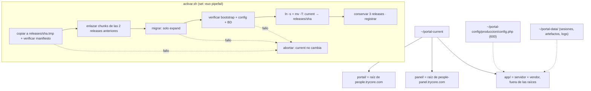
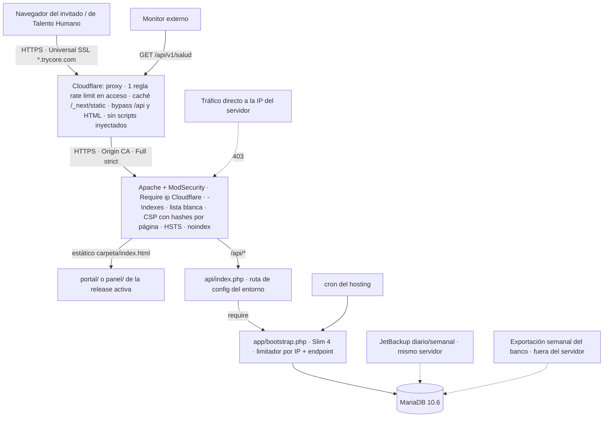

# ADR 0007 — Entornos, CI/CD, despliegue y seguridad perimetral

> Plantilla alineada al método **ADD** (Attribute-Driven Design, Len Bass — *Software Architecture in
> Practice*). Cada sección numerada corresponde a un paso del método. Las decisiones deben trazar a
> [0000-drivers-y-asrs.md](0000-drivers-y-asrs.md) y actualizar
> [_backlog-arquitectonico.md](_backlog-arquitectonico.md). Generada por la skill `setup-architecture`
> (`/build:architect`); un humano la promueve `proposed → accepted`.
>
> **Revisión tras ATAM-lite adversarial:** esta versión incorpora los hallazgos de la evaluación en
> papel: hosts de un solo nivel, CSP con hashes calculados en CI, despliegue atómico por release,
> staging con directorios y rama propios, `trailingSlash`, origen que solo acepta Cloudflare y la
> limitación a **una** regla de rate limiting del plan gratuito.

## 1. Objetivo de la iteración y drivers seleccionados (Pasos 2–3)

- **Objetivo de la iteración:** definir cómo se construye, verifica, despliega, protege, vigila y
  recupera el sistema decidido en ADR-0001 dentro del hosting compartido (cPanel, home
  `/home6/trycorec/`), sin compilar ni instalar `node_modules` en el servidor, con un cambio de
  versión atómico (nunca medio sitio viejo y medio nuevo) y una vuelta atrás en segundos.
- **Elemento(s) a refinar:** asignación física (entornos, carpetas del hosting, hosts), pipeline de
  CI/CD en GitHub Actions, `.cpanel.yml` y script de activación, perímetro (Cloudflare, Apache,
  ModSecurity, cabeceras, CSP) y operación (logs, salud, respaldo).
- **Drivers abordados:**
  - Funcionales: — (transversal; habilita todos los UC en producción).
  - Atributos de calidad: QA-12 (pérdida ≤ 24 h, restauración ≤ 4 h *a validar*, restauración de
    prueba antes de producción), QA-13 (alerta cuando una tarea supera 2× su intervalo; la
    vigilancia no depende solo del cron). Apoya QA-2 (LCP < 2,5 s P75, JS inicial ≤ 200 KB), QA-3
    (límite de Cloudflare sobre el acceso), QA-5 (0 secretos en el bundle, `noindex` en el 100 % de
    las respuestas) y QA-8 (SPF/DKIM/DMARC en pass; los registros viven en la zona de Cloudflare).
  - Restricciones: CON-3 (Local → GitHub → *Update from Remote* → *Deploy* con `.cpanel.yml`; árbol
    limpio; nunca `node_modules`), CON-15 (Cloudflare delante con caché y límite de peticiones;
    ModSecurity activo; listado de directorios desactivado). Apoyo: CON-6 (secretos fuera de la
    raíz pública), CON-16 (JetBackup en el mismo servidor).
  - Concerns: CRN-17 (sin SLO de disponibilidad en el PRD), CRN-18 (ModSecurity puede bloquear POST
    legítimos). Apoyo: CRN-6 (salida HTTPS no verificada), CRN-8 (vigilancia si cae el crontab).

## 2. Conceptos de diseño elegidos (Paso 4)

| Driver | Concepto / Táctica | Alternativas descartadas | Razón |
|--------|--------------------|--------------------------|-------|
| CON-15, QA-5 | **Hosts de un solo nivel bajo `trycore.com`**: `people.trycore.com` (portal), `people-panel.trycore.com` (panel); staging `people-staging.trycore.com` y `people-panel-staging.trycore.com` | Hosts de dos niveles (`panel.people.trycore.com`, `staging.people.trycore.com`, `staging-panel.people.trycore.com`) | El certificado gratuito de Cloudflare (Universal SSL) cubre `trycore.com` y `*.trycore.com`, **un solo nivel**. Un host de dos niveles exige Advanced Certificate Manager (de pago) o queda sin HTTPS en el borde. La separación portal/panel (ADR-0001) se mantiene: son hosts distintos con cookies `__Host-` distintas |
| CON-3 | **Build fuera del servidor + ramas de artefacto** `deploy` (producción) y `deploy-staging` (staging): GitHub Actions compila y empaqueta; cada repositorio de cPanel sigue su rama | (a) Compilar en el servidor con Node; (b) subir `out/` y `vendor/` a `main`; (c) FTP/SFTP manual; (d) `rsync` por SSH desde CI | (a) Node no participa en la v1 (§8.3) y `node_modules` agota inodos; (b) mezcla fuentes con artefactos; (c) sin trazabilidad ni rollback, rompe CON-3; (d) guarda una llave SSH del hosting en GitHub; queda como alternativa equivalente, no como camino principal |
| CON-3 | **Despliegue atómico por release**: cada despliegue crea `releases/<sha>/`, migra, verifica y solo entonces cambia un enlace simbólico `current` por renombre atómico (`mv -T`). Script con `set -euo pipefail`: cualquier fallo aborta **antes** del cambio | (a) `.cpanel.yml` copiando encima de las raíces vivas; (b) rollback por redeploy del commit anterior de `deploy` | (a) una copia a medias deja HTML nuevo apuntando a chunks que aún no están (o al revés) y no hay forma limpia de abortar; (b) tarda un ciclo completo de *Update from Remote* + *Deploy* y repite copias. Con releases, volver atrás es mover el enlace a la release anterior (segundos) |
| CON-3 | **Migraciones expand/contract antes del cambio**: la release N solo **añade** (columnas, tablas, índices); lo que se retira se borra en una release posterior, cuando la release que aún lo usaba ya salió de las 3 conservadas | Migraciones destructivas en la misma release que el código que las necesita | Mientras el esquema sea compatible hacia atrás, las 3 releases conservadas pueden volver a activarse sin tocar la BD |
| CON-3, QA-2 | **Conservar 3 releases y sus chunks**: la release nueva recibe, por enlace duro (`cp -al`), los `/_next/static/` de las 2 anteriores | Borrar la release anterior al activar | Un navegador con la página abierta pide chunks con nombre de la versión que cargó; sin ellos recibe 404 a mitad de sesión. Los enlaces duros **no consumen inodos nuevos** |
| QA-12, QA-13, CRN-18 | **Staging en el mismo hosting, con directorios, rama (`deploy-staging`), repositorio de cPanel, BD, crons y config propios**; la ruta del fichero de config la fija el front controller de cada entorno | (a) Sin staging (local → producción); (b) staging en otro proveedor; (c) staging compartiendo carpetas con producción y distinguiendo por variable de entorno | (a) ModSecurity, Cloudflare, certificado de origen, cron y SMTP solo se prueban en el hosting real; (b) no reproduce esas reglas (y cuesta); (c) cPanel compartido no da variables de entorno por vhost de forma fiable y un error de carpeta mezclaría datos. **Trade-off de negocio abierto** (§6): comparte recursos con producción |
| QA-5 | **CSP estricta con hashes por página calculados en CI**: script *post-build* recorre cada `index.html` del export, calcula `sha256` de cada `<script>` y `<style>` inline (incluido el de `next-themes`) y escribe un `.htaccess` por carpeta con la cabecera CSP de esa página. **Test de Playwright que falla ante cualquier violación de CSP** en consola | (a) `'unsafe-inline'`; (b) nonce; (c) CSP en `<meta>`; (d) `script-src 'self'` sin hashes | (a) anula la CSP; (b) un nonce exige generar HTML por petición y el export es estático; (c) `<meta>` no admite `frame-ancestors` y una segunda CSP en cabecera se intersecta con ella; (d) el export de Next.js (App Router) emite scripts inline de carga del payload y `next-themes` inyecta uno para evitar el parpadeo de tema: sin hashes la página no hidrata |
| QA-5 | **Fuentes autoalojadas** (Geist) y 0 CDNs | Mantener el `@import` de Google Fonts del design system | Google Fonts obliga a abrir `style-src`/`font-src` a terceros y filtra la IP del invitado a Google |
| QA-2, CON-15 | **`trailingSlash: true`** en ambos `next.config`: cada ruta se exporta como `carpeta/index.html` que Apache sirve con `DirectoryIndex`, sin reglas de reescritura | `trailingSlash: false` (`ruta.html`) con reglas `RewriteRule` para quitar la extensión | Menos `mod_rewrite` = menos superficie y menos choques con ModSecurity; además cada página tiene su carpeta, donde vive su `.htaccess` de CSP. `/ruta` sin barra recibe un 301 de `mod_dir` a `/ruta/` |
| CON-15, QA-3 | **Origen que solo acepta IPs de Cloudflare**: el `.htaccess` raíz de cada host exige `Require ip` con los rangos publicados de Cloudflare (IPv4 e IPv6), versionados en el repo | Origen abierto a Internet (la IP del servidor se puede descubrir y saltarse Cloudflare) | Sin esta regla el rate limiting, la caché y el ocultamiento de IP se esquivan pegando directo al servidor. Se descarta *Authenticated Origin Pulls* (mTLS) porque exige configurar Apache a nivel de vhost, fuera del alcance del hosting compartido |
| CON-15 | **Certificado de origen de Cloudflare (Origin CA)** instalado en cPanel para los 4 hosts, con SSL *Full (strict)* | AutoSSL como certificado de origen | Si el origen solo acepta Cloudflare, la validación HTTP de AutoSSL puede fallar detrás del proxy y el certificado caducar sin aviso; Origin CA dura hasta 15 años y Cloudflare lo valida. AutoSSL queda como alternativa si cPanel no permite instalar el certificado |
| CON-15, QA-3 | **Rate limiting en dos capas**: en Cloudflare, **una sola regla** (el plan gratuito da 1 por zona) cuya expresión agrupa los endpoints de acceso de portal y panel; en la aplicación, un **limitador propio** por IP + endpoint (tabla MariaDB, ventana fija) para el resto (`/api/v1/eventos`, solicitudes, requerimiento pegado, voto de sondeo) y como segunda barrera en el acceso | (a) Una regla de Cloudflare por endpoint (necesita plan de pago); (b) solo aplicación; (c) meter `/api/v1/eventos` en la misma regla | (a) coste; (b) la aplicación sola no frena volumen antes de que llegue a PHP; (c) el contador de la regla es único por IP: el tráfico de eventos consumiría el cupo del acceso y bloquearía a un invitado legítimo. La IP del cliente sale de `CF-Connecting-IP`, confiable **solo** porque el origen ya rechaza lo que no viene de Cloudflare |
| CON-15, QA-5 | **Defensa en profundidad**: Cloudflare (proxy, caché solo de `/_next/static/*`, *bypass* de `/api/*` y del HTML, funciones que inyectan scripts desactivadas) + Apache (`-Indexes`, `.htaccess` de lista blanca, 404/403 propias) + cabeceras estrictas + aplicación | Confiar solo en la validación de la aplicación | Cada capa cierra un hueco distinto: prueba masiva de códigos, listado de carpetas, clickjacking, indexación, salto del borde |
| QA-5, CON-6 | **Código PHP fuera de toda raíz pública**: en cada release `app/` (servidor + `vendor/`) es hermano de `portal/` y `panel/`, que son las raíces; en cada raíz solo `api/index.php`, que fija la ruta de config del entorno y hace `require` del bootstrap de su propia release | PHP completo dentro de la raíz pública protegido por `.htaccess` | Un error de configuración de Apache expondría fuentes o `vendor/`; fuera de la raíz no hay ruta HTTP posible |
| QA-5, CON-6 | **Secretos en `~/portal-config/<entorno>/config.php`**, permisos `600`, fuera del repo, de las releases y de las raíces | Variables de entorno de Apache; `.env` en el repo o en la raíz | cPanel compartido no ofrece variables por vhost de forma fiable; un `.env` desplegado puede servirse como texto |
| CRN-18 | **Humo con cargas reales** (solicitud, requerimiento pegado, importación) en staging tras Cloudflare + ModSecurity antes de producción; **excepciones por id de regla** pedidas al proveedor | Desactivar ModSecurity en el dominio | Quitarlo elimina una capa; la excepción puntual es el mínimo necesario |
| QA-13, CRN-8 | **Observabilidad mínima**: logs PHP, de cron y de despliegue en carpeta privada con rotación; `GET /api/v1/salud` para un **monitor externo**; alertas por correo (ADR-0005) | APM/SaaS de logs; solo el correo de salida del cron | Un APM envía datos a terceros y no cabe en el hosting; el monitor externo cumple «la vigilancia no depende solo del cron» |
| QA-12, CON-16 | **JetBackup diario/semanal + exportación semanal del banco fuera del servidor + restauración de prueba obligatoria** | Solo JetBackup | JetBackup guarda en el mismo servidor (riesgo aceptado §10.3); la exportación semanal reduce el daño si se pierde el servidor |
| CRN-17 | **Declarar el hueco**: no se inventa un SLO; se propone un objetivo operativo (RPO 24 h / RTO 4 h) a validar | Fijar un 99,9 % sin base | El hosting compartido no ofrece garantía que sostenga un SLO |

## 3. Instanciación: responsabilidades e interfaces (Paso 5)

### 3.1 Entornos

| Entorno | Hosts | Rama que sigue cPanel | Carpetas en el hosting | BD | Config |
|---------|-------|------------------------|------------------------|----|--------|
| Local | `localhost` | — | — (Docker Compose **solo en desarrollo**: PHP 8.3, MariaDB 10.6, Apache 2.4) | local, datos ficticios | `config.local.php`, token personal de Gemini |
| Staging | `people-staging.trycore.com`, `people-panel-staging.trycore.com` | `deploy-staging` | `~/repositories/portal-staging/`, `~/portal-staging-releases/<sha>/`, `~/portal-staging-current` (enlace), `~/portal-staging-data/` | `…_ps_staging`, datos ficticios | `~/portal-config/staging/config.php`; SMTP solo a destinatarios internos |
| Producción | `people.trycore.com`, `people-panel.trycore.com` | `deploy` | `~/repositories/portal/`, `~/portal-releases/<sha>/`, `~/portal-current` (enlace), `~/portal-data/` | `…_ps` | `~/portal-config/produccion/config.php` |

- Raíces públicas configuradas en cPanel: `people.trycore.com` → `~/portal-current/portal`,
  `people-panel.trycore.com` → `~/portal-current/panel` (staging: lo mismo bajo
  `~/portal-staging-current/`).
- Lo que **sobrevive entre releases** vive fuera de ellas, en `~/portal-data/` (sesiones PHP,
  artefactos de evidencia, logs) y `~/portal-config/`. Una release nunca guarda estado.
- Cada release contiene `portal/`, `panel/`, `app/` (servidor + `vendor/`), `MANIFIESTO.sha256` y
  `REVISION` (sha de `main`).

### 3.2 CI (GitHub Actions)

- `ci.yml` (en cada PR): lint · typecheck · Vitest (`packages/motor`, componentes de `packages/ui`)
  · PHPUnit (dominio y aplicación, con servicio MariaDB 10.6) · `next build` + **script post-build de
  CSP** · Playwright de humo y **test de CSP** contra un contenedor **Apache 2.4** (`AllowOverride
  All`, `mod_headers`, `mod_dir`) que sirve el export con los mismos `.htaccess` que producción ·
  Lighthouse CI (LCP y JS inicial ≤ 200 KB comprimido) · axe · grep de secretos sobre `apps/*/out` ·
  test de contrato del catálogo (0 campos B.4).
- **Script post-build de CSP** (`scripts/csp-hashes.mjs`):
  - recorre `apps/*/out/**/index.html` y `404.html`;
  - calcula `sha256` (base64) de cada `<script>` sin `src` y de cada `<style>` inline, incluido el
    script de `next-themes`;
  - escribe en la carpeta de cada página un `.htaccess` con
    `<Files "index.html"> Header always set Content-Security-Policy "…'sha256-…'…" </Files>`;
  - **falla el build** si encuentra manejadores inline (`onclick=`…), URL `javascript:` o un
    atributo `style=""` en el HTML (este último obligaría a `'unsafe-hashes'`; se corrige en el
    componente, no en la política).
- **Test de CSP** (Playwright): visita todas las rutas del manifiesto del export de portal y panel
  en tema claro, oscuro y sistema; falla ante cualquier evento `securitypolicyviolation` o mensaje
  de consola que contenga `Content Security Policy`. El mismo test corre como humo en staging, tras
  Cloudflare, con las cabeceras reales.
- `deploy.yml`:
  - en merge a `main`: `next build` (`output: 'export'`, `trailingSlash: true`) de `apps/portal` y
    `apps/panel` · script de CSP · `composer install --no-dev --optimize-autoloader` · genera
    `MANIFIESTO.sha256` · commit en `deploy-staging` con `.cpanel.yml` y front controllers de
    staging, mensaje `deploy: <sha de main>`;
  - **promoción a producción** (`workflow_dispatch` tras humo verde en staging): publica el
    **mismo artefacto** en `deploy`; solo cambian `.cpanel.yml` y los dos `api/index.php`, que
    apuntan a la config de producción.
- Tarea mensual: compara los rangos publicados de Cloudflare con el fichero versionado y abre un
  PR si cambiaron.

### 3.3 Hosting: activación atómica

- `.cpanel.yml` tiene **una sola tarea**: `/bin/bash deploy/activar.sh <entorno>`.
- `deploy/activar.sh` (`set -euo pipefail`):
  1. copia el artefacto a `releases/<sha>.tmp/`, verifica `MANIFIESTO.sha256` y renombra a
     `releases/<sha>/`;
  2. enlaza con `cp -al` los `/_next/static/` de las 2 releases anteriores dentro de la nueva;
  3. `php app/bin/migrar.php` — solo migraciones *expand*; si falla, aborta;
  4. `php app/bin/verificar.php` — carga el bootstrap, lee la config, conecta a la BD; si falla,
     aborta;
  5. cambia el enlace: `ln -s releases/<sha> current.tmp && mv -Tf current.tmp current`;
  6. borra releases más allá de las 3 últimas;
  7. registra sha, hora y resultado en `~/portal-data/logs/despliegues.log`.
- **Rollback:** `deploy/rollback.sh <sha>` (Terminal de cPanel o SSH) repite el paso 5 con una de
  las 3 releases conservadas. El camino Git (revertir `deploy` + *Update from Remote* + *Deploy*)
  sigue disponible si la release ya no está en disco.
- **Contract:** una migración que borra solo entra cuando ninguna de las 3 releases conservadas
  depende de lo borrado.
- **Plan B del cambio atómico:** si cPanel no acepta una raíz pública a través de un enlace
  simbólico, la raíz es una carpeta real y el paso 5 son dos `mv` (vieja → `.old`, nueva → raíz);
  la ventana sin sitio es de milisegundos, no atómica.
- Crons de cada entorno apuntan a `~/portal-current/app/bin/…` (o `~/portal-staging-current/…`).

### 3.4 Interfaces / contratos

- **Front controller** (`portal/api/index.php`, `panel/api/index.php`):
  `define('PORTAL_CONFIG', '/home6/trycorec/portal-config/<entorno>/config.php'); require __DIR__ . '/../../app/bootstrap.php';`
  — la ruta de config es lo único que distingue un entorno de otro en el artefacto.
- **Cabeceras:**
  - `.htaccess` raíz (todas las respuestas): `Content-Security-Policy: default-src 'self'; script-src 'self'; style-src 'self'; font-src 'self'; img-src 'self' data:; connect-src 'self'; frame-ancestors 'none'; base-uri 'self'; form-action 'self'; object-src 'none'` (política por defecto para lo que no es página) ·
    `Strict-Transport-Security: max-age=31536000` · `X-Frame-Options: DENY` ·
    `Referrer-Policy: strict-origin` · `X-Content-Type-Options: nosniff` ·
    `X-Robots-Tag: noindex, nofollow` en **todas** las respuestas (RF-1.5).
  - `.htaccess` de cada página (generado): la misma política con los `'sha256-…'` de esa página en
    `script-src`/`style-src`.
  - Cookies `__Host-ps` / `__Host-pp` (`Secure; HttpOnly; SameSite=Lax; Path=/`, sin `Domain`).
- **Apache (`.htaccess` raíz):** `Options -Indexes`; `Require ip` con los rangos de Cloudflare;
  lista blanca: deniega todo salvo `api/index.php`, `index.html`, `404.html` y extensiones
  estáticas; `ErrorDocument 404 /404.html` y 403 propio; sin `RewriteRule` para páginas.
- **Cloudflare (zona `trycore.com`):**
  - proxy naranja en los 4 hosts; SSL *Full (strict)* con Origin CA; registros de correo de
    `people.trycore.com` (SPF, DKIM, DMARC, MX si aplica) en gris, solo DNS;
  - caché solo de `/_next/static/*` (inmutable); *bypass* de `/api/*` y del HTML;
  - *Configuration Rule* para los 4 hosts que desactiva Rocket Loader, ofuscación de correos y
    Web Analytics (inyectan scripts inline que la CSP bloquearía);
  - **regla única de rate limiting** (plan gratuito: contador por IP, periodo 10 s, bloqueo 10 s):
    `(http.request.method eq "POST" and http.request.uri.path in {"/api/v1/acceso/enlace" "/api/v1/acceso/codigo" "/api/v1/acceso/verificar" "/api/v1/panel/acceso/codigo" "/api/v1/panel/acceso/verificar"})`
    → bloquear por encima de 20 peticiones / 10 s *a validar*. La lista exacta sale del contrato de
    ADR-0002; si el plan admite `starts_with`, se usa el prefijo `/api/v1/acceso/` y
    `/api/v1/panel/acceso/`.
- **Limitador de la aplicación:** tabla `limites` (clave = endpoint + IP de `CF-Connecting-IP`,
  ventana fija); umbrales por endpoint en config; responde `429` con `Retry-After`. Se suma a la
  tabla `intentos` de ADR-0002 (5 por enlace+correo, 5 por IP en 15 min).
- **Salud:** `GET /api/v1/salud` → `200 {"bd":"ok","crons":{"reintento":"ok",…},"release":"<sha>"}`
  o `503`; sin datos sensibles; consultado por un monitor externo cada 5 min.

### 3.5 Verificaciones pendientes en el hosting (antes del primer despliegue real)

| # | Verificación | Por qué | Cómo se mide |
|---|--------------|---------|--------------|
| V-1 | Inodos tras el primer despliegue completo (2 entornos × 3 releases + repositorios) | Cuota 600 000, ya en 20,79 % | `find ~ -xdev \| wc -l` o cuota de cPanel; umbral de alerta 50 % |
| V-2 | Permiso para crear triggers en MariaDB | ADR-0003 (auditoría) | `CREATE TRIGGER` de prueba en la BD de staging |
| V-3 | Salida HTTPS a HubSpot, Gemini y SMTP | CRN-6; `curl` desde el servidor | `curl -I` a cada API desde Terminal |
| V-4 | ModSecurity con cargas reales | CRN-18 | Humo de staging: solicitud, requerimiento pegado, importación |
| V-5 | Restauración de prueba | QA-12 | Restaurar JetBackup en la BD de staging y cronometrar |
| V-6 | SPF, DKIM y DMARC de `people.trycore.com` en pass | QA-8 | Cabeceras `Authentication-Results` de un correo a Gmail y a un buzón corporativo |
| V-7 | Raíz pública a través de enlace simbólico y `.cpanel.yml` que corta ante un fallo | Despliegue atómico | Despliegue de staging con un paso forzado a fallar |
| V-8 | Si el hosting reescribe la IP del visitante (`mod_remoteip`/`mod_cloudflare`) | `Require ip` de Cloudflare bloquearía a todos | Probar `Require ip` en staging y leer `REMOTE_ADDR` en `/api/v1/salud` de staging |
| V-9 | Instalación de Origin CA en cPanel y regla de rate limiting libre en la zona | La zona `trycore.com` es compartida con el sitio corporativo | Panel SSL/TLS de cPanel; lista de reglas de Cloudflare |
| V-10 | Caducidad de la caché de rutas de PHP tras el cambio de enlace | `realpath_cache_ttl` (120 s por defecto) puede servir la release vieja un rato | `release` de `/api/v1/salud` justo después de activar en staging |

## 4. Vistas y registro de la decisión (Paso 6)

```mermaid
flowchart LR
    DEV[Local · Node 20 + PHP 8.3 + MariaDB 10.6 + Apache 2.4] -->|push rama + PR| GH[(GitHub)]
    GH -->|PR| CI[ci.yml: lint · typecheck · Vitest · PHPUnit · build + hashes CSP · Playwright + test CSP en Apache · Lighthouse · axe · secretos · contrato]
    CI -->|verde + merge a main| DP[deploy.yml: export ×2 · hashes CSP · composer --no-dev · manifiesto]
    DP -->|commit 'deploy: sha'| DS[(rama deploy-staging)]
    DS -->|Update from Remote + Deploy| ST[cPanel · repositories/portal-staging]
    ST -->|activar.sh staging| STR[portal-staging-releases/sha → portal-staging-current]
    STR -->|humo + test CSP verdes| PR[promoción manual: mismo artefacto]
    PR -->|commit 'deploy: sha'| D[(rama deploy)]
    D -->|Update from Remote + Deploy| CP[cPanel · repositories/portal]
    CP -->|activar.sh produccion| REL[portal-releases/sha]
```

**Decisión:** tres entornos (local, staging en el mismo hosting con carpetas, rama, BD, crons y
config propios, producción) en hosts de un solo nivel (`people.trycore.com`,
`people-panel.trycore.com`, `people-staging.trycore.com`, `people-panel-staging.trycore.com`); CI en
GitHub Actions como única puerta de calidad, incluida una CSP con hashes por página calculados al
compilar y un test que falla ante cualquier violación; un único artefacto precompilado que pasa por
`deploy-staging` y se promueve a `deploy`; activación atómica por release con migraciones
expand/contract, 3 releases conservadas y rollback por cambio de enlace; `trailingSlash: true` sin
reescrituras; origen que solo acepta Cloudflare; una regla de rate limiting de Cloudflare para el
acceso más limitador en la aplicación; observabilidad mínima propia con monitor externo; respaldo
JetBackup + exportación semanal + restauración de prueba.

**Trade-offs aceptados:**
- Las ramas de artefacto duplican builds en el historial de Git, a cambio de un servidor que no
  compila.
- *Update from Remote* + *Deploy* sigue siendo un paso manual en cPanel: el despliegue es «un clic
  tras el merge», no continuo.
- 3 releases por entorno multiplican los ficheros de `vendor/` y del export (los chunks
  compartidos no, van por enlace duro): se mide en V-1.
- Staging comparte servidor con producción (trade-off de negocio abierto, §6).
- La regla única de Cloudflare solo cubre el acceso; el resto del abuso lo frena PHP, después de
  que la petición ya consumió un proceso del hosting.
- Autoalojar Geist y prohibir `style=""` inline obliga a tocar el design system del prototipo.
- Sin SLO: no se puede prometer disponibilidad a las cuentas.

## 5. Análisis del diseño (Paso 7)

> Resultado de la evaluación ATAM-lite adversarial. ✅ solo con medida automática o plan de
> verificación concreto; ⚠️ cuando depende de algo aún no comprobado en el hosting o de una decisión
> de negocio.

| Driver | ✅/⚠️/❌ | Evidencia / medida | Riesgo residual |
|--------|---------|--------------------|-----------------|
| CON-3 | ⚠️ | Servidor recibe solo artefactos (0 `node_modules`, 0 compilación); activación con `set -euo pipefail` que no cambia `current` si falla copia, manifiesto, migración o verificación; rollback por enlace en segundos; 3 releases con chunks por enlace duro | Pendientes en el hosting: V-1 inodos tras el primer despliegue, V-2 triggers, V-3 salida HTTPS, V-4 ModSecurity, V-5 restauración de prueba, V-6 SPF/DKIM/DMARC, V-7 enlace simbólico como raíz y corte de `.cpanel.yml` ante fallo, V-10 caché de rutas de PHP (hasta 120 s con la release vieja; mitigado porque expand/contract mantiene compatibles ambas) |
| CON-15 | ⚠️ | Proxy en los 4 hosts con Universal SSL de un nivel; Full strict con Origin CA; `Require ip` de Cloudflare en el origen; `-Indexes`; lista blanca; 404/403 propias; ModSecurity activo; regla única de rate limiting en acceso | V-8: si el hosting reescribe `REMOTE_ADDR` con la IP del visitante, `Require ip` bloquea todo y hay que cambiar de técnica; V-9: la zona `trycore.com` es compartida y su única regla gratuita puede estar ya en uso por el sitio corporativo; los rangos de Cloudflare cambian (tarea mensual) |
| QA-3 (apoyo) | ⚠️ | Dos capas: regla de Cloudflare por IP en los endpoints de acceso + tabla `intentos` (ADR-0002) + limitador propio; `CF-Connecting-IP` confiable porque el origen solo acepta Cloudflare | Umbral 20/10 s *a validar* contra NAT corporativos (varios invitados tras una IP); el plan gratuito solo cuenta por IP y bloquea 10 s |
| QA-5 (apoyo) | ✅ | Grep de secretos en `out/`; test de contrato del catálogo; `X-Robots-Tag: noindex` global; PHP y config fuera de las raíces; CSP con hashes generada en CI, build que falla ante inline no permitido y test de Playwright que falla ante cualquier violación, en CI (Apache) y en staging (tras Cloudflare) | Una función de Cloudflare activada a mano que inyecte scripts rompería páginas: la detecta el test de humo de staging, no producción |
| QA-2 (apoyo) | ✅ | Lighthouse CI con presupuesto (LCP, JS ≤ 200 KB) bloquea el merge; `/_next/static/*` inmutable en caché de Cloudflare; sin reescrituras | El presupuesto mide en laboratorio; el P75 de campo no se mide sin analítica externa |
| QA-8 (apoyo) | ⚠️ | Registros de correo de `people.trycore.com` en la zona, en modo solo DNS | V-6 sin hacer; IP compartida 192.99.84.46 y staging enviando desde el mismo servidor afectan la reputación |
| QA-12 | ⚠️ | JetBackup diario cumple pérdida ≤ 24 h; restauración de prueba cronometrada (V-5) obligatoria antes de producción; exportación semanal fuera del servidor | RTO 4 h *a validar*; pérdida del servidor = riesgo aceptado; destino y responsable de la exportación semanal sin definir |
| QA-13 | ⚠️ | Cada cron registra su corrida; `/api/v1/salud` expone estado y release; monitor externo que no depende del cron | Monitor externo no elegido (verificar que solo ve el estado, sin datos) |
| CRN-17 | ⚠️ | Se declara el hueco; se propone RPO 24 h / RTO 4 h | Sin SLO ni ventana de mantenimiento acordada con Dirección |
| CRN-18 | ⚠️ | Humo con cargas reales en staging tras Cloudflare + ModSecurity antes de producción; excepciones por id de regla | Staging y producción pueden tener reglas ModSecurity distintas por host; el proveedor no tiene plazo conocido para excepciones |

**Drivers no resueltos en esta iteración:** SLO (CRN-17) y RTO (QA-12) vuelven al backlog
arquitectónico como decisiones de negocio; las verificaciones V-1…V-10 son tareas de operación
previas al primer despliegue real; elección del monitor externo y del destino de la exportación
semanal quedan como tareas de operación.

## 6. Consecuencias

- **Positivas:**
  - HTTPS en el borde sin coste: los 4 hosts caben en el certificado gratuito de Cloudflare.
  - Despliegues reproducibles y trazables: el mismo artefacto (mismo sha) pasa por staging y llega
    a producción.
  - Nunca hay medio sitio: la versión cambia de golpe o no cambia; un fallo de migración deja la
    versión anterior sirviendo.
  - Rollback en segundos a cualquiera de las 3 releases conservadas; las pestañas abiertas no
    pierden sus chunks.
  - La CSP deja de ser una promesa: CI la calcula y un test la hace cumplir en cada PR.
  - Nadie puede saltarse Cloudflare pegando directo al servidor.
  - Ningún código, dependencia ni secreto es alcanzable por HTTP.
- **Negativas:**
  - Paso manual en cPanel para publicar (*Update from Remote* + *Deploy*), dos veces por versión
    (staging y producción).
  - Más inodos: 3 releases por entorno y un segundo repositorio de cPanel.
  - El design system del prototipo cambia: fuentes autoalojadas y sin `style=""` inline.
  - Solo el acceso queda protegido en el borde; el resto del rate limiting cuesta un proceso PHP.
  - Los hosts de un nivel y el traslado de `/api/v1/eventos` al limitador de la aplicación obligan a mantener alineados ADR-0001, 0002, 0004 y 0006 (alineados en la evaluación ATAM-lite).
- **Riesgos:**
  - Si el hosting reescribe la IP del visitante (V-8), el filtro por IP de Cloudflare no sirve tal
    cual y el origen vuelve a quedar expuesto hasta elegir otra técnica.
  - La zona `trycore.com` es compartida con el sitio corporativo: su única regla gratuita de rate
    limiting y sus ajustes globales (Rocket Loader, etc.) afectan a ambos (V-9).
  - Migraciones que no respeten expand/contract rompen el rollback: exige disciplina en la revisión
    de cada PR con migración.
  - Tras activar, PHP puede servir hasta 120 s la release anterior (V-10).
  - Inodos: estimado sin medir (V-1).
- **Trade-offs de negocio abiertos:**
  - **Staging en el mismo servidor que producción.** Ahorra un hosting y es el único modo de probar
    ModSecurity, cron y SMTP reales, pero comparte CPU, memoria, inodos e IP de correo: una prueba
    pesada o un envío masivo de staging degrada producción y su reputación de correo. Alternativa:
    un segundo hosting pequeño del mismo proveedor (coste mensual, reglas casi iguales). Decide
    Dirección con Tecnología; mientras tanto, en staging no se hacen pruebas de carga y el SMTP solo
    envía a destinatarios internos.
- **Operacionales:**
  - Crear los 4 subdominios en cPanel (quedan cupos: 19/50 usados) con sus raíces en
    `…-current/portal` y `…-current/panel`, las 2 BD, las carpetas de config y datos y los crons de
    cada entorno.
  - Instalar Origin CA, crear la regla de rate limiting y la *Configuration Rule* en Cloudflare.
  - Ejecutar V-1…V-10 y dejar el resultado por escrito antes del primer envío real.
  - Pedir al proveedor excepciones de ModSecurity por id de regla cuando el humo lo exija.

## 7. Trazabilidad

- Drivers: [0000-drivers-y-asrs.md](0000-drivers-y-asrs.md) — CON-3, CON-15, QA-12, QA-13, CRN-17,
  CRN-18 (apoyo: QA-2, QA-3, QA-5, QA-8, CON-6, CON-16, CRN-6, CRN-8).
- PRD: [portal-people-service.md](../01-prd/portal-people-service.md) — §8 (seguridad, `noindex`
  RF-1.5), §8.3 (plataforma, despliegue, respaldo, perímetro, vigilancia de tareas), §10.3 (pérdida
  del servidor con sus respaldos: riesgo aceptado); [requisitos-tecnicos-hosting.md](../01-prd/requisitos-tecnicos-hosting.md)
  — Git Version Control y `.cpanel.yml`, cuotas (inodos 20,79 %, subdominios 19/50), SSH y
  Terminal, Cloudflare, ModSecurity, Indexes, Error Pages, JetBackup, home `/home6/trycorec/`.
- ADR relacionadas: [0001](0001-estilo-y-stack-base.md) (monorepo, export estático, `next-themes`,
  hosts — a alinear con los nuevos nombres), [0002](0002-identidad-acceso-y-sesiones.md)
  (endpoints de acceso y tabla `intentos`, cookies `__Host-`), [0003](0003-datos-persistencia-y-auditoria.md)
  (triggers, V-2), ADR-0005 (tareas programadas, alertas, salud), [0006](0006-telemetria-y-atribucion.md)
  (`/api/v1/eventos` pasa al limitador de la aplicación; CSP sin analítica externa).
- Stack operacionalizado en: `.claude/config/stack-allowlist.json` — herramientas de CI (Vitest,
  Playwright, Lighthouse CI, axe, PHPUnit), contenedor Apache 2.4 solo en CI y desarrollo, fuente
  Geist autoalojada; Docker Compose solo como herramienta de desarrollo local, nunca en el hosting.
