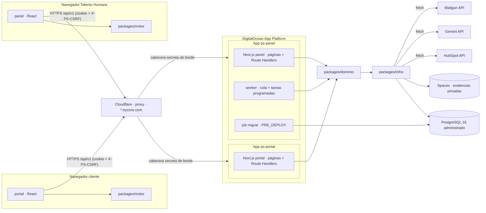
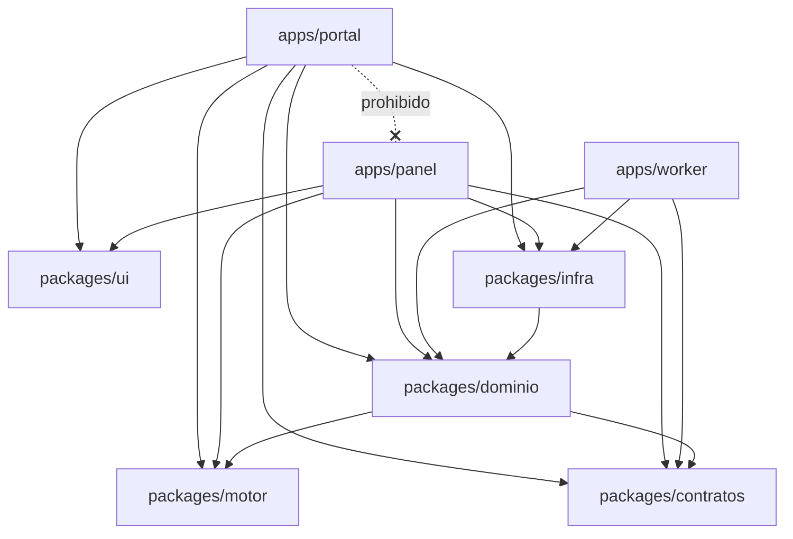

# ADR 0008 — Plataforma en contenedores, stack TypeScript y estructura del sistema

> Plantilla alineada al método **ADD** (Attribute-Driven Design, Len Bass — *Software Architecture in
> Practice*). Cada sección numerada corresponde a un paso del método. Las decisiones deben trazar a
> [0000-drivers-y-asrs.md](0000-drivers-y-asrs.md) y actualizar
> [_backlog-arquitectonico.md](_backlog-arquitectonico.md). Generada por la skill `setup-architecture`
> (`/build:architect`); un humano la promueve `proposed → accepted`.
>
> **Sustituye a [ADR-0001](0001-estilo-y-stack-base.md).** Conserva de ella todo lo que no dependía del
> hosting compartido: dos aplicaciones y dos hosts de un solo nivel, motor de búsqueda TypeScript puro en
> el navegador, catálogo como proyección autenticada desde la BD, CSRF por cabecera + `Origin`, estado de
> búsqueda en la URL, monorepo con paquetes compartidos y las verificaciones de móvil y accesibilidad.
> Cambia la plataforma y el lenguaje del servidor.

## 1. Objetivo de la iteración y drivers seleccionados (Pasos 2–3)

- **Objetivo de la iteración:** rehacer el estilo estructural y el stack del sistema completo sobre la
  plataforma que decidió el sponsor el 2026-09-25 (contenedores Docker portables, destino inicial
  DigitalOcean App Platform; TypeScript con Next.js en servidor y API; worker Node; PostgreSQL
  administrado; Mailgun), sin perder ninguna garantía que ADR-0001 ya daba.
- **Elemento a refinar:** sistema completo (re-iteración top-down).
- **Drivers abordados:**
  - Funcionales: UC-4 (catálogo solo con sesión), UC-5 (motor determinista).
  - Atributos de calidad: QA-1 (filtrado < 1 s), QA-2 (LCP < 2,5 s), QA-4 (parte estructural: 0 rutas
    del panel alcanzables desde el host del cliente), QA-18 (móvil), QA-19 (WCAG 2.1 AA).
  - Restricciones: **CON-18** (contenedores Docker portables, destino DO App Platform), **CON-19**
    (PostgreSQL administrado), CON-9, CON-12, CON-13, CON-14. Sustituye el tratamiento de CON-1, CON-2 y
    CON-3, que quedan reemplazadas (ver 0000).
  - Concerns: CRN-19 (entrada por instrucción retirable).
- **Fuera de alcance aquí:** trabajo diferido, worker y correo ([ADR-0009](0009-trabajo-diferido-worker-y-correo.md));
  entornos, despliegue, perímetro y respaldo ([ADR-0010](0010-entornos-despliegue-y-perimetro.md)).
  Sesiones, datos, búsqueda y telemetría conservan su diseño en ADR-0002, 0003, 0004 y 0006, con la
  enmienda de plataforma que cada uno lleva al final.

## 2. Conceptos de diseño elegidos (Paso 4)

| Driver | Concepto / Táctica | Alternativas descartadas | Razón |
|--------|--------------------|--------------------------|-------|
| CON-18, CON-19 | **Un solo lenguaje de extremo a extremo (TypeScript)**: interfaz, API, dominio, worker y migraciones | Mantener PHP para la API y Node solo para el worker; Python/FastAPI | Decisión del sponsor. Un solo lenguaje permite que el servidor use **el mismo** paquete de motor y los mismos esquemas de contrato que el navegador (se cierra R-20: ya no hay una segunda implementación parcial del filtro de ciudad) |
| QA-2, UC-4 | **Next.js 15 completo (App Router, `output: "standalone"`, runtime `nodejs`)**: páginas renderizadas por el servidor de Next y API en **Route Handlers** (`app/api/v1/**/route.ts`). Imagen Docker por aplicación | Mantener `output: "export"` + API aparte (dos procesos por host sin ganancia); Express/Fastify detrás de un Next estático (un framework más); Edge runtime (sin `pg` ni `crypto` completo) | Next ya estaba en el stack por el handoff; con servidor propio desaparecen las restricciones del export (sin middleware, sin nonce de CSP, sin rutas dinámicas) y la API vive en el mismo proceso y el mismo host, así que el aislamiento por host de ADR-0001 se mantiene sin front controllers |
| UC-4, QA-5, CON-10 | **Ningún dato de inventario sale por el render del servidor salvo por la proyección**: un Server Component solo obtiene perfiles a través del puerto `ProyeccionCatalogo`, cuya salida pasa por el **mismo esquema `zod` estricto** que `GET /api/v1/catalogo` antes de cruzar a un componente cliente. `import "server-only"` en `packages/dominio` y `packages/infra` impide que acaben en un bundle de cliente | Dejar que los Server Components lean repositorios libremente (el payload RSC viaja dentro del HTML y se saltaría el contrato del catálogo) | Con renderizado en servidor el HTML es un segundo canal de salida; ADR-0001 lo evitaba por construcción (export sin datos) y aquí se cierra por contrato y por test (V-4) |
| QA-3, CON-22 | **Middleware en runtime Node con `next ≥ 15.5`** (`export const config = { runtime: "nodejs", … }`), comparación de la cabecera de borde con `crypto.timingSafeEqual`, y rechazo explícito de la cabecera interna `x-middleware-subrequest` si llega desde fuera | Middleware en Edge (por defecto antes de 15.5: sin `crypto` de Node); Next < 15.2.3 (CVE-2025-29927: la cabecera `x-middleware-subrequest` permite saltarse el middleware en Next autoalojado) | El middleware es la barrera de la cabecera de borde (ADR-0010); debe correr donde exista comparación en tiempo constante y en una versión sin el salto conocido |
| QA-3, QA-4 | **Solo Route Handlers para mutar; Server Actions prohibidas** (regla de lint que falla ante `"use server"`) | Server Actions (tienen su propio control de `Origin`) | Un solo mecanismo de CSRF (cabecera `X-PS-CSRF` + `Origin` exacto, ADR-0002) auditable en una sola capa; las Server Actions crean endpoints implícitos que el test de la matriz rol × acción no ve |
| Modificabilidad, CON-9 | **Monolito modular hexagonal en paquetes**: `packages/dominio` (entidades, reglas, casos de uso y puertos, sin dependencias de infraestructura) y `packages/infra` (adaptadores: PostgreSQL, HubSpot, Gemini, Mailgun, Spaces). Los Route Handlers y el worker son adaptadores de entrada delgados que llaman casos de uso | Lógica dentro de los Route Handlers; microservicios por contexto | Aísla las fronteras de `build-config.json`; el dominio se prueba sin red ni BD; portal, panel y worker comparten los mismos casos de uso sin duplicar |
| CON-19, QA-9, QA-11 | **PostgreSQL 16 con `pg` (node-postgres) + Kysely** (constructor de consultas tipado, sin ORM) y **migraciones con el `Migrator` de Kysely** en ficheros TypeScript versionados | Prisma (ya en `deny_examples`: motor binario, transacciones interactivas limitadas, `SKIP LOCKED` y *advisory locks* solo por SQL crudo); Drizzle (válido, pero su capa de relaciones no aporta y su kit de migraciones genera SQL que se revisa peor); `pg` sin constructor (sin tipado de columnas) | Control fino de transacciones, `FOR UPDATE SKIP LOCKED`, `pg_advisory_xact_lock` y `LISTEN/NOTIFY` (ADR-0009) con tipos generados del esquema; conserva el espíritu «SQL a mano» de ADR-0001 con verificación de tipos |
| Modificabilidad, QA-5 | **`zod` como fuente única de contratos** en `packages/contratos`: cada Route Handler valida la entrada y la salida con el mismo esquema que usa el cliente; el catálogo tiene esquema de salida *estricto* (lista blanca: un campo extra hace fallar el test de contrato) | JSON Schema + validador aparte; tipos sin validación en tiempo de ejecución | Tipos y validación en un solo artefacto compartido por navegador, servidor y worker |
| QA-1, UC-5, CRN-19 | **Motor de búsqueda como paquete TypeScript puro** (`packages/motor`) que corre **en el navegador** (sin cambios respecto a ADR-0001). El servidor lo importa además para decidir la ciudad (ADR-0003, enmienda) | Motor en el servidor con una llamada por filtro | Con ~30 perfiles el cálculo local es instantáneo en 4G; un solo motor para panel, resultados y servidor |
| RF-8.1.4, QA-4 | **Dos aplicaciones Next y dos hosts de un solo nivel** (sin cambios de nombres): `people.trycore.com` (portal) y `people-panel.trycore.com` (panel); staging `people-staging.trycore.com` y `people-panel-staging.trycore.com`. Cada aplicación es **una App de App Platform distinta** con su propio dominio, su propia cookie, sus propias variables secretas y **su propio rol de BD** | Una sola App con dos componentes enrutados por host (la especificación de *ingress* admite reglas por `authority`, pero una regla mal escrita o una ruta por defecto dejaría el panel alcanzable desde el host del cliente, y ambos componentes compartirían secretos y ciclo de despliegue) | Aislamiento por construcción, no por configuración de enrutamiento: el panel no es alcanzable desde el host del cliente ni por ruta ni por cookie ni por build, y un fallo del portal no expone secretos del panel. Hosts de un nivel porque el certificado gratuito de Cloudflare solo cubre `*.trycore.com` (ADR-0010) |
| CON-9, QA-5 | **Roles de PostgreSQL por proceso**: `ps_portal` (lectura de inventario y catálogos; escritura solo en identidad, sesiones, solicitudes, trabajos, equipos, eventos y límites), `ps_panel`, `ps_worker` y `ps_migrador` (dueño del esquema, solo en el job `migrar`) | Un único usuario con todos los permisos | «El portal solo lee» (CON-9) pasa de ser una convención de rutas a un permiso de la BD; un fallo en el portal no puede escribir inventario (V-10 de ADR-0010) |
| CON-19, QA-6 | **Presupuesto de conexiones**: `pg.Pool` con `max` fijo por proceso (portal 4, panel 4, worker 5 + 1 conexión directa para `LISTEN`, job `migrar` 1). Portal y panel conectan por el *pool* de PgBouncer en **modo transacción** (solo usan transacciones y candados `xact`); el worker usa la conexión directa para `LISTEN` y candados de sesión. El plan de la BD se dimensiona para `Σ max × instancias + 20 %` | `pg.Pool` por defecto (10 por proceso); todo por conexión directa | El plan más pequeño de BD administrada admite pocas decenas de conexiones; sin presupuesto, escalar una réplica agota la BD. `LISTEN` y los candados de sesión no funcionan a través de PgBouncer en modo transacción |
| QA-3, QA-4 | **CSRF por cabecera + `Origin`** (sin cambios): toda mutación exige `X-PS-CSRF` con el token de la sesión y `Origin` (o `Referer`) igual al origen del host; sin cabeceras CORS | `SameSite=Lax` solo | Los hosts hermanos de `trycore.com` son *same-site*; detalle en ADR-0002 |
| CON-13, QA-16 | **Estado de búsqueda en la query string** con `nuqs` (sin cambios de requisito), leído dentro de `<Suspense>` con su estado de carga. Los segmentos dinámicos **dejan de estar prohibidos** para rutas internas, pero el estado de pantalla del portal (criterios, vista, ámbito y **perfil abierto**, `?id=`) sigue en la query: el identificador del perfil no va en la ruta | Mantener la prohibición total (ya no tiene causa); pasar la ficha a `/perfil/[id]` (el id quedaría en la ruta y en logs sin ganancia) | RF-2.5 exige el estado en la URL; la prohibición de `[id]` era solo consecuencia del export |
| QA-5, QA-2 | **Renderizado dinámico en todo el árbol** (`export const dynamic = "force-dynamic"` en el layout raíz de ambas apps) | Mezclar páginas estáticas y dinámicas | La CSP con nonce (ADR-0010) exige que cada respuesta HTML se genere por petición; una página prerenderizada saldría sin nonce y no hidrataría |
| Operabilidad, CON-18 | **Worker como tercer proceso** (`apps/worker`, Node 22) empaquetado con **esbuild** en un único fichero (`pg-native` como externo); ejecuta la cola, las tareas programadas y las migraciones (ADR-0009, ADR-0010) | Ejecutar trabajo diferido dentro del servidor de Next (se pierde al escalar o reiniciar, y compite con las peticiones); `tsx` en producción (compila en cada arranque) | Separación de responsabilidades y de recursos; un binario pequeño y sin compilación en el contenedor |
| Modificabilidad | **Monorepo con npm workspaces**: `apps/portal`, `apps/panel`, `apps/worker`, `packages/ui`, `packages/motor`, `packages/contratos`, `packages/dominio`, `packages/infra`. `transpilePackages` en ambos `next.config` | Repos separados | Contratos, motor y dominio compartidos con tipado de extremo a extremo |

## 3. Instanciación: responsabilidades e interfaces (Paso 5)

**Estructura del repositorio**

```
apps/
  portal/        Next.js 15 (standalone) — cara cliente (people.trycore.com)
    app/api/v1/  Route Handlers del portal (acceso, catálogo, solicitudes, eventos, estado, equipo)
  panel/         Next.js 15 (standalone) — Talento Humano (people-panel.trycore.com)
    app/api/v1/  Route Handlers del panel (perfiles, importación, catálogos, auditoría, informes,
                 bandeja de fallos, webhooks de Mailgun)
  worker/        Node 22 — cola, tareas programadas, migraciones (bin: worker, migrar, verificar-salidas)
packages/
  ui/            componentes del handoff (docs/07-prototipo/handoff), tokens y tema
  motor/         intérprete + motor de criterios (TypeScript puro, sin React ni Node)
  contratos/     esquemas zod de la API compartidos por las dos apps y el worker
  dominio/       entidades, reglas, máquina de estados, casos de uso y puertos (sin E/S)
  infra/         adaptadores: postgres (Kysely), hubspot, gemini, mailgun, spaces, reloj, latido
    migraciones/ migraciones Kysely versionadas
docker/
  portal.Dockerfile · panel.Dockerfile · worker.Dockerfile   multi-stage, imagen final node:22-slim
.do/
  app-portal.<entorno>.yaml · app-panel.<entorno>.yaml       especificación de App Platform (ADR-0010)
```

**Responsabilidades**

- `apps/portal` y `apps/panel`: presentación, Route Handlers (adaptadores de entrada) y el
  `middleware.ts` de perímetro (cabecera secreta de borde, nonce de CSP y cabeceras de seguridad;
  ADR-0010). **No** abren la BD en el middleware; la sesión se valida dentro de cada Route Handler con
  los envoltorios `conSesion`, `conCsrf` y `conAutorizacion` (ADR-0002, enmienda). `apps/portal` no
  importa nada de `apps/panel` (ni al revés).
- `apps/worker`: despachador de la cola, planificador de tareas y runner de migraciones (ADR-0009).
  No expone HTTP salvo el latido saliente.
- `packages/motor`: `interpretar(texto, lexico, catalogo) → Criterios` y
  `evaluar(criterios, catalogo) → Resultado[]`; puro, determinista, sin red. La entrada por instrucción
  es un módulo que la ficha, el estado cero y el registro de demanda no importan (CRN-19).
- `packages/dominio`: un caso de uso por UC (acceso, enlaces, catálogo, solicitud, perfiles,
  importación, auditoría, telemetría, notificaciones). Depende solo de puertos.
- `packages/infra`: única capa que habla con red, BD o almacenamiento de objetos. El catálogo es una
  **proyección** en `infra/postgres` (ADR-0003); nada de inventario se escribe a disco ni a la imagen.

**Interfaces / contratos**

- API JSON sobre HTTPS bajo `/api/v1/…` en cada host; entrada y salida validadas con `zod` desde
  `packages/contratos`.
- `GET /api/v1/catalogo` (solo portal): exige sesión → 401 sin ella; salida con esquema estricto.
- Toda petición mutante: `X-PS-CSRF` + `Origin`/`Referer` igual al origen del host → si no, 403 sin
  efecto.
- Puertos del dominio: `RepositorioPerfiles`, `RepositorioEnlaces`, `ProyeccionCatalogo`,
  `ColaTrabajos`, `ClienteCrm`, `ClienteModelo`, `EnviadorCorreo`, `AlmacenEvidencias`, `Reloj`,
  `RegistroAuditoria`, `Latido`.
- Configuración: variables de entorno del contenedor, validadas al arrancar con un esquema `zod`
  (`infra/config.ts`); el proceso **no arranca** si falta una. Secretos como variables de tipo
  `SECRET` de App Platform (ADR-0010). Nunca en el repositorio ni en la imagen.

**Verificaciones que este ADR exige (en el CI de ADR-0010)**

| ID | Verificación | Driver |
|----|--------------|--------|
| V-1 | **Lista positiva de rutas del portal**: tras `next build` de `apps/portal`, un test lee `.next/app-path-routes-manifest.json` y falla si aparece cualquier ruta (página o Route Handler) que no esté en `apps/portal/rutas-permitidas.json` (versionado y revisado en cada PR que lo toque). Rutas legítimamente compartidas con el panel (`/api/v1/salud`, acceso) están en la lista; lo que no, falla. Lint prohíbe imports cruzados entre apps | QA-4, RF-8.1.4 |
| V-2 | **Sin Server Actions ni Edge runtime**: lint falla ante `"use server"` y ante `runtime = "edge"`; el `middleware.ts` declara `runtime: "nodejs"`; `next` fijado a `≥ 15.5`; test que envía `x-middleware-subrequest` desde fuera y espera 403; test de que cada `route.ts` mutante usa `conCsrf` | QA-3, QA-4, CON-22 |
| V-3 | **Retirada de la entrada por instrucción (CRN-19)**: job de CI que aplica la retirada documentada, compila ambas apps y corre el humo de Playwright sobre ficha, estado cero y registro de demanda | CRN-19 |
| V-4 | **Catálogo tras sesión, por los dos canales**: contrato `GET /api/v1/catalogo` → 401 sin sesión; con sesión, solo campos del esquema estricto (`z.strictObject`, que **falla** ante campos extra en lugar de descartarlos); rastreo del **HTML renderizado con sesión** (incluido el payload RSC) de cada página del portal buscando nombres de campo de la lista negra B.4 y valores sembrados de prueba; `grep` sobre `.next/static` y la imagen sin datos de perfiles; test de que `packages/dominio` e `infra` importan `server-only` | UC-4, CON-9, CON-10 |
| V-5 | **CSRF**: mutación sin cabecera, con token erróneo, con `Origin` de otro subdominio de `trycore.com` y sin `Origin` ni `Referer` → 403 y 0 cambios | QA-3, QA-4 |
| V-6 | **Presupuesto de rendimiento**: Lighthouse CI en Slow 4G (LCP < 2,5 s, JS inicial ≤ 200 KB comprimido) contra el contenedor de producción; benchmark de `packages/motor` con 300 perfiles (P95 `evaluar` + pintado < 1 000 ms con CPU ×4); **en staging tras Cloudflare**: TTFB P75 del HTML y P95 de `GET /api/v1/catalogo` (meta ≤ 500 ms), con instancias de al menos 1 GB de memoria para Next | QA-1, QA-2 |
| V-7 | **Accesibilidad y móvil automatizados**: axe (0 serias/críticas); a 320 y 390 px, M-1, M-2, M-3, M-8 | QA-18, QA-19, CON-12 |
| V-8 | **Verificación manual por pantalla** en el PR que cierra cada épica con UI: M-3 en iPhone real, M-4..M-7, A-2, A-3, A-5, A-6, A-7, A-1 sobre combinaciones nuevas | QA-18, QA-19, CON-12 |
| V-10 | **Roles de BD**: test de integración que, conectado como `ps_portal`, intenta `INSERT`/`UPDATE` sobre tablas de inventario y espera error de permisos; y que ningún proceso salvo el job `migrar` usa `ps_migrador` | CON-9 |
| V-9 | **Arranque con configuración incompleta**: test que arranca cada proceso sin una variable obligatoria y comprueba que sale con código ≠ 0 sin servir tráfico | CON-6 |

## 4. Vistas y registro de la decisión (Paso 6)

Vista de componentes y conectores:



Vista de módulos (dependencias permitidas):



**Decisión:** TypeScript de extremo a extremo en un monorepo con dos aplicaciones Next.js 15
completas (`standalone`, runtime `nodejs`), cada una desplegada como App propia de App Platform con
su host de un solo nivel y su rol de BD, más un worker Node; renderizado dinámico en todo el árbol y
ningún dato de inventario fuera de la proyección con esquema estricto; middleware en runtime Node
(`next ≥ 15.5`); API en Route Handlers sin Server Actions; dominio
hexagonal en `packages/dominio` con adaptadores en `packages/infra`; PostgreSQL 16 administrado con
`pg` + Kysely y migraciones Kysely; contratos `zod` compartidos; motor de búsqueda puro en el
navegador y reutilizado en el servidor; CSRF por cabecera + `Origin`; estado de búsqueda en la URL.

**Trade-offs aceptados:**
- Cada página HTML se renderiza en el servidor (no hay HTML estático en el borde): el primer byte
  depende del contenedor, no de la caché de Cloudflare. Los chunks `/_next/static/*` sí siguen
  cacheados e inmutables.
- Tres procesos (portal, panel, worker) en lugar de archivos estáticos: coste mensual de plataforma
  frente a un hosting ya pagado.
- Kysely exige escribir las consultas (sin relaciones automáticas), a cambio de control de
  transacciones y bloqueos.
- Dos Apps de App Platform por entorno duplican configuración de dominio, a cambio del aislamiento
  del panel.

## 5. Análisis del diseño (Paso 7)

> Evaluación ATAM-lite adversarial (`architecture-evaluator`), con las correcciones incorporadas.
> ✅ con medida o plan concreto (V-1..V-9); ⚠️ con verificación pendiente o manual; ❌ no se cumple.

| Driver | ✅/⚠️/❌ | Evidencia / medida | Riesgo residual |
|--------|---------|--------------------|-----------------|
| UC-4 | ✅ | Proyección desde PostgreSQL por Route Handler autenticado y, para el HTML, solo por `ProyeccionCatalogo` con esquema estricto; V-4 rastrea ambos canales | Un Server Component nuevo que se salte la proyección: lo detecta el rastreo del HTML de V-4 solo si la página está en la lista del test (R-47) |
| UC-5 | ✅ | `packages/motor` puro; mismo paquete en navegador y servidor; propiedades de determinismo (ADR-0004) | — |
| QA-1 | ⚠️ | Cálculo local; V-6 con 300 perfiles y CPU ×4 | CPU ralentizada aproxima, no mide, un teléfono real (R-15) |
| QA-2 | ⚠️ | V-6 bloqueante contra el contenedor; chunks inmutables en Cloudflare; medida de TTFB y catálogo en staging | HTML dinámico con nonce: sin caché de borde; TTFB (región `nyc`) y catálogo ≤ 500 ms sin medir (R-41) |
| QA-4 (estructural) | ✅ | Dos Apps de App Platform, dos hosts, lista positiva de rutas del portal (V-1), sin Server Actions (V-2) | Matriz rol × acción en ADR-0002 |
| QA-18 | ⚠️ | V-7 automático + V-8 manual | Lista manual sin responsable ni iPhone asignados (R-17) |
| QA-19 | ⚠️ | axe en CI + V-8 | A-5/A-7 solo a mano (R-17) |
| CON-9 | ✅ | El portal no registra rutas de escritura de inventario y su rol de BD no puede escribirlo (V-10); catálogo solo tras sesión; V-1, V-4 | Depende de que la BD administrada permita crear los roles (V-10 de ADR-0010) |
| CON-12 | ⚠️ | V-7 + V-8 por épica con UI | Igual que QA-18/19 |
| CON-13 | ✅ | `nuqs` + ida y vuelta por test de propiedades (ADR-0004) | — |
| CON-14 | ⚠️ | `interpretar` separado de `evaluar`, esquema de criterios versionado en `packages/contratos` | Rol como lista y Perfil Objetivo por dispositivo dependen de ADR-0003/0004 |
| CON-18 | ⚠️ | Tres imágenes Docker multi-stage, sin dependencias del proveedor en el código (App Platform solo en `.do/`); `outputFileTracingRoot` en la raíz del monorepo para que `standalone` incluya los paquetes; V-9 | Portabilidad real sin ensayar en un segundo destino (R-42) |
| CON-19 | ⚠️ | `pg` + Kysely + migraciones versionadas; tests de integración contra PostgreSQL 16 en CI; presupuesto de conexiones por proceso | `max_connections` del plan elegido sin confirmar frente al presupuesto con réplicas (R-49) |
| CRN-19 | ✅ | V-3 | Si V-3 no sigue a la instrucción de retirada, deja de representarla |

**Drivers no resueltos en esta iteración:** los de trabajo diferido y correo pasan a ADR-0009; los de
despliegue, perímetro y respaldo a ADR-0010.

## 6. Consecuencias

- **Garantías de ADR-0001 que se mantienen aquí o en otra ADR:** cookies `__Host-` por host (no se
  pueden fijar desde otro subdominio; mitiga R-14; ADR-0002); `useSearchParams` siempre dentro de
  `<Suspense>` (ADR-0004); fuentes autoalojadas y CSP (ADR-0010).
- **Positivas:**
  - Un solo lenguaje y un solo juego de contratos entre navegador, servidor y worker.
  - El servidor usa el mismo motor que el navegador: desaparece la segunda implementación parcial del
    filtro de ciudad (R-20).
  - Desaparecen los límites del hosting compartido: sin techo de 180 s por proceso, sin inodos, sin
    ModSecurity opaco, con procesos largos y colas propias.
  - CSP con nonce por petición y rutas dinámicas vuelven a estar disponibles (ADR-0010).
- **Negativas:**
  - Coste recurrente de plataforma (tres procesos por entorno, BD administrada, almacenamiento).
  - El handoff se diseñó para export estático: hay que revisar los componentes que asumían
    `output: "export"` (imágenes sin optimizar, `trailingSlash`).
  - El worker añade un proceso que vigilar (ADR-0009).
- **Riesgos:**
  - TTFB del HTML sin caché de borde (R-41).
  - Portabilidad de contenedores declarada pero no ensayada fuera de DO (R-42).
  - Nombres de host atados al nombre de trabajo (D-2), sin cambios respecto a ADR-0001.
  - Datos de perfiles colados por el payload RSC de un Server Component (R-47).
  - Agotar las conexiones de la BD al escalar réplicas (R-49).
- **Trade-offs de negocio abiertos (heredados de ADR-0001 y nuevos):**
  - **Coste recurrente de plataforma** (Apps, BD, Spaces, Mailgun) frente al hosting ya pagado: lo
    aceptó el sponsor al cambiar de plataforma; queda por fijar el techo mensual (ver T-14 del backlog).
  - **Hosts anidados vs certificado de pago** (sin cambios): se mantienen hosts de un nivel.
  - **Nombre definitivo (D-2)** antes del primer despliegue a producción.
  - **Responsable y dispositivo de la verificación manual (V-8)**.
  - **Retirada de la entrada por instrucción (D-17 / CRN-19)**: sigue siendo decisión de negocio.
- **Operacionales:** la compilación ocurre en CI; en producción solo corren imágenes inmutables
  etiquetadas por sha (ADR-0010).

## 7. Trazabilidad

- Drivers: [0000-drivers-y-asrs.md](0000-drivers-y-asrs.md) — UC-4, UC-5, QA-1, QA-2, QA-4
  (estructural), QA-18, QA-19, CON-9, CON-12, CON-13, CON-14, CON-18, CON-19, CRN-19.
- Sustituye a: [ADR-0001](0001-estilo-y-stack-base.md).
- ADR relacionados: [0002](0002-identidad-acceso-y-sesiones.md), [0003](0003-datos-persistencia-y-auditoria.md),
  [0004](0004-busqueda-determinista-y-estado.md), [0006](0006-telemetria-y-atribucion.md) (enmiendas
  de plataforma), [0009](0009-trabajo-diferido-worker-y-correo.md), [0010](0010-entornos-despliegue-y-perimetro.md).
- PRD §8, §8.1, §8.2, §14.7, D-2, D-17 · D-23 y §8.3 reescritos en el PRD v4.12 · prototipo `docs/07-prototipo/handoff/README.md`.
- Stack operacionalizado en: `.claude/config/stack-allowlist.json`.

### Stack propuesto (iteración 8)

| Ecosistema | Producción | Desarrollo |
|------------|------------|------------|
| npm | `next` ≥ 15.5 (< 16), `react` 19, `react-dom` 19, `typescript`, `tailwindcss` 3.4, `tailwindcss-animate`, `@radix-ui/*`, `class-variance-authority`, `clsx`, `tailwind-merge`, `lucide-react`, `nuqs`, `next-themes`, **`pg`**, **`kysely`**, **`zod`** 4, **`server-only`**, **`@aws-sdk/client-s3`**, **`@aws-sdk/s3-request-presigner`** (ADR-0010) | `vitest`, `@testing-library/react`, `fast-check`, `@playwright/test`, `@axe-core/playwright`, `@lhci/cli`, `eslint`, `prettier`, **`esbuild`**, **`@types/node`**, **`@types/pg`**, **`kysely-codegen`** |
| composer | — (PHP sale del stack) | — |

Toda dependencia fuera de esta lista la bloquea `stack-guard.sh` y exige un ADR nuevo o una enmienda.
