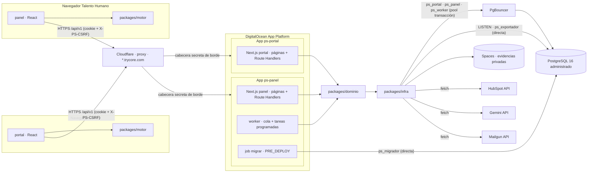
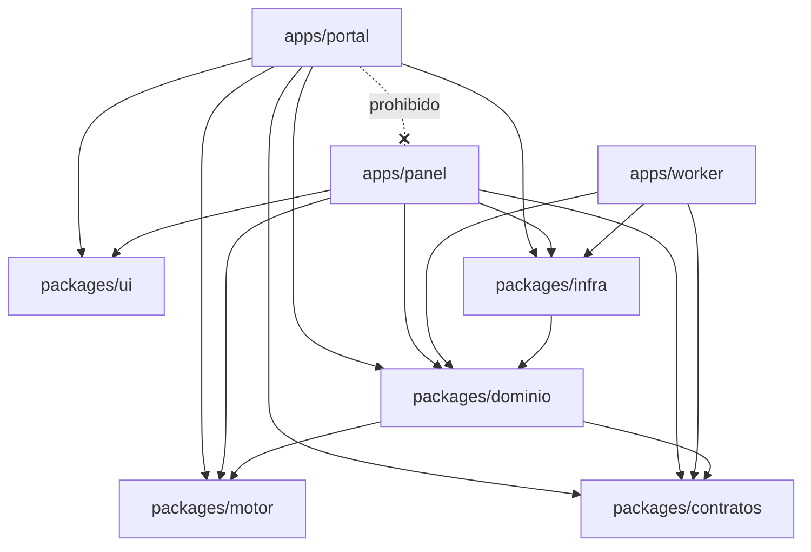

# ADR 0008 — Plataforma en contenedores, stack TypeScript y estructura del sistema

> **Revisión adversarial (2026-09-26):** incorpora los hallazgos H0, H3, H4, H5, H7, H8, H14, H15,
> H16, H19, H20, H26, H28, H31, H34, H37, H38, H39 y H40 de la revisión multiagente. Las
> verificaciones pasan a numerarse con prefijo de ADR (`V8-n` aquí, `V10-n` en ADR-0010).
>
> **Consolidación (2026-09-26, tras la revisión en paralelo):** esta ADR es la referencia única de los
> roles de BD, la estructura del repositorio, el script de roles (`packages/infra/bootstrap/roles.sql`)
> y el stack; la lista detallada de permisos se remite a ADR-0002 (identidad y encolado), ADR-0003
> (vistas e inventario) y ADR-0006 (`eventos`). La guarda de páginas es `exigirSesion` de ADR-0002
> (V8-12 pasa a alias de V2-1) y la matriz rol × acción vive solo en ADR-0002 (V8-13 pasa a alias de
> V2-3). Se resuelven I-1, I-4, I-5, I-6 e I-9 y la regla de `migrar` ante una BD por delante (rige
> ADR-0010).

> Plantilla alineada al método **ADD** (Attribute-Driven Design, Len Bass — *Software Architecture in
> Practice*). Cada sección numerada corresponde a un paso del método. Las decisiones deben trazar a
> [0000-drivers-y-asrs.md](0000-drivers-y-asrs.md) y actualizar
> [_backlog-arquitectonico.md](_backlog-arquitectonico.md). Generada por la skill `setup-architecture`
> (`/build:architect`); un humano la promueve `proposed → accepted`.
>
> **Sustituye a [ADR-0001](0001-estilo-y-stack-base.md).** Conserva de ella todo lo que no dependía del
> hosting compartido: dos aplicaciones y dos hosts de un solo nivel, motor de búsqueda TypeScript puro en
> el navegador, catálogo como proyección autenticada desde la BD, CSRF por cabecera + `Origin`, estado de
> búsqueda en la URL, monorepo con paquetes compartidos y las verificaciones de móvil y accesibilidad.
> Cambia la plataforma y el lenguaje del servidor.

## 1. Objetivo de la iteración y drivers seleccionados (Pasos 2–3)

- **Objetivo de la iteración:** rehacer el estilo estructural y el stack del sistema completo sobre la
  plataforma que decidió el sponsor el 2026-09-25 (contenedores Docker portables, destino inicial
  DigitalOcean App Platform; TypeScript con Next.js en servidor y API; worker Node; PostgreSQL
  administrado; Mailgun), sin perder ninguna garantía que ADR-0001 ya daba.
- **Elemento a refinar:** sistema completo (re-iteración top-down).
- **Drivers abordados:**
  - Funcionales: UC-4 (catálogo solo con sesión), UC-5 (motor determinista).
  - Atributos de calidad: QA-1 (filtrado < 1 s), QA-2 (LCP < 2,5 s), QA-4 (parte estructural: 0 rutas
    del panel alcanzables desde el host del cliente), QA-18 (móvil), QA-19 (WCAG 2.1 AA).
  - Restricciones: **CON-18** (contenedores Docker portables, destino DO App Platform), **CON-19**
    (PostgreSQL administrado), CON-9, CON-12, CON-13, CON-14. Sustituye el tratamiento de CON-1, CON-2 y
    CON-3, que quedan reemplazadas (ver 0000).
  - Concerns: CRN-19 (entrada por instrucción retirable).
- **Fuera de alcance aquí:** trabajo diferido, worker y correo ([ADR-0009](0009-trabajo-diferido-worker-y-correo.md));
  entornos, despliegue, perímetro y respaldo ([ADR-0010](0010-entornos-despliegue-y-perimetro.md)).
  Sesiones, datos, búsqueda y telemetría conservan su diseño en ADR-0002, 0003, 0004 y 0006, con la
  enmienda de plataforma que cada uno lleva al final.

## 2. Conceptos de diseño elegidos (Paso 4)

| Driver | Concepto / Táctica | Alternativas descartadas | Razón |
|--------|--------------------|--------------------------|-------|
| CON-18, CON-19 | **Un solo lenguaje de extremo a extremo (TypeScript)**: interfaz, API, dominio, worker y migraciones | Mantener PHP para la API y Node solo para el worker; Python/FastAPI | Decisión del sponsor. Un solo lenguaje permite que el servidor use **el mismo** paquete de motor y los mismos esquemas de contrato que el navegador. R-20 (segunda implementación parcial del filtro de ciudad) solo se cierra si el contrato de ciudades recibe los `Criterios` completos y el servidor ejecuta `evaluar` (fila QA-1/UC-5 y ADR-0003) |
| QA-2, UC-4 | **Next.js 15 completo (App Router, `output: "standalone"`, runtime `nodejs`)**: páginas renderizadas por el servidor de Next y API en **Route Handlers** (`app/api/v1/**/route.ts`). Imagen Docker por aplicación | Mantener `output: "export"` + API aparte (dos procesos por host sin ganancia); Express/Fastify detrás de un Next estático (un framework más); Edge runtime (sin `pg` ni `crypto` completo) | Next ya estaba en el stack por el handoff; con servidor propio desaparecen las restricciones del export (sin middleware, sin nonce de CSP, sin rutas dinámicas) y la API vive en el mismo proceso y el mismo host, así que el aislamiento por host de ADR-0001 se mantiene sin front controllers |
| UC-4, QA-5, CON-10 | **Ningún dato de inventario sale por el render del servidor salvo por la proyección**: un Server Component solo obtiene perfiles a través del puerto `ProyeccionCatalogo`, cuya salida pasa por el **mismo esquema `zod` estricto** que `GET /api/v1/catalogo` antes de cruzar a un componente cliente, y que exige como argumento la `SesionVerificada` devuelta por `exigirSesion` (fila siguiente; ADR-0002). `import "server-only"` en `packages/dominio` y `packages/infra` impide que acaben en un bundle de cliente. **Defensa en profundidad en la BD:** la proyección lee solo la vista `operacion.catalogo_publicable` (fila de roles) | Dejar que los Server Components lean repositorios libremente (el payload RSC viaja dentro del HTML y se saltaría el contrato del catálogo) | Con renderizado en servidor el HTML es un segundo canal de salida; ADR-0001 lo evitaba por construcción (export sin datos) y aquí se cierra por contrato, por permiso de BD y por test (V8-4, V8-10) |
| UC-4, QA-3, QA-4 | **Guarda de página: la de ADR-0002** (`exigirSesion(host)`, `server-only`, en `apps/<app>/src/sesion/`, sobre `validarSesion` de `packages/dominio`), que esta ADR no redefine: **cada `page.tsx` protegida la llama en su primera línea** (no el layout); sin sesión válida, enlace revocado o vencido o sesión caducada → `redirect` 307 a `/acceso?motivo=…`, donde se muestra la pantalla propia (410 de enlace o sesión expirada) sin datos. Rutas públicas (*revisión de coherencia*): portal `/e` y `/acceso`; panel `/acceso` y `GET /r/[id]` (contrato único de ADR-0009, sin sesión), listadas en `apps/<app>/rutas-publicas.json`; la redirección optimista del middleware no se aplica a ellas. El middleware sigue sin abrir la BD. *Sustituye al texto anterior de esta fila (`obtenerSesion` en `lib/sesion.ts` y pantalla 410 servida por la página protegida, I-1)* | Guarda solo en el layout (no se re-ejecuta en navegación cliente); comprobar la sesión en el middleware (abre la BD en cada petición, incluidos los estáticos, y el middleware ya carga con la cabecera de borde); confiar en que el Route Handler del catálogo falle | Los Route Handlers ya validan con `conSesion`; sin guarda propia, una página renderizaría su marco y su payload RSC sin sesión. El fragmento `#t=` nunca llega al servidor, así que la guarda no interfiere con el aterrizaje. Se prueba recorriendo el manifiesto de rutas (V2-1) |
| QA-3, CON-22 | **Middleware en runtime Node con `next ≥ 15.5`** (`export const config = { runtime: "nodejs", … }`), comparación de la cabecera de borde con `crypto.timingSafeEqual`, y rechazo explícito de la cabecera interna `x-middleware-subrequest` si llega desde fuera | Middleware en Edge (por defecto antes de 15.5: sin `crypto` de Node); Next < 15.2.3 (CVE-2025-29927: la cabecera `x-middleware-subrequest` permite saltarse el middleware en Next autoalojado) | El middleware es la barrera de la cabecera de borde (ADR-0010); debe correr donde exista comparación en tiempo constante y en una versión sin el salto conocido — *Sustituida en parte por la enmienda del 2026-09-28* |
| QA-3, QA-4 | **Solo Route Handlers para mutar; Server Actions prohibidas** (regla de lint que falla ante `"use server"`) | Server Actions (tienen su propio control de `Origin`) | Un solo mecanismo de CSRF (cabecera `X-PS-CSRF` + `Origin` exacto, ADR-0002) auditable en una sola capa; las Server Actions crean endpoints implícitos que el test de la matriz rol × acción (V2-3 de ADR-0002) no ve |
| Modificabilidad, CON-9 | **Monolito modular hexagonal en paquetes**: `packages/dominio` (entidades, reglas, casos de uso y puertos, sin dependencias de infraestructura) y `packages/infra` (adaptadores: PostgreSQL, HubSpot, Gemini, Mailgun, Spaces, latido, en rutas fijas `packages/infra/src/<adaptador>/`). Los Route Handlers y el worker son adaptadores de entrada delgados que llaman casos de uso | Lógica dentro de los Route Handlers; microservicios por contexto | Aísla las fronteras de `build-config.json` (sus `paths` apuntan a esas rutas fijas); el dominio se prueba sin red ni BD; portal, panel y worker comparten los mismos casos de uso sin duplicar |
| CON-19, QA-9, QA-11 | **PostgreSQL 16 con `pg` (node-postgres) + Kysely** (constructor de consultas tipado, sin ORM) y **migraciones con el `Migrator` de Kysely** en ficheros TypeScript versionados, cargadas por un **proveedor estático** (`packages/infra/migraciones/indice.ts` importa cada migración de forma explícita), no por `FileMigrationProvider` | Prisma (ya en `deny_examples`: motor binario, transacciones interactivas limitadas, `SKIP LOCKED` y *advisory locks* solo por SQL crudo); Drizzle (válido, pero su capa de relaciones no aporta y su kit de migraciones genera SQL que se revisa peor); `pg` sin constructor (sin tipado de columnas); `FileMigrationProvider` (lee el disco en ejecución: en el bundle de un fichero no encuentra nada y `migrar` terminaría en verde sin aplicar) | Control fino de transacciones, `FOR UPDATE SKIP LOCKED`, `pg_advisory_xact_lock` y `LISTEN/NOTIFY` (ADR-0009) con tipos generados del esquema; conserva el espíritu «SQL a mano» de ADR-0001 con verificación de tipos. Las reglas de `migrar` son las de ADR-0010 (falla si conoce 0 migraciones o si las aplicadas no empiezan por las que conoce; **admite que la BD vaya por delante** para permitir el rollback y lo registra); *sustituye al texto anterior («falla si conoce menos que las registradas»), que impedía el rollback*. Un test compara `indice.ts` con los ficheros de la carpeta (V8-11) |
| Modificabilidad, QA-5 | **`zod` como fuente única de contratos** en `packages/contratos`: cada Route Handler valida la entrada y la salida con el mismo esquema que usa el cliente; el catálogo tiene esquema de salida *estricto* (lista blanca: un campo extra hace fallar el test de contrato) | JSON Schema + validador aparte; tipos sin validación en tiempo de ejecución | Tipos y validación en un solo artefacto compartido por navegador, servidor y worker |
| QA-1, UC-5, CRN-19 | **Motor de búsqueda como paquete TypeScript puro** (`packages/motor`) que corre **en el navegador** (sin cambios respecto a ADR-0001). El servidor lo importa además para decidir la ciudad: el contrato de ciudades recibe los **`Criterios` completos** validados con el esquema de `packages/contratos` y el servidor ejecuta `evaluar` sobre `catalogo_publicable`, con test de contrato «ciudades ⊆ resultados visibles» (ADR-0003) | Motor en el servidor con una llamada por filtro; enviar al servidor solo modalidad, roles y país (no reproduce el resultado del navegador y devuelve ciudades de perfiles no visibles, CON-10) | Con ~30 perfiles el cálculo local es instantáneo en 4G; un solo motor para panel, resultados y servidor, con la misma entrada |
| RF-8.1.4, QA-4 | **Dos aplicaciones Next y dos hosts de un solo nivel** (sin cambios de nombres): `people.trycore.com` (portal) y `people-panel.trycore.com` (panel); staging `people-staging.trycore.com` y `people-panel-staging.trycore.com`. Cada aplicación es **una App de App Platform distinta** con su propio dominio, su propia cookie, sus propias variables secretas y **su propio rol de BD**. Cada App recibe **solo los secretos que usa**; los secretos de acceso se separan por ámbito (pepper de códigos del cliente y del panel distintos), materializado en ADR-0010 §3.3 | Una sola App con dos componentes enrutados por host (la especificación de *ingress* admite reglas por `authority`, pero una regla mal escrita o una ruta por defecto dejaría el panel alcanzable desde el host del cliente, y ambos componentes compartirían secretos y ciclo de despliegue) | Aislamiento por construcción, no por configuración de enrutamiento: el panel no es alcanzable desde el host del cliente ni por ruta ni por cookie ni por build, y un fallo del portal no expone secretos del panel. Hosts de un nivel porque el certificado gratuito de Cloudflare solo cubre `*.trycore.com` (ADR-0010) |
| CON-9, QA-5, QA-4, QA-11 | **Roles de PostgreSQL por proceso, con mínimo privilegio por tabla y por tipo de trabajo** (detalle en §3 «Roles y aprovisionamiento»; la lista de permisos es la de ADR-0002, 0003 y 0006): `ps_portal` lee solo vistas publicables y catálogos (ADR-0003), escribe solo su identidad de cliente (ADR-0002), solicitudes, equipos, límites, `eventos` (ADR-0006) y las tablas de búsqueda que le asigna ADR-0004; **sin ningún permiso sobre el esquema `identidad_panel`**; **sin `INSERT` en `trabajos`**: encola por `operacion.encolar_portal` con la lista blanca de ADR-0002. `ps_panel`, `ps_worker`, `ps_exportador` (solo lectura, solo `exportar_banco`) y `ps_migrador` (solo en el job `migrar`) | Un único usuario con todos los permisos; `ps_portal` con lectura de todo el inventario y escritura en todo `identidad` y en `trabajos` (texto original: un fallo del portal podía crear una sesión del panel, añadir un administrador o encolar un trabajo del panel que el worker ejecuta con permisos de inventario) | «El portal solo lee lo publicable» (CON-9, QA-5) pasa de ser una convención de código a un permiso de la BD; comprometer el portal, que es el proceso más expuesto, no da acceso al panel, al worker ni a perfiles sin publicar, consentimientos, evidencias o fotos previas de importación (V8-10, V10-10) |
| CON-19, QA-6 | **Presupuesto de conexiones con PgBouncer** (**fórmula única**: ADR-0010 §3.3 y el backlog la citan sin repetirla; *consolidación, 2.ª pasada*): portal, panel y worker conectan por un *pool* de PgBouncer **en modo transacción, uno por usuario** (tamaños de servidor: `ps_portal` 3, `ps_panel` 3, `ps_worker` 4); en cliente, `pg.Pool` con `max` fijo (portal 4, panel 4, worker 5). **Conexión directa solo para `LISTEN`** del worker (1), el job `migrar` (1) y `exportar_banco` como `ps_exportador` (1). Presupuesto = `Σ tamaño de pool + LISTEN × 2 (solape de despliegue) + migrar + exportador + 20 %` ≤ conexiones utilizables del plan (plan más pequeño: 14 × 1,2 ≈ 17 de 22). En modo transacción: sin `SET` de sesión (solo `SET LOCAL` o `ALTER ROLE … SET statement_timeout`), sin sentencias preparadas con nombre y sin candados de sesión (solo `xact`). La prohibición de candados de sesión rige para las conexiones por *pool*; las directas (`migrar`, `exportar_banco`) sí comparten el candado de sesión `mantenimiento_esquema` de ADR-0003. **Ninguna transacción retiene una conexión durante una llamada saliente** (Mailgun, HubSpot, Gemini, Spaces): se confirma antes del `fetch` | `pg.Pool` por defecto (10 por proceso); todo por conexión directa enlazada con `db_user` (el solape del despliegue sin corte duplica las conexiones de servidor: `(4+4+6)×2 + 2` ≈ 30 > 22 en el plan pequeño) | El plan más pequeño de BD administrada admite pocas decenas de conexiones; con PgBouncer el solape del despliegue y las réplicas duplican conexiones de cliente, no de servidor. `LISTEN` no funciona a través de PgBouncer en modo transacción; `migrar` y `pg_dump` necesitan sesión propia |
| QA-3, QA-4 | **CSRF por cabecera + `Origin`** (sin cambios): toda mutación exige `X-PS-CSRF` con el token de la sesión y `Origin` (o `Referer`) igual al origen del host; sin cabeceras CORS | `SameSite=Lax` solo | Los hosts hermanos de `trycore.com` son *same-site*; detalle en ADR-0002 |
| CON-13, QA-16, QA-1 | **Estado de búsqueda en la query string** con `nuqs`, cuyos **parsers se definen en `packages/contratos`** (compartidos con servidor y tests de ida y vuelta) con la lista cerrada de parámetros de ADR-0004, que esta ADR no enumera (incluye `ficha` y el reservado `cmp`), y **`shallow: true` obligatorio**: cambiar un filtro no viaja al servidor. Lint prohíbe `router.replace`/`router.push` sobre claves de búsqueda. Leído dentro de `<Suspense>` con su estado de carga. El perfil abierto va en `?ficha=`, no en la ruta | Mantener la prohibición total de segmentos dinámicos (ya no tiene causa); pasar la ficha a `/perfil/[id]` (el id quedaría en la ruta sin ganancia); `?id=` (nombre divergente del contrato de ADR-0004); `router.replace` o actualización no superficial (en un árbol dinámico pide un nuevo payload RSC en cada filtro y QA-1 pierde su base) | RF-2.5 exige el estado en la URL; un solo contrato de URL evita que las URL compartidas se rompan. La actualización superficial conserva la «latencia nula por toque» con el árbol `force-dynamic` |
| QA-5, QA-2 | **Renderizado dinámico en todo el árbol** (`export const dynamic = "force-dynamic"` en el layout raíz de ambas apps). **El bloque de perfiles de la vista inicial llega en el primer HTML** por `ProyeccionCatalogo` (SSR con esquema estricto); `GET /api/v1/catalogo` queda para la revalidación con ETag | Mezclar páginas estáticas y dinámicas; pedir el catálogo por `fetch` desde el cliente tras hidratar (cascada HTML → JS → petición en el camino del LCP) | La CSP con nonce (ADR-0010) exige que cada respuesta HTML se genere por petición; una página prerenderizada saldría sin nonce y no hidrataría. Servir los perfiles en el HTML quita una ida y vuelta a `nyc` del camino del LCP |
| Operabilidad, CON-18 | **Worker como tercer proceso** (`apps/worker`, Node 22) empaquetado con **esbuild** en un único fichero (`pg-native` como externo), con **`server-only` redirigido a un módulo vacío** (`alias` de esbuild; igual en Vitest con `resolve.alias`); ejecuta la cola, las tareas programadas y las migraciones (ADR-0009, ADR-0010) | Ejecutar trabajo diferido dentro del servidor de Next (se pierde al escalar o reiniciar, y compite con las peticiones); `tsx` en producción (compila en cada arranque); compilar con la condición `react-server` en todo el bundle o en Vitest (resolvería React a su build de servidor y rompería los tests de componentes) | Separación de responsabilidades y de recursos; un binario pequeño y sin compilación en el contenedor. `server-only` lanza error fuera de la condición `react-server`: sin el alias, el worker y los tests de `dominio` no arrancan (V8-11) |
| Modificabilidad | **Monorepo con npm workspaces**: `apps/portal`, `apps/panel`, `apps/worker`, `packages/ui`, `packages/motor`, `packages/contratos`, `packages/dominio`, `packages/infra`. `transpilePackages` en ambos `next.config` | Repos separados | Contratos, motor y dominio compartidos con tipado de extremo a extremo |
| QA-2, CON-18 | **Imágenes sin optimizar en servidor**: `images: { unoptimized: true }` en ambos `next.config`; `next/image` se usa solo por sus dimensiones fijas (sin CLS). Sin `sharp`. **Geist y Geist Mono como `woff2` versionados** en `packages/ui/fuentes/` (licencia OFL incluida) cargados con `next/font/local` | `sharp` y el optimizador `/_next/image` (dependencia nativa en la imagen y una ruta más que proxifica imágenes); paquete `geist` o `next/font/google` (dependencia extra o descarga en cada build) | Las imágenes del producto son logotipos y SVG de marca (la foto del profesional está en la lista negra B.4); el build no depende de la red y las fuentes quedan autoalojadas para la CSP |

## 3. Instanciación: responsabilidades e interfaces (Paso 5)

**Estructura del repositorio**

```
apps/
  portal/        Next.js 15 (standalone) — cara cliente (people.trycore.com)
    app/api/v1/  Route Handlers del portal (acceso, catálogo, solicitudes, eventos, estado, equipo)
    src/sesion/  exigirSesion("portal") — guarda de página de ADR-0002 (server-only)
    rutas-permitidas.json · rutas-publicas.json   (públicas: /e, /acceso)
  panel/         Next.js 15 (standalone) — Talento Humano (people-panel.trycore.com)
    app/api/v1/  Route Handlers del panel (perfiles, importación, catálogos, auditoría, informes,
                 bandeja de fallos, webhooks de Mailgun)
    src/sesion/  exigirSesion("panel") — guarda de página de ADR-0002 (server-only)
    app/r/[id]/  redirección pública de ADR-0009 (sin sesión; señal CRN-1)
    rutas-publicas.json   (públicas: /acceso, /r/[id]; la matriz rol × acción es MatrizPermisos de packages/dominio, ADR-0002)
  worker/        Node 22 — cola, tareas programadas, migraciones (bin: worker, migrar, verificar-salidas)
packages/
  ui/            componentes del handoff (docs/07-prototipo/handoff), tokens, tema y fuentes/ (woff2)
  motor/         intérprete + motor de criterios (TypeScript puro, sin React ni Node)
  contratos/     esquemas zod de la API y parsers de URL (nuqs) compartidos por apps y worker
  dominio/       entidades, reglas, máquina de estados, casos de uso y puertos (sin E/S)
  infra/
    src/
      postgres/  Kysely, repositorios, ProyeccionCatalogo (lee catalogo_publicable)
      hubspot/ · gemini/ · mailgun/ · spaces/ · latido/ · reloj/
      config.ts  esquema zod de configuración por proceso y APP_ENV
    migraciones/ migraciones Kysely versionadas + indice.ts (proveedor estático)
    bootstrap/   roles.sql — script de roles único: roles NOLOGIN, esquemas `auditoria` y `telemetria` con sus tablas, funciones, cabeza génesis y vistas `v_*`, sus GRANT, privilegios base (§3 «Roles»)
docker/
  portal.Dockerfile · panel.Dockerfile · worker.Dockerfile   multi-stage, imagen final node:22-slim
.do/
  app-portal.<entorno>.yaml · app-panel.<entorno>.yaml       especificación de App Platform (ADR-0010)
```

**Responsabilidades**

- `apps/portal` y `apps/panel`: presentación, Route Handlers (adaptadores de entrada) y el
  `middleware.ts` de perímetro (cabecera secreta de borde, nonce de CSP y cabeceras de seguridad;
  ADR-0010). **No** abren la BD en el middleware; la sesión se valida dentro de cada Route Handler con
  los envoltorios `conSesion`, `conCsrf` y `conAutorizacion` (ADR-0002, enmienda) y en cada `page.tsx`
  protegida con `exigirSesion` (ADR-0002). `apps/portal` no importa nada de `apps/panel` (ni al revés).
- `apps/worker`: despachador de la cola, planificador de tareas y runner de migraciones (ADR-0009).
  No expone HTTP salvo el latido saliente.
- `packages/motor`: `interpretar(texto, lexico, catalogo) → Criterios` y
  `evaluar(criterios, catalogo) → Resultado[]`; puro, determinista, sin red. La entrada por instrucción
  es un módulo que la ficha, el estado cero y el registro de demanda no importan (CRN-19).
- `packages/dominio`: un caso de uso por UC (acceso, enlaces, catálogo, solicitud, perfiles,
  importación, auditoría, telemetría, notificaciones) más `validarSesion` y `MatrizPermisos` (ADR-0002).
  Depende solo de puertos.
- `packages/infra`: única capa que habla con red, BD o almacenamiento de objetos, cada adaptador en su
  ruta fija `packages/infra/src/<adaptador>/`. El catálogo es una **proyección** en
  `infra/src/postgres` sobre `catalogo_publicable` (ADR-0003); nada de inventario se escribe a disco ni
  a la imagen.

**Interfaces / contratos**

- API JSON sobre HTTPS bajo `/api/v1/…` en cada host; entrada y salida validadas con `zod` desde
  `packages/contratos`.
- `GET /api/v1/catalogo` (solo portal): exige sesión → 401 sin ella; salida con esquema estricto.
- Toda petición mutante: `X-PS-CSRF` + `Origin`/`Referer` igual al origen del host → si no, 403 sin
  efecto.
- Puertos del dominio: `RepositorioPerfiles`, `RepositorioEnlaces`, `RepositorioSesiones`,
  `ProyeccionCatalogo` (recibe una `SesionVerificada`), `ColaTrabajos`, `ClienteCrm`, `ClienteModelo`,
  `EnviadorCorreo`, `AlmacenEvidencias`, `Reloj`, `RegistroAuditoria`, `Latido`.
- Configuración: variables de entorno del contenedor, validadas al arrancar con un esquema `zod`
  **por proceso y por `APP_ENV`** (`infra/src/config.ts`); el proceso **no arranca** si falta una. Con
  `APP_ENV=produccion` todas son obligatorias y se rechaza cualquier doble. En `local` y `ci` una
  frontera puede sustituirse por un doble **declarado** (`DOBLES=mailgun,hubspot,…`) y solo entonces
  su credencial puede faltar. La cabecera de borde no tiene interruptor: en local y CI, Playwright y
  los tests la inyectan con un secreto de prueba. Secretos como variables de tipo `SECRET` de App
  Platform (ADR-0010). Nunca en el repositorio ni en la imagen.

**Roles y aprovisionamiento de la BD**

- **Alta de usuarios con `doctl databases user create`** (o la API de DO), no con `CREATE ROLE`: son
  los que App Platform y los *pools* de PgBouncer reconocen. Usuarios con `LOGIN`: `ps_portal`,
  `ps_panel`, `ps_worker`, `ps_exportador`, `ps_migrador`. Cada uno tiene su *pool* en modo
  transacción (salvo `ps_exportador` y `ps_migrador`, siempre directos); la cadena del *pool* se carga
  como variable `SECRET` del componente con el procedimiento de rotación y los *trusted sources* por
  App de ADR-0010 §3.3.
- **Script de roles único `packages/infra/bootstrap/roles.sql`** (idempotente, versionado y revisado; **dueño de esta regla**, que ADR-0006 y ADR-0010 citan: se ejecuta a mano con `doadmin` una vez por entorno al aprovisionarlo y de nuevo (idempotente, con dos personas) cada vez que cambian sus objetos (`auditoria`, `telemetria`, vistas `v_*`) o una migración añade objetos que requieren `GRANT` nuevos emitidos por él; lo ejecuta el responsable técnico, nunca CI ni
  `migrar`; es el mismo que ADR-0010 llamaba `infra/bd/arranque.sql`, nombre retirado, I-6). Crea
  los roles de grupo sin `LOGIN` y lo que depende de ellos:
  - `ps_duenio`: dueño de los esquemas `identidad`, `identidad_panel`, `operacion` e `inventario` y de
    las funciones `SECURITY DEFINER` de ADR-0002 (`encolar_*`, `reclamar_propio`, `cerrar_propio`,
    `guardar_codigo_cliente`, `guardar_codigo_panel`, `purgar_vencidos`, `sembrar_admin_inicial`), creadas en la migración inicial (la regla sin DML de
    ADR-0003 no mira sus cuerpos); `ps_migrador` es miembro para hacer DDL y `GRANT` sobre esos esquemas.
  - `ps_auditoria_dueno`: dueño del **esquema `auditoria`** y de sus tablas `auditoria`,
    `auditoria_cabeza`, `auditoria_valores`, su trigger y las funciones `SECURITY DEFINER`
    `auditoria.registrar(...)` y `auditoria.suprimir_titular(perfil_id)`, que el script crea junto con la cabeza génesis;
    ningún rol de conexión es miembro (ADR-0003, I-5).
  - `ps_eventos_dueno`: dueño del **esquema `telemetria`**, de `telemetria.eventos`, sus particiones
    iniciales, `crear_particiones()`, `mantener_eventos(sal)`, `completar_visita` y las vistas `v_*`,
    que el script crea; ningún rol de conexión es miembro (ADR-0006, I-4).
    *Sustituye al grupo `ps_mantenimiento` del texto anterior.*
  - **Por qué esquemas propios** (*consolidación, 2.ª pasada*): el dueño de un esquema puede hacer
    `DROP` de cualquier objeto dentro de él aunque no sea suyo; con la auditoría y `eventos` en
    `operacion`, `ps_migrador` (miembro de `ps_duenio`) podía borrarlos. En esquemas de otros dueños no
    puede (V8-10, V3-7, V10-10).
  - **Quién emite cada `GRANT`:** sobre objetos de `ps_duenio`, `ps_migrador` en las migraciones;
    sobre objetos de dueños `NOLOGIN` distintos (`auditoria`, `telemetria`: tablas, funciones y
    vistas), `roles.sql`, con la regla de ejecución de arriba.
  - Además fija `search_path` y `ALTER DEFAULT PRIVILEGES`. Ninguna aplicación usa `doadmin`.
- **Permisos por rol** (sobre objetos de `ps_duenio`, los concede la primera migración y cada migración
  que crea una tabla; sobre `auditoria` y `telemetria`, `roles.sql`). Esta ADR **no copia la lista
  detallada**, que tiene un solo dueño por ámbito:
  - Identidad (`identidad`, `identidad_panel`), encolado (`encolar_portal`, `encolar_panel`,
    `encolar_worker`, lista blanca y columna `trabajos.origen`), funciones del modo degradado, purga y
    primer administrador: **ADR-0002**, fila «H0» de su revisión adversarial. Ningún rol de conexión
    tiene `INSERT` directo en `trabajos` y solo `ps_worker` tiene `UPDATE` directo.
  - Vistas e inventario (`catalogo_publicable`, `estado_enlace_perfil`, `REVOKE` de `ps_portal` sobre
    tablas base, `claves_titular`, auditoría con `registrar` y `suprimir_titular`): **ADR-0003**.
  - `eventos` (`INSERT` y `EXECUTE` de `completar_visita` del portal, vistas `v_*` del panel, `EXECUTE`
    de `mantener_eventos` del worker) y `experimentos`: **ADR-0006**.
  - Tablas de búsqueda (`lexico`, `propuestas_lexico`, `consultas_sin_coincidencia`, `llamadas_llm`,
    `estados_largos`): **ADR-0004**, fila «Permisos sobre las tablas de búsqueda».
  - Cola, tareas, correo, `solicitudes`, `worker_ciclo` y `aperturas` (`/r/`), y los permisos de
    `ps_worker` por tipo de trabajo: **ADR-0009**, fila «Permisos sobre la cola, tareas y correo».
  - Lo que queda propio de esta ADR: `ps_portal` y `ps_panel` escriben equipos y límites
    según su cara (solicitudes: ADR-0009); `ps_panel` escribe inventario y catálogos por la unidad de trabajo; `ps_worker`
    tiene solo los permisos que exigen los tipos de trabajo y tareas, concedidos tipo por tipo según la
    lista de ADR-0009, y nunca es dueño ni hace DDL; `ps_exportador` tiene `SELECT` sobre todos los esquemas y nada
    más (su credencial solo la recibe el worker para `exportar_banco`, conexión directa);
    `ps_migrador`, miembro de `ps_duenio`, solo en el job `migrar`, conexión directa.
  - *El texto anterior de este apartado (a lo sumo `UPDATE` por columna de `ps_portal` en `enlaces` y
    `enlace_invitados`, solo `INSERT` en `eventos`, grupo `ps_mantenimiento`) queda sustituido por las
    listas citadas.*
- **Paridad en staging, CI y local:** PostgreSQL 16 en contenedor **más un contenedor PgBouncer en
  modo transacción**; el mismo `roles.sql` crea los roles, las aplicaciones y los tests nunca
  conectan como superusuario, y cada proceso pasa por su *pool* igual que en producción. V8-10 corre
  ahí en cada PR y se repite en producción en oscuro dentro de V10-10 (enlace de los usuarios en las
  Apps, sobre todo los tres de la App del panel).

**Esqueleto andante y orden de construcción de la épica caparazón (EP-001)**

EP-001 toca portal, panel, worker y BD (regla dura 8: se descompone). Sub-slices, construidos y
cerrados de uno en uno:

1. **Esqueleto andante:** monorepo y workspaces; las dos apps con layout, `middleware.ts` (cabecera de
   borde, nonce de CSP, cabeceras de seguridad), `exigirSesion` (ADR-0002) y las páginas públicas
   `/acceso` y `/e`; `roles.sql`, migración inicial con los esquemas `identidad` e `identidad_panel`,
   la cola (`trabajos`, `encolar_portal`, `encolar_panel`, `encolar_worker`), las funciones del modo degradado y de purga de ADR-0002 y los permisos de §3; worker con el despachador
   mínimo y el tipo `enviar_codigo` (Mailgun como doble declarado en CI); CI mínimo: lint, typecheck,
   V8-1, V8-2, V8-9, V8-11, V2-1 y la prueba de CSP del shell. Sin datos de perfiles.
2. **Login del panel** (HU-123): código al correo `@trycore.com` inscrito y sesión de una jornada;
   cierra `login-authn` del lado del panel y es prerrequisito de generar enlaces. *T-19 resuelta el 2026-09-27:* HU-123 pasa a EP-001 y
   este orden es normativo.
3. **Modelo mínimo de perfil publicable:** tablas de perfil y consentimiento y la vista
   `catalogo_publicable`, con perfiles ficticios sembrados solo en local, CI y staging. La edición de
   perfiles sigue en EP-006.
4. **Generación del enlace** (HU-122) desde el panel sobre perfiles publicables.
5. **Aterrizaje y acceso del cliente** (`/e/#t=`, código al correo invitado, HU-144 y resto de HU de
   acceso de EP-001), con la guarda del portal y `redirecciones-guards`.
6. Resto de HU de EP-001.

**Verificaciones que este ADR exige (en el CI de ADR-0010)**

La columna «Desde» indica cuándo se activa cada verificación, para que ningún slice tenga que
ponerla en verde con funciones que aún no existen.

| ID | Verificación | Driver | Desde |
|----|--------------|--------|-------|
| V8-1 | **Lista positiva de rutas del portal**: tras `next build` de `apps/portal`, un test lee `.next/app-path-routes-manifest.json` y falla si aparece cualquier ruta (página o Route Handler) que no esté en `apps/portal/rutas-permitidas.json` (versionado y revisado en cada PR que lo toque). Rutas legítimamente compartidas con el panel (`/api/v1/salud`, `/api/v1/salud/vivo`, `/api/v1/salud/lista`, acceso) están en la lista; lo que no, falla. Lint prohíbe imports cruzados entre apps | QA-4, RF-8.1.4 | EP-001 · 1 |
| V8-2 | **Sin Server Actions ni Edge runtime**: lint falla ante `"use server"` y ante `runtime = "edge"`; el `middleware.ts` declara `runtime: "nodejs"`; `next` fijado a `≥ 15.5`; test que envía `x-middleware-subrequest` desde fuera y espera 403; test de que cada `route.ts` mutante usa `conCsrf` | QA-3, QA-4, CON-22 | EP-001 · 1 — *Sustituida en parte por la enmienda del 2026-09-28* |
| V8-3 | **Retirada de la entrada por instrucción (CRN-19)**: job de CI que aplica la retirada documentada, compila ambas apps y corre el humo de Playwright sobre ficha, estado cero y registro de demanda | CRN-19 | EP-009 |
| V8-4 | **Catálogo tras sesión, por los dos canales**: contrato `GET /api/v1/catalogo` → 401 sin sesión; con sesión, solo campos del esquema estricto (`z.strictObject`, que **falla** ante campos extra en lugar de descartarlos); rastreo del **HTML renderizado con sesión** (incluido el payload RSC) de **cada página del manifiesto del portal** buscando nombres de campo de la lista negra B.4 y valores sembrados de prueba; `grep` sobre `.next/static` y la imagen sin datos de perfiles; test de que `packages/dominio` e `infra` importan `server-only` y de que un componente cliente que los importa hace fallar `next build` | UC-4, CON-9, CON-10 | `server-only`: EP-001 · 1; catálogo: EP-001 · 3 |
| V8-5 | **CSRF**: mutación sin cabecera, con token erróneo, con `Origin` de otro subdominio de `trycore.com` y sin `Origin` ni `Referer` → 403 y 0 cambios | QA-3, QA-4 | EP-001 · 2 |
| V8-6 | **Presupuesto de rendimiento**: (a) Lighthouse CI en Slow 4G (LCP < 2,5 s, JS inicial ≤ 200 KB comprimido) contra el contenedor standalone, como regresión en CI; (b) **gate de QA-1**, el mismo que ADR-0004: Playwright contra el contenedor standalone con CPU ×4 y RTT Bogotá→`nyc` emulado, 300 perfiles, vistas tarjetas y tabla y caso presencial con la llamada de ciudades; P95 interacción → pintado < 1 000 ms y **0 peticiones de documento o RSC por interacción de filtrado**; (c) **en producción en oscuro**: la medición es **V10-15** de ADR-0010 con las metas de QA-2 del `0000` (LCP P75 < 2,5 s, TTFB P75 del HTML ≤ 800 ms, P95 de `GET /api/v1/catalogo` ≤ 500 ms, *a validar*), instancias ≥ 1 GB y **solo datos ficticios**; esta fila la cita y no fija metas propias (*sustituye al «TTFB ≤ 500 ms» anterior, I-9*) | QA-1, QA-2 | (a) EP-001 · 1; (b) EP-003; (c) antes del primer enlace real |
| V8-7 | **Accesibilidad y móvil automatizados**: axe (0 serias/críticas); a 320 y 390 px, M-1, M-2, M-3, M-8 | QA-18, QA-19, CON-12 | EP-001 · 1 |
| V8-8 | **Verificación manual por pantalla** en el PR que cierra cada épica con UI: M-3 en iPhone real, M-4..M-7, A-2, A-3, A-5, A-6, A-7, A-1 sobre combinaciones nuevas | QA-18, QA-19, CON-12 | cierre de cada épica con UI |
| V8-9 | **Arranque con configuración incompleta**: test que arranca cada proceso sin cada variable obligatoria de su esquema y comprueba que sale con código ≠ 0 sin servir tráfico; con `APP_ENV=produccion`, que rechaza `DOBLES` y cualquier credencial ausente | CON-6 | EP-001 · 1 — *Ampliada por la enmienda del 2026-09-28 (`EDGE_SECRET` opcional)* |
| V8-10 | **Roles de BD** contra PostgreSQL + PgBouncer en modo transacción con roles creados por `roles.sql` (nunca superusuario): conectado como `ps_portal`, espera error de permisos al (a) escribir inventario, (b) **leer** `perfiles`, `consentimientos`, `artefactos`, `lotes_importacion`, `borradores_evidencia` y `auditoria`, (c) tocar cualquier tabla de `identidad_panel` o crear una sesión del panel, (d) hacer `INSERT` o `UPDATE` directo en `trabajos` o llamar a `encolar_portal` con un tipo o ámbito fuera de la lista, (e) escribir en las tablas de búsqueda fuera de lo que da ADR-0004 (y, en positivo, que sí puede insertar en `consultas_sin_coincidencia`, `llamadas_llm` y `estados_largos`); que `ps_migrador` no puede `DROP` ni `ALTER` en los esquemas `auditoria` y `telemetria`; que `catalogo_publicable` no devuelve perfiles sin publicar ni sin consentimiento; que `ps_worker` no puede hacer DDL salvo por las funciones de mantenimiento; que ningún proceso salvo el job `migrar` usa `ps_migrador` ni salvo `exportar_banco` usa `ps_exportador`; y la fila «Permisos sobre la cola, tareas y correo» de ADR-0009 (*revisión de coherencia*): `ps_portal` y `ps_panel` leen `worker_ciclo` y `ps_portal` inserta en `solicitudes` pero no lee `tareas_*`, `eventos_correo`, `bajas` ni `envios_boletin`; `ps_panel` inserta en `eventos_correo`, `webhooks_vistos` y `bajas` y no hace `DELETE` en ellas; `ps_worker` actualiza `solicitudes` solo en las columnas de fecha de alineación, escribe inventario solo con las columnas y tablas de su tipo de trabajo (importación, colocados), lee solo los nombres de `perfiles` para `proponer_lexico` y cualquier otro `UPDATE`/`DELETE` sobre inventario → error de permisos. Se repite en producción en oscuro dentro de V10-10 | CON-9, QA-5, QA-4 | EP-001 · 1 (se amplía con cada tabla) |
| V8-11 | **Worker y migraciones empaquetados**: el bundle de esbuild arranca (`node dist/worker.js --comprobar` sale con 0 con configuración válida); los tests de Vitest de `dominio` e `infra` corren con el alias de `server-only`; `indice.ts` contiene exactamente los ficheros de `migraciones/`; el contenedor `migrar` contra una BD vacía aplica todas y una segunda ejecución no hace nada; con 0 migraciones conocidas, o con aplicadas que no empiezan por las conocidas (hueco o nombre distinto), sale con código ≠ 0; con la BD **por delante** (migraciones posteriores a la última conocida, caso del rollback de ADR-0010) sale con 0 y lo registra | CON-18, CON-19 | EP-001 · 1 |
| V8-12 | **Retirada: alias de V2-1** (ADR-0002), la única verificación de la guarda de páginas. *Texto anterior (resultado esperado distinto, «pantalla 410 en el portal»), sustituido por la consolidación (I-1)* | UC-4, QA-3 | EP-001 · 1 |
| V8-13 | **Retirada: alias de V2-3** (ADR-0002), la única verificación de la matriz rol × acción, sobre `MatrizPermisos` de `packages/dominio`. *Texto anterior (fuente aparte `apps/panel/matriz-autorizacion.json`), sustituido por la consolidación* | QA-4 | EP-001 · 2 |

## 4. Vistas y registro de la decisión (Paso 6)

Vista de componentes y conectores:


```mermaid
flowchart LR
  subgraph Navegador cliente
    P[portal · React] --> M[packages/motor]
  end
  subgraph Navegador Talento Humano
    A[panel · React] --> M2[packages/motor]
  end
  %% Sustituida por la enmienda del 2026-09-28
  CF[Cloudflare · proxy · *.trycore.com] -->|cabecera secreta de borde| APPP
  CF -->|cabecera secreta de borde| APPA
  P -- "HTTPS /api/v1 (cookie + X-PS-CSRF)" --> CF
  A -- "HTTPS /api/v1 (cookie + X-PS-CSRF)" --> CF
  subgraph DO["DigitalOcean App Platform"]
    subgraph APPP["App ps-portal"]
      NP[Next.js portal · páginas + Route Handlers]
    end
    subgraph APPA["App ps-panel"]
      NA[Next.js panel · páginas + Route Handlers]
      W[worker · cola + tareas programadas]
      MJ[job migrar · PRE_DEPLOY]
    end
  end
  NP --> DOM[packages/dominio]
  NA --> DOM
  W --> DOM
  DOM --> INF[packages/infra]
  INF -- "ps_portal · ps_panel · ps_worker (pool transacción)" --> PGB[PgBouncer]
  PGB --> PG[(PostgreSQL 16 administrado)]
  INF -- "LISTEN · ps_exportador (directa)" --> PG
  INF --> SP[(Spaces · evidencias privadas)]
  INF -- fetch --> HS[HubSpot API]
  INF -- fetch --> GM[Gemini API]
  INF -- fetch --> MG[Mailgun API]
  MJ -- "ps_migrador (directa)" --> PG
```

Vista de módulos (dependencias permitidas):


```mermaid
flowchart TB
  portal[apps/portal] --> ui[packages/ui]
  panel[apps/panel] --> ui
  portal --> contratos[packages/contratos]
  panel --> contratos
  worker[apps/worker] --> contratos
  portal --> motor[packages/motor]
  panel --> motor
  portal --> dominio[packages/dominio]
  panel --> dominio
  worker --> dominio
  dominio --> motor
  dominio --> contratos
  infra[packages/infra] --> dominio
  portal --> infra
  panel --> infra
  worker --> infra
  portal -. prohibido .-x panel
```

**Decisión:** TypeScript de extremo a extremo en un monorepo con dos aplicaciones Next.js 15
completas (`standalone`, runtime `nodejs`), cada una desplegada como App propia de App Platform con
su host de un solo nivel, sus secretos y su rol de BD, más un worker Node empaquetado con esbuild
(`server-only` redirigido a un módulo vacío); renderizado dinámico en todo el árbol, perfiles de la
vista inicial en el primer HTML y ningún dato de inventario fuera de la proyección con esquema
estricto, que lee solo la vista `catalogo_publicable`; guarda `exigirSesion` de ADR-0002 en cada
página protegida; middleware en runtime Node (`next ≥ 15.5`); API en Route Handlers sin Server Actions;
dominio hexagonal en `packages/dominio` con adaptadores en rutas fijas de `packages/infra/src`;
PostgreSQL 16 administrado con `pg` + Kysely, migraciones Kysely con proveedor estático, roles de
mínimo privilegio dados de alta en DO y *pools* PgBouncer en modo transacción por usuario; contratos
`zod` compartidos; motor de búsqueda puro en el navegador y reutilizado en el servidor con los
`Criterios` completos; CSRF por cabecera + `Origin`; estado de búsqueda en la URL con `nuqs`
superficial y parsers en `packages/contratos`.

**Trade-offs aceptados:**
- Cada página HTML se renderiza en el servidor (no hay HTML estático en el borde): el primer byte
  depende del contenedor, no de la caché de Cloudflare. Los chunks `/_next/static/*` sí siguen
  cacheados e inmutables. *Sustituida en parte por la enmienda del 2026-09-28*
- Tres procesos (portal, panel, worker) en lugar de archivos estáticos: coste mensual de plataforma
  frente a un hosting ya pagado.
- Kysely exige escribir las consultas (sin relaciones automáticas), a cambio de control de
  transacciones y bloqueos.
- Dos Apps de App Platform por entorno duplican configuración de dominio, a cambio del aislamiento
  del panel.
- Las cadenas de los *pools* por usuario no se enlazan solas en App Platform: se cargan como `SECRET`
  y rotan por procedimiento (ADR-0010), a cambio de no duplicar conexiones de servidor en cada
  despliegue.
- El portal encola por una función con lista blanca: añadir un tipo de trabajo del portal exige una
  migración que la amplíe.

## 5. Análisis del diseño (Paso 7)

> Evaluación ATAM-lite adversarial (`architecture-evaluator`), con las correcciones incorporadas y la
> revisión adversarial del 2026-09-26. ✅ con medida o plan concreto (V8-1..V8-13); ⚠️ con
> verificación pendiente o manual; ❌ no se cumple.

| Driver | ✅/⚠️/❌ | Evidencia / medida | Riesgo residual |
|--------|---------|--------------------|-----------------|
| UC-4 | ✅ | Proyección desde `catalogo_publicable` por Route Handler autenticado y, para el HTML, solo por `ProyeccionCatalogo` con esquema estricto y `SesionVerificada` obligatoria; guarda de página (V2-1); V8-4 rastrea ambos canales en todas las páginas del manifiesto; `ps_portal` no puede leer las tablas base (V8-10) | Un Server Component que se salte la proyección ya no puede leer perfiles sin publicar ni campos fuera de la vista; queda el riesgo de columnas mal elegidas en la vista (R-47 acotado) |
| UC-5 | ✅ | `packages/motor` puro; mismo paquete y misma entrada (`Criterios` completos) en navegador y servidor; propiedades de determinismo (ADR-0004) | — |
| QA-1 | ⚠️ | Cálculo local con `nuqs` superficial; gate V8-6 (b) con RTT a `nyc`, CPU ×4 y 0 peticiones de documento o RSC por filtro | CPU ralentizada aproxima, no mide, un teléfono real (R-15) |
| QA-2 | ⚠️ | V8-6 (a) en CI; perfiles en el primer HTML; V8-6 (c) en producción en oscuro desde Colombia | HTML dinámico con nonce, sin caché de borde; el TTFB de `nyc` solo se conoce al ejecutar V8-6 (c) (R-41) |
| QA-4 (estructural) | ✅ | Dos Apps de App Platform, dos hosts, lista positiva de rutas del portal (V8-1), sin Server Actions (V8-2), matriz rol × acción del panel (V2-3), `ps_portal` sin acceso a `identidad_panel` ni a trabajos del panel (V8-10) | Secretos por ámbito dependen de ADR-0010 §3.3 |
| QA-18 | ⚠️ | V8-7 automático + V8-8 manual | Lista manual sin responsable ni iPhone asignados (R-17) |
| QA-19 | ⚠️ | axe en CI + V8-8 | A-5/A-7 solo a mano (R-17) |
| CON-9 | ✅ | El portal no registra rutas de escritura de inventario y su rol de BD no puede escribirlo ni leer lo no publicable (V8-10, en CI con PgBouncer y en producción en oscuro dentro de V10-10); catálogo solo tras sesión; V8-1, V8-4 | Depende de que DO admita los usuarios, *pools* y *trusted sources* por App tal como se describen (V10-10) |
| CON-12 | ⚠️ | V8-7 + V8-8 por épica con UI | Igual que QA-18/19 |
| CON-13 | ✅ | `nuqs` con parsers en `packages/contratos` + ida y vuelta por test de propiedades (ADR-0004) | — |
| CON-14 | ⚠️ | `interpretar` separado de `evaluar`, esquema de criterios versionado en `packages/contratos` | Rol como lista y Perfil Objetivo por dispositivo dependen de ADR-0003/0004 |
| CON-18 | ⚠️ | Tres imágenes Docker multi-stage, sin dependencias del proveedor en el código (App Platform solo en `.do/`); `outputFileTracingRoot` en la raíz del monorepo para que `standalone` incluya los paquetes; sin `sharp`; V8-9, V8-11 | Portabilidad real sin ensayar en un segundo destino (R-42) |
| CON-19 | ⚠️ | `pg` + Kysely + migraciones con proveedor estático (V8-11); tests de integración contra PostgreSQL 16 + PgBouncer en modo transacción en CI; presupuesto de conexiones con solape de despliegue (≈ 17 de 22 en el plan pequeño) | `max_connections` y límites de *pools* del plan elegido sin confirmar en DO (R-49) |
| CRN-19 | ✅ | V8-3 | Si V8-3 no sigue a la instrucción de retirada, deja de representarla |

**Drivers no resueltos en esta iteración:** los de trabajo diferido y correo pasan a ADR-0009; los de
despliegue, perímetro y respaldo a ADR-0010.

## 6. Consecuencias

- **Garantías de ADR-0001 que se mantienen aquí o en otra ADR:** cookies `__Host-` por host (no se
  pueden fijar desde otro subdominio; mitiga R-14; ADR-0002); `useSearchParams` siempre dentro de
  `<Suspense>` (ADR-0004); fuentes autoalojadas y CSP (ADR-0010).
- **Positivas:**
  - Un solo lenguaje y un solo juego de contratos entre navegador, servidor y worker.
  - El servidor usa el mismo motor y la misma entrada que el navegador: con el contrato de ciudades
    sobre `Criterios` completos desaparece la segunda implementación parcial (R-20).
  - Desaparecen los límites del hosting compartido: sin techo de 180 s por proceso, sin inodos, sin
    ModSecurity opaco, con procesos largos y colas propias.
  - CSP con nonce por petición y rutas dinámicas vuelven a estar disponibles (ADR-0010).
  - Comprometer el portal no da acceso al panel, a la cola del panel ni a lo no publicable: la BD lo
    impide aunque el código falle.
- **Negativas:**
  - Coste recurrente de plataforma (tres procesos por entorno, BD administrada, almacenamiento).
  - El handoff se diseñó para export estático: hay que revisar los componentes que asumían
    `output: "export"` (`trailingSlash`); las imágenes quedan sin optimizar por decisión.
  - El worker añade un proceso que vigilar (ADR-0009).
  - El aprovisionamiento de usuarios, *pools* y `roles.sql` es un paso manual por entorno.
- **Riesgos:**
  - TTFB del HTML sin caché de borde (R-41).
  - Portabilidad de contenedores declarada pero no ensayada fuera de DO (R-42).
  - Nombres de host atados al nombre de trabajo (D-2), sin cambios respecto a ADR-0001.
  - Datos de perfiles colados por el payload RSC de un Server Component (R-47, acotado por la vista).
  - Agotar las conexiones de la BD al escalar réplicas (R-49).
  - **Nuevos (para numerar en el backlog):**
    - Rotación manual de las cadenas de *pool*: una rotación de contraseña en DO sin actualizar el
      `SECRET` deja el componente sin BD; el chequeo de preparación con `SELECT 1` (ADR-0010) lo
      detecta en el despliegue, no en caliente.
    - Funciones `SECURITY DEFINER` (`encolar_*`, mantenimiento de particiones): un `search_path` sin
      fijar o una lista blanca ampliada sin revisión reabre la escalada; V8-10 cubre los casos
      negativos conocidos.
    - Columnas de `catalogo_publicable`: una columna añadida a la vista sin revisar publica un campo
      de la lista negra B.4; V8-4 lo detecta solo para los nombres de campo conocidos.
    - La query string del portal (criterios y `?ficha=` con el código de perfil) y la IP quedan en
      los logs de App Platform y Cloudflare; la redacción y la retención se deciden en ADR-0010 y
      CRN-10. *Sustituida en parte por la enmienda del 2026-09-28*
    - Aprovisionamiento de la paridad (PgBouncer en contenedor, `roles.sql`) no ensayado aún contra
      DO: debe añadirse a los ensayos de R-56.
- **Coherencia con otras ADR** (alineada en la consolidación del 2026-09-26):
  - ADR-0002 (enmienda): es la dueña de la guarda de páginas (`exigirSesion`, V2-1) y de la matriz
    rol × acción (V2-3); V8-12 y V8-13 son alias. Esquema `identidad_panel`.
  - ADR-0003 (enmienda): vista `catalogo_publicable`, contrato de ciudades con `Criterios` completos,
    perfiles de la vista inicial por SSR, dueño de `auditoria` distinto de `ps_migrador`.
  - ADR-0004 (enmienda): `nuqs` superficial con parsers en `packages/contratos` y parámetro `ficha`;
    mismo gate de QA-1 que V8-6 (b).
  - ADR-0009: aplica la lista blanca única de ADR-0002; permisos de `ps_worker` por tipo;
    `exportar_banco` como `ps_exportador` (`EXPORT_DATABASE_URL`); conexión directa del worker solo
    para `LISTEN`; particiones de `eventos` por `mantener_eventos(sal)` de ADR-0006.
  - ADR-0010 §3.3: alta de usuarios con `doctl`, cadenas de *pool* como `SECRET` con rotación,
    *trusted sources* por App, secretos por ámbito (pepper del cliente y del panel), variables
    `EXPORT_DATABASE_URL` y `DOBLES`; V10-10 en producción en oscuro.
  - `build-config.json#boundaries`: rutas `packages/infra/src/{hubspot,gemini,mailgun,spaces,latido}/**`
    y fronteras de Spaces y del monitor.
  - `stack-allowlist.json`: dependencias y restricciones de versión del stack propuesto (§7).
- **Trade-offs de negocio abiertos (heredados de ADR-0001 y nuevos):**
  - **Coste recurrente de plataforma** (Apps, BD, Spaces, Mailgun) frente al hosting ya pagado: lo
    aceptó el sponsor al cambiar de plataforma; queda por fijar el techo mensual (ver T-29 del backlog;
    el texto anterior citaba T-14 por error).
    Si el plan pequeño de BD no admite los *pools* y conexiones del presupuesto, subir de plan es
    parte de ese techo.
  - **Hosts anidados vs certificado de pago** (sin cambios): se mantienen hosts de un nivel.
  - **Nombre definitivo (D-2)** antes del primer despliegue a producción.
  - **Responsable y dispositivo de la verificación manual (V8-8)**.
  - **Retirada de la entrada por instrucción (D-17 / CRN-19)**: sigue siendo decisión de negocio.
  - **Trade-off de negocio pendiente: validación legal de la transferencia internacional (H12, R-44).**
    Mientras no exista, V8-6 (c) y cualquier medición en producción en oscuro se hacen solo con datos
    ficticios.
  - **Alineación de discovery pendiente (no técnica, T-19):** el orden de sub-slices propone construir
    HU-123 (hoy en EP-006) dentro de la caparazón como **propuesta por defecto**; reasignarla en el
    backlog, o declararla prerrequisito del DoR de EP-001, lo aprueba el PO. No recorta ni difiere
    alcance.
- **Operacionales:** la compilación ocurre en CI; en producción solo corren imágenes inmutables
  etiquetadas por sha (ADR-0010). Alta de usuarios, *pools* y `roles.sql` por entorno antes del
  primer despliegue.

## 7. Trazabilidad

- Drivers: [0000-drivers-y-asrs.md](0000-drivers-y-asrs.md) — UC-4, UC-5, QA-1, QA-2, QA-4
  (estructural), QA-18, QA-19, CON-9, CON-12, CON-13, CON-14, CON-18, CON-19, CRN-19.
- Sustituye a: [ADR-0001](0001-estilo-y-stack-base.md).
- ADR relacionados: [0002](0002-identidad-acceso-y-sesiones.md), [0003](0003-datos-persistencia-y-auditoria.md),
  [0004](0004-busqueda-determinista-y-estado.md), [0006](0006-telemetria-y-atribucion.md) (enmiendas
  de plataforma), [0009](0009-trabajo-diferido-worker-y-correo.md), [0010](0010-entornos-despliegue-y-perimetro.md).
- PRD §8, §8.1, §8.2, §14.7, D-2, D-17 · D-23 y §8.3 reescritos en el PRD v4.12 · prototipo `docs/07-prototipo/handoff/README.md`.
- Revisión adversarial multiagente (2026-09-26): H0, H3, H4, H5, H7, H8, H14, H15, H16, H19, H20,
  H26, H28, H31, H34, H37, H38, H39, H40.
- Stack operacionalizado en: `.claude/config/stack-allowlist.json`.

### Stack propuesto (iteración 8, revisado 2026-09-26)

| Ecosistema | Producción | Desarrollo |
|------------|------------|------------|
| npm | `next` ≥ 15.5 (< 16), `react` 19, `react-dom` 19, `typescript`, `tailwindcss` 3.4, `tailwindcss-animate`, `@radix-ui/*`, `class-variance-authority`, `clsx`, `tailwind-merge`, `lucide-react`, **`cmdk`** (primitiva `Command` de shadcn que usa `PanelPerfilObjetivo`), `nuqs`, `next-themes`, **`pg`**, **`kysely`**, **`zod`** 4, **`server-only`**, **`@aws-sdk/client-s3`**, **`@aws-sdk/s3-request-presigner`** (ADR-0010) | `vitest`, **`@vitejs/plugin-react`**, **`jsdom`**, `@testing-library/react`, **`@testing-library/dom`**, `fast-check`, `@playwright/test`, `@axe-core/playwright`, `@lhci/cli`, `eslint`, **`typescript-eslint`**, **`eslint-config-next`** (reglas de Next y de hooks; sostiene V8-2), `prettier`, **`postcss`**, **`autoprefixer`** (Tailwind 3.4), **`esbuild`**, **`@types/node`**, **`@types/pg`**, **`@types/react`**, **`@types/react-dom`**, **`kysely-codegen`** |
| composer | — (PHP sale del stack) | — |

- **Fuera del stack, por decisión:** `react-hook-form` y `@hookform/resolvers` (los formularios del
  handoff son `<form onSubmit>` nativos; se validan con los esquemas `zod` de `packages/contratos` y no
  se instala el componente `form` de shadcn); `sharp` (imágenes sin optimizar); `geist` (fuentes
  `woff2` versionadas en `packages/ui/fuentes/`); `happy-dom` (se elige `jsdom`).
- **Restricciones de versión** (declaradas en el campo `versions` de la allowlist; hoy `stack-guard.sh`
  solo compara nombres de paquete y no las aplica: la de `next` la comprueba V8-2 en CI, R-78):
  `next >=15.5.0 <16`,
  `react ^19`, `react-dom ^19`, `@types/react ^19`, `@types/react-dom ^19`, `tailwindcss ^3.4`,
  `zod ^4`, `typescript ^5`, `eslint ^9` (configuración plana), `pg ^8`.

Toda dependencia fuera de esta lista la bloquea `stack-guard.sh` y exige un ADR nuevo o una enmienda.

### Enmienda 2026-09-28 — sin proxy de borde (propuesta)

> **Estado: `proposed`** (un humano la promueve a `accepted`). Consecuencia en esta ADR de la decisión
> del sponsor del 2026-09-28 (Cloudflare deja de ser criterio; backlog E-1), detallada en la enmienda
> homónima de [ADR-0010](0010-entornos-despliegue-y-perimetro.md): producción sin secreto de borde,
> staging con él. Las filas afectadas llevan la nota *Sustituida (en parte) por la enmienda del
> 2026-09-28*.

| Mecanismo (texto anterior) | Vigente con la enmienda | Efecto |
|----------------------------|-------------------------|--------|
| Middleware (fila QA-3, CON-22): «barrera de la cabecera de borde», comparación con `timingSafeEqual` y rechazo de `x-middleware-subrequest` | Se conservan runtime `nodejs` y `next ≥ 15.5`. El **rechazo de `x-middleware-subrequest` llegada desde fuera es incondicional y en toda ruta, salud incluida**, y se repite en `conBorde` dentro del Route Handler (dos barreras + versión de Next; R-89). La comparación de `X-PS-Edge` en tiempo constante solo se aplica **si `EDGE_SECRET` está configurada** (opcional, `packages/infra/src/config.ts`); de esa cabecera, y solo de ella, están exentas `GET /api/v1/salud/vivo` y `/lista` | El middleware deja de ser «la barrera del borde» y pasa a ser la del perímetro de la aplicación |
| Diagrama de despliegue: Cloudflare como proxy de `*.trycore.com` con cabecera de borde | Producción: navegador → App Platform (TLS de App Platform) directamente; proxy opcional con `X-PS-Edge` solo si se configura (diagrama vigente en la enmienda de ADR-0010). Staging: túnel de Cloudflare con secreto | — |
| Estáticos `/_next/static/*` cacheados en Cloudflare | En producción los sirve el contenedor con las cabeceras de caché de Next; sin CDN | V8-6 (c) / V10-15 miden directamente contra App Platform |
| Logs de App Platform y Cloudflare | Producción: App Platform y la BD administrada (y el proxy si se configura uno) | — |
| Hosts de un solo nivel | Sin cambio: la fila RF-8.1.4 / QA-4 los justifica por App, cookie `__Host-` y rol propios; se conservan los nombres | — |

**Verificaciones modificadas:**

| # | Nuevo texto |
|---|-------------|
| V8-2 | **Se mantiene** (sin Server Actions ni Edge runtime; `middleware.ts` con `runtime: "nodejs"`; `next ≥ 15.5`; `conCsrf` en cada `route.ts` mutante). Precisión (E-1): el test envía `x-middleware-subrequest` desde fuera a **toda** ruta, **salud incluida**, **con y sin `EDGE_SECRET`**, y espera 403 tanto del middleware como de `conBorde`. La exención de `GET /api/v1/salud/vivo` y `/lista` es solo de la cabecera de borde y la prueba V10-19 |
| V8-9 | **Se amplía**: además de lo actual, `EDGE_SECRET` y `EDGE_SECRET_PREV` son opcionales en todos los `APP_ENV`, `produccion` incluido: el proceso arranca **sin** ellas (y entonces no exige `X-PS-Edge`) y, **con** `EDGE_SECRET`, exige la cabecera. Las demás variables obligatorias siguen haciendo salir al proceso con código ≠ 0 si faltan |

**Veredictos que cambian en §5:** ninguno de esta ADR cambia de símbolo; la evidencia de QA-3 y CON-22
en la fila del middleware pasa a V8-2 + V8-9 + V10-19. Riesgos: R-82 a R-90 (backlog). Trazabilidad:
backlog E-1; ADR-0010 y ADR-0002 (enmiendas del 2026-09-28).
