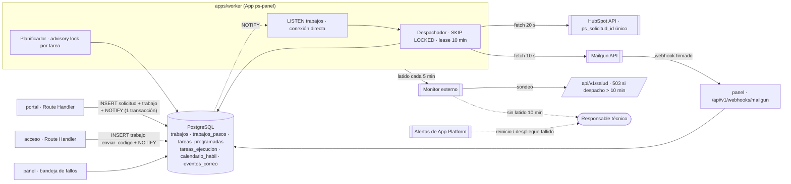
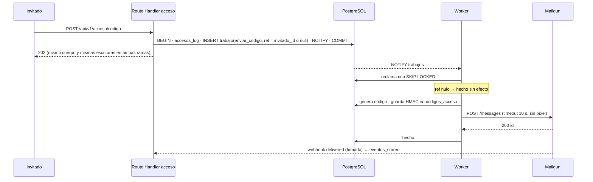

# ADR 0009 — Trabajo diferido en worker, integraciones HubSpot y correo por Mailgun

> Plantilla alineada al método **ADD** (Attribute-Driven Design, Len Bass — *Software Architecture in
> Practice*). Cada sección numerada corresponde a un paso del método. Las decisiones deben trazar a
> [0000-drivers-y-asrs.md](0000-drivers-y-asrs.md) y actualizar
> [_backlog-arquitectonico.md](_backlog-arquitectonico.md). Generada por la skill `setup-architecture`
> (`/build:architect`); un humano la promueve `proposed → accepted`.
>
> **Sustituye a [ADR-0005](0005-integraciones-y-trabajo-diferido.md).** Conserva sin cambios de diseño:
> outbox transaccional, arrendamiento por fila (`locked_until`), reintento infinito con bandeja de
> fallos desde el 3.er fallo, idempotencia por subpaso con la propiedad única `ps_solicitud_id` en
> HubSpot, asociaciones y nota idempotentes, señal de apertura propia con «ya lo estoy atendiendo»,
> escalador con calendario hábil (L–V 8–18 `America/Bogota`, festivos de Colombia, 24 h hábiles),
> notificación por correo + aviso nativo de HubSpot (CRN-2) y monitor externo tipo *dead man's switch*.
> Cambia el motor (cron de PHP → worker Node sobre PostgreSQL) y el correo (SMTP del hosting → Mailgun).

## 1. Objetivo de la iteración y drivers seleccionados (Pasos 2–3)

- **Objetivo de la iteración:** re-instanciar el trabajo diferido y el correo sobre la nueva plataforma
  aprovechando lo que el hosting negaba (procesos largos, notificación de la BD, proveedor de correo con
  eventos), y cerrar los riesgos que existían solo por el hosting.
- **Elemento(s) a refinar:** `apps/worker` (despachador, planificador), `packages/infra/hubspot`,
  `packages/infra/mailgun`, webhook de Mailgun en el panel, tablas de cola y el monitor externo.
- **Drivers abordados:**
  - Funcionales: UC-7, UC-15, UC-16, UC-19.
  - Atributos de calidad: QA-6, QA-7, QA-8, QA-13, QA-14, QA-22.
  - Restricciones: **CON-18** (contenedores), **CON-19** (PostgreSQL), **CON-20** (correo solo por
    Mailgun desde `notify@people.trycore.com`), **CON-21** (llamadas externas solo desde servidor por
    adaptadores con timeout; nunca a URL aportadas por el usuario). Reemplazan a CON-1, CON-2, CON-5 y
    CON-7 en este ámbito.
  - Concerns: CRN-1, CRN-2, CRN-3, CRN-4, CRN-5, CRN-7, CRN-8.

## 2. Conceptos de diseño elegidos (Paso 4)

| Driver | Concepto / Táctica | Alternativas descartadas | Razón |
|--------|--------------------|--------------------------|-------|
| QA-6, UC-7 | **Outbox transaccional en PostgreSQL** (sin cambios de diseño): la solicitud y su trabajo `crear_negocio` se insertan en la misma transacción; el cliente recibe confirmación sin esperar a HubSpot | Llamada síncrona a HubSpot; cola externa (Redis/BullMQ, SQS) | La cola en la misma BD es transaccional con el hecho de negocio sin un segundo sistema; Redis añadiría un servicio administrado más sin ganancia a este volumen |
| QA-6, QA-7, QA-13 | **Worker de proceso largo con reclamo `FOR UPDATE SKIP LOCKED`** + arrendamiento `locked_until = now() + 10 min`. Un trabajo `en_curso` con arrendamiento vencido se retoma. Se pueden correr 1..N réplicas del worker sin coordinación extra | `pg-boss` / `graphile-worker` (bibliotecas de cola sobre PostgreSQL); `GET_LOCK` + cron (plataforma anterior) | Las bibliotecas resuelven reintento y planificación, pero el diseño ya refinado exige estados propios (`fallando` visible, bandeja, subpasos) que habría que forzar sobre su esquema; el reclamo con `SKIP LOCKED` son ~20 líneas y queda bajo nuestro control y nuestros tests |
| QA-8, QA-22 | **Despertar por `LISTEN/NOTIFY`**: el `INSERT` en `trabajos` va acompañado de `NOTIFY trabajos` en la misma transacción (se entrega al confirmar); el worker escucha en una conexión dedicada y, como red de seguridad, sondea cada 5 s | Solo sondeo cada N s; cron cada 5 min (plataforma anterior) | Latencia de despacho sub-segundo en el camino normal: el código de acceso y el aviso comercial ya no esperan al siguiente tick. La conexión de `LISTEN` lleva *keepalive* TCP, escucha `error`/`end` y se reconecta con `LISTEN` de nuevo; el sondeo de 5 s cubre notificaciones perdidas mientras tanto |
| CON-18, QA-13 | **Presupuesto por trabajo, no por corrida**: cada manejador corre con `AbortSignal.timeout` (HubSpot 20 s por llamada, Mailgun 10 s, Gemini 6 s) y un tope por tipo (p. ej. `crear_negocio` ≤ 90 s); concurrencia máxima por tipo (HubSpot 2, correo 4) para respetar límites de tasa | Mantener lotes de 150 s (ya no hay límite de 180 s por proceso) | El proceso es largo; lo que importa es que ningún trabajo retenga su fila más que su arrendamiento (10 min ≫ 90 s) |
| CON-18, QA-22 | **Apagado ordenado con devolución**: ante `SIGTERM` el worker deja de reclamar, aborta los trabajos en curso con su `AbortSignal` y **devuelve** sus filas (`estado='pendiente'`, `locked_until=NULL`, sin sumar `intentos`, `AND locked_by=$reclamo`) antes de salir (margen ≤ 10 s, dentro del periodo de gracia de App Platform, *a verificar*). Es seguro porque cada subpaso es idempotente | Esperar a que terminen (un `crear_negocio` puede durar 90 s); dejar que venza el arrendamiento (10 min de retraso en cada despliegue) | Cada despliegue no retrasa trabajos ni rompe QA-22 |
| QA-7 | **Cierre condicionado al reclamo**: cada reclamo genera un id único (`locked_by = $reclamo`, no por proceso); los `UPDATE` que marcan `hecho`, fallo o devolución llevan `AND locked_by = $reclamo` y, si afectan 0 filas, el resultado se descarta (otro reclamo ya retomó el trabajo) | Cerrar por `id` sin condición | Un proceso que siguió vivo con el arrendamiento vencido no puede pisar el resultado de quien lo retomó |
| QA-8, QA-3 | **Códigos de acceso con reintento propio y caducidad**: el trabajo `enviar_codigo` lleva solo la referencia del invitado (nunca el código ni el correo); **el worker genera el código**, guarda su HMAC en `codigos_acceso` y lo envía. Reintentos a 5, 15 y 30 s; cada reintento genera un código nuevo e invalida el anterior; al superar la vigencia del código (10 min) el trabajo pasa a `caducado` (fuera de la bandeja de fallos) y el usuario puede pedir otro | Heredar el backoff de minutos y el reintento infinito (enviaría códigos ya vencidos durante horas); generar el código en la petición y llevarlo en el `payload` (quedaría en claro en la cola) | Un OTP de 10 min no admite reintentos de minutos; el código solo existe como HMAC en la BD y en el correo |
| QA-8 | **Plazas de correo reservadas**: de la concurrencia de correo, 2 plazas son exclusivas de `enviar_codigo`; el boletín solo usa las demás y respeta un límite de mensajes por minuto por debajo del plan de Mailgun | Cola de correo única sin reserva | Un boletín en curso no retrasa un código de acceso |
| UC-1, UC-9, QA-8 | **Modo degradado del acceso**: si el último ciclo del worker tiene más de 2 min (worker caído o atascado), el Route Handler de acceso procesa él mismo el trabajo recién encolado tras confirmar la transacción, en **ambas ramas**, y rellena la respuesta hasta un tiempo fijo de 2 s para no revelar por tiempo si hubo envío. Registra el uso del modo degradado y alerta | Que sin worker nadie pueda entrar (ni al panel ni a la bandeja de fallos); enviar siempre en línea (se pierde el reintento) | La caída del worker no bloquea el acceso de clientes ni de Talento Humano; la neutralidad se mantiene por relleno de tiempo |
| CRN-4, QA-6 | **Reintento infinito + bandeja de fallos** (sin cambios, salvo `enviar_codigo`): backoff 5-10-20-40-55 min con variación aleatoria de ±10 % y **tope de 55 min**; los errores `Permanente` (4xx de validación) van a `fallando` con aviso inmediato y se reintentan tras corrección; desde el 3.er fallo `fallando`, visible en la bandeja del panel y aviso al responsable, sin dejar de reintentar | Tope de 60 min + sonda de recuperación | Con el worker continuo el siguiente intento sale en el momento exacto (no al siguiente tick de 5 min): peor caso tras la recuperación ≈ **55 min**, dentro de la meta de 60 min de QA-6 (se cierra R-22 sin sonda) |
| QA-7, CRN-7 | **Idempotencia por subpaso + propiedad única `ps_solicitud_id`** en HubSpot; asociaciones idempotentes; nota con marcador leída por asociación; contacto por `idProperty=email`; empresa desde `hubspot_company_id` (sin cambios) | — | Ver ADR-0005 §2: la garantía la da HubSpot mismo |
| QA-6 | **Límites de tasa de HubSpot**: 429 → reprograma con `Retry-After` (acotado a 10 min) sin contar como fallo | Reintento inmediato | Sin cambios |
| UC-15, QA-22, CRN-2 | **Notificación como trabajo** encolado al completar `crear_negocio`: 5 campos por correo + aviso nativo de HubSpot al asignar propietario; aviso degradado sin enlace al negocio si `crear_negocio` llega a `fallando` | Google Chat, WhatsApp | Sin cambios de diseño; ahora sale en segundos tras crear el negocio |
| CRN-1, QA-14 | **Señal de apertura propia** (`/r/<token>`, cambio de etapa/propietario, «ya lo estoy atendiendo») | — | Sin cambios; escalamiento falso declarado (R-23) |
| QA-14, CRN-3, UC-19 | **Planificador dentro del worker con reclamo por fila**: tabla `tareas_programadas` (nombre, intervalo o hora local `America/Bogota`, `proxima_ejecucion`, `lease_hasta`, `lease_por`); cada 30 s el worker reclama cada tarea vencida con `UPDATE tareas_programadas SET proxima_ejecucion = <siguiente>, lease_hasta = now() + <tope de la tarea>, lease_por = $reclamo WHERE nombre = $1 AND proxima_ejecucion <= now() AND (lease_hasta IS NULL OR lease_hasta < now()) RETURNING *`; solo quien obtiene la fila la ejecuta, libera el arrendamiento al terminar (`AND lease_por = $reclamo`) y escribe `tareas_ejecucion` en `finally`. Sin candados consultivos de sesión (con un *pool* el candado y su liberación pueden ir por conexiones distintas y dejar la tarea bloqueada). Tareas: `escalar` (15 min), `vigilar` (5 min), `purgar` (diaria), `verificar_auditoria` (diaria), `sincronizar_colocados` (diaria), `exportar_banco` (semanal), `proponer_lexico` (semanal), `limpiar_tokens` (diaria), `retencion_eventos` (diaria) | Trabajos programados de App Platform; `node-cron`; `pg_try_advisory_lock` por tarea | El planificador portátil no depende de una función del proveedor (CON-18); el reclamo atómico de la fila (misma técnica que la cola) impide ejecuciones dobles con varias réplicas y una tarea larga (`exportar_banco`) queda protegida por su arrendamiento; sin dependencia nueva |
| QA-8, CON-20 | **Mailgun por su API HTTP** (`POST /v3/people.trycore.com/messages`, región de EE. UU. por defecto, *a validar* con T-15) con `fetch` y timeout de 10 s, desde un único adaptador `EnviadorCorreo`. **Todo** correo pasa por la cola: códigos con prioridad alta, avisos y boletín normal. Seguimiento de clics de Mailgun **desactivado** en el dominio y en cada mensaje (`o:tracking-clicks=no`: reescribiría los enlaces firmados); apertura de Mailgun activada solo en avisos y boletín como señal débil, **nunca** en los correos de código. Entrega *al menos una vez*: una respuesta de Mailgun perdida puede producir un correo duplicado (aceptado) | SDK `mailgun.js` (dependencia sin ganancia sobre `fetch`); SMTP de Mailgun (sin eventos por mensaje ni variables); envío del código en línea en la petición | Un solo camino de correo, con eventos por mensaje; con `NOTIFY` el código sale en < 1 s y el P95 ≤ 60 s de QA-8 depende solo de Mailgun y del buzón |
| CRN-5, QA-8 | **Eventos de Mailgun por webhook firmado**: `POST /api/v1/webhooks/mailgun` en el **dominio propio** del panel (pasa por Cloudflare y lleva la cabecera de borde); límite de tamaño (64 KB) y de tasa; verifica `HMAC-SHA256(timestamp ‖ token)` en tiempo constante **antes de escribir nada**, admite dos claves durante una rotación, rechaza marcas de tiempo fuera de ±5 min y tokens repetidos (`webhooks_vistos`), y registra `delivered`, `failed`, `complained`, `unsubscribed`, `opened` en `eventos_correo`, idempotente por id de evento y con estado del envío **monótono** (un evento atrasado no degrada un estado posterior). Rebotes permanentes y quejas pasan a `bajas`. La firma no cubre el contenido del evento: su integridad descansa en TLS y en el token de un solo uso | Leer rebotes por IMAP (plataforma anterior); consultar la API de eventos de Mailgun por sondeo | Rebotes y quejas llegan solos y firmados (se cierra R-3); estado «sin dato» solo cuando Mailgun no informa |
| QA-8, UC-1 | **Supresiones visibles**: tras un rebote permanente Mailgun descarta en silencio los envíos a esa dirección; el panel muestra las direcciones suprimidas de invitados y usuarios del panel y permite a una administradora retirar la supresión (llamada a la API de Mailgun, auditada) | Ignorar las supresiones | Un invitado con un rebote antiguo no se queda sin acceso sin que nadie lo sepa |
| UC-16, CRN-5 | **Boletín por lotes** en la cola (un trabajo por destinatario, enlace firmado por destinatario, bajas persistentes, clic rastreado propio `/r/…`); variables `v:envio_id` y `v:contacto_id` en cada mensaje para correlacionar eventos | Envío masivo en una sola llamada con *batch sending* de Mailgun | El enlace por destinatario (RF-18.2) ya exige un mensaje por persona; el trabajo individual da reintento e idempotencia por destinatario |
| QA-13, CRN-8 | **Vigilancia en tres capas**: (1) `tareas_ejecucion` + tarea `vigilar` que compara con 2× intervalo; (2) chequeo muestreado en los Route Handlers de portal y panel sobre `worker_ciclo` (marca de tiempo que el bucle de despacho escribe en **cada vuelta**, haya o no trabajos): si tiene > 10 min, alerta directa por Mailgun, sin cola, deduplicada a una por hora (los procesos web reciben `MAILGUN_API_KEY` para esto y para el modo degradado); (3) **monitor externo obligatorio**: el latido HTTPS sale **desde el propio bucle de despacho** cada 5 min (un bucle atascado deja de latir) y el monitor avisa si falta 10 min; además sondea `GET /api/v1/salud`, que da 503 si `worker_ciclo` tiene > 10 min o si alguna tarea programada supera 2× su intervalo. Se añaden las **alertas de App Platform** (reinicios, despliegue fallido) por correo al responsable técnico | Solo las alertas del proveedor; solo el vigilante interno | Si el worker cae, caen (1) y el latido: lo detectan (2) con tráfico y (3) sin él. App Platform reinicia el contenedor caído, pero un bucle vivo y atascado solo lo ve el latido |

## 3. Instanciación: responsabilidades e interfaces (Paso 5)

- **Elementos instanciados (esquema `operacion`):** `solicitudes`; `trabajos` (`id`, `tipo`,
  `prioridad`, `payload jsonb`, `clave_idempotencia` UNIQUE, `intentos`, `proximo_intento`, `estado`
  `pendiente|en_curso|hecho|fallando`, `locked_by`, `locked_until`, `ultimo_error`); `trabajos_pasos`
  (`trabajo_id`, `paso`, `clave` UNIQUE, `ref_externa`, `hecho_en`); `tareas_programadas`;
  `tareas_ejecucion`; `calendario_habil`; `aperturas`; `envios_boletin`; `bajas`; `eventos_correo`
  (`mailgun_event_id` UNIQUE); `webhooks_vistos` (token, expira); `worker_ciclo` (una fila: última vuelta del bucle de
  despacho). `trabajos.estado` gana `caducado` (solo `enviar_codigo`).
- **Casos de uso:** `RegistrarSolicitud`, `DespacharTrabajos`, `CrearNegocioHubSpot`,
  `NotificarSolicitud`, `EscalarSolicitudes`, `EnviarCodigoAcceso`, `EnviarLoteBoletin`,
  `RegistrarEventoCorreo`, `VigilarTareas`, `RegistrarVoto`.
- **Puertos:** `CrmPort` (→ `infra/hubspot`), `EnviadorCorreo` (→ `infra/mailgun`), `ColaTrabajos`
  (→ `infra/postgres`), `Reloj`, `Latido`, `CanalAviso` (sin adaptador en v1).
- **Proceso `apps/worker`** (`node dist/worker.js`):
  - Conexión dedicada `LISTEN trabajos` directa al servidor PostgreSQL (puerto directo, **no** por el
    *pool* de PgBouncer en modo transacción, que no soporta `LISTEN`); *pool* `pg` de 5 conexiones para
    el trabajo.
  - Bucle de despacho: al recibir `NOTIFY` o cada 5 s, reclama mientras haya capacidad por tipo:
    `UPDATE operacion.trabajos SET estado='en_curso', locked_by=$corrida, locked_until=now()+interval '10 minutes'
    WHERE id = (SELECT id FROM operacion.trabajos WHERE ((estado IN ('pendiente','fallando') AND proximo_intento<=now())
    OR (estado='en_curso' AND locked_until<now())) AND tipo = ANY($tipos_con_capacidad)
    ORDER BY prioridad DESC, proximo_intento LIMIT 1 FOR UPDATE SKIP LOCKED) RETURNING *`.
  - Éxito → `hecho`; fallo → `intentos+1`, backoff con tope 55 min (salvo `enviar_codigo`: 5/15/30 s
    y `caducado` a los 10 min), desde 3 `fallando` y aviso al responsable (una vez por umbral). Todo
    cierre lleva `AND locked_by = $reclamo`.
  - Cada vuelta del bucle escribe `worker_ciclo`; cada 5 min, desde el mismo bucle, latido al monitor.
  - Planificador cada 30 s con reclamo por fila (ver §2).
  - `SIGTERM` → deja de reclamar, aborta y devuelve las filas en curso, cierra conexiones.
- **Endpoints:** portal `POST /api/v1/solicitudes`, `POST /api/v1/sondeo/voto`, `GET /r/{token}`,
  `GET /api/v1/salud`; panel bandeja de fallos, `POST /api/v1/webhooks/mailgun` (sin sesión ni CSRF;
  autenticado por firma), `GET /api/v1/salud`.
- **Configuración (variables `SECRET` de App Platform):** `DATABASE_URL`, `DATABASE_DIRECT_URL`
  (para `LISTEN`), `HUBSPOT_PRIVATE_APP_TOKEN`, `MAILGUN_API_KEY`, `MAILGUN_WEBHOOK_SIGNING_KEY`,
  `MAILGUN_DOMAIN`, `LATIDO_URL`.
- **Responsabilidades destacadas:**
  - `RegistrarSolicitud`: valida con `zod`, calcula hash de especificación, aplica dedupe D-7, inserta
    solicitud + trabajo + `NOTIFY` en una transacción y responde 201.
  - `CrearNegocioHubSpot`: subpasos `negocio` → `asociaciones` → `nota` (sin cambios, ADR-0005 §3);
    al completar encola `notificar`.
  - `EnviarCodigoAcceso`: el caso de uso de acceso (ADR-0002, enmienda) encola en **ambas ramas** un
    trabajo `enviar_codigo` con `payload = {ref: invitado_id | null, ambito}` (misma forma y mismas
    escrituras); el manejador, si `ref` es nulo, cierra sin efecto; si no, genera el código, guarda su
    HMAC en `codigos_acceso` (invalidando el anterior) y llama a Mailgun.
  - `RegistrarEventoCorreo`: verifica firma y frescura, deduplica por `mailgun_event_id`, actualiza
    `eventos_correo`, `bajas` y el estado del envío.
- **Interfaces / contratos (TypeScript):**
  - `interface CrmPort { leerNegocioPorSolicitud(id: string): Promise<NegocioRef | null>; crearNegocio(n: NegocioNuevo): Promise<NegocioRef> /* lanza Conflicto */; resolverContacto(correo: string, companyId: string): Promise<ContactoRef>; asociar(a: ObjetoRef, b: ObjetoRef): Promise<void>; notaConMarcador(n: NegocioRef, marcador: string): Promise<boolean>; anotar(n: NegocioRef, c: ContactoRef, nota: string): Promise<void>; leerEstado(n: NegocioRef): Promise<EstadoNegocio>; verificarPropiedadUnica(nombre: string): Promise<boolean> }`
  - `interface EnviadorCorreo { enviar(m: Mensaje): Promise<ResultadoEnvio> }` (`Mensaje` lleva
    `variables` para `v:*` y `seguimientoClics: false` fijo).
  - `interface Latido { latir(resumen: ResumenCiclo): Promise<void> /* nunca lanza; timeout 5 s */ }`
  - Errores tipificados: `Transitorio` (5xx, timeout, 429) → reintento; `Conflicto` → leer y
    reutilizar; `Permanente` (4xx de validación) → `fallando` con aviso inmediato.

## 4. Vistas y registro de la decisión (Paso 6)

**Decisión:** todo efecto externo (HubSpot, códigos, avisos, boletín, voto) es un trabajo en
PostgreSQL encolado en la misma transacción que el hecho de negocio y despertado por `NOTIFY`; un
worker de proceso largo lo reclama con `FOR UPDATE SKIP LOCKED` y arrendamiento de 10 min, con timeouts
por llamada, concurrencia por tipo, backoff con tope de 55 min y reintento infinito con bandeja de
fallos. Las tareas periódicas las ejecuta el mismo worker con candado consultivo por tarea. El correo
sale solo por la API de Mailgun y sus eventos entran por webhook firmado. La vigilancia combina
registro de corridas, chequeo en las peticiones web, alertas de App Platform y un monitor externo con
latido.

**Trade-offs aceptados:**
- La cola vive en la misma BD que el negocio: una BD caída detiene también la cola (aceptable: sin BD
  tampoco se reciben solicitudes).
- Un proveedor externo más para el correo (Mailgun): cuenta, dominio verificado y clave que rotar; a
  cambio, reputación de envío y eventos que el hosting no daba.
- Los clics se rastrean con enlaces propios, no con los de Mailgun (se pierde su panel de clics, se
  conservan los enlaces firmados intactos).
- El monitor externo sigue siendo obligatorio (servicio sin elegir, R-24).

## 5. Análisis del diseño (Paso 7)

| Driver | ✅/⚠️/❌ | Evidencia / medida | Riesgo residual |
|--------|---------|--------------------|-----------------|
| UC-7 | ⚠️ | Outbox + subpasos + D-7; integración contra un portal de pruebas de HubSpot en staging | CRN-7: pipeline, scopes y `ps_solicitud_id` único sin crear (R-21) |
| UC-15 | ⚠️ | Correo con 5 campos + aviso nativo de HubSpot + escalador con reloj simulado | Destinatarios nominales sin definir (R-36); escalamiento falso (R-23) |
| UC-16 | ✅ | Un trabajo por destinatario, enlace firmado, bajas, eventos por webhook. Plan: test del webhook con firma válida, inválida, vieja y repetida | Límites de envío del plan de Mailgun a confirmar con el volumen del boletín |
| UC-19 | ✅ | Reclamo por fila con arrendamiento en el planificador; `tareas_ejecucion` en `finally` + vigilante + chequeo web + latido desde el bucle + alertas del proveedor. Plan: dos réplicas del worker con reloj simulado → cada tarea corre una vez por vencimiento; en staging, detener el worker y medir alerta ≤ 10 min | — |
| QA-6 | ✅ | Persistido antes de responder; confirmación sin HubSpot; alerta al 3.er fallo; peor caso tras recuperación ≈ 55 min (tope de backoff 55 min, sin tick). Plan: test con reloj simulado del calendario de backoff | P95 ≤ 2 s de confirmación sin medir en DO (probable: una transacción) |
| QA-7 | ✅ | Propiedad única en HubSpot + subpasos + `SKIP LOCKED` + arrendamiento + `clave_idempotencia` + hash D-7. Plan: 50 respuestas perdidas y dos réplicas del worker en paralelo contra un doble de HubSpot → 0 duplicados | Depende de R-21 |
| QA-8 | ⚠️ | Un solo adaptador; `NOTIFY` → código generado y despachado en < 1 s; reintentos a 5/15/30 s y caducidad; 2 plazas reservadas; modo degradado si cae el worker; supresiones visibles; DKIM/SPF/DMARC en Mailgun | Entrega en bandeja y retrasos por listas grises en buzones corporativos sin medir (V-4 de ADR-0010) |
| QA-13 | ✅ | Registro de corridas; alerta a 2× intervalo por vigilante, chequeo web sobre `worker_ciclo` y latido externo desde el bucle; `/salud` 503 por worker o tarea atrasada; alertas de App Platform. (La medida «< 180 s por corrida» de QA-13 en 0000 era de la plataforma anterior; aquí rige: ningún trabajo retiene su fila más que su arrendamiento) | Proveedor del monitor sin elegir (R-24) |
| QA-14 | ⚠️ | `escalar` cada 15 min; reloj simulado sobre semana con festivo | Festivos a cargar cada año; escalamiento falso (R-23) |
| QA-22 | ✅ | `notificar` despachado por `NOTIFY` al completar el negocio (segundos); el apagado devuelve las filas en curso (un despliegue no retrasa 10 min); aviso degradado al 3.er fallo. Plan: medir en staging el tiempo solicitud → correo entregado (evento `delivered`) | Aviso degradado pendiente de confirmar (trade-off heredado) |
| CON-18 | ✅ | Worker sin dependencias del proveedor; planificador propio | — |
| CON-19 | ⚠️ | Cola y planificador en PostgreSQL; `pool` de 5 + 1 conexión directa por réplica dentro del presupuesto de ADR-0008 | `LISTEN` exige conexión directa (V-6 de ADR-0010); presupuesto de conexiones frente al plan (R-49) |
| CON-20 | ✅ | Adaptador único Mailgun; grep en CI de `nodemailer`, `smtp` y `sendmail` = 0 | — |
| CON-21 | ✅ | Todo HTTP saliente en `packages/infra` con `AbortSignal.timeout`; lint prohíbe `fetch` fuera de `infra` en código de servidor | — |
| CRN-1 | ⚠️ | Sin cambios | R-23 |
| CRN-2 | ✅ | Decidido (correo + aviso nativo de HubSpot) | Divergencia a reflejar en el PRD (T-13) |
| CRN-3 | ✅ | Decidido; tabla administrable | Carga anual de festivos |
| CRN-4 | ✅ | Bandeja desde el 3.er fallo sin dejar de reintentar | — |
| CRN-5 | ✅ | Rebotes, quejas y bajas por webhook firmado; «sin dato» solo cuando Mailgun no informa | Apertura sigue siendo señal débil (Apple Mail Privacy Protection); la regla de 3 envíos usa clic/entrada (T-10) |
| CRN-7 | ⚠️ | Verificación de la propiedad única al arrancar | Depende de Mercadeo y Comercial (R-21) |
| CRN-8 | ✅ | Ya no hay crontab: el equivalente es la caída del worker, cubierta por latido, chequeo web y alertas del proveedor | — |

**Drivers no resueltos en esta iteración:** CRN-7 (configuración de HubSpot) y la entrega en bandeja
(QA-8) quedan como verificación de staging.

## 6. Consecuencias

- **Positivas:**
  - Código de acceso y aviso comercial salen en segundos (no al siguiente tick de 5 min): se cierran
    R-26 y R-27 y mejora QA-8 y QA-22.
  - Peor caso de entrega tras una caída de HubSpot ≈ 55 min, dentro de la meta (R-22).
  - Rebotes y quejas llegan por webhook: se cierra R-3 (IMAP) y se elimina la dependencia de la IP
    compartida del hosting (R-5 pasa a depender de Mailgun).
  - Sin techo de 180 s por proceso: se cierra R-25.
- **Negativas:**
  - Un proceso más que operar y un proveedor más (Mailgun).
  - El webhook de Mailgun es una ruta pública sin sesión: su seguridad descansa en la firma.
- **Riesgos:** R-21, R-23, R-24 (heredados); R-43 (clave de firma del webhook filtrada o sin rotar);
  R-44 (región de Mailgun y transferencia internacional de datos, T-15); R-52 (el acceso depende del
  worker: mitigado por el modo degradado, que debe probarse en staging); R-53 (supresiones de Mailgun
  que dejan sin acceso a un invitado); R-49 (conexiones).
- **Trade-offs de negocio abiertos (heredados de ADR-0005):** aviso degradado sin enlace al negocio
  cuando HubSpot falla (QA-22); tolerancia al escalamiento falso con «ya lo estoy atendiendo»
  (CRN-1); destinatarios nominales de escalamiento; proveedor del monitor externo.
- **Operacionales:** alta del dominio de envío `people.trycore.com` en Mailgun (registros SPF, DKIM,
  CNAME de seguimiento y MX de rebotes en la zona de Cloudflare, en modo solo DNS); política DMARC;
  webhook configurado hacia el host del panel de cada entorno; staging con su propio dominio de envío
  o lista de destinatarios autorizados.

## 7. Trazabilidad

- Drivers: [0000-drivers-y-asrs.md](0000-drivers-y-asrs.md) · UC-7, UC-15, UC-16, UC-19 · QA-6, QA-7,
  QA-8, QA-13, QA-14, QA-22 · CON-18, CON-19, CON-20, CON-21 · CRN-1, 2, 3, 4, 5, 7, 8.
- Sustituye a: [ADR-0005](0005-integraciones-y-trabajo-diferido.md) (su §3 sigue siendo la referencia
  del algoritmo de subpasos de HubSpot).
- PRD v4.11: RF-5, RF-9.1–9.7, RF-10.8, RF-17, RF-18, RF-1.6 · D-6, D-7, D-21 · **§8.3 pendiente de
  reescribir en discovery** (SMTP del hosting → Mailgun).
- Specs: `docs/10-specs/correo-curado.md`, `docs/10-specs/enlaces-curados.md`.
- HU: HU-096–HU-107, HU-077, HU-113–HU-117 · Épicas: EP-005, EP-007, EP-011.
- ADR relacionados: [0008](0008-plataforma-contenedores-y-stack.md), [0002](0002-identidad-acceso-y-sesiones.md)
  (códigos por la cola), [0003](0003-datos-persistencia-y-auditoria.md) (tareas diarias),
  [0004](0004-busqueda-determinista-y-estado.md) (léxico semanal, voto), [0010](0010-entornos-despliegue-y-perimetro.md)
  (App Platform, monitor, alertas).
- Stack: sin dependencias nuevas (Mailgun y HubSpot por `fetch`; cola con `pg`).
