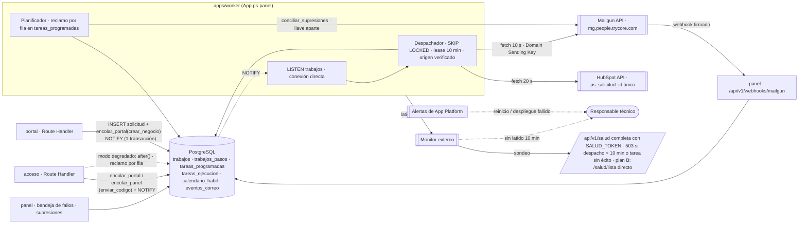

# ADR 0009 — Trabajo diferido en worker, integraciones HubSpot y correo por Mailgun

> **Revisión adversarial (2026-09-26):** incorpora los hallazgos H2, H8, H9, H11, H16, H17, H19, H21,
> H22, H44, H45 y la parte que toca a esta ADR de H0, H23, H25, H26, H27 y H43 de la revisión
> multiagente. Las verificaciones propias se numeran V9-n; las de otros ADR se citan V8-n y V10-n.
>
> **Consolidación (2026-09-26, tras la revisión en paralelo):** esta ADR es la referencia única de la
> cola, el worker, el planificador y el correo. Cita sin redefinir: el modo degradado del acceso, los
> códigos ante envío ambiguo y la lista blanca de encolado con `trabajos.origen` (ADR-0002, I-3); el
> contrato de `aplicar_importacion` (ADR-0003, I-2); el dueño y el mantenimiento de `eventos`
> (ADR-0006, I-4); el candado `mantenimiento_esquema` (ADR-0003, I-7); la salud `vivo`/`lista`/completa,
> las variables y el runbook de restauración (ADR-0010, I-8). Tablas de códigos con los nombres de
> ADR-0002 (`codigos_cliente`, `codigos_panel`). V9-1 y V9-6 pasan a alias de V2-4 y V3-5.

> Plantilla alineada al método **ADD** (Attribute-Driven Design, Len Bass — *Software Architecture in
> Practice*). Cada sección numerada corresponde a un paso del método. Las decisiones deben trazar a
> [0000-drivers-y-asrs.md](0000-drivers-y-asrs.md) y actualizar
> [_backlog-arquitectonico.md](_backlog-arquitectonico.md). Generada por la skill `setup-architecture`
> (`/build:architect`); un humano la promueve `proposed → accepted`.
>
> **Sustituye a [ADR-0005](0005-integraciones-y-trabajo-diferido.md).** Conserva sin cambios de diseño:
> outbox transaccional, arrendamiento por fila (`locked_until`), reintento infinito con bandeja de
> fallos desde el 3.er fallo, idempotencia por subpaso con la propiedad única `ps_solicitud_id` en
> HubSpot, asociaciones y nota idempotentes, señal de apertura propia con «ya lo estoy atendiendo»,
> escalador con calendario hábil (L–V 8–18 `America/Bogota`, festivos de Colombia, 24 h hábiles),
> notificación por correo + aviso nativo de HubSpot (CRN-2) y monitor externo tipo *dead man's switch*.
> Cambia el motor (cron de PHP → worker Node sobre PostgreSQL) y el correo (SMTP del hosting → Mailgun).
> Esta ADR es **autocontenida**: el algoritmo de subpasos de HubSpot y el vigilante de la vuelta al
> determinista, que vivían en ADR-0005, se recogen aquí (§3); ADR-0005 ya no es referencia normativa.

> **Decisión de negocio (2026-09-27, T-28):** además de la nota del negocio en HubSpot, Coordinación de Servicio recibe la solicitud por **correo interno** (HU-101): un trabajo `notificar_delivery` en la cola, mismo adaptador de Mailgun. Prototipo en `docs/05-prototipo/` (correo-aviso-interno--solicitud-delivery).

## 1. Objetivo de la iteración y drivers seleccionados (Pasos 2–3)

- **Objetivo de la iteración:** re-instanciar el trabajo diferido y el correo sobre la nueva plataforma
  aprovechando lo que el hosting negaba (procesos largos, notificación de la BD, proveedor de correo con
  eventos), y cerrar los riesgos que existían solo por el hosting.
- **Elemento(s) a refinar:** `apps/worker` (despachador, planificador), `packages/infra/hubspot`,
  `packages/infra/mailgun`, webhook de Mailgun en el panel, tablas de cola y el monitor externo.
- **Drivers abordados:**
  - Funcionales: UC-7, UC-15, UC-16, UC-19.
  - Atributos de calidad: QA-6, QA-7, QA-8, QA-13, QA-14, QA-22.
  - Restricciones: **CON-18** (contenedores), **CON-19** (PostgreSQL), **CON-20** (correo solo por
    Mailgun con remitente `notify@people.trycore.com`; dominio de envío `mg.people.trycore.com`),
    **CON-21** (llamadas externas solo desde servidor por adaptadores con timeout; nunca a URL aportadas
    por el usuario). Reemplazan a CON-1, CON-2, CON-5 y CON-7 en este ámbito.
  - Concerns: CRN-1, CRN-2, CRN-3, CRN-4, CRN-5, CRN-6 (vigilante de la vuelta al determinista), CRN-7,
    CRN-8.

## 2. Conceptos de diseño elegidos (Paso 4)

| Driver | Concepto / Táctica | Alternativas descartadas | Razón |
|--------|--------------------|--------------------------|-------|
| QA-6, UC-7 | **Outbox transaccional en PostgreSQL** (sin cambios de diseño): la solicitud y su trabajo `crear_negocio` se insertan en la misma transacción; el cliente recibe confirmación sin esperar a HubSpot | Llamada síncrona a HubSpot; cola externa (Redis/BullMQ, SQS) | La cola en la misma BD es transaccional con el hecho de negocio sin un segundo sistema; Redis añadiría un servicio administrado más sin ganancia a este volumen |
| QA-6, QA-7, QA-13 | **Worker de proceso largo con reclamo `FOR UPDATE SKIP LOCKED`** + arrendamiento `locked_until = now() + 10 min`. Un trabajo `en_curso` con arrendamiento vencido se retoma. **Ningún tipo tiene un tope mayor que el arrendamiento, así que no hay renovación** (la importación y la reversión tienen tope de 5 min, contrato de ADR-0003; *sustituye a la renovación cada 60 s del texto anterior, I-2*). Se pueden correr 1..N réplicas del worker sin coordinación extra | `pg-boss` / `graphile-worker` (bibliotecas de cola sobre PostgreSQL); `GET_LOCK` + cron (plataforma anterior); arrendamiento largo para todos | Las bibliotecas resuelven reintento y planificación, pero el diseño ya refinado exige estados propios (`fallando` visible, bandeja, subpasos) que habría que forzar sobre su esquema; el reclamo con `SKIP LOCKED` son ~20 líneas y queda bajo nuestro control y nuestros tests. Un arrendamiento largo general retrasaría 30 min la recuperación de cualquier trabajo huérfano |
| QA-8, QA-22 | **Despertar por `LISTEN/NOTIFY`**: el encolado (funciones `encolar_*` de ADR-0002, única vía de `INSERT` en `trabajos`) hace `NOTIFY trabajos` en la misma transacción (se entrega al confirmar); el worker escucha en una conexión dedicada y, como red de seguridad, sondea cada 5 s | Solo sondeo cada N s; cron cada 5 min (plataforma anterior) | Latencia de despacho sub-segundo en el camino normal: el código de acceso y el aviso comercial ya no esperan al siguiente tick. La conexión de `LISTEN` lleva *keepalive* TCP, escucha `error`/`end` y se reconecta con `LISTEN` de nuevo; el sondeo de 5 s cubre notificaciones perdidas mientras tanto |
| CON-18, QA-13 | **Presupuesto por trabajo, no por corrida**: cada manejador corre con `AbortSignal.timeout` (HubSpot 20 s por llamada, Mailgun 10 s, Gemini 6 s) y un tope por tipo (`crear_negocio` ≤ 90 s; `enviar_codigo` ≤ 15 s; `aplicar_importacion`/`revertir_importacion` ≤ 5 min, ADR-0003); concurrencia máxima por tipo (HubSpot 2, correo 4, importación 1) para respetar límites de tasa | Mantener lotes de 150 s (ya no hay límite de 180 s por proceso) | El proceso es largo; lo que importa es que ningún trabajo retenga su fila más que su arrendamiento vigente (10 min ≫ 90 s y > 5 min de la importación) |
| CON-18, QA-22 | **Apagado ordenado con devolución**: ante `SIGTERM` el worker deja de reclamar, aborta los trabajos en curso con su `AbortSignal` y **devuelve** sus filas (`estado='pendiente'`, `locked_until=NULL`, sin sumar `intentos`, `AND locked_by=$reclamo`) antes de salir (margen ≤ 10 s, dentro del periodo de gracia de App Platform, V10-12). Es seguro porque cada subpaso es idempotente y la importación hace *rollback* completo | Esperar a que terminen (un `crear_negocio` puede durar 90 s); dejar que venza el arrendamiento (10 min de retraso en cada despliegue) | Cada despliegue no retrasa trabajos ni rompe QA-22 |
| QA-7 | **Cierre condicionado al reclamo**: cada reclamo genera un id único (`locked_by = $reclamo`, no por proceso); los `UPDATE` que marcan `hecho`, fallo o devolución llevan `AND locked_by = $reclamo` y, si afectan 0 filas, el resultado se descarta (otro reclamo ya retomó el trabajo). El mismo protocolo lo usa el modo degradado del acceso | Cerrar por `id` sin condición | Un proceso que siguió vivo con el arrendamiento vencido no puede pisar el resultado de quien lo retomó |
| QA-7, CON-9 | **Origen del trabajo fijado por la BD**, con la definición única de ADR-0002 (fila «H0 — encolado»): se encola solo con `encolar_portal`, `encolar_panel` o `encolar_worker`, que escriben `trabajos.origen` con su literal (`'portal'`, `'panel'`, `'worker'`) y validan la **lista blanca única** de ADR-0002; ningún rol de conexión inserta en `trabajos` directamente. Antes de ejecutar, el worker vuelve a comprobar que el `origen` de la fila está en la lista de su tipo y valida el `payload` con su esquema `zod`; si no → `Permanente`, no se ejecuta, alerta de seguridad. *Sustituye al texto anterior (`DEFAULT current_user` comparado con nombres de rol, que dentro de una función `SECURITY DEFINER` registraría al dueño de la función, y una lista por tipo distinta de la de ADR-0002)* | Confiar en que solo el código legítimo encola | Defensa en profundidad frente a un portal comprometido que encole trabajos del panel (H0); complementa la restricción de `INSERT` de ADR-0008 |
| QA-8, QA-3 | **Códigos de acceso con reintento propio, caducidad y envío ambiguo**: el trabajo `enviar_codigo` lleva solo la referencia del invitado (nunca el código ni el correo); **el worker genera el código**, guarda su HMAC en `codigos_cliente` o `codigos_panel` según el ámbito (ADR-0002) y lo envía. Reintentos a 5, 15 y 30 s con código nuevo. La clasificación **definitivo/ambiguo**, el número de códigos vigentes por (ámbito, sujeto) y la regla de que un código invalidado por el sistema no suma intento son los de ADR-0002 (fila H22); **hasta 3 vigentes es propuesta por defecto, pendiente de T-31**. Al superar la vigencia (10 min) el trabajo pasa a `caducado` (fuera de la bandeja) y el usuario puede pedir otro | Heredar el backoff de minutos y el reintento infinito (enviaría códigos ya vencidos durante horas); generar el código en la petición y llevarlo en el `payload` (quedaría en claro en la cola); invalidar el anterior en cada reintento (el usuario recibe un código que ya no vale si el envío «fallido» sí llegó); reenviar el mismo código (solo existe su HMAC) | Un OTP de 10 min no admite reintentos de minutos; el código solo existe como HMAC en la BD y en el correo; con listas grises los correos llegan desordenados y cualquiera de los recibidos funciona |
| QA-8 | **Plazas de correo reservadas**: de la concurrencia de correo, 2 plazas son exclusivas de `enviar_codigo`; el boletín solo usa las demás y respeta un límite de mensajes por minuto por debajo del plan de Mailgun | Cola de correo única sin reserva | Un boletín en curso no retrasa un código de acceso |
| UC-1, UC-9, QA-8 | **Modo degradado del acceso: definición única en ADR-0002** (fila «H8 — modo degradado»), que esta ADR aplica sin redefinir: con `worker_ciclo` > 2 min, misma transacción que en modo normal y `202` **sin relleno de tiempo**; `after()` procesa **solo su propia fila** por las funciones de ADR-0002 (`operacion.reclamar_propio`, `identidad.guardar_codigo_cliente`/`identidad_panel.guardar_codigo_panel` y `operacion.cerrar_propio`), que ejecutan dentro el mismo reclamo del worker (`… WHERE id=$1 AND estado='pendiente' RETURNING`) y el cierre con `AND locked_by` (portal y panel no tienen `UPDATE` directo en `trabajos` ni `INSERT` en `codigos_*`; *consolidación, 2.ª pasada*), y suelta la conexión antes de llamar a Mailgun; **un solo intento** (si falla, la fila vuelve a `pendiente` con `proximo_intento = now()+5 s` para el worker); no procesa filas ajenas; semáforo de 2 por instancia; registra el uso del modo degradado y alerta. *Sustituye al texto anterior (respuesta a los 2 s exactos, reintentos 5/15/30 s dentro del `after()` y drenaje de 2 pendientes ajenos, I-3)* | Que sin worker nadie pueda entrar (ni al panel ni a la bandeja de fallos); enviar siempre en línea (se pierde el reintento); procesar sin reclamo y rellenar hasta 2 s (una llamada a Mailgun de hasta 10 s alarga solo la rama invitada, revela por tiempo quién está invitado, retiene conexiones del *pool* de 4 y, con el worker vivo pero retrasado, genera dos códigos) | La caída del worker no bloquea el acceso; la neutralidad se mantiene porque ninguna rama espera a Mailgun dentro de la ventana medida; no hay doble procesamiento ni agotamiento del *pool* |
| CRN-4, QA-6 | **Reintento infinito + bandeja de fallos** (sin cambios, salvo `enviar_codigo` y la importación): backoff 5-10-20-40-55 min con variación aleatoria de ±10 % y **tope de 55 min**; los errores `Permanente` (4xx de validación) van a `fallando` con aviso inmediato y se reintentan tras corrección; desde el 3.er fallo `fallando`, visible en la bandeja del panel y aviso al responsable, sin dejar de reintentar | Tope de 60 min + sonda de recuperación | Con el worker continuo el siguiente intento sale en el momento exacto (no al siguiente tick de 5 min): peor caso tras la recuperación ≈ **55 min**, dentro de la meta de 60 min de QA-6 (se cierra R-22 sin sonda) |
| QA-9, QA-10 | **Importación y reversión en la cola** (`aplicar_importacion`, `revertir_importacion`) con el **contrato único de ADR-0003** (I-2), que esta ADR aplica sin redefinir: concurrencia 1, `intentos` máximo 1 sin reintento automático, **tope de 5 min sin renovar el arrendamiento**, lote como fuente de verdad (retoma con lote `aplicado` → `hecho` sin reaplicar; retoma sin aplicar → lote `abortado`), candado ocupado → +1 min sin sumar `intentos`; reintentar es una acción explícita de la persona desde el panel. La transacción escribe perfiles en su curso y toma la fila de `inventario_version` y la cabeza de la cadena de auditoría **solo en el paso final** (sube la versión una vez e inserta en bloque las filas de auditoría del lote, encadenadas en una pasada, ADR-0003), respetando el orden perfil → hijas → versión global → auditoría de ADR-0003; retención de las filas globales ≤ 5 s | «Transacción sin techo» sin tope ni renovación (otro reclamo la retoma a los 10 min y choca con el candado; el primero no puede cerrar y el lote queda aplicado con el trabajo en `fallando`); subir la versión global por fila (retiene las filas globales toda la importación y el panel acaba en 503) | La importación cabe en el contrato de la cola; el resultado no depende del cierre del trabajo; los guardados del panel no esperan a un lote largo |
| QA-7, CRN-7 | **Idempotencia por subpaso + propiedad única `ps_solicitud_id`** en HubSpot; asociaciones idempotentes; nota con marcador leída por asociación; contacto por `idProperty=email`; empresa desde `hubspot_company_id` (algoritmo completo en §3) | Buscar antes de crear con la Search API (retraso de indexación); idempotencia solo por trabajo completo | La garantía la da HubSpot mismo: un segundo intento falla por valor único en vez de duplicar |
| QA-6 | **Límites de tasa de HubSpot**: 429 → reprograma con `Retry-After` (acotado a 10 min) sin contar como fallo | Reintento inmediato | Sin cambios |
| UC-15, QA-22, CRN-2 | **Notificación como trabajo** encolado al completar `crear_negocio`: 5 campos por correo + aviso nativo de HubSpot al asignar propietario; aviso degradado sin enlace al negocio si `crear_negocio` llega a `fallando` | Google Chat, WhatsApp | Sin cambios de diseño; ahora sale en segundos tras crear el negocio |
| UC-15, RF-17 | **Traspaso a Delivery con especificación completa en HubSpot** — **propuesta por defecto, pendiente de T-28** (no normativa: el canal depende de que Coordinación de Servicio tenga acceso a HubSpot y el cálculo de OE-03 del plazo de RF-17.3 que acuerde Delivery; si T-28 elige la opción (b), la especificación se muestra en una vista de solo lectura del panel): (a) la nota del subpaso `nota` lleva la **especificación estructurada completa** de RF-17.1 con plantilla fija (reto, rol, seniority, tecnologías, sector, modalidad, ubicación, perfiles con código y enlace del panel) y la marca «Especificación revisada por el cliente: sí / no (inferida)»; la marca va también como propiedad `ps_especificacion_revisada` del negocio (RF-17.5). El correo a Coordinación de Servicio enlaza al negocio. (b) La fecha de alineación **no se envía al crear** el negocio: dos propiedades, `ps_fecha_alineacion_actual` (la escribe quien agenda en HubSpot) y `ps_fecha_alineacion_primera`; la tarea `sincronizar_negocios` (diaria) lee `actual` y, si el portal no tiene aún la primera, guarda `solicitudes.fecha_alineacion_primera` y la escribe en HubSpot (subpaso idempotente `alineacion_primera`); la primera **nunca se sobrescribe** en el portal aunque HubSpot la cambie al reagendar (HU-107). OE-03 se calcula desde `solicitudes` | Solo el correo de 5 campos (RF-17.1 lo descarta: «no un resumen»); una propiedad única de fecha (HubSpot la sobrescribe al reagendar); vista nueva en el panel (exige rol nuevo en la matriz de ADR-0002) | Coordinación lee la especificación donde ya se trabaja el negocio, sin integración nueva; el portal es la fuente de verdad de la primera fecha y del indicador |
| CRN-1, QA-14 | **Señal de apertura propia** (`/r/<id>`, cambio de etapa/propietario, «ya lo estoy atendiendo»). **Contrato único de `/r/`** (esta ADR es la dueña; ADR-0002 lo cita; *consolidación, 2.ª pasada*): se usa **solo** en avisos internos al comercial. **Host: el panel** (`people-panel.trycore.com`), ruta pública `GET /r/[id]` listada en `rutas-publicas.json` del panel (V2-1), sin sesión ni CSRF; nunca en el portal, así que no figura en `rutas-permitidas.json` (V8-1). El `id` es aleatorio opaco de 32 bytes, lo genera el worker al enviar el aviso y se guarda solo como SHA-256 en `operacion.aperturas` (`id_hash` único, `solicitud_id`, `negocio_id` de HubSpot, `creado_en`, `abierto_en`). Al abrirlo, marca `abierto_en` la primera vez y **redirige (302) al negocio en HubSpot**, con la URL construida en servidor desde `negocio_id` (nunca desde la query); un `id` desconocido redirige al inicio del panel sin distinguir el caso. No da acceso a inventario ni a sesión. **Permisos** (lista normativa de esta ADR): `ps_worker` `INSERT` en `aperturas`; `ps_panel` `SELECT` y `UPDATE (abierto_en)`; `ps_portal` ninguno. *Sustituye a «redirige al inicio del panel» (texto anterior de ADR-0002) y a `GET /r/{token}` entre los endpoints del portal* | Redirector en el portal (su rol tendría que escribir en `aperturas` y la ruta ampliaría la superficie del proceso más expuesto) | Sin cambios de fondo; escalamiento falso declarado (R-23) |
| CON-9, QA-5 | **Permisos sobre la cola, tareas y correo** (*revisión de coherencia*: lista normativa de esta ADR, que ADR-0002 y ADR-0008 citan; todas las tablas son de `ps_duenio` y los `GRANT` los emite `ps_migrador` en la migración que crea cada una; sin `DELETE` directo para ningún rol de conexión salvo lo indicado). **`ps_portal`:** `SELECT` de `worker_ciclo` (chequeo de la capa 2 de vigilancia y modo degradado de H8, ADR-0002); `INSERT` y `SELECT` en `solicitudes` (solo por su caso de uso `RegistrarSolicitud`); `trabajos` solo por `encolar_portal` (ADR-0002); ningún permiso sobre `tareas_programadas`, `tareas_ejecucion`, `calendario_habil`, `eventos_correo`, `webhooks_vistos`, `bajas`, `envios_boletin` ni `aperturas`. **`ps_panel`:** `SELECT` de `worker_ciclo`, `tareas_programadas`, `tareas_ejecucion`, `trabajos`, `trabajos_pasos` (bandeja de fallos y salud), `solicitudes`, `envios_boletin`, `bajas` y `eventos_correo`; webhook de Mailgun: `INSERT` en `webhooks_vistos`, `eventos_correo` (idempotente por `mailgun_event_id`) y `bajas`, y `UPDATE` de la columna de estado de `envios_boletin` (solo avance monótono); `SELECT` y `UPDATE (abierto_en)` en `aperturas` (fila CRN-1); `trabajos` solo por `encolar_panel`. **`ps_worker`:** `SELECT`/`UPDATE` en `trabajos` y `SELECT`/`INSERT`/`UPDATE` en `trabajos_pasos` (despacho; ADR-0002 fija que es el único con `UPDATE` directo en `trabajos`); `SELECT`/`UPDATE` en `tareas_programadas`, `INSERT` en `tareas_ejecucion`, `SELECT` de `calendario_habil`, `INSERT`/`UPDATE` en `worker_ciclo`; `SELECT` y `UPDATE (fecha_alineacion_primera, fecha_alineacion_actual)` en `solicitudes`; `SELECT`/`INSERT`/`UPDATE` en `envios_boletin`, `SELECT`/`INSERT` en `bajas` (conciliación) y `SELECT` de `eventos_correo`; `INSERT` en `aperturas`; `DELETE` en `webhooks_vistos` solo de filas vencidas (tarea `purgar`). **Inventario, tipo por tipo:** `aplicar_importacion` y `revertir_importacion`, `SELECT`/`INSERT`/`UPDATE` en `perfiles` y sus hijas, `lotes_importacion` y la fila de `inventario_version`; `sincronizar_colocados`, `SELECT` y `UPDATE` de las columnas de estado y disponibilidad de `perfiles`; `proponer_lexico`, `SELECT` solo de las columnas de nombre de `perfiles` (para excluirlos del lote, V9-8); auditoría solo por `auditoria.registrar(...)` (ADR-0003); sin `DELETE` sobre inventario. Un tipo de trabajo nuevo añade aquí sus permisos en la misma migración | Permisos «de la cola» sin lista (V8-10 y V2-4 no se pueden ejecutar con roles reales); `ps_worker` con escritura en todo el inventario | Cada rol y tipo de trabajo tiene solo lo que usa, y la lista es comprobable (V8-10) |
| QA-14, CRN-3, UC-19, QA-13 | **Planificador dentro del worker con reclamo por fila**: tabla `tareas_programadas` (nombre, intervalo o hora local `America/Bogota`, `critica`, `proxima_ejecucion`, `lease_hasta`, `lease_por`, `ultimo_exito_en`, `fallos_consecutivos`, `ultimo_error`); cada 30 s el worker reclama cada tarea vencida con `UPDATE tareas_programadas SET lease_hasta = now() + <tope de la tarea>, lease_por = $reclamo WHERE nombre = $1 AND proxima_ejecucion <= now() AND (lease_hasta IS NULL OR lease_hasta < now()) RETURNING *`. El reclamo **solo fija el arrendamiento**. Al terminar (siempre con `AND lease_por = $reclamo`): **éxito** → `proxima_ejecucion = <siguiente vencimiento>`, `ultimo_exito_en = now()`, `fallos_consecutivos = 0`; **fallo** → `proxima_ejecucion = now() + min(15 min, intervalo)`, `fallos_consecutivos + 1`, `ultimo_error`. Si el proceso muere, vence el arrendamiento y la tarea se reintenta (su `proxima_ejecucion` no avanzó). `tareas_ejecucion` se escribe en `finally` con el resultado. Alerta: tareas `critica` (`verificar_auditoria`, `exportar_banco`, `escalar`) al **primer** fallo; el resto al 3.er fallo consecutivo. Sin candados consultivos de sesión (con un *pool* el candado y su liberación pueden ir por conexiones distintas). Tareas: `sembrar_admin_inicial` (al arrancar; sin efecto si ya hay usuarios del panel: llama por la unidad de trabajo, auditada con `origen = migracion`, a `identidad_panel.sembrar_admin_inicial` de ADR-0002 con `PANEL_ADMIN_INICIAL`), `escalar` (15 min), `vigilar` (5 min), `purgar` (diaria; solo por `purgar_vencidos()` de ADR-0002, sin `DELETE` directo), `verificar_auditoria` (diaria), `sincronizar_colocados` (diaria), `sincronizar_negocios` (diaria), `conciliar_supresiones` (diaria), `exportar_banco` (semanal), `proponer_lexico` (semanal), `limpiar_tokens` (diaria), `retencion_eventos` (diaria; llama a `mantener_eventos(sal)` de ADR-0006) | Trabajos programados de App Platform; `node-cron`; `pg_try_advisory_lock` por tarea; avanzar `proxima_ejecucion` al reclamar (una tarea que falla se salta en silencio hasta su siguiente vencimiento y la corrida fallida cuenta como corrida) | El planificador portátil no depende del proveedor (CON-18); el reclamo atómico impide ejecuciones dobles con varias réplicas; una tarea fallida se reintenta pronto y se ve; sin dependencia nueva |
| CON-9 | **Credenciales de BD por tarea de mantenimiento**: `exportar_banco` conecta con `EXPORT_DATABASE_URL` (rol `ps_exportador`, solo lectura, el único con `SELECT` sobre todo el banco; nombre de variable de ADR-0010 §3.3) por conexión directa y toma el candado de sesión `mantenimiento_esquema` con la política única de ADR-0003 (si lo tiene `migrar`, la corrida falla y se reintenta a los 15 min). `retencion_eventos` **no** usa credencial aparte: `ps_worker` llama por su *pool* a `mantener_eventos(sal)`, `SECURITY DEFINER` de `ps_eventos_dueno` (ADR-0006). `ps_worker` no lee auditoría completa ni identidad más allá de lo que usan sus manejadores. *Sustituye al texto anterior (`EXPORTADOR_DATABASE_URL`, rol con login `ps_mantenimiento` con `MANTENIMIENTO_DATABASE_URL` y arrendamiento publicado para que `migrar` esperase, I-4, I-7, I-8)* | `pg_dump` y DDL con `ps_worker` (necesitaría leer todo y ser dueño: contra el mínimo privilegio); particiones creadas a mano (el primer `INSERT` del mes siguiente falla); un rol con login para las particiones (otra credencial que custodiar) | Mínimo privilegio por tarea y telemetría sin caída por cambio de mes (H26); el script de roles es de ADR-0008 y el alta de usuarios de ADR-0010 |
| QA-8, CON-20 | **Mailgun por su API HTTP con dominio de envío propio**: `POST /v3/mg.people.trycore.com/messages` (región de EE. UU., T-15), con `fetch` y timeout de 10 s, desde un único adaptador `EnviadorCorreo`. Dominio de envío **`mg.people.trycore.com`** (staging: `mg.people-staging.trycore.com`), subdominio **sin host web**: allí viven SPF, DKIM, MX de rebotes (Return-Path) y el CNAME de seguimiento. Remitente visible `notify@people.trycore.com` con alineación DMARC **relajada** (`adkim=r; aspf=r`: el dominio organizativo coincide). **Todo** correo pasa por la cola: códigos con prioridad alta, avisos y boletín normal. Seguimiento de clics de Mailgun **desactivado** en el dominio y en cada mensaje (`o:tracking-clicks=no`: reescribiría los enlaces con token); apertura activada solo en avisos y boletín como señal débil, **nunca** en los correos de código. Entrega *al menos una vez*: una respuesta perdida puede producir un correo duplicado (aceptado; en códigos, cubierto por el envío ambiguo) | Dominio de envío `people.trycore.com` (es el host del portal publicado como CNAME con proxy: un nombre con CNAME no admite SPF ni MX, o se publica el portal o se autentica el correo); SDK `mailgun.js`; SMTP de Mailgun (sin eventos por mensaje); envío del código en línea | Correo autenticado sin tocar el host del portal; un solo camino de correo con eventos por mensaje; con `NOTIFY` el código sale en < 1 s y el P95 ≤ 60 s de QA-8 depende solo de Mailgun y del buzón |
| QA-5, QA-8, CON-6 | **Llaves de Mailgun de alcance mínimo, por entorno y componente**: cada proceso recibe una **Domain Sending Key** propia (`MAILGUN_SENDING_KEY`; solo `/messages` del dominio de su entorno): worker (envío normal), portal y panel (modo degradado y alerta directa). La API de supresiones solo la usa el worker con una llave aparte (`MAILGUN_SUPPRESSIONS_KEY`, la de menor privilegio que Mailgun permita para `/suppressions` y lectura de eventos) en los trabajos `retirar_supresion` (encolado por el panel, auditado) y `conciliar_supresiones`. Los webhooks se configuran a mano en la consola; ningún proceso tiene llave para `/webhooks`. **Staging en una subcuenta de Mailgun separada** (clave de firma de webhooks propia, dominio `mg.people-staging.trycore.com`): su llave no puede enviar desde el dominio de producción y el servidor de staging no guarda la clave de firma de producción. **Retención de mensajes** en Mailgun fijada al mínimo que permita el plan y anotada en CRN-10 (los cuerpos llevan códigos vigentes y datos de profesionales) | Una `MAILGUN_API_KEY` de cuenta en todos los procesos y en staging (comprometer el portal o el servidor de staging basta para enviar con DKIM válido desde `notify@`, borrar supresiones, redirigir webhooks y leer mensajes guardados); staging con «destinatarios autorizados» (solo existen en *sandbox*, donde DKIM no prueba nada) | Un proceso comprometido solo puede enviar desde su dominio; staging no es pivote hacia producción |
| CRN-5, QA-8 | **Eventos de Mailgun por webhook firmado**: `POST /api/v1/webhooks/mailgun` en el **dominio propio** del panel (pasa por Cloudflare y lleva la cabecera de borde); límite de tamaño (64 KB) y de tasa; verifica `HMAC-SHA256(timestamp ‖ token)` en tiempo constante **antes de escribir nada**, admite dos claves durante una rotación, rechaza marcas de tiempo fuera de ±5 min y tokens repetidos (`webhooks_vistos`), y registra `delivered`, `failed`, `complained`, `unsubscribed`, `opened` en `eventos_correo`, idempotente por id de evento y con estado del envío **monótono**. Rebotes permanentes y quejas pasan a `bajas`. La firma no cubre el contenido del evento: su integridad descansa en TLS y en el token de un solo uso. **Red de seguridad:** `conciliar_supresiones` (diaria) lee de la API de Mailgun rebotes, quejas y bajas de las últimas 48 h y concilia `bajas` (Mailgun reintenta los webhooks fallidos durante 8 h; la conciliación cubre lo que se pierda). **Plan B si V10-13 muestra que el modo antibots (*Bot Fight Mode*) de la zona desafía al webhook y no se puede omitir por ruta:** el webhook se configura hacia el host por defecto del panel (`…ondigitalocean.app`) con una excepción **exacta** en el middleware para `POST /api/v1/webhooks/mailgun` (sin cabecera de borde), autenticado igual por firma, tamaño y marca de tiempo, con límite de tasa en la aplicación por IP de la plataforma; el monitor externo sondea directamente `GET /api/v1/salud/lista` (exenta de cabecera de borde por diseño, respuesta sin cuerpo informativo) y deja la salud completa `GET /api/v1/salud` (con `SALUD_TOKEN`, por Cloudflare) como segunda señal (contrato de salud de ADR-0010 §3.3). El latido es saliente y no se ve afectado | Leer rebotes por IMAP (plataforma anterior); solo sondeo de la API de eventos; quedarse sin plan si el borde desafía a Mailgun | Rebotes y quejas llegan solos y firmados (se cierra R-3); si el borde falla, ni se pierden bajas (Ley 1581) ni la vigilancia queda ciega |
| QA-8, UC-1 | **Supresiones visibles**: tras un rebote permanente Mailgun descarta en silencio los envíos a esa dirección; el panel muestra las direcciones suprimidas de invitados y usuarios del panel y permite a una administradora retirar la supresión (encola `retirar_supresion`, auditado) | Ignorar las supresiones; llamar a la API de supresiones desde el panel (daría al panel una llave con más alcance que enviar) | Un invitado con un rebote antiguo no se queda sin acceso sin que nadie lo sepa |
| UC-16, CRN-5 | **Boletín por lotes** en la cola (un trabajo por destinatario, bajas persistentes, variables `v:envio_id` y `v:contacto_id`). El enlace va **directo** a `/e/#t=<token opaco por destinatario>` generado desde el envío (RF-18.2) y guardado solo como hash (modelo de ADR-0002); el clic se mide con los eventos `enlace_abierto` (escrito por el servidor en `POST /acceso/enlace`, sin endpoint anónimo) / `verificacion_ok` de ADR-0006, sin redirector `/r/` | Envío masivo en una sola llamada con *batch sending*; redirector `/r/<x>` → `/e/#t=` (exige guardar o derivar el token en claro y deja una credencial en la ruta y en los logs del borde) | El enlace por destinatario ya exige un mensaje por persona; se conserva la garantía de ADR-0002 (una fuga de la BD no entrega enlaces usables). Esta ADR no usa `LINK_SIGNING_SECRET` |
| QA-13, CRN-8, CRN-6 | **Vigilancia en tres capas**: (1) `tareas_programadas` + tarea `vigilar` que compara `ultimo_exito_en` con 2× intervalo (una corrida fallida **no** cuenta) y alerta al primer fallo de las tareas críticas; `vigilar` comprueba además las particiones de `eventos` (filas en `DEFAULT`, menos de dos meses por delante) llamando a `telemetria.estado_particiones()` de ADR-0006, sin leer eventos; `vigilar` calcula además la **tasa de vuelta al determinista** del intérprete (tabla `llamadas_llm` de ADR-0004: resultado y causa, sin texto) y alerta al responsable técnico si supera el **20 %** en 24 h con al menos 10 llamadas elegibles; (2) chequeo muestreado en los Route Handlers de portal y panel sobre `worker_ciclo` (marca que el bucle escribe en **cada vuelta**): si tiene > 10 min, alerta directa por Mailgun con la llave de envío del componente, sin cola, deduplicada a una por hora; (3) **monitor externo obligatorio**: latido HTTPS **desde el propio bucle de despacho** cada 5 min y aviso si falta 10 min; además sondea la salud completa `GET /api/v1/salud` (con `SALUD_TOKEN`, ADR-0010 §3.3), que da 503 si `worker_ciclo` tiene > 10 min, si alguna tarea tiene `ultimo_exito_en` de más de 2× su intervalo o si una tarea crítica está en fallo (`/salud/vivo` y `/salud/lista` son los chequeos de la plataforma y del plan B). Se añaden las **alertas de App Platform** (reinicios, despliegue fallido) por correo al responsable técnico | Solo las alertas del proveedor; solo el vigilante interno; medir la última corrida en vez del último éxito (`verificar_auditoria` podría fallar a diario sin alerta y `exportar_banco` detectarse a los 14 días) | Si el worker cae, caen (1) y el latido: lo detectan (2) con tráfico y (3) sin él. Un bucle vivo y atascado solo lo ve el latido. Una degradación silenciosa del intérprete (UC-18) se vuelve señal |

## 3. Instanciación: responsabilidades e interfaces (Paso 5)

- **Elementos instanciados (esquema `operacion`):** `solicitudes` (con `especificacion_revisada`,
  `fecha_alineacion_primera`, `fecha_alineacion_actual`); `trabajos` (`id`, `tipo`, `prioridad`,
  `origen` `portal|panel|worker` sin `DEFAULT`, escrito solo por las funciones `encolar_*` de ADR-0002, `payload jsonb`, `clave_idempotencia` UNIQUE, `intentos`,
  `proximo_intento`, `estado` `pendiente|en_curso|hecho|fallando|caducado`, `locked_by`, `locked_until`,
  `ultimo_error`); `trabajos_pasos` (`trabajo_id`, `paso`, `clave` UNIQUE, `ref_externa`, `hecho_en`);
  `tareas_programadas` (ver §2); `tareas_ejecucion`; `calendario_habil`; `aperturas` (hash del `id` de `/r/`, contrato en la fila CRN-1);
  `envios_boletin`; `bajas`; `eventos_correo` (`mailgun_event_id` UNIQUE); `webhooks_vistos` (token,
  expira); `worker_ciclo` (una fila: última vuelta del bucle). `codigos_cliente` y `codigos_panel` (ADR-0002)
  guardan `resultado_envio` `ok|ambiguo|definitivo` y admiten los códigos vigentes por (ámbito,
  sujeto) que fije ADR-0002 (hasta 3 como propuesta por defecto, T-31).
- **Casos de uso:** `RegistrarSolicitud`, `DespacharTrabajos`, `CrearNegocioHubSpot`,
  `NotificarSolicitud`, `EscalarSolicitudes`, `SincronizarNegocios`, `EnviarCodigoAcceso`,
  `EnviarLoteBoletin`, `RegistrarEventoCorreo`, `ConciliarSupresiones`, `RetirarSupresion`,
  `AplicarImportacion`, `RevertirImportacion`, `VigilarTareas`, `ProponerLexico`, `RegistrarVoto`.
- **Puertos:** `CrmPort` (→ `infra/hubspot`), `EnviadorCorreo` y `SupresionesCorreo` (→ `infra/mailgun`),
  `ColaTrabajos` (→ `infra/postgres`), `Reloj`, `Latido`, `CanalAviso` (sin adaptador en v1).
- **Proceso `apps/worker`** (`node dist/worker.js`):
  - Conexión dedicada `LISTEN trabajos` directa al servidor PostgreSQL (puerto directo, **no** por el
    *pool* de PgBouncer en modo transacción, que no soporta `LISTEN`); *pool* `pg` de 5 conexiones para
    el trabajo; una conexión directa aparte, abierta solo durante `exportar_banco`, para
    `ps_exportador`.
  - Bucle de despacho: al recibir `NOTIFY` o cada 5 s, reclama mientras haya capacidad por tipo:
    `UPDATE operacion.trabajos SET estado='en_curso', locked_by=$corrida, locked_until=now()+interval '10 minutes'
    WHERE id = (SELECT id FROM operacion.trabajos WHERE ((estado IN ('pendiente','fallando') AND proximo_intento<=now())
    OR (estado='en_curso' AND locked_until<now())) AND tipo = ANY($tipos_con_capacidad)
    ORDER BY prioridad DESC, proximo_intento LIMIT 1 FOR UPDATE SKIP LOCKED) RETURNING *`.
  - Antes de ejecutar: comprueba `origen` contra la lista blanca única de ADR-0002 y valida el
    `payload` con su esquema `zod`; si no cumple → `Permanente` y alerta de seguridad. Los trabajos que
    el worker encola (`notificar`) pasan por `encolar_worker`.
  - Éxito → `hecho`; fallo → `intentos+1`, backoff con tope 55 min (salvo `enviar_codigo`: 5/15/30 s
    y `caducado` a los 10 min; importación: sin reintento automático), desde 3 `fallando` y aviso al
    responsable (una vez por umbral). Todo cierre lleva `AND locked_by = $reclamo`.
  - Cada vuelta del bucle escribe `worker_ciclo`; cada 5 min, desde el mismo bucle, latido al monitor.
  - Planificador cada 30 s con reclamo por fila (ver §2).
  - `SIGTERM` → deja de reclamar, aborta y devuelve las filas en curso, cierra conexiones.
  - Variable `WORKER_PAUSADO=1`: el proceso arranca, late y escribe `worker_ciclo`, pero no reclama
    trabajos ni tareas. Es **el mecanismo de pausa que usa el runbook de restauración de ADR-0010
    §3.5** (el monitor no salta porque el latido sigue).
- **Endpoints:** portal `POST /api/v1/solicitudes`, `POST /api/v1/sondeo/voto`;
  panel `GET /r/{id}` (pública, fila CRN-1), bandeja de fallos, supresiones, `POST /api/v1/webhooks/mailgun` (sin sesión ni CSRF;
  autenticado por firma). En ambos, la salud de ADR-0010 §3.3: `GET /api/v1/salud/vivo`,
  `GET /api/v1/salud/lista` y la completa `GET /api/v1/salud` (con `SALUD_TOKEN`), que es la que
  informa de `worker_ciclo` y de las tareas.
- **Configuración:** la lista normativa y completa de variables por componente es **ADR-0010 §3.3**;
  esta ADR no la repite. Las que usa esta ADR: worker `DATABASE_URL`, `DATABASE_DIRECT_URL` (para
  `LISTEN`), `EXPORT_DATABASE_URL`, `HUBSPOT_PRIVATE_APP_TOKEN`, `MAILGUN_SENDING_KEY` (llave del
  worker), `MAILGUN_SUPPRESSIONS_KEY`, `MAILGUN_DOMAIN`, `LATIDO_URL`, `EVENTOS_SEUDONIMO_SAL`,
  `WORKER_PAUSADO`; portal y panel `MAILGUN_SENDING_KEY` (llave propia de cada componente) y
  `MAILGUN_DOMAIN`; panel `MAILGUN_WEBHOOK_SIGNING_KEY`. `MAILGUN_DOMAIN` = `mg.people.trycore.com` en
  producción y `mg.people-staging.trycore.com` en staging. *`EXPORTADOR_DATABASE_URL` y
  `MANTENIMIENTO_DATABASE_URL` del texto anterior se retiran (I-8).*
- **Responsabilidades destacadas:**
  - `RegistrarSolicitud`: valida con `zod`, calcula hash de especificación, aplica dedupe D-7, guarda
    `especificacion_revisada` (el cliente abrió o no el Perfil Objetivo, RF-17.5), inserta la solicitud y
    encola `crear_negocio` con `encolar_portal` (que hace el `NOTIFY`) en una transacción y responde 201
    (*corregido en la consolidación, 2.ª pasada: decía «solicitud + trabajo + `NOTIFY`»; ningún rol
    inserta en `trabajos`*).
  - `CrearNegocioHubSpot`, por subpasos; cada uno registra su clave `ps:<solicitud_id>:<paso>` y su
    referencia externa en `trabajos_pasos`, y un reintento **salta los pasos hechos**:
    1. `negocio`: crea el negocio en el pipeline People Service con `ps_solicitud_id` (propiedad de
       **valor único** en HubSpot) y propiedades (origen, perfiles, roles, sector, inicio, duración,
       modalidad, campaña, correo de origen, `ps_especificacion_revisada`); **sin** fecha de alineación.
       Ante conflicto por valor único, lee el existente con
       `GET /crm/v3/objects/deals/{valor}?idProperty=ps_solicitud_id` (lectura directa, sin depender de
       la indexación de la Search API). Al arrancar, el adaptador verifica que la propiedad exista y sea
       única; si no, no despacha `crear_negocio` y alerta.
    2. `asociaciones`: resuelve el contacto por `idProperty=email` (si no existe lo crea asociado a
       `hubspot_company_id`; ante conflicto reutiliza el existente); asocia negocio↔contacto,
       negocio↔empresa y, si la cuenta tiene un negocio abierto, negocio↔negocio relacionado (D-7). Las
       asociaciones son idempotentes para el mismo par. La empresa **no se crea**.
    3. `nota`: lista las notas **asociadas al negocio** (lectura por asociación, no por búsqueda); si
       ninguna lleva el marcador `[ps:<solicitud_id>:nota]`, la crea con la plantilla de especificación
       completa de RF-17.1 y la marca revisada / inferida.
    Al completar los tres, encola `notificar` con el enlace al negocio.
  - `SincronizarNegocios` (diaria): para las solicitudes con negocio abierto lee
    `ps_fecha_alineacion_actual`, etapa y propietario; actualiza `fecha_alineacion_actual`; si
    `fecha_alineacion_primera` está vacía la guarda y la escribe en HubSpot (subpaso idempotente
    `alineacion_primera`, nunca sobrescribe).
  - `EnviarCodigoAcceso`: el caso de uso de acceso (ADR-0002, enmienda) encola en **ambas ramas** un
    trabajo `enviar_codigo` con `payload = {ref: invitado_id | null, ambito}` (misma forma y mismas
    escrituras); el manejador, si `ref` es nulo, cierra sin efecto; si no, comprueba que `ref` pertenezca
    al `ambito` (invitado de enlace para `cliente`, usuario del panel para `panel`), genera el código,
    guarda su HMAC en `codigos_cliente` o `codigos_panel` (conserva los vigentes de envíos ambiguos
    según ADR-0002: máx. 3 como propuesta por defecto, T-31) y llama a Mailgun; clasifica el resultado
    en definitivo o ambiguo.
  - `AplicarImportacion` / `RevertirImportacion`: contrato de ADR-0003 (fila QA-9/QA-10 de §2).
  - `ProponerLexico` (semanal): lee `consultas_sin_coincidencia` no procesadas y, **antes de enviar**,
    descarta las marcadas `modelo_permitido = false` (sesiones que eligieron «Interpretar sin servicio
    externo», ADR-0004) y quita de cada consulta los tokens que coinciden con nombres o apellidos de
    perfiles (diccionario determinista leído de `inventario` en la misma corrida); el resto va a Gemini
    con la taxonomía; resultado como propuestas pendientes de aprobación humana.
  - `RegistrarEventoCorreo`: verifica firma y frescura, deduplica por `mailgun_event_id`, actualiza
    `eventos_correo`, `bajas` y el estado del envío.
- **Tras una restauración por PITR:** el procedimiento único es el **runbook de ADR-0010 §3.5**; esta
  ADR solo aporta sus piezas: la pausa del worker con `WORKER_PAUSADO=1`, `conciliar_supresiones` con
  ventana desde el instante restaurado (T), el paso de los `enviar_codigo` pendientes a `caducado` y la
  lista de negocios de HubSpot con `ps_solicitud_id` sin solicitud local (huérfanos) para revisión. El
  tratamiento de `webhooks_vistos` es el de ese runbook. Criterio: 0 envíos a bajas y 0 negocios
  huérfanos sin revisar. *Sustituye al texto anterior, que trataba `webhooks_vistos` como vacío hasta
  T + 5 min, distinto del runbook de ADR-0010.*
- **Interfaces / contratos (TypeScript):**
  - `interface CrmPort { leerNegocioPorSolicitud(id: string): Promise<NegocioRef | null>; crearNegocio(n: NegocioNuevo): Promise<NegocioRef> /* lanza Conflicto */; resolverContacto(correo: string, companyId: string): Promise<ContactoRef>; asociar(a: ObjetoRef, b: ObjetoRef): Promise<void>; notaConMarcador(n: NegocioRef, marcador: string): Promise<boolean>; anotar(n: NegocioRef, c: ContactoRef, nota: string): Promise<void>; leerEstado(n: NegocioRef): Promise<EstadoNegocio /* etapa, propietario, fechas de alineación */>; escribirPropiedad(n: NegocioRef, nombre: string, valor: string): Promise<void>; verificarPropiedadUnica(nombre: string): Promise<boolean> }`
  - `interface EnviadorCorreo { enviar(m: Mensaje): Promise<ResultadoEnvio /* ok | ambiguo | definitivo */> }`
    (`Mensaje` lleva `variables` para `v:*` y `seguimientoClics: false` fijo).
  - `interface SupresionesCorreo { listar(desde: Date): Promise<Supresion[]>; retirar(correo: string): Promise<void> }` (solo worker).
  - `interface Latido { latir(resumen: ResumenCiclo): Promise<void> /* nunca lanza; timeout 5 s */ }`
  - Errores tipificados: `Transitorio` (5xx, timeout, 429) → reintento; `Conflicto` → leer y
    reutilizar; `Permanente` (4xx de validación, origen o `payload` no válidos) → `fallando` con aviso
    inmediato.

### Verificaciones de esta ADR

| ID | Qué verifica | Driver | Cómo se mide |
|----|--------------|--------|--------------|
| V9-1 | **Retirada: alias de V2-4** (ADR-0002), la única prueba del modo degradado (neutralidad < 5 ms con N = 200 por rama, pool sin agotar, un solo código con el worker retrasado). *Texto anterior (diferencia < 20 ms, 8 concurrentes), sustituido por la consolidación (I-3)* | QA-3, QA-8, UC-1 | Ver V2-4 |
| V9-2 | Planificador: fallo visible y reintento | QA-13, UC-19 | Reloj simulado: tarea que falla → reintento a los 15 min, `proxima_ejecucion` sin avanzar, alerta al primer fallo de `verificar_auditoria`, `/salud` 503; proceso muerto a mitad → retoma al vencer el arrendamiento; dos réplicas → una ejecución por vencimiento |
| V9-3 | Códigos con envío ambiguo (*condicionada a T-31*, igual que V2-5) | QA-8, UC-1 | Timeout simulado con mensaje sí entregado → el primer código funciona; usar uno consume los demás; 4xx → ese código no vale; un código invalidado por el sistema no suma intento |
| V9-4 | Alcance de las llaves de Mailgun | QA-5, CON-6 | Con la llave de portal, panel y worker: `/suppressions` y `/webhooks` → 401/403; envío desde otro dominio → rechazado; la llave de staging no envía desde `mg.people.trycore.com` |
| V9-5 | DNS del correo sin conflicto | QA-8, CON-20 | `mg.people.trycore.com` y `mg.people-staging.trycore.com` con SPF, DKIM, MX y CNAME de seguimiento y sin registro web; `people.trycore.com` sigue siendo CNAME con proxy; `Authentication-Results` con `dmarc=pass` para `From: notify@people.trycore.com` (complementa V10-4) |
| V9-6 | **Retirada: alias de V3-5** (ADR-0003), la única prueba del contrato de importación (tope de 5 min sin renovación, retoma con lote `aplicado` → `hecho`, retención ≤ 5 s, 0 respuestas 503). *Texto anterior (lote de más de 10 min con renovación), sustituido por la consolidación (I-2)* | QA-9, QA-10 | Ver V3-5 |
| V9-7 | Plan B del webhook y del sondeo | CRN-5, QA-13 | Junto al *spike* de V10-13 con una App desechable: si hay desafío, webhook y sondeo por el host por defecto con excepción de ruta exacta; cualquier otra ruta sin cabecera de borde → 403; firma inválida → 401 |
| V9-8 | Contrato del lote de `proponer_lexico` | CON-8, CON-10 | Consulta con el nombre de un perfil de prueba y otra con `modelo_permitido = false` → ninguna aparece en el `payload` enviado al doble de Gemini |
| V9-9 | Traspaso a Delivery (*condicionada a T-28*: si T-28 elige la vista del panel, se sustituye por su test) | UC-15 | Contra el doble de HubSpot: la nota contiene todos los campos de RF-17.1 y la marca revisada / inferida; reagendar cambia `fecha_alineacion_actual` y conserva la primera |
| V9-10 | Origen de los trabajos | CON-9, QA-4 | Como `ps_portal`: `INSERT` directo en `trabajos` → error de permisos; `encolar_portal('aplicar_importacion', …)` y `encolar_portal('enviar_codigo', {ambito:'panel'})` → excepción; `encolar_portal('crear_negocio', …)` → fila con `origen = 'portal'`. Fila con `origen` fuera de la lista de su tipo, insertada en el test como dueño → el worker la marca `Permanente` sin ejecutarla y alerta (misma lista que V2-2) |

## 4. Vistas y registro de la decisión (Paso 6)

```mermaid
flowchart LR
  C[portal · Route Handler] -- "INSERT solicitud + encolar_portal(crear_negocio) · NOTIFY (1 transacción)" --> DB
  ACC[acceso · Route Handler] -- "encolar_portal / encolar_panel (enviar_codigo) + NOTIFY" --> DB
  ACC -. "modo degradado: after() · reclamo por fila" .-> DB
  subgraph W["apps/worker (App ps-panel)"]
    L[LISTEN trabajos · conexión directa]
    D[Despachador · SKIP LOCKED · lease 10 min · origen verificado]
    PL[Planificador · reclamo por fila en tareas_programadas]
  end
  DB[(PostgreSQL<br/>trabajos · trabajos_pasos · tareas_programadas<br/>tareas_ejecucion · calendario_habil · eventos_correo)]
  DB -. NOTIFY .-> L --> D
  D --> DB
  PL --> DB
  D -- fetch 20 s --> HS[[HubSpot API · ps_solicitud_id único]]
  D -- "fetch 10 s · Domain Sending Key" --> MG[[Mailgun API · mg.people.trycore.com]]
  MG -- webhook firmado --> WH[panel · /api/v1/webhooks/mailgun]
  WH --> DB
  PL -- "conciliar_supresiones · llave aparte" --> MG
  W -- latido cada 5 min --> EXT[[Monitor externo]]
  EXT -- sondeo --> SAL[/api/v1/salud completa con SALUD_TOKEN · 503 si despacho > 10 min o tarea sin éxito · plan B: /salud/lista directo/]
  EXT -. sin latido 10 min .-> RESP([Responsable técnico])
  DOA[[Alertas de App Platform]] -. reinicio / despliegue fallido .-> RESP
  PAN[panel · bandeja de fallos · supresiones] --> DB
```

```mermaid
sequenceDiagram
  participant U as Invitado
  participant A as Route Handler acceso
  participant DB as PostgreSQL
  participant W as Worker
  participant M as Mailgun
  U->>A: POST /api/v1/acceso/codigo
  A->>DB: BEGIN · accesos_log · encolar_*(enviar_codigo, ref = invitado_id o null) · NOTIFY · COMMIT
  A-->>U: 202 (mismo cuerpo y mismas escrituras en ambas ramas; sin relleno de tiempo también en modo degradado, ADR-0002)
  DB-->>W: NOTIFY trabajos
  W->>DB: reclama con SKIP LOCKED · verifica origen y payload
  Note over W: ref nulo → hecho sin efecto
  W->>DB: genera código · guarda HMAC en codigos_cliente / codigos_panel
  W->>M: POST /v3/mg.people.trycore.com/messages (timeout 10 s, sin píxel)
  M-->>W: 200 id (o ambiguo: el código sigue vigente)
  W->>DB: hecho (AND locked_by)
  M-->>A: webhook delivered (firmado) → eventos_correo
```

**Decisión:** todo efecto externo (HubSpot, códigos, avisos, boletín, voto, importación) es un trabajo
en PostgreSQL encolado en la misma transacción que el hecho de negocio y despertado por `NOTIFY`; un
worker de proceso largo lo reclama con `FOR UPDATE SKIP LOCKED` y arrendamiento de 10 min (sin
renovación: ningún tipo lo supera), verifica su origen, y lo ejecuta con timeouts por llamada, concurrencia por
tipo, backoff con tope de 55 min y reintento infinito con bandeja de fallos. Las tareas periódicas las
ejecuta el mismo worker con **reclamo atómico por fila en `tareas_programadas`**; la siguiente ejecución
avanza solo tras éxito. El correo sale solo por la API de Mailgun desde el dominio de envío
`mg.people.trycore.com` con llaves de envío por componente, y sus eventos entran por webhook firmado con
conciliación diaria. Con el worker caído, el acceso responde sin esperar a Mailgun y procesa su propia fila
tras la respuesta con el mismo reclamo (modo degradado de ADR-0002). La vigilancia combina último éxito por tarea, chequeo en las peticiones web,
alertas de App Platform y un monitor externo con latido.

**Trade-offs aceptados:**
- La cola vive en la misma BD que el negocio: una BD caída detiene también la cola (aceptable: sin BD
  tampoco se reciben solicitudes).
- Un proveedor externo más para el correo (Mailgun): cuenta, subcuenta de staging, dominios verificados
  y varias llaves que rotar; a cambio, reputación de envío y eventos que el hosting no daba.
- Los clics del boletín se miden por la entrada al portal, no por Mailgun ni por redirector (se pierde
  el panel de clics, se conserva el modelo de token de ADR-0002).
- Hasta 3 códigos vigentes a la vez por invitado tras envíos ambiguos (espacio de adivinación ×3, dentro
  del limitador de ADR-0002): **propuesta por defecto, pendiente de T-31**; no es un trade-off que
  acepte la arquitectura.
- La importación no se reintenta sola: un fallo exige que una persona la reencole.
- El monitor externo sigue siendo obligatorio (servicio sin elegir, R-24).

## 5. Análisis del diseño (Paso 7)

| Driver | ✅/⚠️/❌ | Evidencia / medida | Riesgo residual |
|--------|---------|--------------------|-----------------|
| UC-7 | ⚠️ | Outbox + subpasos (§3) + D-7; integración contra un portal de pruebas de HubSpot en staging | CRN-7: pipeline, scopes y `ps_solicitud_id` único sin crear (R-21) |
| UC-15 | ⚠️ | Correo con 5 campos + aviso nativo de HubSpot + escalador con reloj simulado; nota con especificación completa y fechas de alineación primera y actual como propuesta por defecto (V9-9, condicionada a T-28) | Destinatarios nominales sin definir (R-36); escalamiento falso (R-23); canal de la especificación y plazo de RF-17.3 pendientes de T-28 |
| UC-16 | ✅ | Un trabajo por destinatario, enlace directo con token opaco, bajas, eventos por webhook y conciliación diaria. Plan: test del webhook con firma válida, inválida, vieja y repetida | Límites de envío del plan de Mailgun a confirmar con el volumen del boletín |
| UC-19 | ✅ | Reclamo por fila; `proxima_ejecucion` solo avanza tras éxito; `ultimo_exito_en` vigilado; latido desde el bucle; alertas del proveedor. Plan: V9-2; en staging, detener el worker y medir alerta ≤ 10 min | — |
| QA-6 | ✅ | Persistido antes de responder; confirmación sin HubSpot; alerta al 3.er fallo; peor caso tras recuperación ≈ 55 min. Plan: test con reloj simulado del calendario de backoff | P95 ≤ 2 s de confirmación sin medir en DO (probable: una transacción) |
| QA-7 | ✅ | Propiedad única en HubSpot + subpasos + `SKIP LOCKED` + arrendamiento + `clave_idempotencia` + hash D-7 + origen verificado. Plan: 50 respuestas perdidas y dos réplicas del worker en paralelo contra un doble de HubSpot → 0 duplicados | Depende de R-21 |
| QA-8 | ⚠️ | Un solo adaptador; dominio de envío `mg.` sin conflicto DNS (V9-5); `NOTIFY` → código en < 1 s; reintentos 5/15/30 s con envío ambiguo (V9-3, condicionada a T-31) y caducidad; 2 plazas reservadas; modo degradado neutro (V2-4); supresiones visibles y conciliadas; DKIM/SPF/DMARC | Entrega en bandeja y listas grises en buzones corporativos sin medir (V10-4); modo antibots frente al webhook (V10-13, plan B V9-7) |
| QA-9, QA-10 (apoyo) | ⚠️ | Importación en la cola con el contrato de ADR-0003 (tope de 5 min sin renovación), sin reintento automático y versión global al final (V3-5) | Límite de filas y duración reales sin medir en DO |
| QA-13 | ✅ | Último éxito por tarea frente a 2× intervalo; alerta al primer fallo de tareas críticas; chequeo web sobre `worker_ciclo`; latido externo; `/salud` 503; alertas de App Platform. La medida de QA-13 es la del catálogo 0000 (esta ADR ya no la redefine) | Proveedor del monitor sin elegir (R-24) |
| QA-14 | ⚠️ | `escalar` cada 15 min (tarea crítica); reloj simulado sobre semana con festivo | Festivos a cargar cada año; escalamiento falso (R-23) |
| QA-22 | ✅ | `notificar` despachado por `NOTIFY` al completar el negocio (segundos); el apagado devuelve las filas en curso (V10-12); aviso degradado al 3.er fallo. Plan: medir en staging solicitud → evento `delivered` | Aviso degradado pendiente de confirmar (trade-off heredado) |
| CON-9 | ⚠️ | Origen del trabajo fijado por las funciones `encolar_*` (V9-10, V2-2); `ps_exportador` solo para `exportar_banco`; particiones por `mantener_eventos(sal)` sin credencial aparte | Script de roles (ADR-0008) y alta de usuarios (ADR-0010) sin ensayar en DO (V10-10) |
| CON-18 | ✅ | Worker sin dependencias del proveedor; planificador propio | — |
| CON-19 | ⚠️ | Cola y planificador en PostgreSQL; `pool` de 5 + 1 conexión directa por réplica + conexión puntual de exportación | `LISTEN` exige conexión directa (V10-6); presupuesto de conexiones frente al plan (R-49) |
| CON-20 | ✅ | Adaptador único Mailgun; dominio `mg.people.trycore.com`, remitente `notify@people.trycore.com` alineado en relajado; grep en CI de `nodemailer`, `smtp` y `sendmail` = 0 | — |
| CON-21 | ✅ | Todo HTTP saliente en `packages/infra` con `AbortSignal.timeout`; lint prohíbe `fetch` fuera de `infra` en código de servidor | — |
| CRN-1 | ⚠️ | Sin cambios; `/r/` solo en avisos internos | R-23 |
| CRN-2 | ✅ | Decidido (correo + aviso nativo de HubSpot) | Divergencia a reflejar en el PRD (T-13) |
| CRN-3 | ✅ | Decidido; tabla administrable | Carga anual de festivos |
| CRN-4 | ✅ | Bandeja desde el 3.er fallo sin dejar de reintentar | — |
| CRN-5 | ✅ | Rebotes, quejas y bajas por webhook firmado + conciliación diaria; «sin dato» solo cuando Mailgun no informa | Apertura sigue siendo señal débil (Apple Mail Privacy Protection); la regla de 3 envíos usa clic/entrada (T-10) |
| CRN-6 | ⚠️ | Vigilante de la vuelta al determinista en `vigilar` (> 20 % en 24 h, ≥ 10 llamadas) | Cuota y términos de la llave de producción (ADR-0004) |
| CRN-7 | ⚠️ | Verificación de la propiedad única al arrancar; propiedades nuevas `ps_especificacion_revisada`, `ps_fecha_alineacion_primera`, `ps_fecha_alineacion_actual` | Depende de Mercadeo y Comercial (R-21) |
| CRN-8 | ✅ | Ya no hay crontab: el equivalente es la caída del worker, cubierta por latido, chequeo web y alertas del proveedor | — |

**Drivers no resueltos en esta iteración:** CRN-7 (configuración de HubSpot) y la entrega en bandeja
(QA-8) quedan como verificación de staging y de producción en oscuro.

## 6. Consecuencias

- **Positivas:**
  - Código de acceso y aviso comercial salen en segundos (no al siguiente tick de 5 min): se cierran
    R-26 y R-27 y mejora QA-8 y QA-22.
  - Peor caso de entrega tras una caída de HubSpot ≈ 55 min, dentro de la meta (R-22).
  - Rebotes y quejas llegan por webhook y se concilian a diario: se cierra R-3 (IMAP) y se elimina la
    dependencia de la IP compartida del hosting (R-5 pasa a depender de Mailgun).
  - Sin techo de 180 s por proceso: se cierra R-25.
  - Una tarea programada que falla se reintenta a los 15 min y, si es crítica, avisa al primer fallo.
- **Negativas:**
  - Un proceso más que operar y un proveedor más (Mailgun), con subcuenta y cuatro llaves por entorno.
  - El webhook de Mailgun es una ruta pública sin sesión: su seguridad descansa en la firma.
  - Un rol de BD más con login (`ps_exportador`) que aprovisionar y rotar (el antiguo
    `ps_mantenimiento` se retira: el dueño de `eventos` es `NOLOGIN`, ADR-0006).
- **Riesgos:** R-21, R-23, R-24 (heredados); R-43 (clave de firma del webhook filtrada o sin rotar);
  R-44 (región de Mailgun y transferencia internacional de datos, T-15); R-52 (el acceso depende del
  worker: mitigado por el modo degradado con reclamo y `after()` de ADR-0002, V2-4); R-53 (supresiones de Mailgun
  que dejan sin acceso a un invitado: ahora también conciliadas); R-49 (conexiones). **Riesgos nuevos a
  numerar por el backlog:**
  - `after()` de Next corre en el mismo proceso: si el contenedor del portal se reinicia justo tras
    responder en modo degradado, el trabajo queda `en_curso` hasta que vence su arrendamiento (10 min);
    el usuario pide otro código (R-60). *El drenaje de pendientes ajenos que proponía el texto anterior
    se retira: el modo degradado de ADR-0002 solo procesa su propia fila.*
  - La llave de supresiones de Mailgun puede no existir con un alcance menor que el de cuenta; si solo
    hay llaves de cuenta, vive únicamente en el worker y su fuga equivale a la de la cuenta.
  - Si Mailgun no permite fijar la retención de mensajes, los cuerpos (códigos vigentes, correos curados
    con datos de profesionales) quedan en EE. UU. el plazo del proveedor.
  - Las particiones dependen de que `retencion_eventos` llame a `mantener_eventos(sal)` (ADR-0006): si
    la tarea falla, la partición `DEFAULT` recoge los eventos y `vigilar` alerta, pero la retención por
    `DETACH` no se aplica a esa partición (R-68).
- **Coherencia con otros ADR (alineada en la consolidación del 2026-09-26):** ADR-0002 es la dueña del
  envío ambiguo, del modo degradado (sin relleno de tiempo, un intento, solo su fila) y de la lista
  blanca de encolado, y esta ADR la cita; ADR-0010 usa `MAILGUN_DOMAIN = mg.…`, `MAILGUN_SENDING_KEY`
  por componente, `MAILGUN_SUPPRESSIONS_KEY` solo en el worker, `EXPORT_DATABASE_URL` (nombre único), la
  subcuenta de staging, la excepción de ruta exacta del plan B y la salud `vivo`/`lista`/completa;
  ADR-0008 crea `ps_exportador` y el script de roles con `ps_eventos_dueno` (no hay
  `ps_mantenimiento`); ADR-0004 marca `modelo_permitido` en `consultas_sin_coincidencia` y ya no aloja
  el vigilante de la vuelta al determinista; ADR-0006 mide el clic del boletín con
  `enlace_abierto`/`verificacion_ok` y es la dueña de las particiones de `eventos`. *2.ª pasada:*
  ADR-0002 cita el contrato de `/r/` de la fila CRN-1 y define las funciones del modo degradado que
  esta ADR aplica; ADR-0010 §3.3 da `PANEL_ADMIN_INICIAL` al worker.
- **Trade-offs de negocio abiertos (heredados de ADR-0005):** aviso degradado sin enlace al negocio
  cuando HubSpot falla (QA-22); tolerancia al escalamiento falso con «ya lo estoy atendiendo»
  (CRN-1); destinatarios nominales de escalamiento; proveedor del monitor externo.
- **Trade-off de negocio pendiente (H27):** la zona compartida `trycore.com` en plan gratuito no
  permite omitir el modo antibots por ruta. La parte técnica queda resuelta con el plan B (V9-7); falta
  decidir si se acepta ese plan como definitivo o se contrata zona propia, plan Pro o un acuerdo con
  quien administra la zona para desactivar el modo antibots.
- **Trade-off de negocio pendiente (H44, T-28):** como propuesta por defecto, la especificación
  completa llega a Coordinación de Servicio por la nota del negocio en HubSpot y OE-03 se calcula desde
  `solicitudes` con la primera fecha de alineación. Falta confirmar que Coordinación de Servicio (Eida Tinjacá)
  tiene acceso a HubSpot; si no lo tiene, la alternativa es una vista de solo lectura en el panel con un
  rol nuevo en la matriz de ADR-0002. También falta acordar con Delivery el plazo de agendamiento de
  RF-17.3 que usa OE-03.
- **Operacionales:** alta de los dominios de envío `mg.people.trycore.com` (cuenta de producción) y
  `mg.people-staging.trycore.com` (subcuenta de staging) en Mailgun, con SPF, DKIM, MX de rebotes y
  CNAME de seguimiento en la zona de Cloudflare en modo solo DNS; `_dmarc.people.trycore.com` con
  `adkim=r; aspf=r`, empezando en `p=none` y pasando a `p=quarantine` tras 30 días de informes limpios;
  una Domain Sending Key por componente y entorno, y la llave de supresiones solo en el worker; webhook
  configurado a mano hacia el host del panel de cada entorno (o su host por defecto, plan B); retención
  de mensajes al mínimo; propiedades `ps_especificacion_revisada`, `ps_fecha_alineacion_primera` y
  `ps_fecha_alineacion_actual` creadas en HubSpot.

## 7. Trazabilidad

- Drivers: [0000-drivers-y-asrs.md](0000-drivers-y-asrs.md) · UC-7, UC-15, UC-16, UC-19 · QA-6, QA-7,
  QA-8, QA-9, QA-10, QA-13, QA-14, QA-22 · CON-9, CON-18, CON-19, CON-20, CON-21 · CRN-1, 2, 3, 4, 5, 6,
  7, 8.
- Sustituye a: [ADR-0005](0005-integraciones-y-trabajo-diferido.md) (histórico; el algoritmo de
  subpasos y el vigilante de la vuelta al determinista se recogen en esta ADR, §3 y §2).
- PRD v4.11: RF-5, RF-9.1–9.7, RF-10.8, RF-17.1–17.5, RF-18, RF-1.6 · D-6, D-7, D-21 · §8.3 reescrita en
  el PRD v4.12 (Mailgun).
- Specs: `docs/10-specs/correo-curado.md`, `docs/10-specs/enlaces-curados.md`.
- HU: HU-096–HU-107, HU-077, HU-113–HU-117 · Épicas: EP-005, EP-006 (importación), EP-007, EP-009
  (vigilante), EP-011.
- Revisión adversarial 2026-09-26: H0 (parte), H2, H8, H9, H11, H16, H17, H19, H21, H22, H23 (parte),
  H25 (parte), H26 (parte), H27 (parte técnica), H43 (parte), H44, H45.
- ADR relacionados: [0008](0008-plataforma-contenedores-y-stack.md) (roles, V8-n),
  [0002](0002-identidad-acceso-y-sesiones.md) (códigos por la cola, modelo de token),
  [0003](0003-datos-persistencia-y-auditoria.md) (tareas diarias, importación),
  [0004](0004-busqueda-determinista-y-estado.md) (léxico semanal, voto, `llamadas_llm`),
  [0006](0006-telemetria-y-atribucion.md) (particiones de `eventos`, clic del boletín),
  [0010](0010-entornos-despliegue-y-perimetro.md) (App Platform, monitor, alertas, V10-3, V10-4, V10-6,
  V10-12, V10-13).
- Stack: sin dependencias nuevas (Mailgun y HubSpot por `fetch`; cola con `pg`; `after()` es de Next).
