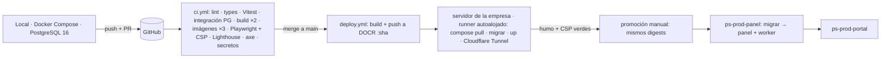
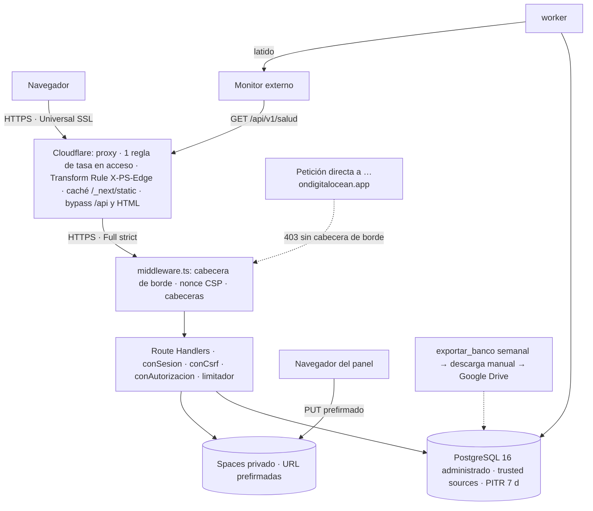

# ADR 0010 — Entornos, CI/CD, despliegue en App Platform, perímetro y respaldo

> Plantilla alineada al método **ADD** (Attribute-Driven Design, Len Bass — *Software Architecture in
> Practice*). Cada sección numerada corresponde a un paso del método. Las decisiones deben trazar a
> [0000-drivers-y-asrs.md](0000-drivers-y-asrs.md) y actualizar
> [_backlog-arquitectonico.md](_backlog-arquitectonico.md). Generada por la skill `setup-architecture`
> (`/build:architect`); un humano la promueve `proposed → accepted`.
>
> **Sustituye a [ADR-0007](0007-entornos-despliegue-y-perimetro.md).** Conserva: hosts de un solo nivel
> bajo `trycore.com`, Cloudflare delante con una regla de límite de tasa para el acceso + limitador en
> la aplicación, CSP estricta con test de Playwright que falla ante cualquier violación, fuentes
> autoalojadas, `noindex` global, un único artefacto promovido de staging a producción, migraciones
> expand/contract, monitor externo, RPO 24 h / RTO 4 h como techo y la exportación semanal cifrada a
> Google Drive (decisión del sponsor). Cambia todo lo que era cPanel.

## 1. Objetivo de la iteración y drivers seleccionados (Pasos 2–3)

- **Objetivo de la iteración:** definir cómo se construye, verifica, despliega, protege, vigila y
  recupera el sistema de ADR-0008 en DigitalOcean App Platform con imágenes Docker portables, sin
  medio sitio viejo y medio nuevo, con vuelta atrás rápida y sin que el origen sea alcanzable
  saltándose Cloudflare.
- **Elemento(s) a refinar:** asignación física (entornos, Apps, BD, almacenamiento), pipeline de
  GitHub Actions, especificaciones `.do/`, perímetro (Cloudflare, middleware, cabeceras, CSP) y
  operación (logs, salud, alertas, respaldo).
- **Drivers abordados:**
  - Atributos de calidad: QA-12 (pérdida ≤ 24 h, restauración ≤ 4 h, restauración de prueba antes de
    producción), QA-13 (alertas; vigilancia no dependiente de un solo mecanismo). Apoyo: QA-2, QA-3,
    QA-5, QA-8.
  - Restricciones: **CON-18** (contenedores portables, destino DO App Platform), **CON-19**
    (PostgreSQL administrado), **CON-22** (Cloudflare delante; reemplaza a CON-15 sin ModSecurity ni
    listado de directorios, que ya no existen), CON-6 (secretos solo en servidor). Reemplaza el
    tratamiento de CON-3 y CON-16.
  - Concerns: CRN-9 (pérdida del servidor → pérdida de la región o de la cuenta), CRN-17 (sin SLO).
    CRN-18 (ModSecurity) deja de aplicar.

## 2. Conceptos de diseño elegidos (Paso 4)

| Driver | Concepto / Táctica | Alternativas descartadas | Razón |
|--------|--------------------|--------------------------|-------|
| CON-18 | **Imágenes Docker multi-stage** (`node:22-slim`, usuario sin privilegios, `NODE_ENV=production`, solo `standalone` + `static` en portal y panel; solo el bundle de esbuild en el worker) publicadas en **DigitalOcean Container Registry** y etiquetadas por sha de `main`; App Platform despliega **por imagen**, nunca compila desde el repositorio | Despliegue de App Platform desde GitHub con *buildpacks* (compila el proveedor: no portátil ni reproducible); Droplet con Docker Compose (gestión de SO, parches y TLS a cargo nuestro) | Artefacto inmutable y portable: la misma imagen corre en local, CI, staging, producción o en otro proveedor |
| CON-18, QA-12 | **Staging fuera de DO, en un servidor de la empresa con Docker** (decisión del sponsor, T-14): Docker Compose con las mismas imágenes que producción; publicado **por Cloudflare Tunnel** (`cloudflared` en el mismo Compose: sin puertos abiertos en el servidor; la *Transform Rule* de cabecera de borde se aplica igual); PostgreSQL 16 en contenedor con datos ficticios | Staging en App Platform con BD en DO (coste); BD de staging en el clúster de producción (arrastra datos reales en los ensayos) | Sin coste de plataforma para staging y sin datos reales; además ejercita la portabilidad de las imágenes fuera de DO (R-42). Lo propio de App Platform (job `PRE_DEPLOY`, certificado con el proxy, dominio `…ondigitalocean.app`, gracia de `SIGTERM`) ya no se prueba en staging: se verifica en **producción en oscuro** antes del primer envío real (§3.4) |
| CON-18, QA-4 | **Dos Apps de App Platform en producción**: `ps-<entorno>-portal` (servicio `portal`) y `ps-<entorno>-panel` (servicio `panel`, worker `worker`, job `migrar` de tipo `PRE_DEPLOY`). Especificación versionada en `.do/app-*.yaml`; región `nyc` (*a validar* con T-15) | Una App con todos los componentes (enrutamiento por ruta, no por host: el panel quedaría alcanzable desde el host del cliente) | Aislamiento del panel por host (ADR-0008) y un único lugar para migrar antes de cambiar código |
| CON-19, QA-12 | **PostgreSQL 16 administrado de DO** con respaldo diario automático y **recuperación a un punto en el tiempo (PITR) de 7 días**; acceso restringido a *trusted sources* (solo las Apps del entorno); TLS obligatorio | BD en contenedor propio; PostgreSQL de otro proveedor | Respaldos y PITR fuera de nuestros contenedores sin operar nada: la pérdida típica pasa de 24 h a minutos (RPO real ≪ 24 h) |
| QA-12, CRN-9 | **Exportación semanal cifrada a Google Drive de Trycore** (sin cambios: decisión del sponsor). La tarea `exportar_banco` del worker ejecuta `pg_dump` 16 (la imagen del worker incluye `postgresql-client-16` y `age`) por la **conexión directa**, de la **BD completa** (identidad, operación, inventario, auditoría y consentimientos), la cifra con la **llave pública** `age` de Trycore (el worker nunca tiene la privada) y la deja en un bucket privado; el responsable técnico la descarga y la carga a Drive | Automatizar la subida a Drive (integración nueva, no autorizada) | Copia fuera del proveedor ante pérdida de la cuenta o de la región |
| CON-3 (reemplazada), QA-12 | **Despliegue continuo a staging, promoción manual a producción del mismo digest**: en merge a `main` CI construye las tres imágenes y las sube a DOCR; un **runner autoalojado de GitHub Actions en el servidor de staging** (etiqueta propia, solo para el job `deploy-staging` en `main`, nunca para PRs) hace `docker compose pull && up` con esos digests, con `migrar` antes de arrancar los servicios; humo + test de CSP contra staging tras Cloudflare; `workflow_dispatch` promueve **los mismos digests** a producción en App Platform | Compilar por entorno; desplegar producción en cada merge | Lo que se prueba en staging es exactamente lo que llega a producción |
| CON-3 (reemplazada) | **Migraciones en el job `PRE_DEPLOY` de la App del panel** (solo *expand*), con el rol dueño del esquema (`ps_migrador`) y conexión directa; si fallan, App Platform aborta el despliegue y la versión anterior sigue sirviendo. Orden: App del panel (migrar → panel + worker) y después App del portal. **Compatibilidad N/N-1** entre portal, panel y worker (incluidos los `payload` de trabajos: un worker N-1 ignora tipos que no conoce y los devuelve sin sumar intentos). *Contract* solo cuando ninguno de los **3 últimos digests** conservados depende de lo borrado. `migrar` no falla si la BD va por delante del código (caso de rollback): lo registra y termina | Migrar desde CI contra la BD de producción (expondría la BD fuera de *trusted sources*); migrar al arrancar cada contenedor (carreras entre réplicas) | Un único ejecutor de migraciones, dentro del perímetro de la BD, que bloquea el despliegue si falla |
| QA-12, CRN-9 | **Protección contra borrado**: el token de DO que usa CI tiene alcance limitado (registro de contenedores y actualización de Apps; **sin** permisos sobre la BD ni Spaces) y el clúster de producción tiene la protección contra borrado activada. Si se borrara el clúster, sus respaldos y el PITR podrían perderse con él (*a verificar* en V-3) y solo quedaría la exportación semanal | Token de CI con acceso total | Un token de CI filtrado no puede destruir la BD ni sus respaldos |
| QA-12 | **Despliegue sin corte con verificación de salud**: App Platform arranca la nueva versión de cada componente, espera a que `GET /api/v1/salud?ligera=1` responda 200 y solo entonces retira la anterior. Entre las dos Apps el cambio **no es atómico**: por eso rige N/N-1, y si el despliegue del portal falla, `deploy.yml` revierte la App del panel a los digests anteriores. **Rollback** = redesplegar los digests de un sha anterior (los 3 últimos se conservan en DOCR con etiqueta protegida frente a la recolección de basura) | Enlace simbólico + `releases/` (plataforma anterior) | La plataforma da el cambio atómico por componente; la BD compatible hacia atrás (expand/contract) permite volver sin tocarla |
| QA-2 | **Desfase de chunks tras un despliegue**: `deploymentId = sha` en `next.config`; los `/_next/static/*` se cachean inmutables en Cloudflare **solo para respuestas 200** (un 404 transitorio no queda en caché); si un navegador pide un chunk que ya no existe, el router hace una navegación completa y un manejador de `ChunkLoadError` recarga la página. Como el estado de búsqueda está en la URL y «Mi equipo» en el servidor, la recarga **no pierde nada** | Subir los estáticos de cada build a un bucket con `assetPrefix` y conservar 3 versiones (un host y una pieza más) | Coste mínimo; la consecuencia (una recarga) es aceptable porque el estado sobrevive |
| CON-22, QA-3, QA-5 | **Cloudflare como único camino al origen mediante cabecera secreta de borde, comprobada en dos capas**: una *Transform Rule* de Cloudflare añade `X-PS-Edge: <secreto>` y **elimina** `x-middleware-subrequest` en toda petición hacia los 4 hosts; el `middleware.ts` (runtime Node, `next ≥ 15.5`, ADR-0008) responde 403 si la cabecera falta o no coincide (tiempo constante, admite `EDGE_SECRET` y `EDGE_SECRET_PREV` durante una rotación), y **`conSesion` y el envoltorio de los endpoints sin sesión la vuelven a comprobar** dentro del Route Handler, por si el middleware se saltara. Excepción: la ruta exacta normalizada `/api/v1/salud` con `ligera=1`, que solo devuelve `200 ok`. La IP del cliente sale de `CF-Connecting-IP` solo con cabecera de borde válida (qué cabecera llega realmente tras la capa propia de App Platform se verifica en V-11) | Filtrar por rangos IP de Cloudflare (App Platform no permite reglas de entrada por IP); *Authenticated Origin Pulls* (mTLS no configurable en App Platform); dejar abierto el dominio `*.ondigitalocean.app` | El dominio por defecto de App Platform siempre existe y no se puede apagar: sin la cabecera cualquiera saltaría Cloudflare (y su límite de tasa) pegando a `…ondigitalocean.app`. Sustituye a `Require ip` (se cierra R-11 en su forma anterior; nace R-45) |
| CON-22 | **TLS**: Universal SSL de Cloudflare en el borde (hosts de un nivel) + certificado de App Platform en el origen para cada dominio personalizado, con Cloudflare en *Full (strict)*; el monitor externo vigila la caducidad del certificado del origen. **Plan B** si App Platform no emite o no renueva con el proxy activo: dominio en *Full* (no estricto) temporalmente con alerta, mientras se resuelve | *Flexible* (tráfico sin cifrar hasta el origen) | Cifrado de extremo a extremo sin certificados de pago; App Platform no admite subir un Origin CA, por eso la emisión y la renovación se verifican (V-1) y se vigilan |
| CON-22, QA-3 | **Límite de tasa en dos capas** (sin cambios de diseño): **una** regla gratuita de Cloudflare sobre las rutas de acceso de portal y panel (por ruta; el filtro por método puede no estar en el plan gratuito) + limitador propio por IP + endpoint en la tabla `limites` de PostgreSQL para el resto (`/api/v1/eventos`, solicitudes, requerimiento pegado, voto) | Regla de Cloudflare por endpoint (de pago) | Sin cambios; ahora el limitador no consume un proceso PHP, solo una consulta |
| QA-5, UC-14 | **CSP con nonce por petición**: `middleware.ts` genera un nonce y fija `default-src 'self'; script-src 'self' 'nonce-…' 'strict-dynamic'; style-src 'self' 'nonce-…'; style-src-elem 'self' 'nonce-…'; style-src-attr 'unsafe-inline'; img-src 'self' data:; font-src 'self'; connect-src 'self'` (**en el panel** además `https://<bucket>.<región>.digitaloceanspaces.com` para la subida prefirmada) `; frame-ancestors 'none'; base-uri 'self'; form-action 'self'; object-src 'none'`; lo pasa a Next y a `next-themes`. El HTML sale con `Cache-Control: private, no-store` (un HTML cacheado reutilizaría el nonce) y todo el árbol es dinámico (ADR-0008). Test de Playwright que falla ante cualquier `securitypolicyviolation`, en CI y en staging tras Cloudflare, **con un menú de Radix abierto y una subida real de evidencia** | Hashes en el build (ya no hay HTML estático); `'unsafe-inline'` en `style-src` (el navegador lo ignora cuando hay nonce); prohibir todo `style=""` (React SSR y las librerías de posicionamiento los emiten) | El nonce cubre scripts y elementos `<style>`; los atributos `style` se permiten solo vía `style-src-attr` (no ejecutan código; riesgo residual: inyección de CSS en atributos, acotada porque `img-src`/`font-src`/`connect-src` siguen cerrados) |
| QA-5 | **Fuentes autoalojadas con `next/font/local`** (Geist) y 0 CDNs; Rocket Loader, ofuscación de correos y Web Analytics de Cloudflare desactivados por *Configuration Rule* en los 4 hosts | Google Fonts | Sin cambios |
| QA-5, CON-10 | **Cabeceras globales** desde `headers()` de `next.config` (cubren también `/_next/static`, que el middleware excluye): `Strict-Transport-Security: max-age=31536000`, `X-Frame-Options: DENY`, `Referrer-Policy: strict-origin`, `X-Content-Type-Options: nosniff`, `X-Robots-Tag: noindex, nofollow` en **todas** las respuestas; `Cache-Control: private, no-store` en `/api/*` salvo lo que ADR-0003 fija para el catálogo | `.htaccess` (plataforma anterior) | Un único punto, probado por test |
| UC-14, QA-5 | **Evidencias en DO Spaces** (bucket privado por entorno, misma región, cifrado del lado del servidor, sin ACL pública, CORS solo para el host del panel): subida **directa desde el navegador del panel** con URL prefirmada de PUT (5 min, tamaño y tipo fijados) y descarga con URL prefirmada de GET (5 min) solo tras autorización. Nunca se exponen a la cara cliente | Guardar en el disco del contenedor (efímero); pasar el archivo por la API (60 MB por Cloudflare y el contenedor) | Los contenedores no tienen disco persistente; la subida directa evita el límite de 100 MB de Cloudflare y no ocupa el servidor |
| CON-6, QA-5 | **Secretos como variables de tipo `SECRET` a nivel de componente** (no de App: la App del panel contiene también el worker), cifradas en reposo; `DATABASE_URL` enlazada con el **usuario de BD del componente** (`db_user`), nunca `doadmin`; llaves de Spaces limitadas a su bucket (la de staging no lee producción); nada en el repositorio ni en la imagen; grep de secretos en CI sobre la imagen y `.next/static`. CI **no reescribe la especificación entera**: obtiene la vigente, cambia solo los digests de imagen y la reaplica (los valores `EV[…]` cifrados se conservan) | Fichero de configuración montado; gestor de secretos externo; `doctl apps update --spec` con la spec del repositorio (borraría los secretos) | Nativo de la plataforma; mínimo privilegio por proceso |
| QA-13, CRN-17 | **Observabilidad mínima**: logs JSON a `stdout` (sin datos personales: correos como HMAC con `EMAIL_HMAC_KEY`, sin payloads) recogidos por App Platform; `GET /api/v1/salud` completo (`bd`, `worker`, `tareas`, `release`) protegido con un token del monitor (`SALUD_TOKEN`); **alertas de App Platform** (reinicio de componente, despliegue fallido, CPU/memoria sostenidas) y **de la BD administrada** (CPU, disco, conexiones) por correo; monitor externo con latido (ADR-0009). Reenvío de logs a un servicio externo: no en v1 | APM/SaaS de logs | Suficiente para el volumen; la retención corta de logs del proveedor es un riesgo aceptado (R-46) |
| CRN-17 | **Sin SLO** (sin cambios): RPO 24 h / RTO 4 h como techo aceptado; el objetivo realista con PITR es minutos de pérdida y < 1 h de restauración, a ensayar | Fijar 99,9 % sin base | App Platform tiene SLA propio, pero no se promete disponibilidad a las cuentas sin medir |

## 3. Instanciación: responsabilidades e interfaces (Paso 5)

### 3.1 Entornos

| Entorno | Hosts | Apps de App Platform | BD | Almacenamiento | Correo |
|---------|-------|----------------------|----|----------------|--------|
| Local | `localhost:3000` / `:3001` | — (Docker Compose: PostgreSQL 16; adaptadores de correo, HubSpot y Gemini sustituibles por dobles) | local, datos ficticios | MinIO o carpeta local tras el puerto `AlmacenEvidencias` | adaptador de consola; Mailgun *sandbox* opcional |
| Staging | `people-staging.trycore.com`, `people-panel-staging.trycore.com` | — **Servidor de la empresa con Docker** (decisión T-14): Docker Compose con las **mismas imágenes** de DOCR (portal, panel, worker, job `migrar` antes de arrancar) + PostgreSQL 16 en contenedor + `cloudflared` | PostgreSQL 16 en contenedor, datos ficticios, sin respaldo | bucket `ps-staging-evidencias` en Spaces | Mailgun con destinatarios autorizados únicamente |
| Producción | `people.trycore.com`, `people-panel.trycore.com` | `ps-prod-portal`, `ps-prod-panel` | clúster administrado, base `ps` | bucket `ps-prod-evidencias` | Mailgun, dominio `people.trycore.com` |

### 3.2 CI (GitHub Actions)

- `ci.yml` (cada PR): lint (incluidas las reglas de ADR-0008: sin Server Actions, sin Edge, sin imports
  cruzados, `fetch` solo en `infra`) · typecheck · Vitest (`motor`, `dominio`, `ui`) · tests de
  integración de `infra` y Route Handlers contra un servicio **PostgreSQL 16** del runner · `next build`
  de ambas apps + V-1 de ADR-0008 · build de las 3 imágenes · Playwright de humo y **test de CSP**
  contra los contenedores levantados con Docker Compose · Lighthouse CI · axe · grep de secretos ·
  contrato del catálogo.
- `deploy.yml`:
  - en merge a `main`: build y push de `portal`, `panel`, `worker` a DOCR con etiqueta = sha; job
    `deploy-staging` en el runner autoalojado del servidor de staging: `docker compose pull`, `migrar`,
    `docker compose up -d` con los digests; humo + test de CSP contra staging (tras Cloudflare Tunnel).
  - **promoción** (`workflow_dispatch`, tras humo verde): mismos digests a `ps-prod-panel` y luego
    `ps-prod-portal`.
  - **rollback** (`workflow_dispatch` con un sha anterior): redespliega los digests de ese sha (solo si
    ninguna migración *contract* posterior lo impide).

### 3.3 Interfaces / contratos

- **Middleware** (`apps/*/middleware.ts`, runtime por defecto): (1) cabecera de borde → 403 si no;
  (2) nonce y CSP; (3) cabeceras globales. No toca la BD.
- **Cloudflare (zona `trycore.com`):** proxy en los 4 hosts; *Full (strict)*; *Transform Rule* de
  cabecera de borde (un secreto distinto por entorno); caché solo de `/_next/static/*`; *bypass* de
  `/api/*` y del HTML; *Configuration Rule* sin scripts inyectados; **regla única de límite de tasa**
  sobre los POST de acceso (lista exacta del contrato de ADR-0002); registros de Mailgun en modo solo
  DNS.
- **Salud:** `GET /api/v1/salud?ligera=1` → `200 ok` (sin consultar nada; para App Platform);
  `GET /api/v1/salud` (tras la cabecera de borde) → `200 {"bd":"ok","worker":"ok","tareas":{…},"release":"<sha>"}`
  o `503`.
- **Variables por componente** (mínimo privilegio; cada proceso recibe solo las que usa):
  - portal — `DATABASE_URL` (`ps_portal`), `LINK_SIGNING_SECRET`, `OTP_PEPPER`, `EMAIL_HMAC_KEY`,
    `EDGE_SECRET`, `EDGE_SECRET_PREV`, `GEMINI_API_KEY`, `MAILGUN_API_KEY`, `MAILGUN_DOMAIN` (alerta
    directa y modo degradado del acceso, ADR-0009), `SALUD_TOKEN`;
  - panel — `DATABASE_URL` (`ps_panel`), `LINK_SIGNING_SECRET`, `OTP_PEPPER`, `EMAIL_HMAC_KEY`,
    `AUDIT_HMAC_KEY`, `EDGE_SECRET`, `EDGE_SECRET_PREV`, `SPACES_KEY`, `SPACES_SECRET`,
    `SPACES_BUCKET`, `MAILGUN_API_KEY`, `MAILGUN_DOMAIN`, `MAILGUN_WEBHOOK_SIGNING_KEY` (y `_PREV`),
    `SALUD_TOKEN`;
  - worker — `DATABASE_URL` (`ps_worker`), `DATABASE_DIRECT_URL`, `HUBSPOT_PRIVATE_APP_TOKEN`,
    `MAILGUN_API_KEY`, `MAILGUN_DOMAIN`, `GEMINI_API_KEY`, `AUDIT_HMAC_KEY`, `EMAIL_HMAC_KEY`,
    `OTP_PEPPER`, `LATIDO_URL`, `SPACES_*`, `EXPORT_AGE_RECIPIENT` (llave pública);
  - job `migrar` — `MIGRATOR_DATABASE_URL` (`ps_migrador`, conexión directa), `PANEL_ADMIN_INICIAL`.

### 3.4 Verificaciones antes del primer despliegue a producción

> Las marcadas **(prod en oscuro)** dependen de App Platform y ya no pueden hacerse en staging (que
> corre en el servidor de la empresa): se ejecutan en producción antes de enviar el primer enlace real a
> un cliente, con los hosts de producción aún sin difundir.

| # | Verificación | Por qué | Cómo se mide |
|---|--------------|---------|--------------|
| V-1 | **(prod en oscuro)** Emisión y renovación del certificado de App Platform con el proxy de Cloudflare activo | *Full (strict)* exige certificado válido en el origen | Alta de los 2 dominios de staging con proxy; `curl -v` al origen; fecha de caducidad |
| V-2 | Cabecera de borde efectiva (staging por el túnel y **prod en oscuro** en `…ondigitalocean.app`) | R-45 | Petición a `…ondigitalocean.app` y al host sin la cabecera → 403; con Cloudflare → 200 |
| V-3 | **(prod en oscuro)** Restauración de prueba cronometrada y alcance de los respaldos | QA-12, CRN-9 | PITR a un clúster nuevo, re-enlazar Apps, *trusted sources*, usuarios y *pools*, medir de extremo a extremo; restaurar también la exportación semanal y comprobar auditoría y consentimientos al 100 %; confirmar si borrar un clúster borra sus respaldos |
| V-4 | SPF, DKIM y DMARC en *pass* y colocación en bandeja | QA-8 | Cabeceras `Authentication-Results` de un código enviado a Gmail y a un buzón corporativo |
| V-5 | Webhooks de Mailgun | CRN-5 | Rebote forzado en staging → `eventos_correo` y `bajas` actualizados; firma inválida → 401 |
| V-6 | `LISTEN/NOTIFY` por conexión directa | ADR-0009 | Latencia inserción → reclamo < 1 s en staging; reconexión tras reinicio de la BD |
| V-7 | **(prod en oscuro)** Job `PRE_DEPLOY` que falla aborta el despliegue | Migraciones | Migración forzada a fallar en staging → la versión anterior sigue activa |
| V-8 | **(prod en oscuro)** Tiempo de rollback | QA-12 | Redespliegue del sha anterior en staging, cronometrado |
| V-9 | Reglas gratuitas disponibles en la zona compartida `trycore.com` (límite de tasa, *Transform Rule*, *Configuration Rule*) | La zona la comparte el sitio corporativo | Lista de reglas de Cloudflare |
| V-10 | Roles por componente (`ps_portal`, `ps_panel`, `ps_worker`, `ps_migrador`) enlazados con `db_user`; `auditoria` sin `UPDATE`/`DELETE` para los roles de aplicación y con trigger que los rechaza; ningún componente conecta como `doadmin` | ADR-0003 (enmienda), ADR-0008 | Migración de prueba en staging + test de permisos por rol |
| V-11 | **(prod en oscuro, y staging por el túnel)** Cabecera real con la IP del cliente tras Cloudflare y la capa propia de App Platform (`CF-Connecting-IP` o `do-connecting-ip`) | El limitador depende de ella | `/api/v1/salud` de staging con eco temporal de cabeceras |
| V-12 | **(prod en oscuro)** Periodo de gracia de `SIGTERM` en App Platform y devolución de filas del worker | ADR-0009 | Despliegue de staging con un trabajo largo en curso |
| V-13 | Modo antibots (*Bot Fight Mode*) de la zona compartida frente a los webhooks de Mailgun y al monitor externo | CRN-5, QA-13 | Webhook de prueba y sondeo del monitor en staging |

## 4. Vistas y registro de la decisión (Paso 6)

**Garantías de ADR-0007 que cambian de forma:** «nunca medio sitio» se mantiene por componente, no
entre las dos Apps (N/N-1 + reversión del panel); «3 releases conservadas» pasa a 3 digests conservados
en DOCR; la regla que prohibía `style=""` se sustituye por `style-src-attr 'unsafe-inline'`.

**Decisión:** tres entornos (local con Docker Compose; staging en un servidor de la empresa con Docker
Compose y Cloudflare Tunnel; producción en App Platform con dos Apps: portal, y panel con worker y job
de migración previo), todos con las mismas imágenes Docker inmutables de DOCR; despliegue continuo a staging y promoción manual del mismo digest a
producción; migraciones expand/contract en el job `PRE_DEPLOY`; rollback por redespliegue del
despliegue anterior; Cloudflare como único camino al origen gracias a una cabecera secreta de borde;
CSP con nonce por petición; evidencias en Spaces con URL prefirmadas; secretos como variables
`SECRET`; PostgreSQL administrado con PITR de 7 días más la exportación semanal a Drive; observabilidad
con logs a `stdout`, salud, alertas del proveedor y monitor externo.

**Trade-offs aceptados:**
- Dependencia operativa de DigitalOcean (registro, Apps, BD, Spaces), mitigada por imágenes portables
  y especificaciones versionadas; mover de proveedor exige reescribir solo `.do/` y la conexión a
  almacenamiento S3-compatible.
- La cabecera secreta de borde es un secreto compartido con Cloudflare: si se filtra, el origen queda
  alcanzable sin límite de tasa del borde hasta rotarla (el limitador propio sigue activo).
- Sin ModSecurity: el filtrado de aplicación web queda en el conjunto gestionado gratuito de
  Cloudflare y en la validación `zod` de cada entrada.
- La promoción a producción sigue siendo un clic humano.
- Logs con la retención del proveedor, sin reenvío externo en v1.

## 5. Análisis del diseño (Paso 7)

| Driver | ✅/⚠️/❌ | Evidencia / medida | Riesgo residual |
|--------|---------|--------------------|-----------------|
| CON-18 | ✅ | Imágenes multi-stage por sha; App Platform despliega por imagen; especificaciones en `.do/`; misma imagen en CI (Compose) y en DO | Portabilidad fuera de DO sin ensayar (R-42) |
| CON-19 | ⚠️ | BD administrada, *trusted sources*, TLS, PITR, roles por componente, protección contra borrado | Permisos de rol y trigger (V-10); presupuesto de conexiones (R-49) |
| CON-6 | ✅ | Secretos `SECRET` por componente, llaves de Spaces por bucket, CI que conserva los `EV[…]`, grep en imagen | Rotación del secreto de borde exige convivir con el anterior (`EDGE_SECRET_PREV`) |
| CON-22 | ⚠️ | Proxy en los 4 hosts; cabecera de borde comprobada en middleware y en cada Route Handler; `x-middleware-subrequest` eliminada en el borde; *Full (strict)* con plan B; una regla de tasa | V-1 certificado de origen con proxy; V-2 cabecera efectiva; V-9 reglas libres en la zona compartida (R-12); V-11 IP del cliente |
| QA-12 | ⚠️ | Respaldo diario + PITR 7 días (pérdida esperada en minutos, techo 24 h); exportación semanal completa y cifrada fuera del proveedor; protección contra borrado; despliegue sin corte con N/N-1 y reversión del panel si falla el portal; 3 digests conservados | Restauración y rollback sin cronometrar (V-3, V-8; R-7); evidencias de Spaces sin copia fuera del proveedor (T-16) |
| QA-13 | ⚠️ | Salud + alertas de App Platform + latido externo (ADR-0009) | Monitor externo sin elegir (R-24) |
| QA-3 (apoyo) | ⚠️ | Regla de Cloudflare + limitador propio + tabla `intentos`; IP del cliente confiable solo con cabecera de borde válida | Umbrales frente a NAT corporativos (R-13) |
| QA-5 (apoyo) | ✅ | CSP con nonce (`style-src-attr` para atributos, Spaces en `connect-src` del panel) y test que falla ante violaciones con Radix abierto y subida real (CI y staging); HTML `no-store`; `noindex` global; secretos solo en variables `SECRET` con mínimo privilegio; grep en imagen; evidencias solo por URL prefirmada del panel | Función de Cloudflare activada a mano que inyecte scripts: la detecta el humo de staging |
| QA-2 (apoyo) | ⚠️ | Lighthouse CI contra el contenedor; chunks inmutables en Cloudflare | TTFB del HTML dinámico sin medir en DO (R-41) |
| QA-8 (apoyo) | ⚠️ | Registros de Mailgun en la zona, solo DNS | V-4 sin hacer |
| CRN-9 | ⚠️ | La pérdida de un contenedor no pierde nada (sin estado); pérdida de la BD → PITR; pérdida de cuenta o región → exportación semanal (hasta 7 días) | Aceptar 7 días ante pérdida de cuenta/región y evidencias sin copia es decisión de negocio (T-16); exportación manual depende del responsable técnico (R-8) |
| CRN-17 | ⚠️ | Hueco declarado; RPO/RTO techo aceptado | Sin SLO ni ventana de mantenimiento |

**Drivers no resueltos en esta iteración:** SLO (CRN-17); V-1…V-10 son tareas de operación previas al
primer despliegue a producción; elección del monitor externo (R-24).

## 6. Consecuencias

- **Positivas:**
  - Desaparecen los riesgos del hosting compartido: inodos (R-4), `.cpanel.yml` y enlaces simbólicos,
    caché de rutas de PHP (R-32), ModSecurity (R-6, CRN-18), triggers no permitidos (R-1, a confirmar
    con V-10), IP de correo compartida (R-5 en su forma anterior), staging compartiendo CPU con
    producción (R-33).
  - Pérdida de datos esperada en minutos gracias a PITR, no en un día.
  - Despliegue sin medio sitio y rollback sin tocar el servidor.
  - CSP por nonce, más simple que los hashes por página.
- **Negativas:**
  - Coste mensual de plataforma (Apps, BD, Spaces, Mailgun) frente a un hosting ya pagado.
  - Configuración de Cloudflare más delicada: si la *Transform Rule* se borra, los 4 hosts responden
    403 (falla cerrado; lo detecta el monitor externo en minutos).
  - Dependencia de un segundo proveedor de nube además de Cloudflare.
- **Riesgos:** R-12 (zona compartida), R-24 (monitor), R-41 (TTFB), R-42 (portabilidad), R-45
  (cabecera de borde filtrada o regla borrada), R-46 (retención corta de logs), R-7 (restauración sin
  ensayar), R-54 (certificado del origen con el proxy activo sin renovación probada), R-55 (despliegue
  no atómico entre las dos Apps).
- **Decisiones de la revisión (sponsor, 2026-09-25):**
  - **T-14 staging:** en un servidor de la empresa con Docker (mismas imágenes, PostgreSQL en
    contenedor, Cloudflare Tunnel). Las verificaciones propias de App Platform pasan a producción en
    oscuro.
  - **T-15 región:** indiferente para el sponsor → se aplica la recomendación: DO `nyc` + Mailgun
    EE. UU. La transferencia internacional queda como riesgo a validar con el área legal (R-44).
  - **T-16 pérdida ante caída de cuenta o región:** indiferente para el sponsor → se aplica la
    recomendación: hasta 7 días (exportación semanal a Drive) y evidencias sin copia fuera de DO.
- **Operacionales:**
  - Crear en DO: registro de contenedores, 4 Apps (2 por entorno), clúster PostgreSQL (y base de
    staging según T-14), 2 buckets de Spaces, alertas de App Platform al responsable técnico.
  - Crear en Cloudflare: 4 registros CNAME con proxy, *Transform Rule* por entorno, *Configuration
    Rule*, la regla de tasa y los registros de Mailgun.
  - Ejecutar V-1…V-10 y dejar el resultado por escrito antes del primer envío real.
  - `scripts/diagnostico-hosting.sh` queda obsoleto (verificaba el hosting cPanel).

## 7. Trazabilidad

- Drivers: [0000-drivers-y-asrs.md](0000-drivers-y-asrs.md) — CON-18, CON-19, CON-22, CON-6, QA-12,
  QA-13, CRN-9, CRN-17 (apoyo: QA-2, QA-3, QA-5, QA-8).
- Sustituye a: [ADR-0007](0007-entornos-despliegue-y-perimetro.md).
- PRD: §8 (seguridad, `noindex` RF-1.5), §10.3, §8.3 y D-23 (reescritos en el PRD v4.12);
  `docs/01-prd/requisitos-tecnicos-hosting.md` queda como antecedente (describe la plataforma
  abandonada).
- ADR relacionados: [0008](0008-plataforma-contenedores-y-stack.md), [0009](0009-trabajo-diferido-worker-y-correo.md),
  [0002](0002-identidad-acceso-y-sesiones.md) (endpoints de acceso, cookies `__Host-`),
  [0003](0003-datos-persistencia-y-auditoria.md) (rol de auditoría, evidencias, exportación),
  [0006](0006-telemetria-y-atribucion.md) (limitador de eventos).
- Stack operacionalizado en: `.claude/config/stack-allowlist.json` — `@aws-sdk/client-s3`,
  `@aws-sdk/s3-request-presigner` (Spaces); herramientas de CI; Docker y `doctl` como herramientas de
  CI/infraestructura, no dependencias de código.
