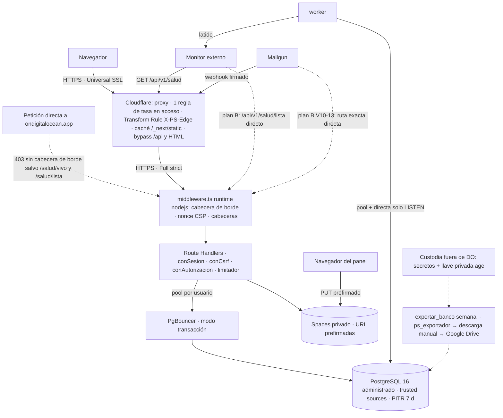
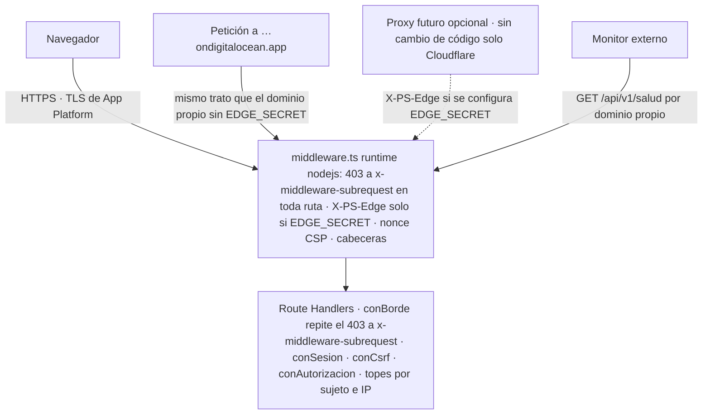

# ADR 0010 — Entornos, CI/CD, despliegue en App Platform, perímetro y respaldo

> **Revisión adversarial (2026-09-26):** incorpora los hallazgos H0, H2, H3, H5, H9, H10, H11, H12,
> H13, H15, H16, H19, H20, H23, H24, H25, H26, H27, H28, H29, H30, H31, H38 y H40 de la revisión
> multiagente. Las verificaciones pasan a numerarse con prefijo de ADR (**V10-n**; las de ADR-0008 son
> V8-n).
>
> **Consolidación (2026-09-26, tras la revisión en paralelo):** esta ADR es la referencia única del
> despliegue, la salud (`vivo`/`lista`/completa), los secretos y la lista completa de variables (§3.3 y
> §3.5), el runbook de restauración y la regla de `migrar` ante una BD por delante (rollback). Cita sin
> redefinir: el script de roles `packages/infra/bootstrap/roles.sql` y los dueños `ps_duenio`,
> `ps_auditoria_dueno` y `ps_eventos_dueno` (ADR-0008, 0003, 0006); el candado `mantenimiento_esquema`
> y la carpeta `packages/infra/migraciones` (ADR-0003); las particiones de `eventos` (ADR-0006). Se
> retiran `infra/bd/arranque.sql`, el rol `ps_auditoria`, la creación de particiones por `migrar` y
> `LINK_SIGNING_SECRET` (I-4..I-8).

> Plantilla alineada al método **ADD** (Attribute-Driven Design, Len Bass — *Software Architecture in
> Practice*). Cada sección numerada corresponde a un paso del método. Las decisiones deben trazar a
> [0000-drivers-y-asrs.md](0000-drivers-y-asrs.md) y actualizar
> [\_backlog-arquitectonico.md](_backlog-arquitectonico.md). Generada por la skill `setup-architecture`
> (`/build:architect`); un humano la promueve `proposed → accepted`.
>
> **Sustituye a [ADR-0007](0007-entornos-despliegue-y-perimetro.md).** Conserva: hosts de un solo nivel
> bajo `trycore.com`, Cloudflare delante con una regla de límite de tasa para el acceso + limitador en
> la aplicación, CSP estricta con test de Playwright que falla ante cualquier violación, fuentes
> autoalojadas, `noindex` global, un único artefacto promovido de staging a producción, migraciones
> expand/contract, monitor externo, RPO 24 h / RTO 4 h como techo y la exportación semanal cifrada a
> Google Drive (decisión del sponsor). Cambia todo lo que era cPanel. *Sustituida en parte por la enmienda del 2026-09-28*

## 1. Objetivo de la iteración y drivers seleccionados (Pasos 2–3)

- **Objetivo de la iteración:** definir cómo se construye, verifica, despliega, protege, vigila y
recupera el sistema de ADR-0008 en DigitalOcean App Platform con imágenes Docker portables, sin
medio sitio viejo y medio nuevo, con vuelta atrás rápida y sin que el origen sea alcanzable
saltándose Cloudflare. *Sustituida en parte por la enmienda del 2026-09-28*
- **Elemento(s) a refinar:** asignación física (entornos, Apps, BD, almacenamiento), pipeline de
GitHub Actions, especificaciones `.do/`, perímetro (Cloudflare, middleware, cabeceras, CSP) y
operación (logs, salud, alertas, respaldo, restauración).
- **Drivers abordados:**
  - Atributos de calidad: QA-12 (pérdida ≤ 24 h, restauración ≤ 4 h, restauración de prueba antes de
  producción), QA-13 (alertas; vigilancia no dependiente de un solo mecanismo). Apoyo: QA-2, QA-3,
  QA-5, QA-8.
  - Restricciones: **CON-18** (contenedores portables, destino DO App Platform), **CON-19**
  (PostgreSQL administrado), **CON-22** (Cloudflare delante; reemplaza a CON-15 sin ModSecurity ni
  listado de directorios, que ya no existen), CON-6 (secretos solo en servidor), CON-9 (mínimo
  privilegio en BD, aprovisionamiento). Reemplaza el tratamiento de CON-3 y CON-16. *Sustituida en parte por la enmienda del 2026-09-28*
  - Concerns: CRN-9 (pérdida del servidor → pérdida de la región o de la cuenta), CRN-17 (sin SLO),
  CRN-5 (webhooks de correo), CRN-10 (retención de logs y copias). CRN-18 (ModSecurity) deja de
  aplicar.

## 2. Conceptos de diseño elegidos (Paso 4)

| Driver                     | Concepto / Táctica                                                                                                                                                                                                                                                                                                                                                                                                                                                                                                                                                                                                                                                                                                                                                                                                                                                                                                                                                                                                                                                                                                                                                                                                                                                                                                                                                                                                                                                                                                                                                                                                                                                                                                                                                                                                                                                                                                                                                                                                                                                                                                                                                                                                | Alternativas descartadas                                                                                                                                                                                                                                                                                                                                                                                                                                                                                       | Razón                                                                                                                                                                                                                                                                                                                                                                                                                                                                                                                                                                                        |
| -------------------------- | ----------------------------------------------------------------------------------------------------------------------------------------------------------------------------------------------------------------------------------------------------------------------------------------------------------------------------------------------------------------------------------------------------------------------------------------------------------------------------------------------------------------------------------------------------------------------------------------------------------------------------------------------------------------------------------------------------------------------------------------------------------------------------------------------------------------------------------------------------------------------------------------------------------------------------------------------------------------------------------------------------------------------------------------------------------------------------------------------------------------------------------------------------------------------------------------------------------------------------------------------------------------------------------------------------------------------------------------------------------------------------------------------------------------------------------------------------------------------------------------------------------------------------------------------------------------------------------------------------------------------------------------------------------------------------------------------------------------------------------------------------------------------------------------------------------------------------------------------------------------------------------------------------------------------------------------------------------------------------------------------------------------------------------------------------------------------------------------------------------------------------------------------------------------------------------------------------------------- | -------------------------------------------------------------------------------------------------------------------------------------------------------------------------------------------------------------------------------------------------------------------------------------------------------------------------------------------------------------------------------------------------------------------------------------------------------------------------------------------------------------- | -------------------------------------------------------------------------------------------------------------------------------------------------------------------------------------------------------------------------------------------------------------------------------------------------------------------------------------------------------------------------------------------------------------------------------------------------------------------------------------------------------------------------------------------------------------------------------------------- |
| CON-18                     | **Imágenes Docker multi-stage** (`node:22-slim`, usuario sin privilegios, `NODE_ENV=production`, solo `standalone` + `static` en portal y panel; solo el bundle de esbuild en el worker, que **debe arrancar** en CI: ver V8-11 y la resolución de `server-only` de ADR-0008; *el texto anterior citaba V8-4 por error*) publicadas en **DigitalOcean Container Registry** y etiquetadas por sha de `main`; App Platform despliega **por imagen**, nunca compila desde el repositorio                                                                                                                                                                                                                                                                                                                                                                                                                                                                                                                                                                                                                                                                                                                                                                                                                                                                                                                                                                                                                                                                                                                                                                                                                                                                                                                                                                                                                                                                                                                                                                                                                                                                                                                             | Despliegue de App Platform desde GitHub con *buildpacks* (compila el proveedor: no portátil ni reproducible); Droplet con Docker Compose (gestión de SO, parches y TLS a cargo nuestro)                                                                                                                                                                                                                                                                                                                        | Artefacto inmutable y portable: la misma imagen corre en local, CI, staging, producción o en otro proveedor                                                                                                                                                                                                                                                                                                                                                                                                                                                                                  |
| CON-18, QA-12              | **Staging fuera de DO, en un servidor de la empresa con Docker** (decisión del sponsor, T-14): Docker Compose con las mismas imágenes que producción; publicado **por Cloudflare Tunnel** (`cloudflared` en el mismo Compose: sin puertos abiertos en el servidor; la *Transform Rule* de cabecera de borde se aplica igual); PostgreSQL 16 en contenedor con datos ficticios, **aprovisionado sin superusuario para la aplicación y con PgBouncer en modo transacción** delante (§3.3), para reproducir el reparto de roles y las limitaciones del pool de producción. El servidor vive en un **segmento de red aislado**: solo salida a Internet (Cloudflare, DOCR, Mailgun, Spaces, HubSpot de pruebas), sin entrada y sin acceso a la LAN corporativa                                                                                                                                                                                                                                                                                                                                                                                                                                                                                                                                                                                                                                                                                                                                                                                                                                                                                                                                                                                                                                                                                                                                                                                                                                                                                                                                                                                                                                                         | Staging en App Platform con BD en DO (coste); BD de staging en el clúster de producción (arrastra datos reales en los ensayos)                                                                                                                                                                                                                                                                                                                                                                                 | Sin coste de plataforma para staging y sin datos reales; además ejercita la portabilidad de las imágenes fuera de DO (R-42). Lo propio de App Platform y de la BD administrada (job `PRE_DEPLOY`, certificado con el proxy, dominio `…ondigitalocean.app`, gracia de `SIGTERM`, usuarios `db_user`, pools de PgBouncer de DO, `LISTEN` por la conexión directa del clúster, rendimiento desde Colombia) **no se da por probado en staging**: se verifica en **producción en oscuro** antes del primer envío real (§3.4). Staging sirve de regresión funcional, no de evidencia de plataforma |
| CON-18, QA-4               | **Dos Apps de App Platform en producción**: `ps-prod-portal` (servicio `portal`) y `ps-prod-panel` (servicio `panel`, worker `worker`, job `migrar` de tipo `PRE_DEPLOY`). Especificación versionada en `.do/app-*.yaml`; región `nyc` (T-15)                                                                                                                                                                                                                                                                                                                                                                                                                                                                                                                                                                                                                                                                                                                                                                                                                                                                                                                                                                                                                                                                                                                                                                                                                                                                                                                                                                                                                                                                                                                                                                                                                                                                                                                                                                                                                                                                                                                                                                     | Una App con todos los componentes (enrutamiento por ruta, no por host: el panel quedaría alcanzable desde el host del cliente)                                                                                                                                                                                                                                                                                                                                                                                 | Aislamiento del panel por host (ADR-0008) y un único lugar para migrar antes de cambiar código                                                                                                                                                                                                                                                                                                                                                                                                                                                                                               |
| CON-19, QA-12              | **PostgreSQL 16 administrado de DO** con respaldo diario automático y **recuperación a un punto en el tiempo (PITR) de 7 días**; acceso restringido a *trusted sources* (solo las Apps del entorno); TLS obligatorio. Toda restauración sigue el **runbook de §3.5** (worker en pausa, conciliación con HubSpot y Mailgun, nuevo tramo de auditoría)                                                                                                                                                                                                                                                                                                                                                                                                                                                                                                                                                                                                                                                                                                                                                                                                                                                                                                                                                                                                                                                                                                                                                                                                                                                                                                                                                                                                                                                                                                                                                                                                                                                                                                                                                                                                                                                              | BD en contenedor propio; PostgreSQL de otro proveedor                                                                                                                                                                                                                                                                                                                                                                                                                                                          | Respaldos y PITR fuera de nuestros contenedores sin operar nada: la pérdida típica pasa de 24 h a minutos (RPO real ≪ 24 h). PITR rebobina la BD pero no los efectos externos: sin runbook, restaurar reenviaría códigos y correos a bajas y crearía negocios duplicados                                                                                                                                                                                                                                                                                                                     |
| CON-9, CON-19              | **Aprovisionamiento de usuarios de BD** (H28): `ps_portal`, `ps_panel`, `ps_worker`, `ps_migrador` y `ps_exportador` se crean con `doctl databases user create` (contraseña gestionada por DO, rotable con `doctl databases user reset`); el **script de roles único de ADR-0008** (`packages/infra/bootstrap/roles.sql`), que se ejecuta a mano con `doadmin` una vez por entorno al aprovisionarlo y de nuevo (idempotente, con dos personas) cada vez que cambian sus objetos (`auditoria`, `telemetria`, vistas `v_*`) o una migración añade objetos que requieren `GRANT` nuevos emitidos por él (regla de ADR-0008; lo ejecuta el responsable técnico, nunca CI ni `migrar`), crea los roles `NOLOGIN` `ps_duenio` (dueño de los esquemas de aplicación; `ps_migrador` es miembro), `ps_auditoria_dueno` (esquema propio `auditoria`, sus tablas, trigger y cabeza génesis, ADR-0003) y `ps_eventos_dueno` (esquema propio `telemetria`, `eventos`, sus funciones y vistas `v_*`, ADR-0006), y fija `ALTER DEFAULT PRIVILEGES`; así `ps_migrador` no puede deshabilitar el trigger, reescribir la auditoría ni hacer `DROP` de sus tablas o de `eventos` (no son esquemas de `ps_duenio`). Los GRANT sobre objetos de `ps_duenio` los emite `ps_migrador` en las migraciones, como miembro del dueño y sin `CREATEROLE`; los GRANT sobre objetos de otros dueños `NOLOGIN` (`auditoria`, `telemetria`) los emite `roles.sql` (ADR-0008; *corregido en la consolidación, 2.ª pasada: decía que todos los emitía `ps_migrador`, imposible sobre tablas que no son de su grupo*). *Sustituye al texto anterior (`infra/bd/arranque.sql`, esquemas propiedad directa de `ps_migrador`, rol `ps_auditoria`; I-5, I-6).* Portal y panel conectan por un **pool de PgBouncer de DO por usuario** (modo transacción, ADR-0008); worker (solo para `LISTEN`) y `migrar` por la conexión directa del clúster                                                                                                                                                                                                                                                                                                          | Crear roles con `CREATE ROLE` desde `migrar` (exige `CREATEROLE` y App Platform no los enlazaría); un usuario con todos los permisos; enlace `db_user` directo para todo sin PgBouncer (el plan pequeño ronda 22 conexiones útiles y el solape del despliegue las agota)                                                                                                                                                                                                                                       | Los roles existen antes de la primera migración, con el mínimo privilegio que ADR-0008 da por supuesto; el mismo script, sin superusuario para la aplicación, se ejecuta en local, CI y staging                                                                                                                                                                                                                                                                                                                                                                                              |
| QA-12, CRN-9               | **Exportación semanal cifrada a Google Drive de Trycore** (decisión del sponsor). El **artefacto de recuperación es el `pg_dump` 16** (formato *custom*) de la BD, no la exportación funcional JSON/CSV de RF-8.15.9, que sigue existiendo como función del panel pero no restituye consentimientos (H13). Incluye identidad (salvo los datos de las tablas transitorias, con los nombres de ADR-0002: `sesiones_portal`, `sesiones_panel`, `codigos_cliente`, `codigos_panel`, `intentos_cliente`, `intentos_panel`; más `limites` y `webhooks_vistos`), operación, inventario, **auditoría y consentimientos** (que por tanto **sí se recuperan**); **sin los datos de telemetría**: `--exclude-table-data=telemetria.eventos*` (ADR-0006; el esquema sí va). *Corregido en la consolidación: el texto anterior incluía la telemetría y usaba los nombres de tabla antiguos.* La ejecuta la tarea `exportar_banco` del worker (imagen con `postgresql-client-16` y `age`) por la conexión directa con el usuario de solo lectura **`ps_exportador`** (no `ps_worker`, H26), tomando antes el candado consultivo de sesión `mantenimiento_esquema` que comparte con `migrar`, con la política única de ADR-0003 (si lo tiene `migrar`, la corrida falla y se reintenta a los 15 min; H25, I-7), a las 03:00 America/Bogota del domingo; la cifra con la **llave pública** `age` de Trycore (el worker nunca tiene la privada, que se custodia fuera de DO: §3.5) y la deja en un bucket privado; el responsable técnico la descarga y la carga a Drive. Retención en Drive: **propuesta por defecto, pendiente de T-27** (no normativa): las 4 últimas copias semanales, borrando las anteriores. La **retención interina** mientras T-27 no se decida también es decisión de legal y del sponsor dentro de T-27, no de esta ADR: *propuesta interina por defecto (no normativa): conservar sin borrar las copias que existan, con acceso nominal de dos personas a la carpeta*. *Corregido en la consolidación (2.ª pasada): el texto anterior fijaba como norma «hasta que T-27 se decida, no se borra ninguna copia», una retención indefinida de datos personales fuera del proveedor que es decisión legal* | Automatizar la subida a Drive (integración nueva, no autorizada); usar como respaldo la exportación JSON/CSV (pierde consentimientos: todo volvería a `borrador`); `pg_dump` con credenciales de `ps_worker` (le daría lectura de todo, contra CON-9)                                                                                                                                                                                                                                                          | Copia fuera del proveedor ante pérdida de la cuenta o de la región que restituye el estado legal (consentimientos) y la cadena de auditoría. Pone datos personales en Drive: la retención es trade-off legal pendiente (§6)                                                                                                                                                                                                                                                                                                                                                                  |
| CON-3 (reemplazada), QA-12 | **Despliegue continuo a staging por extracción, promoción manual a producción del mismo digest** (H10): en merge a `main`, CI (runners hospedados de GitHub) construye las tres imágenes, las sube a DOCR, **las firma con `cosign` sin llave** (identidad OIDC del workflow `deploy.yml` en `refs/heads/main`) y mueve la etiqueta `staging` a esos digests. En el servidor de staging, un **agente de despliegue** (`ps-despliegue`, servicio de systemd; script versionado en `infra/staging/` pero **instalado a mano**, junto con el `compose.yaml`) consulta cada minuto el digest de `staging`, lo verifica con `cosign verify` contra esa identidad exacta y, solo si la firma es válida para las tres imágenes, ejecuta `migrar` y `docker compose up -d` con los digests fijados; si la firma falla no despliega y alerta. Un job de CI en runner hospedado espera a que `GET /api/v1/salud` de staging reporte el nuevo `release` (15 min máx.) y corre humo + test de CSP tras Cloudflare. `workflow_dispatch` vuelve a verificar la firma y promueve **los mismos digests** a producción                                                                                                                                                                                                                                                                                                                                                                                                                                                                                                                                                                                                                                                                                                                                                                                                                                                                                                                                                                                                                                                                                                             | Runner autoalojado de GitHub Actions en el servidor (necesita el socket de Docker, equivalente a root, y cualquier colaborador con escritura puede dirigirle un workflow con `runs-on` apuntando a su etiqueta: pivote hacia la red y los secretos de staging); runner endurecido (grupo de organización limitado a `deploy.yml@refs/heads/main`, `--ephemeral`, Docker rootless, VM dedicada: más piezas y sigue ejecutando código del repositorio); compilar por entorno; desplegar producción en cada merge | El servidor **nunca ejecuta código del repositorio**: solo arranca imágenes firmadas por el workflow de `main`. Comprometer una rama o un PR no basta para ejecutar nada allí. Lo que se prueba en staging es exactamente lo que llega a producción                                                                                                                                                                                                                                                                                                                                          |
| CON-3 (reemplazada)        | **Migraciones en el job `PRE_DEPLOY` de la App del panel** (solo *expand*), con `ps_migrador` y conexión directa; si fallan, App Platform aborta el despliegue y la versión anterior sigue sirviendo. Orden: App del panel (migrar → panel + worker) y después App del portal. **Compatibilidad N/N-1** entre portal, panel y worker (incluidos los `payload` de trabajos: un worker N-1 ignora tipos que no conoce y los devuelve sin sumar intentos). *Contract* solo cuando ninguno de los **3 últimos digests promovidos** (§3.2, poda) depende de lo borrado. Reglas de `migrar` (H3, H25): proveedor de migraciones **estático** (índice TS que importa cada migración; nada se lee del disco en ejecución); **falla** si conoce 0 migraciones o si las aplicadas en `kysely_migration` no empiezan por las que conoce (hueco o nombre distinto); admite que la BD vaya **por delante** (rollback: migraciones posteriores a la última conocida) y lo registra; `SET lock_timeout = '5s'` con 3 reintentos y después falla (el despliegue aborta sin colgar el sitio); toma el candado consultivo `mantenimiento_esquema` con la política única de ADR-0003 (espera como máximo 10 min a que termine `exportar_banco` y después falla); las migraciones **solo cambian esquema**: los cambios de datos sobre tablas auditadas son trabajos del worker con origen `migracion` (CI aplica la **regla de migraciones sin DML de ADR-0003**, fila «Migraciones» de su revisión adversarial, que es su única definición: DML de nivel superior sobre tablas de datos rechazado, cuerpos de `CREATE FUNCTION` ignorados, excepciones enumeradas allí; carpeta única `packages/infra/migraciones`). `migrar` **no** crea particiones de `eventos`: las iniciales las crea el script de roles y las futuras la tarea `retencion_eventos` con `mantener_eventos(sal)` (ADR-0006). *Sustituye al texto anterior («crea por adelantado las particiones … porque es el único proceso dueño», carpeta `infra/migraciones`; I-4)*. Esta regla de BD por delante rige también sobre ADR-0008 (V8-11 alineada)                                                                                                              | Migrar desde CI contra la BD de producción (expondría la BD fuera de *trusted sources*); migrar al arrancar cada contenedor (carreras entre réplicas); `FileMigrationProvider` (con el worker empaquetado en un fichero no encuentra migraciones y termina en verde sin aplicar nada)                                                                                                                                                                                                                          | Un único ejecutor de migraciones, dentro del perímetro de la BD, que bloquea el despliegue si falla y no puede pasar en verde en vacío ni dejar el sitio esperando un bloqueo                                                                                                                                                                                                                                                                                                                                                                                                                |
| QA-12, CRN-9               | **Protección contra borrado**: el token de DO que usa CI tiene alcance limitado (registro de contenedores, incluida la poda, y actualización de Apps; **sin** permisos sobre la BD ni Spaces) y el clúster de producción tiene la protección contra borrado activada. Si se borrara el clúster, sus respaldos y el PITR podrían perderse con él (*a verificar* en V10-3) y solo quedaría la exportación semanal                                                                                                                                                                                                                                                                                                                                                                                                                                                                                                                                                                                                                                                                                                                                                                                                                                                                                                                                                                                                                                                                                                                                                                                                                                                                                                                                                                                                                                                                                                                                                                                                                                                                                                                                                                                                   | Token de CI con acceso total                                                                                                                                                                                                                                                                                                                                                                                                                                                                                   | Un token de CI filtrado no puede destruir la BD ni sus respaldos                                                                                                                                                                                                                                                                                                                                                                                                                                                                                                                             |
| QA-12                      | **Despliegue sin corte con chequeo de preparación real** (H29): App Platform arranca la nueva versión de cada componente y solo retira la anterior cuando `GET /api/v1/salud/lista` responde 200: esa ruta, sin *query string*, hace `SELECT 1` con el rol del propio componente (por su pool) y comprueba que la versión de esquema aplicada es ≥ la que exige el código, con 2 s de tope. Es el `health_check` (preparación); `GET /api/v1/salud/vivo` (sin BD) es el `liveness_health_check`, para que una caída de la BD no reinicie en bucle los contenedores. Entre las dos Apps el cambio **no es atómico**: por eso rige N/N-1, y si el despliegue del portal falla, `deploy.yml` revierte la App del panel a los digests anteriores. **Rollback** = redesplegar los digests de un sha anterior, conservados por la **poda explícita** de §3.2 (DOCR no tiene etiquetas protegidas frente a la recolección de basura, H30)                                                                                                                                                                                                                                                                                                                                                                                                                                                                                                                                                                                                                                                                                                                                                                                                                                                                                                                                                                                                                                                                                                                                                                                                                                                                                | Chequeo que no consulta nada (un despliegue con credenciales o pool mal enlazados, esquema atrasado o TLS roto pasaría y dejaría el sitio caído); ruta con `?ligera=1` (depende de que `http_path` admita *query string*); enlace simbólico + `releases/` (plataforma anterior)                                                                                                                                                                                                                                | La plataforma da el cambio atómico por componente y ahora solo cambia a una versión que llega a su BD; la BD compatible hacia atrás (expand/contract) permite volver sin tocarla                                                                                                                                                                                                                                                                                                                                                                                                             |
| QA-2                       | **Desfase de chunks tras un despliegue**: `deploymentId = sha` en `next.config`; los `/_next/static/*` se cachean inmutables en Cloudflare **solo para respuestas 200** (un 404 transitorio no queda en caché); si un navegador pide un chunk que ya no existe, el router hace una navegación completa y un manejador de `ChunkLoadError` recarga la página. Como el estado de búsqueda está en la URL y «Mi equipo» en el servidor, la recarga **no pierde nada**                                                                                                                                                                                                                                                                                                                                                                                                                                                                                                                                                                                                                                                                                                                                                                                                                                                                                                                                                                                                                                                                                                                                                                                                                                                                                                                                                                                                                                                                                                                                                                                                                                                                                                                                                | Subir los estáticos de cada build a un bucket con `assetPrefix` y conservar 3 versiones (un host y una pieza más)                                                                                                                                                                                                                                                                                                                                                                                              | Coste mínimo; la consecuencia (una recarga) es aceptable porque el estado sobrevive — *Sustituida en parte por la enmienda del 2026-09-28*                                                                                                                                                                                                                                                                                                                                                                                                                                                   |
| CON-22, QA-3, QA-5         | **Cloudflare como único camino al origen mediante cabecera secreta de borde, comprobada en dos capas**: una *Transform Rule* de Cloudflare añade `X-PS-Edge: <secreto>` y **elimina** `x-middleware-subrequest` en toda petición hacia los 4 hosts; el `middleware.ts` (runtime `nodejs`, `next ≥ 15.5`, V8-2) responde 403 si la cabecera falta o no coincide (tiempo constante, admite `EDGE_SECRET` y `EDGE_SECRET_PREV` durante una rotación), y **`conSesion` y el envoltorio de los endpoints sin sesión la vuelven a comprobar** dentro del Route Handler, por si el middleware se saltara. Excepciones por ruta exacta normalizada y método `GET`: `/api/v1/salud/vivo` y `/api/v1/salud/lista`, que solo devuelven `200`/`503` sin cuerpo informativo; y, **solo si se activa el plan B de V10-13**, `POST /api/v1/webhooks/mailgun` del panel. La IP del cliente sale de `CF-Connecting-IP` solo con cabecera de borde válida (qué cabecera llega realmente tras la capa propia de App Platform se verifica en V10-11). En local y CI la cabecera la pone un borde emulado (§3.2): **no existe ninguna opción que desactive la comprobación**                                                                                                                                                                                                                                                                                                                                                                                                                                                                                                                                                                                                                                                                                                                                                                                                                                                                                                                                                                                                                                                           | Filtrar por rangos IP de Cloudflare (App Platform no permite reglas de entrada por IP); *Authenticated Origin Pulls* (mTLS no configurable en App Platform); dejar abierto el dominio `*.ondigitalocean.app`; bandera de configuración que desactive la comprobación en desarrollo (podría llegar a producción)                                                                                                                                                                                                | El dominio por defecto de App Platform siempre existe y no se puede apagar: sin la cabecera cualquiera saltaría Cloudflare (y su límite de tasa) pegando a `…ondigitalocean.app`. Sustituye a `Require ip` (se cierra R-11 en su forma anterior; nace R-45)                                                                                                                                                                                                                                                                                                                                  |
| CON-22                     | **TLS**: Universal SSL de Cloudflare en el borde (hosts de un nivel) + certificado de App Platform en el origen para cada dominio personalizado, con Cloudflare en *Full (strict)*; el monitor externo vigila la caducidad del certificado del origen y alerta a 20 días. **Plan B de emisión**: si App Platform no valida o no activa el dominio con el proxy activo, el registro pasa a solo DNS durante la validación y se reactiva el proxy tras la emisión (con la cabecera de borde el origen sigue cerrado mientras tanto). **Plan B de renovación**: dominio en *Full* (no estricto) temporalmente con alerta, mientras se resuelve                                                                                                                                                                                                                                                                                                                                                                                                                                                                                                                                                                                                                                                                                                                                                                                                                                                                                                                                                                                                                                                                                                                                                                                                                                                                                                                                                                                                                                                                                                                                                                       | *Flexible* (tráfico sin cifrar hasta el origen)                                                                                                                                                                                                                                                                                                                                                                                                                                                                | Cifrado de extremo a extremo sin certificados de pago; App Platform no admite subir un Origin CA, por eso la emisión, la activación y la renovación se verifican (V10-1) y se vigilan — *Sustituida por la enmienda del 2026-09-28*                                                                                                                                                                                                                                                                                                                                                          |
| CON-22, QA-3               | **Límite de tasa en dos capas**: **una** regla gratuita de Cloudflare sobre las rutas de acceso de portal y panel, que en el plan gratuito filtra por ruta y por IP (sin host ni método si el plan no los da) con periodo y bloqueo cortos: es una **mitigación de ráfagas**, no la defensa frente a la prueba masiva de tokens (H27). Esa defensa es de la aplicación: tokens de ≥ 128 bits (ADR-0002), limitador propio por IP + endpoint en la tabla `limites` de PostgreSQL (acceso, `/api/v1/eventos`, solicitudes, requerimiento pegado, voto) y respuesta neutra                                                                                                                                                                                                                                                                                                                                                                                                                                                                                                                                                                                                                                                                                                                                                                                                                                                                                                                                                                                                                                                                                                                                                                                                                                                                                                                                                                                                                                                                                                                                                                                                                                           | Regla de Cloudflare por endpoint (de pago); presentar la regla gratuita como control principal                                                                                                                                                                                                                                                                                                                                                                                                                 | La entropía del token hace inviable la enumeración aunque la regla del borde falte; la regla solo abarata las ráfagas                                                                                                                                                                                                                                                                                                                                                                                                                                                                        |
| CRN-5, QA-13               | **Plan B frente al modo antibots de la zona compartida** (H27): *Bot Fight Mode* gratuito se aplica a toda la zona sin excepciones por ruta. Si V10-13 muestra desafíos a Mailgun o al monitor: (1) el webhook se registra en Mailgun contra `https://<panel>.ondigitalocean.app/api/v1/webhooks/mailgun`, única ruta de negocio exenta de la cabecera de borde, autenticada por firma HMAC de Mailgun (`MAILGUN_WEBHOOK_SIGNING_KEY`), marca de tiempo de ±5 min, token de un solo uso (`webhooks_vistos`), cuerpo ≤ 64 KB y limitador propio; (2) el monitor sondea `GET /api/v1/salud/lista` directamente en los dos `…ondigitalocean.app` (exenta por diseño) y el `GET /api/v1/salud` completo por Cloudflare solo como segunda señal; el latido sale del worker y no cruza Cloudflare                                                                                                                                                                                                                                                                                                                                                                                                                                                                                                                                                                                                                                                                                                                                                                                                                                                                                                                                                                                                                                                                                                                                                                                                                                                                                                                                                                                                                       | Aceptar la pérdida silenciosa de rebotes, quejas y bajas (CRN-5, R-53) o de la vigilancia (QA-13); depender de un cambio de plan o de zona que no controlamos                                                                                                                                                                                                                                                                                                                                                  | Bajas y rebotes no pueden perderse por un desafío: la ruta directa se autentica por sí misma y no expone nada si la firma no es válida — *Sustituida por la enmienda del 2026-09-28*                                                                                                                                                                                                                                                                                                                                                                                                         |
| QA-5, UC-14                | **CSP con nonce por petición**: `middleware.ts` genera un nonce y fija `default-src 'self'; script-src 'self' 'nonce-…' 'strict-dynamic'; style-src 'self' 'nonce-…'; style-src-elem 'self' 'nonce-…'; style-src-attr 'unsafe-inline'; img-src 'self' data:; font-src 'self'; connect-src 'self'` (**en el panel** además `https://<bucket>.<región>.digitaloceanspaces.com` para la subida prefirmada) `; frame-ancestors 'none'; base-uri 'self'; form-action 'self'; object-src 'none'`; lo pasa a Next y a `next-themes`. El HTML sale con `Cache-Control: private, no-store` (un HTML cacheado reutilizaría el nonce) y todo el árbol es dinámico (ADR-0008). Test de Playwright que falla ante cualquier `securitypolicyviolation`, en CI y en staging tras Cloudflare, **con un menú de Radix abierto y, desde la épica que la introduce, una subida real de evidencia** (§3.2)                                                                                                                                                                                                                                                                                                                                                                                                                                                                                                                                                                                                                                                                                                                                                                                                                                                                                                                                                                                                                                                                                                                                                                                                                                                                                                                            | Hashes en el build (ya no hay HTML estático); `'unsafe-inline'` en `style-src` (el navegador lo ignora cuando hay nonce); prohibir todo `style=""` (React SSR y las librerías de posicionamiento los emiten)                                                                                                                                                                                                                                                                                                   | El nonce cubre scripts y elementos `<style>`; los atributos `style` se permiten solo vía `style-src-attr` (no ejecutan código; riesgo residual: inyección de CSS en atributos, acotada porque `img-src`/`font-src`/`connect-src` siguen cerrados)                                                                                                                                                                                                                                                                                                                                            |
| QA-5                       | **Fuentes autoalojadas con `next/font/local`**: Geist se versiona como `woff2` en `packages/ui/fuentes/` (licencia OFL incluida), sin la dependencia `geist` ni `next/font/google` (el handoff del prototipo que usa `next/font/google` queda sustituido por esta decisión, H20); 0 CDNs; Rocket Loader, ofuscación de correos y Web Analytics de Cloudflare desactivados por *Configuration Rule* en los 4 hosts                                                                                                                                                                                                                                                                                                                                                                                                                                                                                                                                                                                                                                                                                                                                                                                                                                                                                                                                                                                                                                                                                                                                                                                                                                                                                                                                                                                                                                                                                                                                                                                                                                                                                                                                                                                                 | Google Fonts; paquete `geist` (dependencia más, fuera del stack permitido)                                                                                                                                                                                                                                                                                                                                                                                                                                     | Sin peticiones a terceros y sin ampliar la lista de dependencias                                                                                                                                                                                                                                                                                                                                                                                                                                                                                                                             |
| QA-5, CON-10               | **Cabeceras globales** desde `headers()` de `next.config` (cubren también `/_next/static`, que el middleware excluye): `Strict-Transport-Security: max-age=31536000`, `X-Frame-Options: DENY`, `Referrer-Policy: strict-origin`, `X-Content-Type-Options: nosniff`, `X-Robots-Tag: noindex, nofollow` en **todas** las respuestas; `Cache-Control: private, no-store` en `/api/*` salvo lo que ADR-0003 fija para el catálogo                                                                                                                                                                                                                                                                                                                                                                                                                                                                                                                                                                                                                                                                                                                                                                                                                                                                                                                                                                                                                                                                                                                                                                                                                                                                                                                                                                                                                                                                                                                                                                                                                                                                                                                                                                                     | `.htaccess` (plataforma anterior)                                                                                                                                                                                                                                                                                                                                                                                                                                                                              | Un único punto, probado por test                                                                                                                                                                                                                                                                                                                                                                                                                                                                                                                                                             |
| UC-14, QA-5                | **Evidencias en DO Spaces** (bucket privado por entorno, misma región, cifrado del lado del servidor, sin ACL pública, CORS solo para el host del panel): subida **directa desde el navegador del panel** con URL prefirmada de PUT (5 min, tamaño y tipo fijados) y descarga con URL prefirmada de GET (5 min) solo tras autorización. Nunca se exponen a la cara cliente                                                                                                                                                                                                                                                                                                                                                                                                                                                                                                                                                                                                                                                                                                                                                                                                                                                                                                                                                                                                                                                                                                                                                                                                                                                                                                                                                                                                                                                                                                                                                                                                                                                                                                                                                                                                                                        | Guardar en el disco del contenedor (efímero); pasar el archivo por la API (60 MB por Cloudflare y el contenedor)                                                                                                                                                                                                                                                                                                                                                                                               | Los contenedores no tienen disco persistente; la subida directa evita el límite de 100 MB de Cloudflare y no ocupa el servidor                                                                                                                                                                                                                                                                                                                                                                                                                                                               |
| CON-6, QA-5                | **Secretos como variables de tipo `SECRET` a nivel de componente** (no de App: la App del panel contiene también el worker), cifradas en reposo; `DATABASE_URL` = cadena del **pool de PgBouncer del usuario del componente** (enlazada como variable de la BD si la especificación lo admite; si no, `SECRET` con el procedimiento de rotación de §3.3), nunca `doadmin`; llaves de Spaces limitadas a su bucket (la de staging no lee producción); **llaves de Mailgun por componente y entorno** (§3.3); **peppers de código por ámbito** (`OTP_PEPPER_CLIENTE`, `OTP_PEPPER_PANEL`: el portal no recibe el del panel, H0); nada en el repositorio ni en la imagen; grep de secretos en CI sobre la imagen y `.next/static`. CI **no reescribe la especificación entera**: obtiene la vigente, cambia solo los digests de imagen y la reaplica (los valores `EV[…]` cifrados se conservan). **Custodia fuera de DO** de todos los secretos no regenerables y de la llave privada `age` (§3.5, H24)                                                                                                                                                                                                                                                                                                                                                                                                                                                                                                                                                                                                                                                                                                                                                                                                                                                                                                                                                                                                                                                                                                                                                                                                             | Fichero de configuración montado; gestor de secretos externo como fuente en ejecución; `doctl apps update --spec` con la spec del repositorio (borraría los secretos); un único pepper para ambos ámbitos (un portal comprometido podría fabricar códigos del panel)                                                                                                                                                                                                                                           | Nativo de la plataforma; mínimo privilegio por proceso; la pérdida de la cuenta no deja la auditoría ni los enlaces inverificables                                                                                                                                                                                                                                                                                                                                                                                                                                                           |
| QA-13, CRN-17, CRN-10      | **Observabilidad mínima**: logs JSON a `stdout` por un **logger central con redacción** (H40) en `packages/infra`: elimina `detail`, `parameters`, `where` y `query` de los errores de `pg`, sustituye por HMAC (`EMAIL_HMAC_KEY`) todo lo que case con un correo, nunca registra *payloads*, cuerpos ni *query strings* (solo la ruta normalizada) y un manejador global en cada Route Handler y en el worker captura lo no controlado antes de que Next lo imprima; test que provoca un `23505` con un correo en el valor y comprueba que no aparece en `stdout`. En la BD administrada: `log_min_error_statement = panic` y `log_statement = none` (el log del proveedor no guarda sentencias con valores). Recogidos por App Platform; `GET /api/v1/salud` completo (`bd`, `worker`, `tareas`, `release`) protegido con un token del monitor (`SALUD_TOKEN`); **alertas de App Platform** (reinicio de componente, despliegue fallido, CPU/memoria sostenidas) y **de la BD administrada** (CPU, disco, conexiones) por correo; monitor externo con latido (ADR-0009). Reenvío de logs a un servicio externo: no en v1                                                                                                                                                                                                                                                                                                                                                                                                                                                                                                                                                                                                                                                                                                                                                                                                                                                                                                                                                                                                                                                                                        | APM/SaaS de logs; confiar en que nadie registre datos personales                                                                                                                                                                                                                                                                                                                                                                                                                                               | Suficiente para el volumen; la retención del proveedor (R-46) queda acotada a datos sin identificación directa; la IP y la ruta en los logs de App Platform y Cloudflare se documentan en CRN-10                                                                                                                                                                                                                                                                                                                                                                                             |
| CRN-17                     | **Sin SLO** (sin cambios): RPO 24 h / RTO 4 h como techo aceptado; el objetivo realista con PITR es minutos de pérdida y &lt; 1 h de restauración, a ensayar (V10-3)                                                                                                                                                                                                                                                                                                                                                                                                                                                                                                                                                                                                                                                                                                                                                                                                                                                                                                                                                                                                                                                                                                                                                                                                                                                                                                                                                                                                                                                                                                                                                                                                                                                                                                                                                                                                                                                                                                                                                                                                                                              | Fijar 99,9 % sin base                                                                                                                                                                                                                                                                                                                                                                                                                                                                                          | App Platform tiene SLA propio, pero no se promete disponibilidad a las cuentas sin medir                                                                                                                                                                                                                                                                                                                                                                                                                                                                                                     |

## 3. Instanciación: responsabilidades e interfaces (Paso 5)

### 3.1 Entornos

| Entorno    | Hosts                                                            | Apps de App Platform                                                                                                                                                                                                                                         | BD                                                                                | Almacenamiento                                           | Correo                                                                                                                                                |
| ---------- | ---------------------------------------------------------------- | ------------------------------------------------------------------------------------------------------------------------------------------------------------------------------------------------------------------------------------------------------------ | --------------------------------------------------------------------------------- | -------------------------------------------------------- | ----------------------------------------------------------------------------------------------------------------------------------------------------- |
| Local      | `localhost:3000` / `:3001` tras el borde emulado                 | — (Docker Compose: PostgreSQL 16 + PgBouncer en modo transacción + `borde-local`; adaptadores de correo, HubSpot y Gemini sustituibles por dobles)                                                                                                           | local, datos ficticios, script de roles sin superusuario para la aplicación       | MinIO o carpeta local tras el puerto `AlmacenEvidencias` | adaptador de consola                                                                                                                                  |
| Staging    | `people-staging.trycore.com`, `people-panel-staging.trycore.com` | — **Servidor de la empresa con Docker** en segmento aislado (T-14): Docker Compose con las **mismas imágenes** firmadas de DOCR (portal, panel, worker, job `migrar` antes de arrancar) + PostgreSQL 16 + PgBouncer + `cloudflared` + agente `ps-despliegue` | PostgreSQL 16 en contenedor, datos ficticios, sin respaldo, mismo script de roles | bucket `ps-staging-evidencias` en Spaces                 | **Cuenta (o subcuenta) de Mailgun separada** con dominio de envío `mg.people-staging.trycore.com` y clave de firma de webhooks propia                 |
| Producción | `people.trycore.com`, `people-panel.trycore.com`                 | `ps-prod-portal`, `ps-prod-panel`                                                                                                                                                                                                                            | clúster administrado, base `ps`, pools por usuario                                | bucket `ps-prod-evidencias`                              | Mailgun, dominio de envío **`mg.people.trycore.com`** (sin host web, H2); remitente visible `notify@people.trycore.com` con alineación DMARC relajada |

**Secretos que viven en el servidor de staging** (ninguno de producción): token de DOCR de solo
lectura (pull), token del túnel `cloudflared`, `EDGE_SECRET` de staging, llave de Spaces limitada a
`ps-staging-evidencias`, llave de envío de la cuenta de Mailgun de staging, credenciales del entorno de
pruebas de HubSpot, token personal de Gemini con datos ficticios (CON-8) y los secretos de aplicación
propios de staging (peppers, claves HMAC, `AUDIT_KEK`, sal de seudonimización, clave de firma de
webhooks de su cuenta de Mailgun), distintos de los de producción.

### 3.2 CI (GitHub Actions)

- `ci.yml` (cada PR, runners hospedados). Cada verificación corre sobre **lo que existe**; las ligadas a
una capacidad se activan con la épica que la introduce, y desde entonces son obligatorias (H38):
  
  | Verificación                                                                                                                                                                                                    | Se activa con                                        |
  | --------------------------------------------------------------------------------------------------------------------------------------------------------------------------------------------------------------- | ---------------------------------------------------- |
  | lint (reglas de ADR-0008: sin Server Actions, sin Edge, sin imports cruzados, `fetch` solo en `infra`) · typecheck · Vitest de lo existente · grep de secretos · V8-1 · V8-2 · V8-9 (configuración incompleta)  | primer slice (EP-001, caparazón)                     |
  | **V10-19** (perímetro en las dos ramas del borde, `x-middleware-subrequest` en toda ruta, `ipDelCliente`) · *añadida por la enmienda del 2026-09-28*                                                            | EP-001 · 1                                           |
  | build de las 3 imágenes + **arranque del bundle del worker** y de `migrar` contra BD vacía (falla si aplica 0 migraciones)                                                                                      | primer slice (EP-001 ya encola `enviar_codigo`)      |
  | integración de `infra` y Route Handlers contra PostgreSQL 16 **con el script de roles de ADR-0008 y PgBouncer en modo transacción** · test de permisos por rol (V8-10) · test de redacción del logger (`23505`) | primera migración (EP-001)                           |
  | Playwright de humo + **test de CSP del shell** (portal y panel, menú de Radix abierto) · axe · Lighthouse CI sobre las páginas existentes                                                                       | primer slice con UI (EP-001)                         |
  | contrato del catálogo y rastreo de V8-4                                                                                                                                                                         | primera épica que sirve `GET /api/v1/catalogo`       |
  | test de CSP con **subida real de evidencia** a Spaces (MinIO en CI)                                                                                                                                             | épica que introduce la subida de evidencias (EP-006) |
  | pruebas de contrato de HubSpot y Gemini con dobles                                                                                                                                                              | EP-005/EP-007 y EP-009 respectivamente               |
  

  **Borde emulado:** en local y CI un contenedor `borde-local` (imagen oficial de nginx, herramienta de
  infraestructura, no dependencia de código) delante de portal y panel añade `X-PS-Edge` con un secreto
  de prueba generado por el job y elimina `x-middleware-subrequest`, igual que la *Transform Rule*;
  Playwright entra siempre por él. La configuración se valida con `zod` por proceso y por `APP_ENV`
  (`local`, `ci`, `staging`, `produccion`): en `local`/`ci` los adaptadores de correo, HubSpot y Gemini
  admiten dobles; `EDGE_SECRET` y las credenciales de BD son obligatorias en todos; en `produccion` falta
  cualquiera → el proceso sale con código ≠ 0. *Sustituida por la enmienda del 2026-09-28*
- `deploy.yml`:
  - en merge a `main`: build y push de `portal`, `panel`, `worker` a DOCR con etiqueta = sha; firma
  `cosign` sin llave de cada digest; mueve la etiqueta `staging`. El agente `ps-despliegue` del
  servidor verifica y despliega (§2); el job `humo-staging` espera el nuevo `release` y corre humo +
  CSP contra staging tras Cloudflare Tunnel.
  - **promoción** (`workflow_dispatch`, tras humo verde): `cosign verify` de los digests; mismos digests
  a `ps-prod-panel` y luego `ps-prod-portal`; registra los digests promovidos en una *release* de
  GitHub (`prod-<sha>`), que es la fuente de verdad de lo conservable.
  - **rollback** (`workflow_dispatch` con un sha anterior): redespliega los digests de esa *release*
  (solo si ninguna migración *contract* posterior lo impide).
  - **poda de DOCR** (H30; tras cada promoción y semanal, nunca durante un despliegue): conserva los
  digests en uso por las Apps de producción (leídos de su especificación vigente), los de las **3
  últimas *releases* `prod-*`** y los **5 últimos de staging**; borra el resto de manifiestos por la API
  de DOCR y lanza la recolección de basura. El plan de DOCR se dimensiona con el tamaño real de las 3
  imágenes × esa retención + margen del 50 %; un push que falle por cuota alerta y no bloquea el
  rollback, que usa digests conservados.

### 3.3 Interfaces / contratos

- **Middleware** (`apps/*/middleware.ts`, **runtime `nodejs`**, V8-2; H16): (1) cabecera de borde → 403
si no (salvo las excepciones exactas de §2); (2) nonce y CSP; (3) cabeceras globales. No toca la BD y
por tanto **no autentica páginas**: la revalidación de sesión y la redirección a la puerta de acceso
en cada `page.tsx` protegida es la capa de sesión de ADR-0002/0008 (H5).
- **Cloudflare (zona `trycore.com`):** proxy en los 4 hosts; *Full (strict)*; *Transform Rule* de
cabecera de borde (un secreto distinto por entorno); caché solo de `/_next/static/*`; *bypass* de
`/api/*` y del HTML; *Configuration Rule* sin scripts inyectados; **regla única de límite de tasa**
sobre las rutas de acceso (lista exacta del contrato de ADR-0002; sin filtro por método si el plan
gratuito no lo permite); registros de Mailgun **bajo `mg.people.trycore.com` y
`mg.people-staging.trycore.com`** en modo solo DNS (SPF, DKIM, CNAME de seguimiento, MX de rebotes), sin
tocar los CNAME con proxy de los hosts web. *Sustituida por la enmienda del 2026-09-28*
- **Salud:** `GET /api/v1/salud/vivo` → `200` sin consultar nada (*liveness*);
`GET /api/v1/salud/lista` → `200` si `SELECT 1` con el rol del componente y versión de esquema ≥ la
requerida en ≤ 2 s, si no `503`, sin cuerpo informativo (*readiness* y chequeo del despliegue);
`GET /api/v1/salud` (tras la cabecera de borde y con `SALUD_TOKEN`) →
`200 {"bd":"ok","worker":"ok","tareas":{…},"release":"<sha>"}` o `503`.
- **Usuarios de BD y conexiones** (H28):
  - Alta: `doctl databases user create` de los 5 usuarios `ps_*`; pools de PgBouncer de DO en modo
  transacción **por usuario**: `pool-portal` (`ps_portal`) y `pool-panel` (`ps_panel`); `ps_worker`
  tiene pool `pool-worker` para sus consultas y la conexión directa solo para `LISTEN`; `ps_migrador` y
  `ps_exportador` solo conexión directa. Después, `packages/infra/bootstrap/roles.sql` (ADR-0008), que
  se ejecuta a mano con `doadmin` una vez por entorno al aprovisionarlo y de nuevo (idempotente, con dos personas) cada vez que cambian sus objetos (`auditoria`, `telemetria`, vistas `v_*`) o una migración añade objetos que requieren `GRANT` nuevos emitidos por él.
  - *Trusted sources*: las dos Apps de producción.
  - Rotación: `doctl databases user reset <usuario>` → nueva cadena al `SECRET` del componente con
  `doctl apps update` sobre la especificación vigente (mismo procedimiento que los digests) →
  despliegue; se registra la fecha. Si la especificación permite enlazar la cadena del pool como
  variable de la BD, se usa el enlace y la rotación no toca `SECRET`s (V10-10 decide cuál aplica).
  - Presupuesto de conexiones: **fórmula única de ADR-0008** (fila CON-19/QA-6: tamaños de *pool* de
  servidor de PgBouncer, `LISTEN` × 2 por el solape, `migrar`, exportador y 20 %; ≈ 17 de 22 en el plan
  pequeño); se mide en V10-10. *Corregido en la consolidación (2.ª pasada): el texto anterior duplicaba
  los `max` de cliente (≈ 35 &gt; 22) y contradecía a ADR-0008.*
  - Local, CI y staging: el mismo script de roles con un superusuario solo de instalación, que la
  aplicación nunca usa, y un contenedor PgBouncer en modo transacción delante de portal y panel.
- **Mailgun, llaves por componente y entorno** (H11): **llaves de envío de dominio** (*Domain Sending
Keys*, solo `/messages` del dominio): una para el portal (modo degradado del acceso y alerta directa,
ADR-0009), otra para el panel (modo degradado de su acceso) y otra para el worker. Las supresiones las
retira un trabajo `retirar_supresion` del worker, encolado y auditado por el panel, con una llave
aparte de alcance mínimo sobre `/suppressions` del dominio (`MAILGUN_SUPPRESSIONS_KEY`); ningún proceso
tiene la llave de cuenta, que queda en custodia (§3.5). Staging usa su propia cuenta o subcuenta, cuyas
llaves no pueden enviar desde `mg.people.trycore.com`. Retención de mensajes almacenados en Mailgun al
mínimo que permita el plan (anotado en V10-4).
- **Variables por componente** — **lista normativa y completa** (mínimo privilegio; cada proceso
recibe solo las que usa; el esquema `zod` por proceso de ADR-0008 la refleja y V8-9 la prueba). Las
demás ADR citan esta lista sin repetirla. `SECRET` salvo las marcadas *(config)*:
  - portal — `APP_ENV` *(config)*, `DATABASE_URL` (`pool-portal`, `ps_portal`), `OTP_PEPPER_CLIENTE`,
  `EMAIL_HMAC_KEY`, `EDGE_SECRET`, `EDGE_SECRET_PREV`, `GEMINI_API_KEY`, `MAILGUN_SENDING_KEY` (llave
  del portal), `MAILGUN_DOMAIN` *(config)*, `SALUD_TOKEN`;
  - panel — `APP_ENV` *(config)*, `DATABASE_URL` (`pool-panel`, `ps_panel`), `OTP_PEPPER_PANEL`,
  `EMAIL_HMAC_KEY`, `AUDIT_HMAC_KEY`, `AUDIT_KEK` (ADR-0003), `EDGE_SECRET`, `EDGE_SECRET_PREV`,
  `SPACES_KEY`, `SPACES_SECRET`, `SPACES_BUCKET` *(config)*, `MAILGUN_SENDING_KEY` (llave del panel),
  `MAILGUN_DOMAIN` *(config)*, `MAILGUN_WEBHOOK_SIGNING_KEY`, `MAILGUN_WEBHOOK_SIGNING_KEY_PREV`,
  `SALUD_TOKEN`;
  - worker — `APP_ENV` *(config)*, `WORKER_PAUSADO` *(config, ADR-0009)*, `DATABASE_URL`
  (`pool-worker`, `ps_worker`), `DATABASE_DIRECT_URL` (`ps_worker`, solo `LISTEN`),
  `EXPORT_DATABASE_URL` (`ps_exportador`, conexión directa, solo `exportar_banco`; nombre único, I-8),
  `HUBSPOT_PRIVATE_APP_TOKEN`, `MAILGUN_SENDING_KEY` (llave del worker), `MAILGUN_SUPPRESSIONS_KEY`,
  `MAILGUN_DOMAIN` *(config)*, `GEMINI_API_KEY`, `AUDIT_HMAC_KEY`, `AUDIT_KEK` (ADR-0003),
  `EMAIL_HMAC_KEY`, `OTP_PEPPER_CLIENTE`, `OTP_PEPPER_PANEL`, `EVENTOS_SEUDONIMO_SAL` (ADR-0006),
  `LATIDO_URL`, `SPACES_KEY`, `SPACES_SECRET`, `SPACES_BUCKET` *(config)*, `EXPORT_AGE_RECIPIENT`
  *(config, llave pública)*, `PANEL_ADMIN_INICIAL` *(config; tarea `sembrar_admin_inicial`, ADR-0002 y
  ADR-0009)*;
  - job `migrar` — `APP_ENV` *(config)*, `MIGRATOR_DATABASE_URL` (`ps_migrador`, conexión directa).
  *`PANEL_ADMIN_INICIAL` pasa del job `migrar` al worker (consolidación, 2.ª pasada: sembrar el
  administrador es un acto auditado, no una migración)*;
  - solo en `local` y `ci`: `DOBLES` *(config)*; con `APP_ENV=produccion` se rechaza (ADR-0008).
  - **No existen** (retiradas): `LINK_SIGNING_SECRET` (modelo de token opaco, ADR-0002), `OTP_PEPPER`
  único, `MAILGUN_API_KEY` en procesos (la llave de cuenta queda en custodia, §3.5),
  `EXPORTADOR_DATABASE_URL` y `MANTENIMIENTO_DATABASE_URL` (ADR-0009, texto anterior). *El texto
  anterior de esta lista daba `LINK_SIGNING_SECRET` a portal y panel «solo si ADR-0002 le fija uso» y
  omitía `AUDIT_KEK` y `EVENTOS_SEUDONIMO_SAL`.*

### 3.4 Verificaciones antes del primer despliegue a producción

> **Dónde se ejecutan.** **Spike**: ahora, con una App desechable en DO y un host de prueba en la zona,
> porque su resultado puede cambiar el diseño. **Prod en oscuro**: en las Apps y la BD de producción con
> los hosts aún sin difundir, antes de enviar el primer enlace real; staging no sirve de evidencia para
> ellas. **Staging**: regresión funcional. Hasta que V10-18 pase, todas las verificaciones en producción
> se hacen **solo con datos ficticios**. El resultado de cada una queda por escrito con fecha y sha.

| #      | Verificación                                                                                                                                                                                                               | Dónde                                          | Por qué                                                      | Cómo se mide                                                                                                                                                                                                                                                                                                                                                                                                                                                                                                                                                                                                                                                                                                                                                                                                                                                                                                                                                                             |
| ------ | -------------------------------------------------------------------------------------------------------------------------------------------------------------------------------------------------------------------------- | ---------------------------------------------- | ------------------------------------------------------------ | ---------------------------------------------------------------------------------------------------------------------------------------------------------------------------------------------------------------------------------------------------------------------------------------------------------------------------------------------------------------------------------------------------------------------------------------------------------------------------------------------------------------------------------------------------------------------------------------------------------------------------------------------------------------------------------------------------------------------------------------------------------------------------------------------------------------------------------------------------------------------------------------------------------------------------------------------------------------------------------------- |
| V10-1  | Emisión, **activación** y renovación del certificado de App Platform con el proxy de Cloudflare activo                                                                                                                     | spike + prod en oscuro                         | *Full (strict)* exige certificado válido en el origen (R-54) | Alta de `people.trycore.com` y `people-panel.trycore.com` en las Apps de producción con proxy; `curl -v` al origen; fecha de caducidad y alerta a 20 días en el monitor; si no activa, se aplica y documenta el plan B de emisión — *Sustituida por la enmienda del 2026-09-28*                                                                                                                                                                                                                                                                                                                                                                                                                                                                                                                                                                                                                                                                                                          |
| V10-2  | Cabecera de borde efectiva                                                                                                                                                                                                 | staging por el túnel + prod en oscuro          | R-45                                                         | Petición a los dos `…ondigitalocean.app` sin la cabecera → 403 en todas las rutas salvo las excepciones exactas; con `x-middleware-subrequest` → 403; por el host de producción tras Cloudflare → 200 — *Sustituida por la enmienda del 2026-09-28*                                                                                                                                                                                                                                                                                                                                                                                                                                                                                                                                                                                                                                                                                                                                      |
| V10-3  | Restauración de prueba cronometrada con el **runbook de §3.5**, alcance de los respaldos y **custodia**                                                                                                                    | prod en oscuro                                 | QA-12, CRN-9 (R-7)                                           | PITR a un clúster nuevo; re-enlazar Apps, *trusted sources*, usuarios y pools; worker en pausa; conciliación; medir de extremo a extremo (≤ 4 h, objetivo &lt; 1 h). Restaurar la exportación semanal **desde un equipo sin acceso a DO**, con la llave privada `age` y la `AUDIT_HMAC_KEY` sacadas de la custodia, y verificar la cadena de auditoría y los consentimientos al 100 %. Confirmar si borrar un clúster borra sus respaldos. Criterio: 0 reenvíos a bajas, 0 negocios huérfanos                                                                                                                                                                                                                                                                                                                                                                                                                                                                                            |
| V10-4  | SPF, DKIM y DMARC en *pass* para `mg.people.trycore.com`, colocación en bandeja y alcance de las llaves                                                                                                                    | prod en oscuro (buzones internos) + staging    | QA-8                                                         | Cabeceras `Authentication-Results` de un código enviado a Gmail y a un buzón corporativo; `dig` de `people.trycore.com` y `mg.people.trycore.com` sin registros en conflicto con el CNAME del host; la llave del portal recibe 401/403 contra `/suppressions` y `/webhooks`; la de staging no puede enviar desde el dominio de producción; retención de mensajes anotada                                                                                                                                                                                                                                                                                                                                                                                                                                                                                                                                                                                                                 |
| V10-5  | Webhooks de Mailgun                                                                                                                                                                                                        | staging                                        | CRN-5                                                        | Rebote forzado → `eventos_correo` y `bajas` actualizados; firma inválida, marca de tiempo vencida o token repetido → 401                                                                                                                                                                                                                                                                                                                                                                                                                                                                                                                                                                                                                                                                                                                                                                                                                                                                 |
| V10-6  | `LISTEN/NOTIFY` por la conexión directa del clúster administrado                                                                                                                                                           | prod en oscuro (+ staging como regresión)      | ADR-0009                                                     | Latencia inserción → reclamo &lt; 1 s; reconexión tras reinicio o mantenimiento del clúster; comprobar que ningún `LISTEN` sale por un pool                                                                                                                                                                                                                                                                                                                                                                                                                                                                                                                                                                                                                                                                                                                                                                                                                                              |
| V10-7  | Job `PRE_DEPLOY` que falla aborta el despliegue                                                                                                                                                                            | prod en oscuro                                 | Migraciones                                                  | Imagen de prueba cuyo `migrar` sale con código ≠ 0 desplegada en `ps-prod-panel` → la versión anterior sigue activa; `migrar` con bloqueo retenido por otra sesión → agota `lock_timeout` y aborta sin colgar el sitio                                                                                                                                                                                                                                                                                                                                                                                                                                                                                                                                                                                                                                                                                                                                                                   |
| V10-8  | Tiempo de rollback con digests conservados por la poda                                                                                                                                                                     | prod en oscuro                                 | QA-12                                                        | Poda en seco (lista de conservados = en uso + 3 *releases* `prod-*`), después redespliegue del sha anterior en las dos Apps, cronometrado                                                                                                                                                                                                                                                                                                                                                                                                                                                                                                                                                                                                                                                                                                                                                                                                                                                |
| V10-9  | Reglas gratuitas disponibles en la zona compartida `trycore.com` (límite de tasa y su alcance real, *Transform Rule*, *Configuration Rule*)                                                                                | spike                                          | La zona la comparte el sitio corporativo (R-12)              | Lista de reglas de Cloudflare y prueba de cada una sobre el host de prueba; si la regla de tasa ya está usada, se anota y rige solo el limitador propio — *Sustituida por la enmienda del 2026-09-28*                                                                                                                                                                                                                                                                                                                                                                                                                                                                                                                                                                                                                                                                                                                                                                                    |
| V10-10 | Usuarios `ps_*` creados con `doctl`, enlazados a sus componentes (los **3 usuarios de la App del panel** incluidos), pools por usuario, arranque sin superusuario para la aplicación, permisos y presupuesto de conexiones | prod en oscuro (+ CI y staging como regresión) | CON-9, ADR-0003, ADR-0008; cierre de R-1                     | Baterías de V8-10, V2-2 y V3-2 (incluidas las pruebas negativas de H0: `ps_portal` no toca `usuarios_panel`, no crea sesiones del panel, no encola tipos fuera de la lista de ADR-0002) ejecutadas con las credenciales reales; `auditoria` rechaza `UPDATE`/`DELETE`; como `ps_panel` y `ps_worker`, `auditoria.registrar(...)` escribe y avanza la cabeza y un `SELECT … FOR UPDATE` o `UPDATE` directo sobre `auditoria_cabeza` falla; `auditoria.suprimir_titular(perfil_id)` funciona como `ps_panel` y falla como `ps_worker`; `UPDATE` directo sobre `identidad.claves_titular` falla para ambos (casos de V3-1 y V3-3 con credenciales reales); `ps_migrador` no puede `DISABLE TRIGGER` ni hacer `DROP`/`ALTER` sobre `auditoria.*` ni `telemetria.eventos` (error de permisos); ningún componente conecta como `doadmin`; `pg_stat_activity` durante un despliegue sin corte ≤ presupuesto (fórmula de ADR-0008); se decide si la cadena del pool se enlaza o va como `SECRET` |
| V10-11 | Cabecera real con la IP del cliente tras Cloudflare y la capa propia de App Platform (`CF-Connecting-IP` o `do-connecting-ip`)                                                                                             | prod en oscuro + staging por el túnel          | El limitador depende de ella                                 | Despliegue de prueba que registra (sin persistir, redactado) las cabeceras candidatas; se retira después y un test de CI falla si el registro sigue en el código — *Sustituida por la enmienda del 2026-09-28*                                                                                                                                                                                                                                                                                                                                                                                                                                                                                                                                                                                                                                                                                                                                                                           |
| V10-12 | Periodo de gracia de `SIGTERM` en App Platform y devolución de filas del worker                                                                                                                                            | prod en oscuro                                 | ADR-0009                                                     | Despliegue de `ps-prod-panel` con un trabajo largo de prueba en curso: la fila vuelve a `pendiente` o termina dentro de la gracia                                                                                                                                                                                                                                                                                                                                                                                                                                                                                                                                                                                                                                                                                                                                                                                                                                                        |
| V10-13 | Modo antibots (*Bot Fight Mode*) de la zona compartida frente a los webhooks de Mailgun y al monitor externo                                                                                                               | spike + prod en oscuro                         | CRN-5, QA-13                                                 | Webhook de prueba firmado desde Mailgun y sondeo del monitor al host de producción; **si hay desafío, se activa el plan B de §2** y se repite la prueba contra la ruta directa — *Sustituida por la enmienda del 2026-09-28*                                                                                                                                                                                                                                                                                                                                                                                                                                                                                                                                                                                                                                                                                                                                                             |
| V10-14 | El chequeo de preparación impide retirar la versión buena                                                                                                                                                                  | prod en oscuro                                 | QA-12 (H29)                                                  | Despliegue con `DATABASE_URL` rota y otro con imagen que exige un esquema superior → App Platform no retira la versión anterior                                                                                                                                                                                                                                                                                                                                                                                                                                                                                                                                                                                                                                                                                                                                                                                                                                                          |
| V10-15 | **Rendimiento desde Colombia** (H31): LCP P75 y TTFB P75 del HTML, P95 de `GET /api/v1/catalogo`                                                                                                                           | prod en oscuro                                 | QA-2 (R-41); sustituye la medición en staging de V8-6        | WebPageTest desde Bogotá (o 4G real en Colombia) vía Cloudflare contra `ps-prod-portal` con sesión y 300 perfiles ficticios; metas: LCP &lt; 2,5 s, TTFB ≤ 800 ms, catálogo ≤ 500 ms; instancias de ≥ 1 GB — *Sustituida en parte por la enmienda del 2026-09-28*                                                                                                                                                                                                                                                                                                                                                                                                                                                                                                                                                                                                                                                                                                                        |
| V10-16 | E2E de URL de estado de búsqueda de 2 000 caracteres (QA-16) contra los límites de cabecera de Cloudflare y App Platform, y `verificar-salidas` de ADR-0004                                                                | prod en oscuro                                 | QA-16; condición de entrada de EP-009 (R-2)                  | Playwright contra el host de producción; `verificar-salidas` ejecutado desde la consola del componente `worker` de `ps-prod-panel`                                                                                                                                                                                                                                                                                                                                                                                                                                                                                                                                                                                                                                                                                                                                                                                                                                                       |
| V10-17 | Logs sin datos personales en el proveedor                                                                                                                                                                                  | prod en oscuro                                 | CRN-10 (H40)                                                 | Provocar un `23505` con un correo ficticio y un error no controlado: no aparece en los logs de App Platform ni en el de la BD administrada; retención de App Platform y Cloudflare anotada en CRN-10 — *Sustituida en parte por la enmienda del 2026-09-28*                                                                                                                                                                                                                                                                                                                                                                                                                                                                                                                                                                                                                                                                                                                              |
| V10-18 | **Validación legal de la transferencia internacional y de la transmisión a encargados** (DO, Mailgun, Cloudflare, HubSpot, Google Drive)                                                                                   | —                                              | CON-10, Ley 1581 (R-44)                                      | **Bloquea la primera importación de datos reales**: sin constancia escrita del área legal no se carga ningún dato real en producción. El contenido de la validación es negocio/legal (§6)                                                                                                                                                                                                                                                                                                                                                                                                                                                                                                                                                                                                                                                                                                                                                                                                |

### 3.5 Restauración y custodia

- **Runbook tras restaurar por PITR a T** (H23; **procedimiento único**, ADR-0009 solo aporta sus
piezas): (1) arrancar la App del panel con el worker en pausa (`WORKER_PAUSADO=1`, mecanismo de
ADR-0009: late y escribe `worker_ciclo` pero no reclama, así el monitor no salta) y el portal en
mantenimiento (503 en `/lista`); (2) caducar los `enviar_codigo` pendientes;
(3) conciliar los trabajos posteriores a T: para `crear_negocio` buscar en HubSpot por `ps_solicitud_id`
y marcar `hecho` los que ya existen; para correo, reimportar desde Mailgun las supresiones, bajas y
rebotes posteriores a T (cruzando con `bajas`) con `conciliar_supresiones` de ADR-0009 antes de
reactivar envíos, y listar los negocios de HubSpot con `ps_solicitud_id` sin solicitud local para
revisión; (4) vaciar `webhooks_vistos` hasta T y rechazar webhooks con marca de tiempo anterior a la
restauración (*sustituye al «vacío hasta T + 5 min» del texto anterior de ADR-0009*); (5) registrar el evento
`restauracion(T, ultimo_hash_restaurado)`, que **abre un nuevo tramo** de la cadena de auditoría y se
envía al ancla externa (el verificador acepta una cadena más corta solo con ese evento, ADR-0003); (6)
quitar `WORKER_PAUSADO` y reactivar el portal. Criterio: 0 reenvíos a bajas, 0 negocios huérfanos o
duplicados.
- **Custodia fuera de DO** (H24; lista normativa): copia cifrada de `AUDIT_HMAC_KEY`, `AUDIT_KEK`,
`EMAIL_HMAC_KEY`, `OTP_PEPPER_CLIENTE`, `OTP_PEPPER_PANEL`, `EVENTOS_SEUDONIMO_SAL` (ADR-0006), la
llave de cuenta de Mailgun y la **llave privada `age`** (`LINK_SIGNING_SECRET` ya no existe), en un gestor de secretos o caja fuerte corporativa ajena a DO y a GitHub,
con **al menos dos custodios nominales**. Cada rotación se registra con la fecha, que marca el inicio
del tramo correspondiente de auditoría. La llave privada `age` no está nunca en DO ni en GitHub. V10-3
demuestra que con la custodia y la exportación, sin acceso a DO, se verifica la cadena. Quién custodia
y dónde está pendiente de T-24.

## 4. Vistas y registro de la decisión (Paso 6)

```mermaid
flowchart LR
  DEV[Local · Docker Compose · PostgreSQL 16 + PgBouncer · borde-local] -->|push + PR| GH[(GitHub)]
  GH --> CI[ci.yml: matriz por épica · lint · types · Vitest · integración PG+PgBouncer · imágenes ×3 · Playwright + CSP · secretos]
  CI -->|merge a main| DP[deploy.yml: build + push a DOCR :sha · firma cosign · etiqueta staging]
  DP -.->|el servidor consulta; nada entra| AG[servidor de staging · agente ps-despliegue: cosign verify · migrar · up]
  AG --> STG[staging tras Cloudflare Tunnel]
  STG -->|humo + CSP verdes desde runner hospedado| PRM[promoción manual: cosign verify · mismos digests · release prod-sha]
  PRM --> PRP[ps-prod-panel: migrar → panel + worker]
  PRP --> PRO[ps-prod-portal]
  PRM --> PODA[poda de DOCR: conserva en uso + 3 prod + 5 staging]
```

```mermaid
flowchart TB
  %% Sustituida por la enmienda del 2026-09-28
  U[Navegador] -->|HTTPS · Universal SSL| CF[Cloudflare: proxy · 1 regla de tasa en acceso · Transform Rule X-PS-Edge · caché /_next/static · bypass /api y HTML]
  X[Petición directa a …ondigitalocean.app] -.->|403 sin cabecera de borde salvo /salud/vivo y /salud/lista| MW
  CF -->|HTTPS · Full strict| MW[middleware.ts runtime nodejs: cabecera de borde · nonce CSP · cabeceras]
  MW --> RH[Route Handlers · conSesion · conCsrf · conAutorizacion · limitador]
  RH -->|pool por usuario| PGB[PgBouncer · modo transacción]
  PGB --> PG[(PostgreSQL 16 administrado · trusted sources · PITR 7 d)]
  RH --> SP[(Spaces privado · URL prefirmadas)]
  WK[worker] -->|pool + directa solo LISTEN| PG
  PANEL[Navegador del panel] -->|PUT prefirmado| SP
  MON[Monitor externo] -->|GET /api/v1/salud| CF
  MON -.->|plan B: /api/v1/salud/lista directo| MW
  MG[Mailgun] -->|webhook firmado| CF
  MG -.->|plan B V10-13: ruta exacta directa| MW
  WK -->|latido| MON
  EXP[exportar_banco semanal · ps_exportador → descarga manual → Google Drive] -.-> PG
  CUS[Custodia fuera de DO: secretos + llave privada age] -.-> EXP
```

**Garantías de ADR-0007 que cambian de forma:** «nunca medio sitio» se mantiene por componente, no
entre las dos Apps (N/N-1 + reversión del panel); «3 releases conservadas» pasa a 3 *releases* `prod-*`
cuyos digests conserva la poda de DOCR; la regla que prohibía `style=""` se sustituye por
`style-src-attr 'unsafe-inline'`.

**Decisión:** tres entornos (local con Docker Compose y borde emulado; staging en un servidor de la
empresa en segmento aislado, con Docker Compose, Cloudflare Tunnel y un agente que solo aplica digests
firmados por el workflow de `main`; producción en App Platform con dos Apps: portal, y panel con worker y
job de migración previo), todos con las mismas imágenes Docker inmutables de DOCR; despliegue continuo a
staging por extracción y promoción manual del mismo digest a producción; migraciones expand/contract en
el job `PRE_DEPLOY`, que no pueden pasar en vacío ni colgar el sitio; chequeo de preparación que consulta
la BD; rollback por redespliegue de digests conservados por una poda explícita; usuarios de BD por
componente creados con `doctl` y pools de PgBouncer por usuario; Cloudflare como único camino al origen
gracias a una cabecera secreta de borde, con plan B para webhook y monitor; CSP con nonce por petición;
evidencias en Spaces con URL prefirmadas; secretos como variables `SECRET` por componente con custodia
fuera de DO; PostgreSQL administrado con PITR de 7 días, runbook de restauración y exportación semanal
`pg_dump` cifrada a Drive; observabilidad con logger que redacta, salud, alertas del proveedor y monitor
externo. *Sustituida en parte por la enmienda del 2026-09-28*

**Trade-offs aceptados:**

- Dependencia operativa de DigitalOcean (registro, Apps, BD, Spaces), mitigada por imágenes portables
y especificaciones versionadas; mover de proveedor exige reescribir solo `.do/` y la conexión a
almacenamiento S3-compatible.
- La cabecera secreta de borde es un secreto compartido con Cloudflare: si se filtra, el origen queda
alcanzable sin límite de tasa del borde hasta rotarla (el limitador propio sigue activo). *Sustituida por la enmienda del 2026-09-28*
- Sin ModSecurity: el filtrado de aplicación web queda en el conjunto gestionado gratuito de
Cloudflare y en la validación `zod` de cada entrada. *Sustituida en parte por la enmienda del 2026-09-28*
- La promoción a producción sigue siendo un clic humano.
- Logs con la retención del proveedor, sin reenvío externo en v1.
- El agente y el `compose.yaml` de staging se reinstalan a mano cuando cambian (a cambio, el servidor no
ejecuta código del repositorio).

## 5. Análisis del diseño (Paso 7)

| Driver        | ✅/⚠️/❌ | Evidencia / medida                                                                                                                                                                                                                                                                                                                                                  | Riesgo residual                                                                                                                                                             |
| ------------- | ------ | ------------------------------------------------------------------------------------------------------------------------------------------------------------------------------------------------------------------------------------------------------------------------------------------------------------------------------------------------------------------- | --------------------------------------------------------------------------------------------------------------------------------------------------------------------------- |
| CON-18        | ✅      | Imágenes multi-stage por sha, firmadas; App Platform despliega por imagen; especificaciones en `.do/`; misma imagen en CI (Compose), staging y DO; arranque del bundle del worker en CI                                                                                                                                                                             | Portabilidad fuera de DO sin ensayar en un segundo proveedor (R-42; staging la ejercita en parte)                                                                           |
| CON-19        | ⚠️     | BD administrada, *trusted sources*, TLS, PITR, usuarios por componente con `doctl`, pools por usuario, script de roles, protección contra borrado                                                                                                                                                                                                                   | V10-10 en producción (enlace de los 3 usuarios, pool como variable o `SECRET`); presupuesto de conexiones (R-49)                                                            |
| CON-9 (apoyo) | ⚠️     | Roles creados antes de la primera migración; auditoría con dueño sin login; exportación con usuario de solo lectura                                                                                                                                                                                                                                                 | R-1 solo se cierra con V10-10 en producción en oscuro, no con staging                                                                                                       |
| CON-6         | ✅      | Secretos `SECRET` por componente, peppers por ámbito, llaves de Mailgun de envío por componente, llaves de Spaces por bucket, CI que conserva los `EV[…]`, grep en imagen, custodia fuera de DO                                                                                                                                                                     | Rotación del secreto de borde exige convivir con el anterior (`EDGE_SECRET_PREV`); custodios sin nombrar (§6)                                                               |
| CON-22        | ⚠️     | Proxy en los 4 hosts; cabecera de borde comprobada en middleware (runtime `nodejs`) y en cada Route Handler; `x-middleware-subrequest` eliminada en el borde y en el borde emulado; *Full (strict)* con planes B de emisión y renovación; regla de tasa como mitigación de ráfagas                                                                                  | V10-1, V10-9 y V10-13 (spike); V10-2 y V10-11 en oscuro; zona compartida (R-12) — *Sustituida por la enmienda del 2026-09-28*                                               |
| QA-12         | ⚠️     | Respaldo diario + PITR 7 días con runbook (0 reenvíos a bajas, 0 negocios huérfanos); `pg_dump` semanal completo y cifrado fuera del proveedor que restituye consentimientos y auditoría, verificable con la custodia; protección contra borrado; chequeo de preparación que consulta la BD; N/N-1 y reversión del panel; 3 *releases* conservadas por la poda      | Restauración y rollback sin cronometrar (V10-3, V10-8, V10-14; R-7); evidencias de Spaces sin copia fuera del proveedor (T-16)                                              |
| QA-13         | ⚠️     | Salud (`vivo`, `lista`, completa) + alertas de App Platform + latido externo (ADR-0009) + plan B del monitor sin Cloudflare                                                                                                                                                                                                                                         | Monitor externo sin elegir (R-24); V10-13 — *Sustituida en parte por la enmienda del 2026-09-28*                                                                            |
| QA-3 (apoyo)  | ⚠️     | Limitador propio y entropía del token como defensa; regla de Cloudflare como mitigación de ráfagas; IP del cliente confiable solo con cabecera de borde válida                                                                                                                                                                                                      | Umbrales frente a NAT corporativos (R-13); V10-11                                                                                                                           |
| QA-5 (apoyo)  | ✅      | CSP con nonce (`style-src-attr` para atributos, Spaces en `connect-src` del panel) y test que falla ante violaciones con Radix abierto y, desde EP-006, subida real (CI y staging); HTML `no-store`; `noindex` global; fuentes versionadas; secretos solo en variables `SECRET` con mínimo privilegio; grep en imagen; evidencias solo por URL prefirmada del panel | Función de Cloudflare activada a mano que inyecte scripts: la detecta el humo de staging                                                                                    |
| QA-2 (apoyo)  | ⚠️     | Lighthouse CI contra el contenedor; chunks inmutables en Cloudflare; V10-15 mide LCP y TTFB desde Colombia contra producción en oscuro                                                                                                                                                                                                                              | Hasta V10-15, TTFB del HTML dinámico en `nyc` sin medir (R-41: su mitigación depende de V10-15, no de staging) — *Sustituida en parte por la enmienda del 2026-09-28*       |
| QA-8 (apoyo)  | ⚠️     | Dominio de envío `mg.people.trycore.com` sin conflicto con el host web; registros solo DNS; llaves de envío por dominio; staging en cuenta separada                                                                                                                                                                                                                 | V10-4 sin hacer                                                                                                                                                             |
| CRN-5         | ⚠️     | Webhook firmado con token de un uso; plan B directo si hay desafíos                                                                                                                                                                                                                                                                                                 | V10-5, V10-13 — *Sustituida en parte por la enmienda del 2026-09-28*                                                                                                        |
| CRN-9         | ⚠️     | La pérdida de un contenedor no pierde nada (sin estado); pérdida de la BD → PITR + runbook; pérdida de cuenta o región → exportación semanal (hasta 7 días) + custodia de secretos fuera de DO                                                                                                                                                                      | Aceptar 7 días ante pérdida de cuenta/región y evidencias sin copia es decisión de negocio (T-16); exportación manual depende del responsable técnico (R-8); custodios (§6) |
| CRN-10        | ⚠️     | Logger con redacción y test; logs de la BD sin sentencias; retención documentada                                                                                                                                                                                                                                                                                    | V10-17; retención en Drive y transferencia (V10-18) son legales (§6)                                                                                                        |
| CRN-17        | ⚠️     | Hueco declarado; RPO/RTO techo aceptado                                                                                                                                                                                                                                                                                                                             | Sin SLO ni ventana de mantenimiento                                                                                                                                         |

**Drivers no resueltos en esta iteración:** SLO (CRN-17); V10-1…V10-18 son tareas previas al primer
envío real (V10-1, V10-9 y V10-13 como spike inmediato; V10-18 antes de la primera carga de datos
reales); elección del monitor externo (R-24). *Sustituida en parte por la enmienda del 2026-09-28*

## 6. Consecuencias

- **Positivas:**
  - Desaparecen los riesgos del hosting compartido: inodos (R-4), `.cpanel.yml` y enlaces simbólicos,
  caché de rutas de PHP (R-32), ModSecurity (R-6, CRN-18), triggers no permitidos (R-1, a confirmar
  con V10-10 **en producción en oscuro**), IP de correo compartida (R-5 en su forma anterior), staging
  compartiendo CPU con producción (R-33: staging corre en un servidor propio, sin Apps ni base en DO).
  - Pérdida de datos esperada en minutos gracias a PITR, no en un día, y restauración sin efectos
  externos duplicados.
  - Despliegue sin medio sitio y rollback sin tocar el servidor; un despliegue que no llega a su BD no
  retira la versión buena.
  - El servidor de staging no ejecuta código del repositorio.
  - CSP por nonce, más simple que los hashes por página.
- **Negativas:**
  - Coste mensual de plataforma (Apps, BD, Spaces, Mailgun, DOCR dimensionado) frente a un hosting ya
  pagado.
  - Configuración de Cloudflare más delicada: si la *Transform Rule* se borra, los 4 hosts responden
  403 (falla cerrado; lo detecta el monitor externo en minutos). *Sustituida por la enmienda del 2026-09-28*
  - Dependencia de un segundo proveedor de nube además de Cloudflare. *Sustituida por la enmienda del 2026-09-28*
  - Operación manual adicional: script de roles de la BD, reinstalación del agente de staging,
  rotación de credenciales de pool si no se pueden enlazar, custodia de secretos.
  - El plan B del webhook abre una ruta de negocio sin cabecera de borde (autenticada por firma). *Sustituida por la enmienda del 2026-09-28*
- **Riesgos:** R-12 (zona compartida), R-24 (monitor), R-41 (TTFB), R-42 (portabilidad), R-45
(cabecera de borde filtrada o regla borrada), R-46 (retención corta de logs), R-7 (restauración sin
ensayar), R-54 (certificado del origen con el proxy activo sin renovación probada), R-55 (despliegue
no atómico entre las dos Apps). **Nuevos, sin numerar** (los numera el backlog): *Sustituida en parte por la enmienda del 2026-09-28*
  - Firma de imágenes: si la identidad OIDC de `cosign` o su verificación se configura mal, staging deja
  de desplegar (falla cerrado) o aceptaría imágenes de otra rama; se prueba con una imagen firmada
  desde una rama que el agente debe rechazar.
  - Poda de DOCR: un error en la lista de conservados borra el digest en uso o el del rollback; mitigado
  por la poda en seco de V10-8 y por leer lo conservable de la especificación vigente y de las
  *releases* `prod-*`.
  - Pool de PgBouncer como `SECRET`: si la especificación no permite enlazarlo, cada rotación de
  contraseña es manual y un olvido deja la cadena vieja hasta el siguiente despliegue.
  - ~~Particiones de `eventos` creadas solo por `migrar`~~ (retirado en la consolidación: las crea
  `retencion_eventos` con `mantener_eventos(sal)`, ADR-0006; el riesgo vigente es R-68).
  - Custodia de secretos: si falta la copia o un custodio, la pérdida de la cuenta de DO deja la
  auditoría inverificable y sus valores ilegibles (R-61).
  - Restauración: el runbook depende de la conciliación con HubSpot y Mailgun; sin ensayo (V10-3) puede
  haber reenvíos a bajas tras restaurar.
- **Decisiones de la revisión (sponsor, 2026-09-25):**
  - **T-14 staging:** en un servidor de la empresa con Docker (mismas imágenes, PostgreSQL en
  contenedor, Cloudflare Tunnel). Las verificaciones propias de App Platform y de la BD administrada
  pasan a producción en oscuro.
  - **T-15 región:** indiferente para el sponsor → se aplica la recomendación: DO `nyc` + Mailgun
    EE. UU. La **validación legal** de la transferencia no está hecha: pasa a ser V10-18, que bloquea la
    primera carga de datos reales (R-44).
  - **T-16 pérdida ante caída de cuenta o región:** indiferente para el sponsor → se aplica la
  recomendación: hasta 7 días (exportación semanal a Drive) y evidencias sin copia fuera de DO.
- **Trade-offs de negocio pendientes** (la parte técnica queda resuelta; la decisión no la toma la
arquitectura):
  - **Trade-off de negocio pendiente (H12, legal):** contenido y firma de V10-18 — validación de la
  transferencia a EE. UU. y de la transmisión a encargados (DO, Mailgun, Cloudflare, HubSpot, Google
  Drive), contratos de encargo (DPA) con cada uno, ampliación del consentimiento de RF-8.4 y de la
  política de tratamiento con encargados y países, y registro en el RNBD. Hasta entonces, solo datos
  ficticios en producción.
  - **Trade-off de negocio pendiente (H24):** quién custodia los secretos y la llave privada `age`
  (mínimo dos personas nominales) y en qué gestor o caja fuerte corporativa.
  - **Trade-off de negocio pendiente (H27):** si la zona compartida `trycore.com` resulta limitante
  (regla de tasa ya usada, *Bot Fight Mode* no desactivable), elegir entre zona propia para el portal,
  plan Pro de Cloudflare o acuerdo con quien administra el sitio corporativo para desactivar *Bot Fight
  Mode*; mientras tanto rige el plan B técnico. El PRD §8.3 debe dejar de presentar la regla gratuita
  como defensa frente a la prueba masiva de tokens (corrección de discovery). *Sustituida por la enmienda del 2026-09-28*
  - **Trade-off de negocio pendiente (H13, legal, T-27):** retención en Google Drive de la exportación
  `pg_dump` completa (identidad, consentimientos y auditoría; sin datos de telemetría: Ley 1581);
  propuesta por defecto: 4 copias semanales, no aplicada hasta que T-27 se decida; la retención interina
  hasta entonces también es parte de T-27 (legal y sponsor), no norma de esta ADR.
- **Operacionales:**
  - Crear en DO: registro de contenedores (plan dimensionado), 2 Apps de producción, clúster PostgreSQL
  con los 5 usuarios `ps_*` y sus pools, script de roles de ADR-0008 (que se ejecuta a mano con `doadmin` una vez por entorno al aprovisionarlo y de nuevo (idempotente, con dos personas) cada vez que cambian sus objetos (`auditoria`, `telemetria`, vistas `v_*`) o una migración añade objetos que requieren `GRANT` nuevos emitidos por él), 2 buckets de Spaces,
  alertas de App Platform al responsable técnico. Staging no crea nada en DO salvo su bucket.
  - Crear en Cloudflare: 4 registros CNAME con proxy, *Transform Rule* por entorno, *Configuration
  Rule*, la regla de tasa, los registros de Mailgun bajo `mg.*` y el túnel de staging. *Sustituida en parte por la enmienda del 2026-09-28*
  - Crear en Mailgun: dominio `mg.people.trycore.com` con llaves de envío por componente y llave de
  supresiones; cuenta o subcuenta de staging con `mg.people-staging.trycore.com`.
  - Servidor de staging: segmento aislado, agente `ps-despliegue` y `compose.yaml` instalados a mano.
  - Custodia: copia cifrada de secretos y llave privada `age` fuera de DO antes del primer despliegue.
  - Ejecutar V10-1, V10-9 y V10-13 como spike ahora; V10-18 antes de la primera carga de datos reales;
  el resto de V10-1…V10-17 y dejar el resultado por escrito antes del primer envío real. *Sustituida en parte por la enmienda del 2026-09-28*
  - `scripts/diagnostico-hosting.sh` queda obsoleto (verificaba el hosting cPanel).

## 7. Trazabilidad

- Drivers: [0000-drivers-y-asrs.md](0000-drivers-y-asrs.md) — CON-18, CON-19, CON-22, CON-6, CON-9,
QA-12, QA-13, CRN-5, CRN-9, CRN-10, CRN-17 (apoyo: QA-2, QA-3, QA-5, QA-8, QA-16).
- Sustituye a: [ADR-0007](0007-entornos-despliegue-y-perimetro.md).
- PRD: §8 (seguridad, `noindex` RF-1.5), §10.3, §8.3 y D-23 (reescritos en el PRD v4.12);
`docs/01-prd/requisitos-tecnicos-hosting.md` queda como antecedente (describe la plataforma
abandonada).
- ADR relacionados: [0008](0008-plataforma-contenedores-y-stack.md) (V8-1, V8-2, V8-4, V8-6, V8-9,
V8-10, V8-11), [0009](0009-trabajo-diferido-worker-y-correo.md) (modo degradado, supresiones, vigilancia),
[0002](0002-identidad-acceso-y-sesiones.md) (endpoints de acceso, cookies `__Host-`, guarda de
páginas, retirada de `LINK_SIGNING_SECRET`),
[0003](0003-datos-persistencia-y-auditoria.md) (rol de auditoría, tramos y ancla, evidencias,
exportación), [0006](0006-telemetria-y-atribucion.md) (limitador de eventos, particiones),
[0004](0004-busqueda-determinista-y-estado.md) (`verificar-salidas`, QA-16).
- Revisión adversarial (2026-09-26): H0, H2, H3, H5, H9, H10, H11, H12, H13, H15, H16, H19, H20, H23,
H24, H25, H26, H27, H28, H29, H30, H31, H38, H40.
- Stack operacionalizado en: `.claude/config/stack-allowlist.json` — `@aws-sdk/client-s3`,
`@aws-sdk/s3-request-presigner` (Spaces); herramientas de CI; Docker, `doctl`, `cosign` y la imagen de
nginx del borde emulado como herramientas de CI/infraestructura, no dependencias de código.

### Enmienda 2026-09-28 — sin proxy de borde (propuesta)

> **Estado:** `accepted` (un humano la promueve a `accepted`). Recoge la decisión del sponsor del
> 2026-09-28 durante la construcción de EP-001 (E-1 del backlog): **Cloudflare deja de ser criterio**
> (era para el hosting cPanel anterior) y **no hay proxy de borde obligatorio**. Incorpora las
> correcciones de la evaluación ATAM-lite de la propia enmienda (mismo día). El código ya la aplica:
> `EDGE_SECRET` y `EDGE_SECRET_PREV` están en `OPCIONALES` (`packages/infra/src/config.ts`);
> `decidirPerimetro` (`packages/infra/src/perimetro.ts`), `conBorde` e `ipDelCliente`
> (`packages/infra/src/http/envoltorios.ts`). Rige sobre el cuerpo, la «Revisión adversarial» y la
> «Consolidación» donde los contradiga; las filas afectadas llevan la nota *Sustituida por la enmienda
> del 2026-09-28*.
>
> **Decisión por entorno:** **producción va sin secreto de borde** (rama sin secreto: los 2 hosts de
> producción, solo DNS hacia App Platform); **staging mantiene `EDGE_SECRET`** (rama con secreto),
> porque el túnel `cloudflared` de §3.1 exige que los 2 hosts de staging tengan proxy en la zona de
> Cloudflare. Así cada rama del perímetro se ejercita en un entorno real, además de en CI (V10-19).

| Mecanismo (texto anterior)                                                                                              | Vigente con la enmienda                                                                                                                                                                                                                                                                                                                                                                                                                                                                                                                                                                                                     | Efecto                                                                                                            |
| ----------------------------------------------------------------------------------------------------------------------- | --------------------------------------------------------------------------------------------------------------------------------------------------------------------------------------------------------------------------------------------------------------------------------------------------------------------------------------------------------------------------------------------------------------------------------------------------------------------------------------------------------------------------------------------------------------------------------------------------------------------------- | ----------------------------------------------------------------------------------------------------------------- |
| **CON-22** «Cloudflare delante; origen no alcanzable sin él»                                                            | CON-22 se reformula: **perímetro sin proxy de borde obligatorio; si se configura uno, el origen solo le atiende a él**. Producción: los 2 hosts apuntan por DNS (sin proxy) a las Apps de App Platform. Staging: sin cambio (túnel, con proxy y con secreto)                                                                                                                                                                                                                                                                                                                                                                | El origen de producción es el punto de entrada público                                                            |
| Cabecera secreta de borde `X-PS-Edge` siempre exigida; «no existe ninguna opción que desactive la comprobación»         | **`EDGE_SECRET` opcional.** Si está configurada, `middleware.ts` y `conBorde` exigen `X-PS-Edge` en tiempo constante (`timingSafeEqual`, con `EDGE_SECRET_PREV` durante una rotación), exactamente como antes; si no, no se exige. La ausencia del secreto **es** el interruptor: no hay otra bandera. Compatible **sin cambio de código solo con Cloudflare**, porque con secreto la IP sale de `cf-connecting-ip`; cualquier otro proxy exige configurar su cabecera de IP de confianza (trabajo futuro, R-88)                                                                                                            | Staging la usa; producción no (R-84)                                                                              |
| La *Transform Rule* elimina `x-middleware-subrequest`                                                                   | **Rechazo siempre con 403** de `x-middleware-subrequest` llegada desde fuera, **en toda ruta sin excepción (salud incluida)** y haya o no secreto de borde, en **dos barreras**: `middleware.ts` (`decidirPerimetro`) y, dentro del Route Handler, `conBorde`; más `next ≥ 15.5` (V8-2). Las rutas `GET /api/v1/salud/vivo` y `GET /api/v1/salud/lista` están exentas **solo de la cabecera de borde** (devuelven `200`/`503` sin cuerpo informativo)                                                                                                                                                                       | La defensa frente a CVE-2025-29927 deja de depender del borde y no descansa en una sola capa (R-89)               |
| IP del cliente de `CF-Connecting-IP` con cabecera de borde válida                                                       | `ipDelCliente`: `cf-connecting-ip` **solo si hay borde configurado** (staging); si no, `do-connecting-ip` (App Platform) y, en su defecto, el primer salto de `x-forwarded-for`; si no hay ninguna, `desconocida`, que **no cuenta como IP** para el limitador y dispara alerta (R-86)                                                                                                                                                                                                                                                                                                                                      | El limitador por IP depende de que el cliente no pueda fijar esas cabeceras (R-83, V10-11)                        |
| Límite de tasa en dos capas (regla gratuita de Cloudflare + aplicación)                                                 | **Solo la aplicación.** En el acceso: capas 1 y 2 de ADR-0002 (5 fallos / 15 min por par enlace+correo y 5 por IP; 20 fallos / día por par → bloqueo 24 h + alerta) y **tope de emisión por ámbito + sujeto, independiente de la IP** (≤ 3 envíos de código / 15 min y ≤ 10 / día, respuesta neutra; R-85, planificado en EP-001: sub-slice 2 para el panel, sub-slice 5 para el cliente), que es el freno por sujeto real. El limitador genérico por IP + endpoint en la tabla `limites` (eventos, solicitudes, requerimiento pegado, voto) está **planificado, no implementado** (R-87). La regla de Cloudflare se retira | La regla del borde ya era solo mitigación de ráfagas (H27); se pierde el freno de volumen antes del origen (R-82) |
| TLS: Universal SSL de Cloudflare + certificado de App Platform en *Full (strict)*, con planes B de emisión y renovación | **Producción: TLS lo termina App Platform** con su certificado gestionado para cada dominio personalizado; se retiran allí *Full (strict)*, Universal SSL y los dos planes B. Staging: TLS del borde de Cloudflare por el túnel, sin cambio. Se conserva la alerta de caducidad a 20 días del monitor externo                                                                                                                                                                                                                                                                                                               | Una pieza menos en producción (V10-1 modificada)                                                                  |
| Hosts de un solo nivel bajo `trycore.com` (condicionados por el certificado de Cloudflare)                              | Se **conservan los mismos nombres** (RF-8.1.4, cookies `__Host-` por host, ADR-0008); en staging el certificado de Cloudflare sigue exigiendo un solo nivel. Esta enmienda no propone renombrar                                                                                                                                                                                                                                                                                                                                                                                                                             | Sin cambio visible                                                                                                |
| Caché inmutable de `/_next/static/*` en Cloudflare, *bypass* de `/api/*` y del HTML                                     | **Producción sin caché de borde**: los chunks los sirve el contenedor con las cabeceras de caché de Next; el HTML sigue `no-store`. El manejo del desfase de chunks (`deploymentId = sha`, recarga ante `ChunkLoadError`) no cambia                                                                                                                                                                                                                                                                                                                                                                                         | Algo más de carga y latencia en el origen; lo mide V10-15                                                         |
| Plan B frente a *Bot Fight Mode* de la zona compartida                                                                  | **Producción: retirado** (sin zona delante no hay desafíos; el webhook de Mailgun va al dominio propio del panel y el monitor sondea los dominios propios). **Staging: sigue en la zona compartida** por el túnel, y *Bot Fight Mode* puede desafiar el webhook de Mailgun de staging (V10-5): R-12 queda reabierto para staging y V10-13 se conserva allí                                                                                                                                                                                                                                                                  | —                                                                                                                 |
| *Configuration Rule* sin scripts inyectados (Rocket Loader)                                                             | No aplica en producción. En staging se mantiene. El test de CSP en CI y en el humo de staging sigue siendo la barrera                                                                                                                                                                                                                                                                                                                                                                                                                                                                                                       | —                                                                                                                 |
| Filtrado de aplicación web por el conjunto gestionado gratuito de Cloudflare                                            | **Producción sin WAF.** El filtrado queda en la validación `zod` de cada entrada, los límites de tamaño por endpoint y los límites de aplicación. Contratar un WAF o un proxy es decisión de negocio (T-33)                                                                                                                                                                                                                                                                                                                                                                                                                 | Riesgo registrado (R-82)                                                                                          |
| Dominio por defecto `*.ondigitalocean.app` cerrado por la cabecera de borde                                             | Producción: sin secreto, el dominio por defecto de cada App queda **expuesto igual que el dominio propio** (mismas guardas, límites y CSP). Cerrarlo sin proxy con una lista de hosts permitidos es un trade-off técnico propuesto, no decidido (R-90)                                                                                                                                                                                                                                                                                                                                                                      | Sin borde no hay diferencia entre los dos dominios (R-82)                                                         |
| Variables `EDGE_SECRET` y `EDGE_SECRET_PREV` obligatorias en la lista normativa de §3.3                                 | Siguen en la lista de portal y panel, marcadas **opcionales**: se configuran en staging y no en producción; V8-9 prueba su ausencia y su presencia                                                                                                                                                                                                                                                                                                                                                                                                                                                                          | —                                                                                                                 |
| Borde emulado `borde-local` obligatorio en local y CI                                                                   | Pasa a ser **opcional**: CI prueba las **dos ramas** (sin secreto, y con secreto a través de `borde-local`) en V10-19, desde EP-001 · 1 (tabla de activación de §3.2)                                                                                                                                                                                                                                                                                                                                                                                                                                                       | Se sigue probando la rama de staging y de un proxy futuro                                                         |
| V10-18: Cloudflare entre los encargados de la transmisión                                                               | **No se afirma que la lista de encargados se reduzca.** Cloudflare sigue en staging (túnel, solo datos ficticios); en producción, qué encargados y subencargados intervienen (incluidos los que pueda usar App Platform) queda **a validar por legal**                                                                                                                                                                                                                                                                                                                                                                      | Sin cambio en el alcance de V10-18                                                                                |

**Verificaciones retiradas o modificadas:**

| #      | Estado                                       | Nuevo texto / motivo                                                                                                                                                                                                                                                                                                                                                                                                                                                                        |
| ------ | -------------------------------------------- | ------------------------------------------------------------------------------------------------------------------------------------------------------------------------------------------------------------------------------------------------------------------------------------------------------------------------------------------------------------------------------------------------------------------------------------------------------------------------------------------- |
| V10-1  | **Modificada**                               | Producción: emisión, activación y renovación del certificado gestionado de App Platform para `people.trycore.com` y `people-panel.trycore.com` con DNS **sin proxy**; `curl -v` a cada host; caducidad y alerta a 20 días en el monitor. Se retiran *Full (strict)* y el plan B de emisión                                                                                                                                                                                                  |
| V10-2  | **Modificada**                               | **Producción (sin `EDGE_SECRET`)**: petición al dominio propio y a `…ondigitalocean.app` → mismo comportamiento (guardas, límites, CSP). **Staging (con `EDGE_SECRET`)**: petición al origen sin la cabecera → 403 en toda ruta salvo las de salud exentas de la cabecera; por el túnel → 200. **En los dos**: con `x-middleware-subrequest` → 403 en **toda** ruta, salud incluida                                                                                                         |
| V10-9  | **Retirada**                                 | Reglas gratuitas de la zona compartida para producción: no aplica. Revive si se configura Cloudflare como proxy de producción                                                                                                                                                                                                                                                                                                                                                               |
| V10-11 | **Modificada**                               | Producción sin proxy: confirmar que App Platform fija `do-connecting-ip` y que **sobrescribe** (no concatena) un `do-connecting-ip` o `x-forwarded-for` enviado por el cliente; petición con esas cabeceras falsificadas → la IP registrada (redactada, sin persistir) es la real. Staging: la IP llega por `cf-connecting-ip` del túnel. Si App Platform no las sobrescribe, R-83 bloquea usar la capa por IP como defensa y se reabre el diseño                                           |
| V10-13 | **Modificada**                               | Solo **staging**: *Bot Fight Mode* de la zona frente al webhook de Mailgun de staging (V10-5) y al monitor, si lo hubiera. Para producción, condicionada a que se configure un proxy con modo antibots                                                                                                                                                                                                                                                                                      |
| V10-15 | **Modificada**                               | Medición desde Colombia **directa contra App Platform** (sin «vía Cloudflare»), incluidos los estáticos servidos por el contenedor                                                                                                                                                                                                                                                                                                                                                          |
| V10-16 | **Modificada**                               | Producción: solo los límites de cabecera de App Platform (y los del proxy si se configura uno)                                                                                                                                                                                                                                                                                                                                                                                              |
| V10-17 | **Modificada**                               | Producción: retención de App Platform y de la BD; la de Cloudflare solo si se configura un proxy                                                                                                                                                                                                                                                                                                                                                                                            |
| V10-18 | **Modificada**                               | Sin cambio de alcance: encargados y subencargados de producción, incluidos los de App Platform, a validar por legal                                                                                                                                                                                                                                                                                                                                                                         |
| V10-19 | **Nueva** (CI, bloqueante, desde EP-001 · 1) | Perímetro en las dos ramas: (a) sin `EDGE_SECRET`, sin `X-PS-Edge` → no 403 por borde; (b) con `EDGE_SECRET`, sin cabecera o con valor erróneo → 403 en middleware **y** en `conBorde`, con `EDGE_SECRET_PREV` aceptado, salud exenta de la cabecera; (c) `x-middleware-subrequest` → 403 en las dos ramas, en **toda** ruta (salud incluida), en middleware **y** en `conBorde`; (d) `ipDelCliente` ignora `cf-connecting-ip` sin secreto y la usa con él; `desconocida` no cuenta como IP |
| V10-20 | **Nueva** (CI + prod en oscuro)              | **Alerta de volumen de acceso** por la tarea `vigilar` del worker (ADR-0009, QA-13) sobre `accesos_log`, **por host**: umbral inicial *a validar* (propuesta técnica: &gt; 200 `codigo_pedido` / 10 min o &gt; 50 `verificacion_fallida` / 10 min por host) → alerta al responsable técnico. En CI, test con filas sintéticas por encima y por debajo del umbral; en oscuro, ráfaga sintética con datos ficticios (mitigación de R-82)                                                      |

La tabla de §3.4 y los diagramas de §4 describen el perímetro anterior; donde difieran, rigen estas
dos tablas. Diagrama vigente del perímetro de producción:

```mermaid
flowchart TB
  U[Navegador] -->|HTTPS · TLS de App Platform| MW[middleware.ts runtime nodejs: 403 a x-middleware-subrequest en toda ruta · X-PS-Edge solo si EDGE_SECRET · nonce CSP · cabeceras]
  X[Petición a …ondigitalocean.app] -->|mismo trato que el dominio propio sin EDGE_SECRET| MW
  P[Proxy futuro opcional · sin cambio de código solo Cloudflare] -.->|X-PS-Edge si se configura EDGE_SECRET| MW
  MW --> RH[Route Handlers · conBorde repite el 403 a x-middleware-subrequest · conSesion · conCsrf · conAutorizacion · topes por sujeto e IP]
  MON[Monitor externo] -->|GET /api/v1/salud por dominio propio| MW
```

**Veredictos que cambian en §5:**

| Driver               | Antes | Ahora | Evidencia / riesgo residual                                                                                                                                                                                                                         |
| -------------------- | ----- | ----- | --------------------------------------------------------------------------------------------------------------------------------------------------------------------------------------------------------------------------------------------------- |
| CON-22 (reformulada) | ⚠️    | ⚠️    | Rechazo incondicional de `x-middleware-subrequest` en dos barreras, borde opcional con doble comprobación, staging con secreto y producción sin él, V10-19 en CI. Residual: V10-1 y V10-11 en oscuro; R-82, R-83, R-84, R-88, R-90; R-12 en staging |
| QA-3 (apoyo)         | ⚠️    | ⚠️    | Topes por sujeto (R-85) y por par, entropía del token, IP `desconocida` sin contar (R-86). Residual: limitador genérico por IP planificado (R-87), V10-11 (R-83), sin freno de volumen previo al origen (R-82), NAT (R-13)                          |
| QA-13                | ⚠️    | ⚠️    | `vigilar` suma la alerta de volumen (V10-20); monitor externo sin elegir (R-24)                                                                                                                                                                     |
| QA-2 (apoyo)         | ⚠️    | ⚠️    | Estáticos sin CDN en producción; V10-15 directa contra App Platform (R-41)                                                                                                                                                                          |
| QA-5 (apoyo)         | ✅     | ✅     | En producción desaparece el riesgo de scripts inyectados por el borde; en staging lo cubre el test de CSP                                                                                                                                           |
| CRN-5                | ⚠️    | ⚠️    | Webhook de producción por dominio propio sin desafíos; en staging, V10-5 + V10-13 (R-12)                                                                                                                                                            |

**Consecuencias:**

- **Positivas:** en producción, una pieza menos de configuración y un secreto compartido menos; R-54
queda reformulado y T-21 sin objeto; el origen de producción ya no puede quedarse en 403 por una regla
borrada; la defensa frente a `x-middleware-subrequest` es de la aplicación y doble.
- **Negativas:** sin WAF ni límite de tasa antes del origen de producción; el dominio por defecto de
App Platform es tan público como el propio; la capa por IP depende de las cabeceras de App Platform;
con borde opcional, un proxy futuro mal configurado falla **abierto**; staging y producción ejercitan
ramas distintas del perímetro (buscado, pero el humo de staging ya no prueba la rama de producción:
la cubre V10-19 en CI y V10-2 en oscuro).
- **Riesgos** (numerados en el backlog): R-82 a R-90; R-12 reabierto solo para staging; R-45
condicionado a staging y a un proxy futuro.
- **Trade-off de negocio pendiente:** **T-33** — contratar un WAF o un proxy de borde, o aceptar el
perímetro sin borde con los límites de aplicación. Propuesta para el sponsor: decidirlo **antes del
primer envío real**. No lo decide la arquitectura.
- **Operacionales:** en el DNS de `trycore.com`, solo los **2 hosts de producción** pasan a solo DNS
hacia App Platform; los 2 de staging siguen con proxy por el túnel, con *Transform Rule* de
`X-PS-Edge` (secreto de staging) y *Configuration Rule*. No se crea regla de tasa ni se provisiona
`EDGE_SECRET` en producción mientras no haya proxy. Los registros de Mailgun bajo `mg.*` no cambian.

**Trazabilidad:** decisión del sponsor 2026-09-28; evaluación ATAM-lite de esta enmienda (mismo día);
backlog E-1 y E-3, R-82…R-90, T-33; ADR-0002, ADR-0008 y ADR-0009 (enmiendas del mismo día); código
`packages/infra/src/config.ts`, `perimetro.ts`, `http/envoltorios.ts`. Pendiente fuera de `docs/adr/`
(corrección de discovery, T-30): PRD §8.3 / D-23 y el bloque de dominio de `CLAUDE.md` siguen
describiendo `EDGE_SECRET` como «cabecera de borde de Cloudflare».